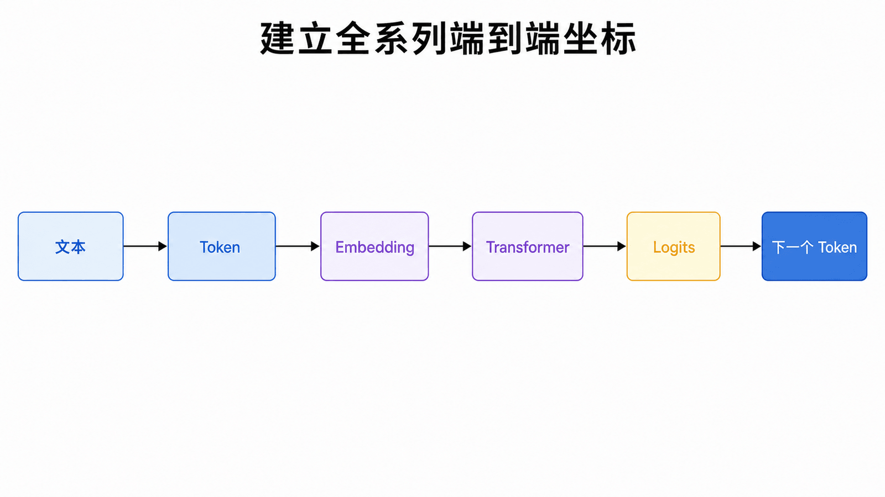
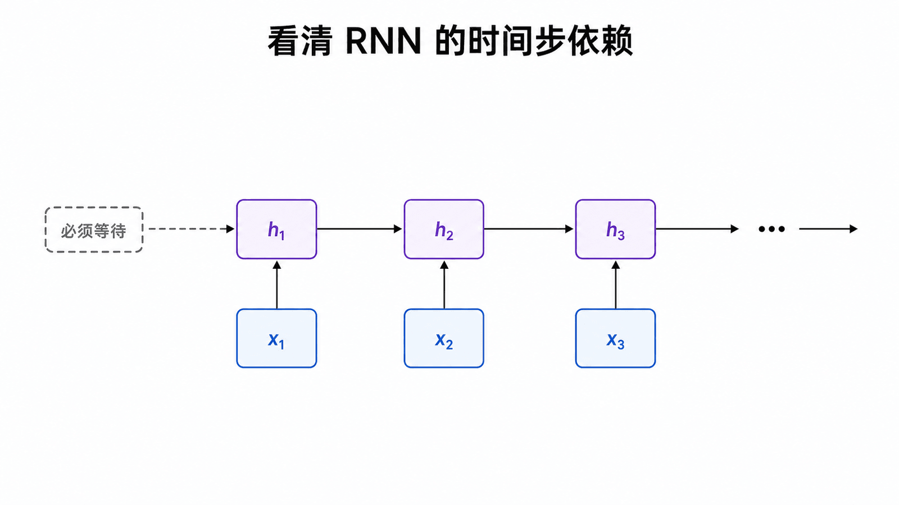
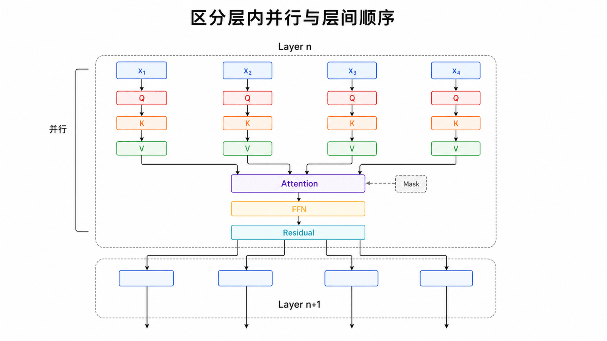
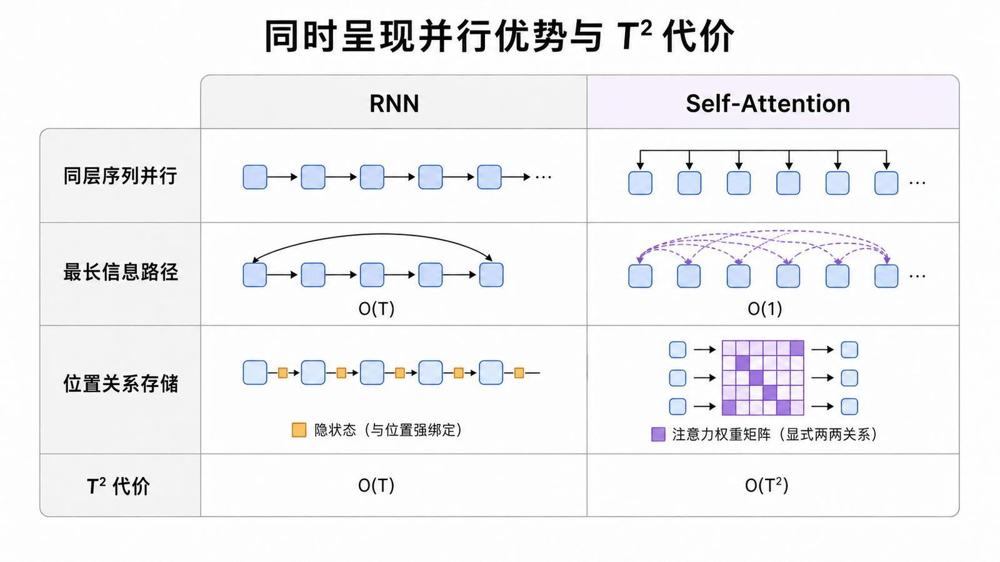
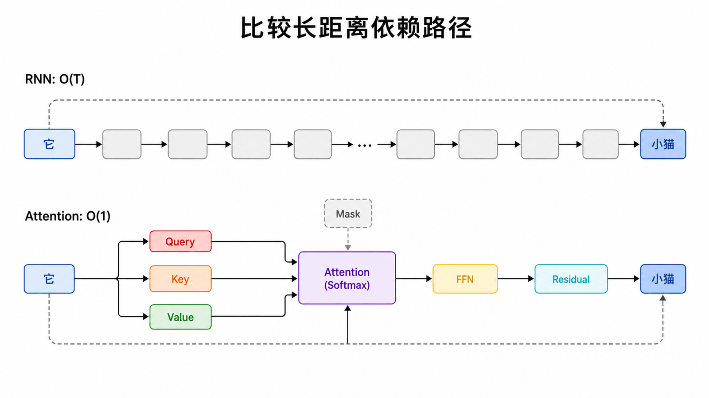
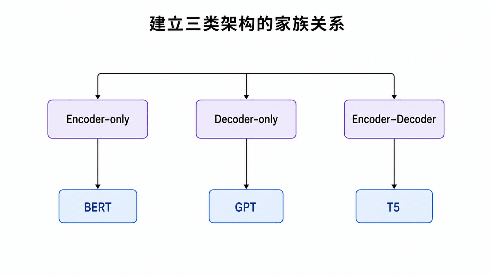
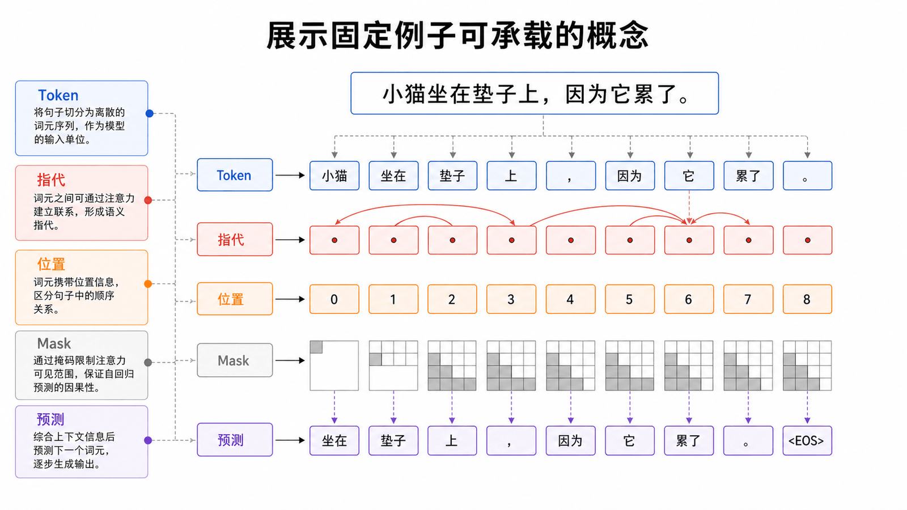
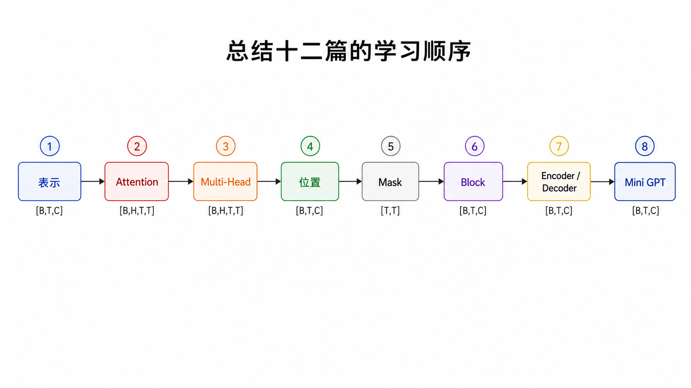

## 本篇要解决的问题

在接触 Q、K、V 和矩阵公式之前，先回答四个更重要的问题：传统序列模型怎样读文本？为什么训练难以并行？Attention 改变了哪条信息路径？原始 Transformer 与今天的 GPT 又是什么关系？

### 前置知识

读者只需知道：神经网络会把 Token 表示成向量，矩阵乘法可以同时处理一批向量。本篇不要求会求导，也不会提前使用 Attention 的完整公式。

语言模型接收的不是“意思”，而是一串离散 Token。Token 先被映射为向量，再经过多层 Transformer 更新，最后由线性层和 Softmax 变成词表上的概率分布。后面十一篇讲的每个组件，都在这条流水线上有明确位置。

## RNN 的核心限制：计算路径是串行的

RNN 用隐藏状态 `h_t` 汇总截至位置 `t` 的信息：

$$
h_t = f(x_t, h_{t-1})
$$

由于 `h_t` 依赖 `h_{t-1}`，第 100 个位置不能绕过前 99 个位置直接计算。这种递归结构很自然地表达顺序，却限制了训练时对序列维度的并行化。

Transformer 去掉了沿时间步递归的主干。同一层里，各位置的 Q、K、V 以及注意力分数都能通过批量矩阵运算并行计算；层与层之间仍然必须顺序执行。

所以“Transformer 可以并行”应准确理解为：**训练时，同一层的所有序列位置可并行；不是所有层同时计算，也不是自回归生成能一次吐出整段文本。**

### 并行不等于没有代价

对长度为 `T`、隐藏维为 `C` 的序列，标准全量 Self-Attention 要显式或隐式处理 `T×T` 个位置关系，注意力分数的时间与显存开销随 `T²` 增长。RNN 每一步只处理一个新位置，单层沿序列的计算量近似随 `T` 线性增长，却有无法消除的时间步依赖。

| 维度         | RNN 主干          | 标准 Self-Attention |
| ------------ | ----------------- | ------------------- |
| 同层序列并行 | 困难              | 容易                |
| 最长信息路径 | `O(T)`            | `O(1)`              |
| 位置关系存储 | 无显式 `T×T` 矩阵 | 通常为 `O(T²)`      |
| 自回归生成   | 逐步              | 仍然逐步            |

因此 Transformer 的优势不是“所有方面都更快”，而是把串行依赖换成更适合 GPU/TPU 的大规模矩阵计算。长上下文模型仍需要稀疏注意力、滑动窗口、FlashAttention 或其他工程优化来控制成本。

## Attention 改变了信息传递距离

设一句话中相距很远的两个 Token 存在指代关系。RNN 中，信息要经过多个隐藏状态逐步传递；Self-Attention 中，当前 Token 可以直接给远处 Token 较高权重，在一个子层内读取它的 Value。

这不意味着 Transformer 自动“理解”了指代。它只是提供了一条短路径；哪条边重要、传递什么信息，仍需通过训练学习。

## Transformer 不是单一架构

2017 年论文 [Attention Is All You Need](https://arxiv.org/abs/1706.03762) 提出的是用于机器翻译的 Encoder–Decoder。后来常见模型按堆栈和可见范围分成三类：

| 类型            | 注意力可见范围                           | 典型用途             | 代表模型             |
| --------------- | ---------------------------------------- | -------------------- | -------------------- |
| Encoder-only    | 双向                                     | 表示学习、分类、抽取 | BERT                 |
| Decoder-only    | 只能看当前及过去                         | 自回归生成           | GPT、Llama、Qwen     |
| Encoder–Decoder | 源序列双向，目标序列因果，并含交叉注意力 | 翻译、条件生成       | 原始 Transformer、T5 |

GPT 使用 Transformer Block，但不等于把原论文架构原封不动搬过来。第 10 篇会专门解释这次结构迁移。

## 一个贯穿全系列的句子

后续统一使用：

> 小猫坐在垫子上，因为它累了。  
> The cat sat on the mat because it was tired.

它可以连续解释 Tokenization、Embedding、“它”对“小猫”的注意、位置编码、因果 Mask 与下一个 Token 预测。固定例子能把注意力留给新机制，而不是每篇重新理解语境。

## 常见误区

- Attention 缩短信息路径，不等于它总能找到正确关系。
- 训练可并行，不等于自回归生成也可完全并行。
- Transformer 是架构家族，不是 GPT 的同义词。
- 原论文取消的是循环与卷积主干，不是取消一切顺序信息；顺序会由位置编码注入。

## 本篇自检

1. Transformer 的“训练可并行”具体发生在哪个维度？
2. Attention 把长距离信息路径从多少步缩短到多少步？
3. 为什么不能据此断言 Transformer 在长序列上没有代价？

查看答案

1. 同一个网络层内部的序列位置维；层与层之间仍需顺序执行。
2. 从最坏 `O(T)` 的逐步传播缩短为单个注意力子层中的直接连接。
3. 因为标准全量注意力需要处理 `T×T` 个位置关系，时间和显存都会随序列长度平方增长。

## 小结

Transformer 的突破可以压缩成两句话：它用注意力替代沿时间步递归的主干，使训练更适合并行矩阵计算；它让任意两个位置能在一个子层内建立直接的信息通道。下一篇从最前面的输入开始：文字怎样变成模型能计算的向量。

**下一篇：** [文本如何变成向量：Token、Embedding 与语义空间](/posts/ai/transformer系列教程/transformer-02-token-embedding/)

## 参考资料

- [Attention Is All You Need](https://arxiv.org/abs/1706.03762)
- [The Illustrated Transformer](https://jalammar.github.io/illustrated-transformer/)
- [3Blue1Brown：Attention in transformers, step-by-step](https://www.3blue1brown.com/lessons/attention/)
