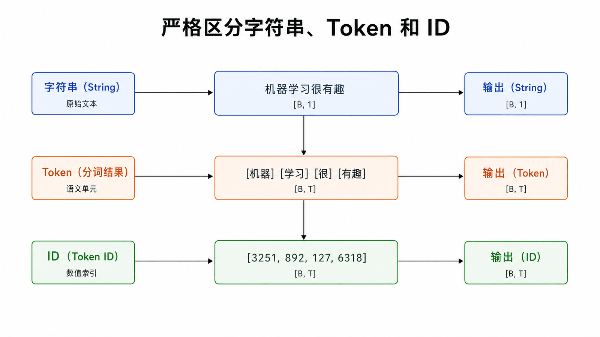
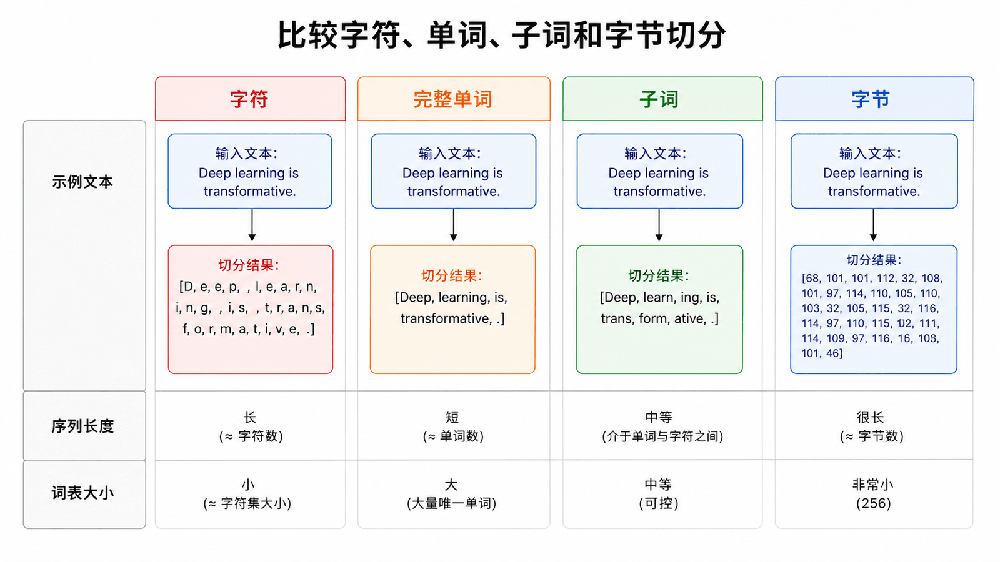
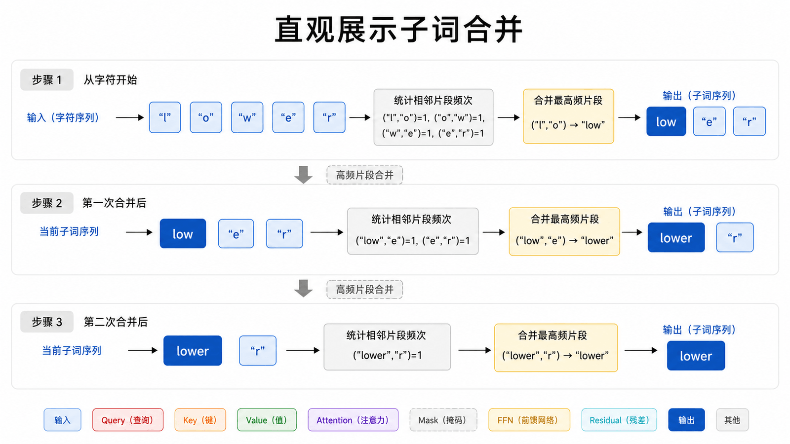
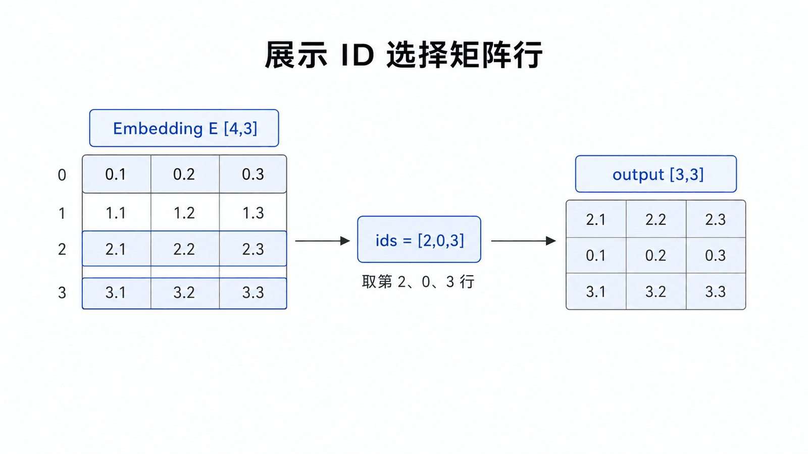
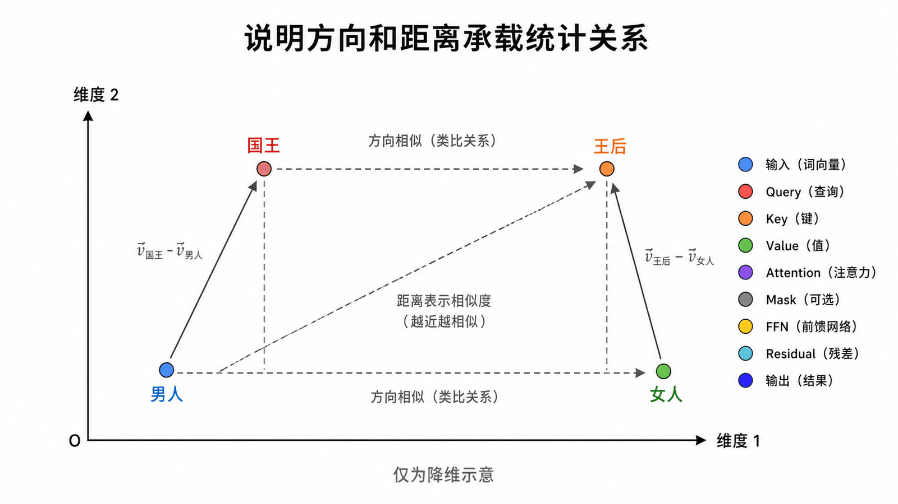
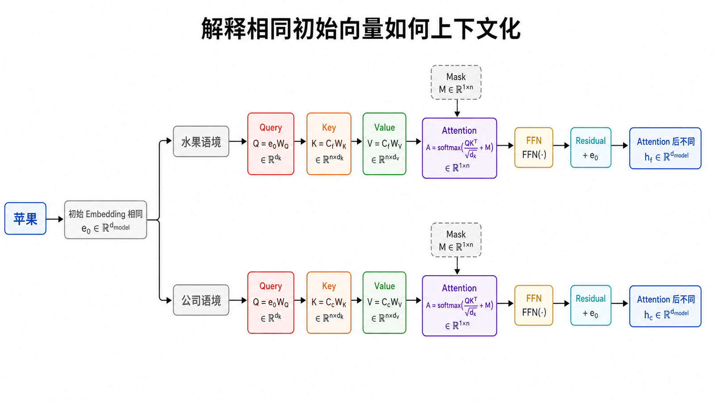
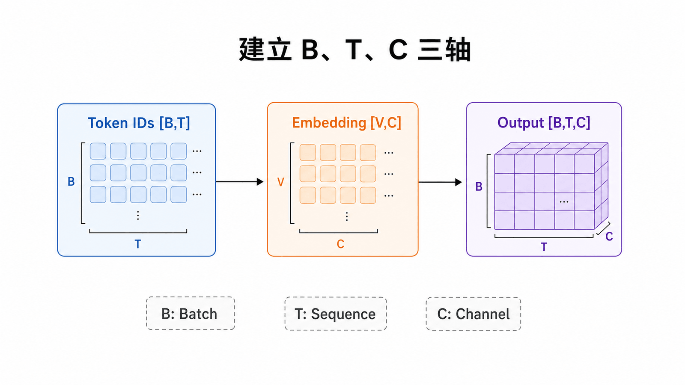
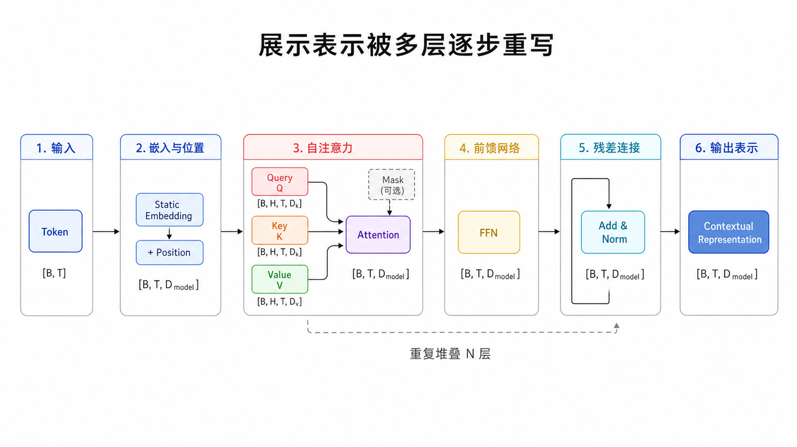
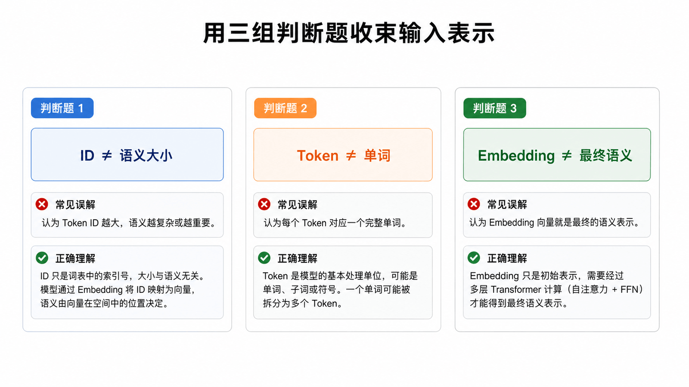

## 本篇要解决的问题

模型为什么不能直接处理字符串？Token ID 是否包含语义？Embedding 到底是计算还是查表？`[B,T,C]` 三个维度分别代表什么？

### 前置知识

建议先读完第 1 篇，并能区分“文本字符串”和“模型内部张量”。本篇会使用数组索引与矩阵行的概念，不要求了解具体 Tokenizer 训练算法。

## 文本、Token 与 ID 是三层对象



Tokenizer 按规则把字符串切成有限词表中的单位，再把每个单位映射为整数 ID。Token 可能是字符、完整单词、子词或字节片段，具体取决于词表与算法。

整数只是在词表中的地址。ID 3251 并不比 ID 892“语义更大”，相邻 ID 通常也不表示语义相近。模型真正接收的是通过 Embedding 表查出的浮点向量。

### Token 的粒度是一项工程选择





| 粒度     | 优点                       | 代价                         |
| -------- | -------------------------- | ---------------------------- |
| 字符     | 词表小、实现直观           | 序列长，难直接复用词块       |
| 完整单词 | 序列较短、可读性强         | 生僻词和词形变化导致词表膨胀 |
| 子词     | 在词表大小和序列长度间折中 | 切分结果未必符合人类词义边界 |
| 字节     | 几乎没有未知字符           | 常见文本可能需要更多 Token   |

BPE、WordPiece、Unigram 等方法都试图从数据中找到可复用片段。Tokenizer 决定模型看到的序列长度和词表，因此也会间接影响训练成本、上下文容量和多语言表现。Tokenization 通常是离散预处理，不在语言模型的反向传播中更新。

## Embedding 是可训练的查表

设词表大小为 `V`、模型维度为 `C`，Embedding 参数矩阵形状为 `[V,C]`。每个 Token ID 选择其中一行：

$$
x_t = E[token\_id_t]
$$

在 PyTorch 中它通常写成：

```python
token_embedding = nn.Embedding(vocab_size, n_embd)
x = token_embedding(idx)  # idx [B,T] -> x [B,T,C]
```

### 一个可以手算的查表示例



假设词表只有 4 个 Token，Embedding 维度为 3：

```text
E = [[ 0.2,  0.1, -0.4],
     [ 0.7, -0.3,  0.5],
     [-0.1,  0.8,  0.2],
     [ 0.4,  0.0,  0.9]]
ids = [2, 0, 3]
```

查表结果就是依次取第 2、0、3 行，输出 Shape 为 `[3,3]`。这个过程没有把 ID 当成连续数值计算；真正参与后续点积和线性变换的是选出的浮点向量。

查表操作本身没有神秘之处；关键是矩阵 `E` 会在训练中随损失的梯度更新。经常出现在相似上下文中的 Token，可能逐渐形成有用的几何关系。

## “语义空间”是一个有用但有限的直觉





高维向量的方向、距离与线性组合能编码统计关系。为了画图，我们常把它降到二维；二维位置只是示意，不应被当成真实模型的精确地图。

更重要的是，输入 Embedding 仍是**静态起点**。同一个 Token ID 每次查到同一行，但经过 Transformer 后会因上下文不同而得到不同表示。

以“苹果很好吃”和“苹果发布新手机”为例，初始“苹果”向量相同；在层内读取周围 Token 后，一个表示更靠近食物语境，另一个更靠近公司与产品语境。Self-Attention 的任务之一就是完成这种上下文化。

## 永远标出 Tensor Shape



本系列统一使用：

- `B`：Batch Size，一次并行的样本数；
- `T`：Sequence Length，序列中的 Token 数；
- `C`：Channel / Embedding Dimension，每个 Token 的特征数；
- `H`：Attention Head 数；
- `D`：每个 Head 的维度，通常 `C = H × D`。

Embedding 只增加特征维，不改变 Token 的相对顺序：`[B,T] → [B,T,C]`。后续线性层通常也保留前两个维度，只变换最后一维。

## 静态向量如何变成上下文向量



模型先把 Token Embedding 与 Position 表示相加，再反复经过 Attention 与 FFN。每一层都保留 `[B,T,C]` 的外形，却重写里面的数值。

这也是“深度”的含义：不是给同一个词贴越来越多标签，而是让表示经过多轮“与其他位置交换信息”和“在本位置非线性加工”。

## 常见误区

- Token ID 是索引，不是语义数值。
- Tokenizer 通常不是按空格简单切词。
- 降维图只能帮助形成直觉，不能证明模型内部存在某条命名轴。
- Embedding 不是最终语义；上下文表示才与当前句子绑定。

## 本篇自检



1. 为什么 Token ID 不能直接被理解成语义大小？
2. 输入 `[B,T]` 经过 `nn.Embedding(V,C)` 后是什么 Shape？
3. 同一个“苹果”为什么能在两句话里获得不同表示？

<details>
<summary>查看答案</summary>

1. ID 只是词表地址，编号的大小和相邻关系通常没有语义。
2. `[B,T,C]`。
3. 初始 Embedding 相同，但后续 Self-Attention 会根据周围 Token 更新它，形成上下文表示。

</details>

## 小结

文本先被离散化为 Token ID，再由可训练的 Embedding 矩阵映射为 `[B,T,C]`。这组向量仍彼此孤立；下一篇将不急着推公式，而是用“检索与信息聚合”直观理解它们怎样交换信息。

**下一篇：** [从“查询资料”理解 Attention](/posts/ai/transformer系列教程/transformer-03-attention-intuition/)

## 参考资料

- [3Blue1Brown：Transformers 与 Attention 章节](https://www.3blue1brown.com/topics/neural-networks)
- [The Illustrated Transformer](https://jalammar.github.io/illustrated-transformer/)
- [The Annotated Transformer：Embeddings and Softmax](https://nlp.seas.harvard.edu/annotated-transformer/)
