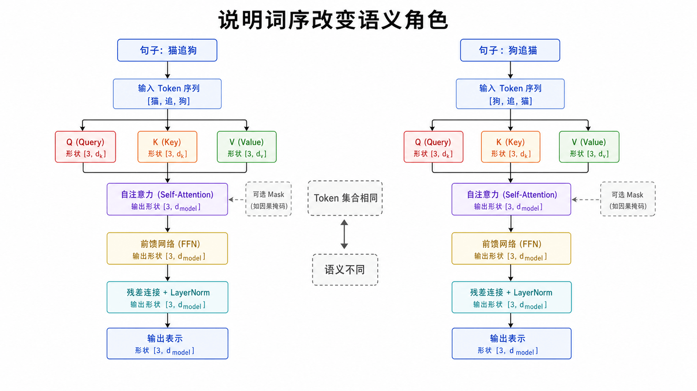
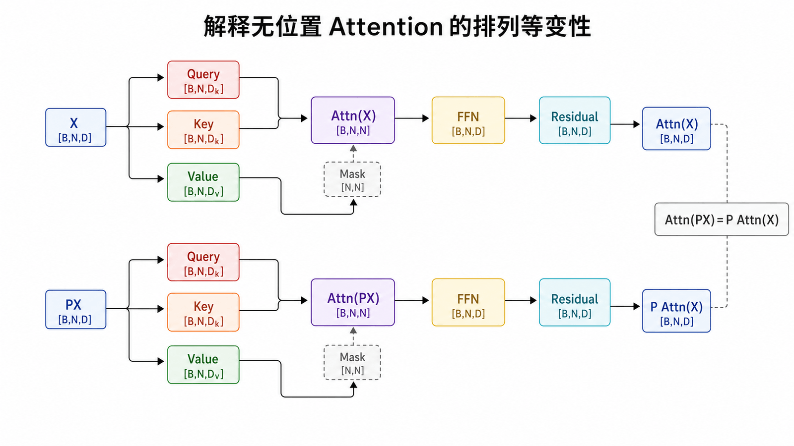
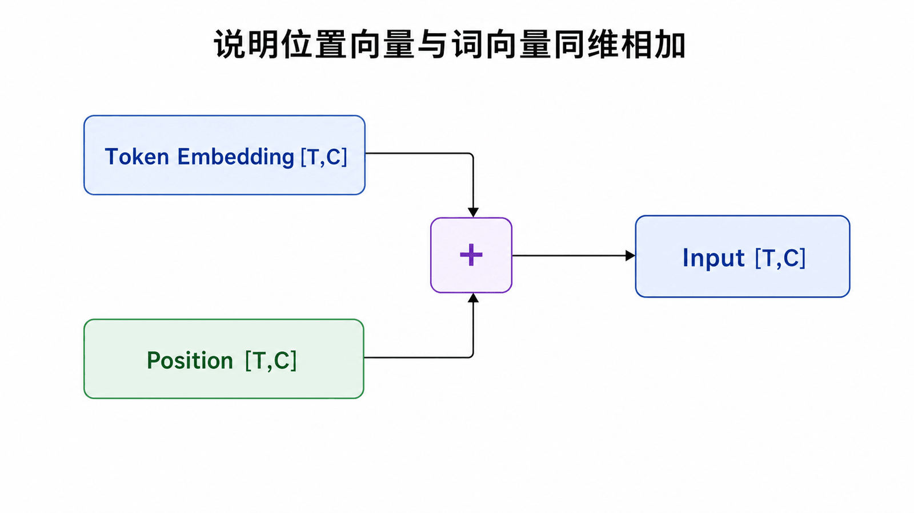
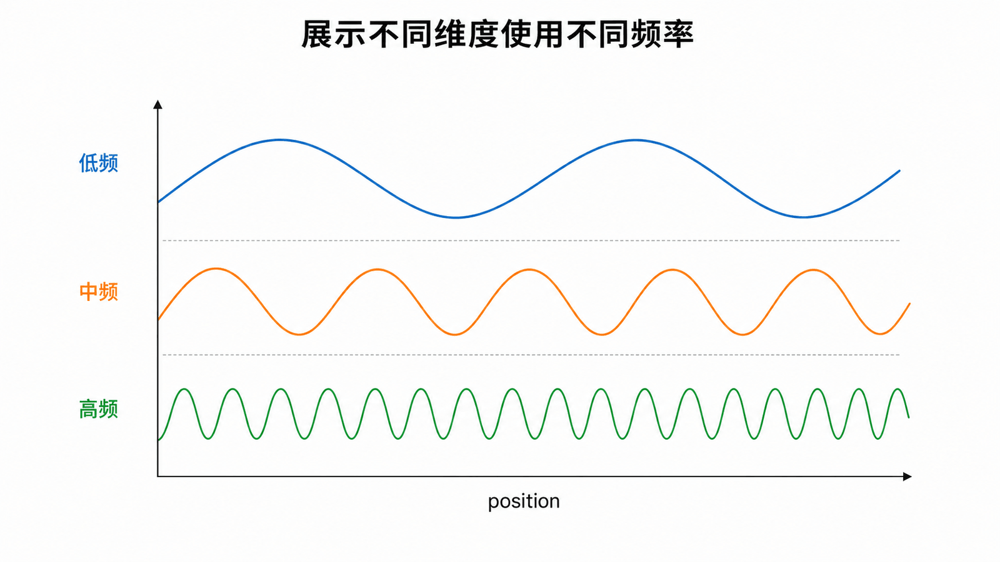
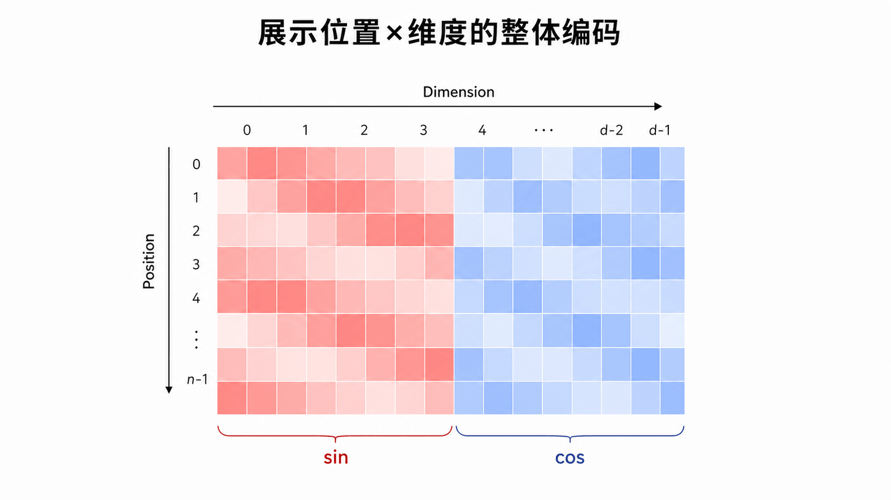
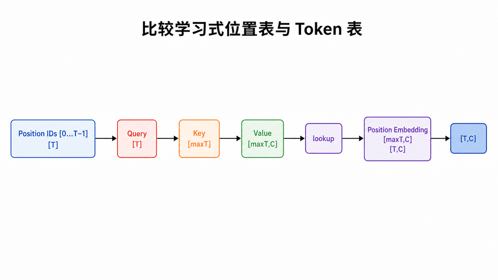
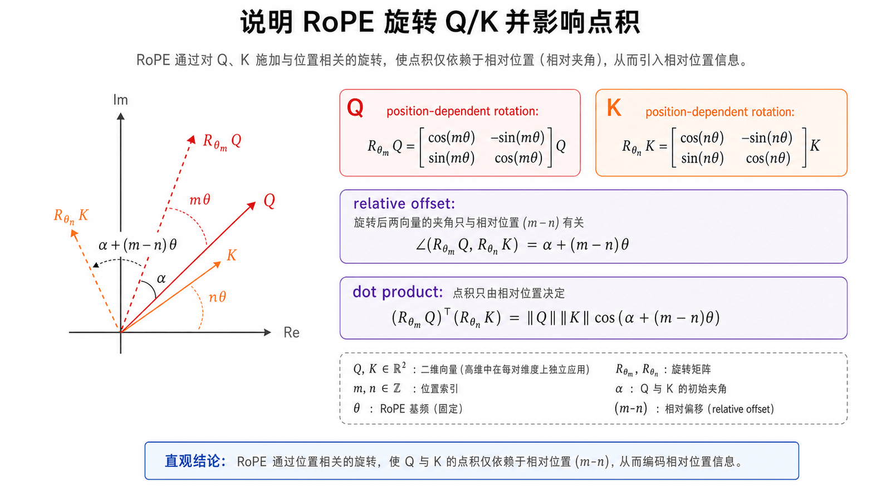
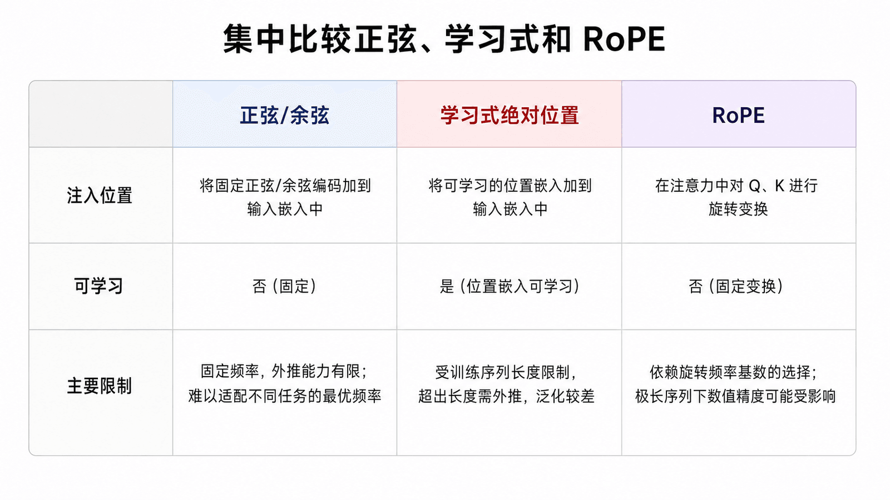
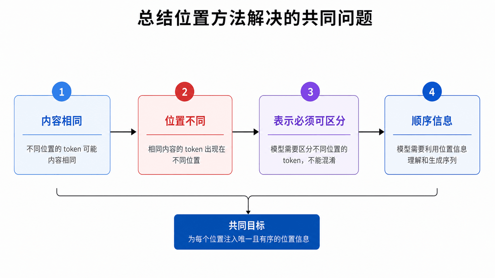

## 本篇要解决的问题

Attention 为什么不知道词序？位置向量如何进入模型？原论文的正弦余弦公式表达了什么？它与学习式位置 Embedding、RoPE 有何区别？

### 前置知识

读者应理解 Token Embedding 的 Shape 为 `[B,T,C]`，并知道 Self-Attention 对不同位置共享同一套 QKV 投影参数。

## Token 相同，顺序可能改变意义



“猫追狗”和“狗追猫”包含同样三个 Token，但施事与受事完全相反。

如果输入只有词向量，Self-Attention 对所有位置使用共享投影。同步置换输入，输出也会随之同步置换；它没有一个天然的“第 3 位”特征。

### 用置换看清问题



设输入为 `[猫, 追, 狗]`，交换第 1、3 个位置得到 `[狗, 追, 猫]`。若没有位置表示，Q、K、V 只是对应行一起交换，`QKᵀ` 的行列也随相同置换交换，最终输出只是按同样方式重新排序。模型能看到三个内容，却没有额外信息判断谁原本位于句首。

更形式化地，用置换矩阵 `P` 表示换位，则无位置的 Self-Attention 满足：

$$
\operatorname{Attn}(PX)=P\operatorname{Attn}(X)
$$

这叫排列等变性：输入怎样排列，输出就怎样排列。要理解“猫追狗”和“狗追猫”的角色差异，必须显式打破这种对称性。

## 最直接的做法：向量相加



给每个位置一个与词向量同维的向量 $p_t$：

$$
x_t = e_{token_t} + p_t
$$

位置不是额外插入的 Token，也不是新增一个特征维；同维相加保持输入 `[B,T,C]`，后续所有层无需修改接口。

## 原论文的正弦余弦位置编码





原始 Transformer 使用固定函数：

$$
PE(pos,2i)=\sin(pos/10000^{2i/d_{model}})
$$

$$
PE(pos,2i+1)=\cos(pos/10000^{2i/d_{model}})
$$

不同维度使用不同频率，相邻位置会得到平滑但可区分的编码。

把所有位置和维度排成矩阵，可得到常见热力图：

正弦编码没有可训练参数，并能为训练长度以外的位置计算值；但“可计算”不等于模型必然能无损外推到任意长度。

## 学习式位置 Embedding



GPT-2 等模型使用可训练表：

```python
tok = token_embedding(idx)                 # [B,T,C]
pos = position_embedding(torch.arange(T))  # [T,C]
x = tok + pos                              # 广播到 [B,T,C]
```

它简单且灵活，却受最大位置表大小约束，超出训练长度通常不能直接索引。

## 从绝对位置到相对关系



语言中常见的是“向前一个词”“距离主语三格”等相对关系。现代模型因此常在注意力分数或 Q/K 变换中编码相对位置。RoPE 用与位置相关的旋转作用于 Q、K，使点积自然包含相对位移信息。

本篇只建立接口：无论采用固定、学习式还是旋转位置方法，目的都是破除纯内容注意力对顺序的无知。不同方法的长度外推能力还依赖训练分布、缩放策略与模型实现。

### 三类位置方法对比



| 方法           | 注入位置              | 是否可学习       | 主要特点               | 常见限制                 |
| -------------- | --------------------- | ---------------- | ---------------------- | ------------------------ |
| 正弦/余弦      | 与输入 Embedding 相加 | 否               | 无参数、任意位置可计算 | 长度外推仍不保证可靠     |
| 学习式绝对位置 | 与输入 Embedding 相加 | 是               | 简单直接、由数据适配   | 受最大位置表限制         |
| RoPE           | 旋转 Q、K             | 通常无位置表参数 | 点积自然包含相对位移   | 长上下文仍依赖缩放和训练 |

选择位置方案不只是替换一个公式，还会影响缓存方式、最大上下文、外推策略和模型权重兼容性。

## 常见误区

- Attention 不是把词序“学在权重里”就能自动绕过位置输入。
- 位置编码不是一个特殊 `[POSITION]` Token。
- 正弦编码可计算到更远位置，不保证模型在更长上下文上可靠。
- RoPE 不是把位置向量简单加到 Token Embedding。

## 本篇自检



1. 为什么无位置 Self-Attention 无法天然区分“猫追狗”和“狗追猫”？
2. 正弦编码与学习式位置 Embedding 都怎样进入输入？
3. RoPE 主要作用于哪两个张量？

<details>
<summary>查看答案</summary>

1. 因为它对输入置换是等变的，只会让输出跟着同样置换。
2. 都以 `[T,C]` 位置表示与 Token Embedding 相加。
3. Query 和 Key。

</details>

## 小结

位置表示让内容相同但位置不同的 Token 可被区分。现在模型知道顺序，却仍可能在训练时看到未来答案。下一篇用 Causal Mask 建立自回归语言模型最关键的信息边界。

**下一篇：** [Mask 是什么：模型为什么不能偷看未来](/posts/ai/transformer系列教程/transformer-07-attention-mask/)

## 参考资料

- [Attention Is All You Need：Positional Encoding](https://arxiv.org/abs/1706.03762)
- [The Annotated Transformer：Positional Encoding](https://nlp.seas.harvard.edu/annotated-transformer/)
