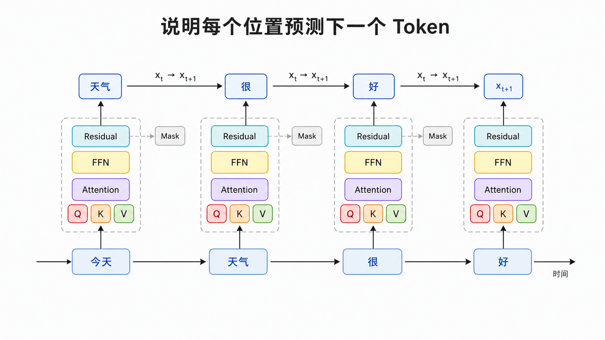
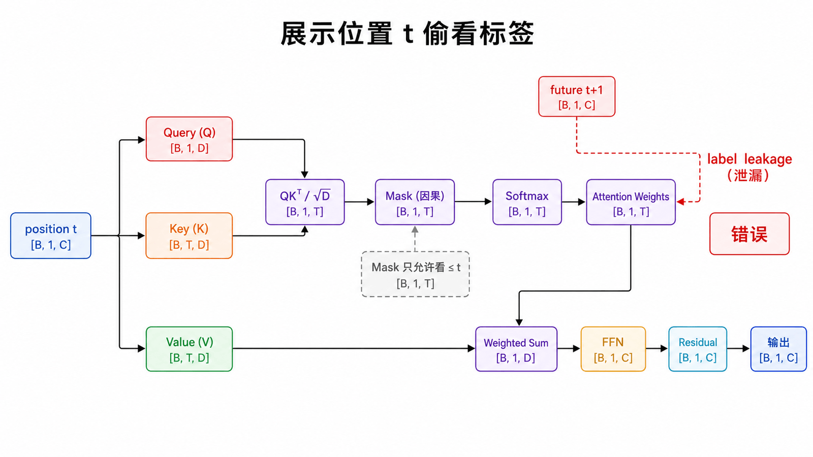
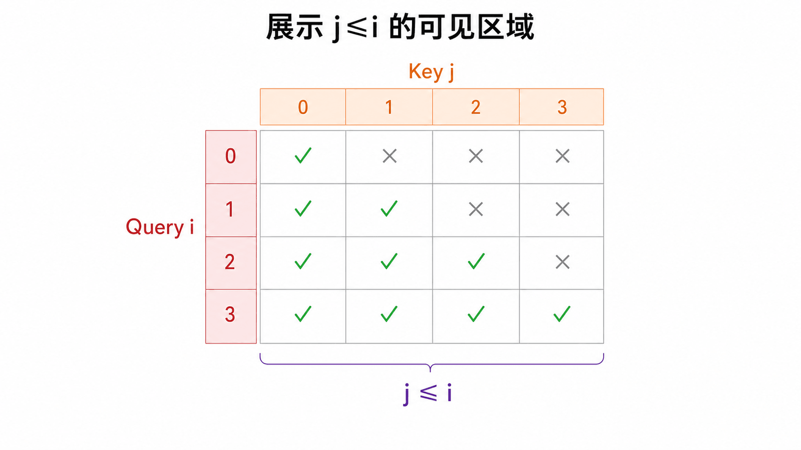
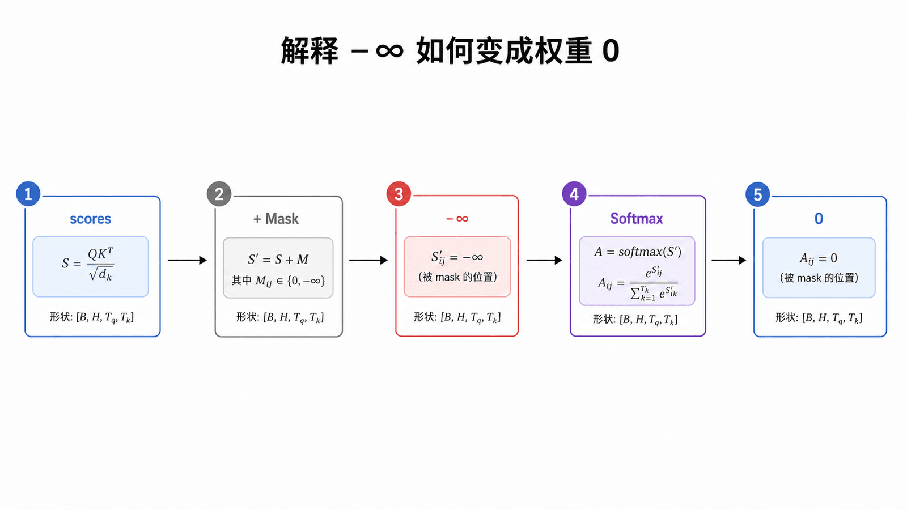
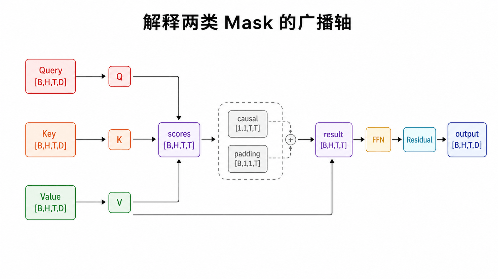
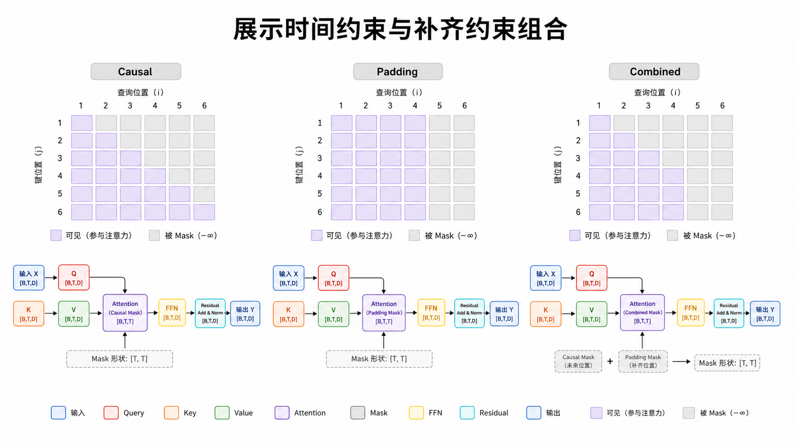
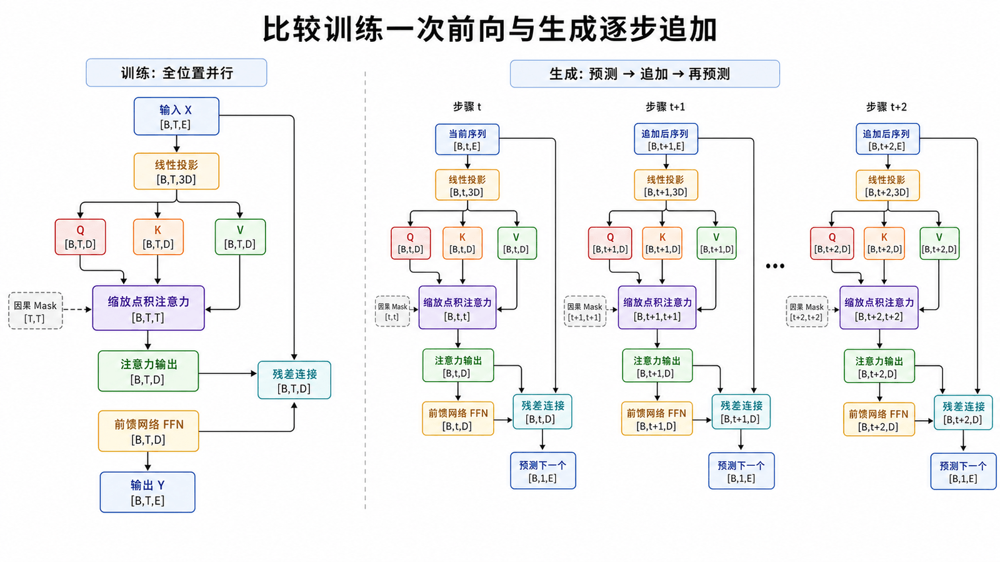
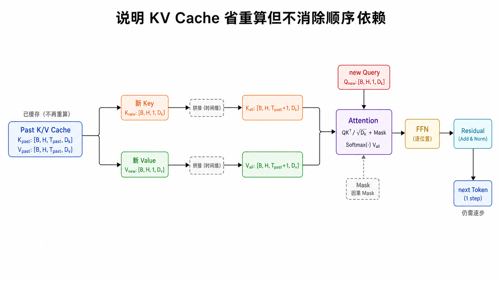
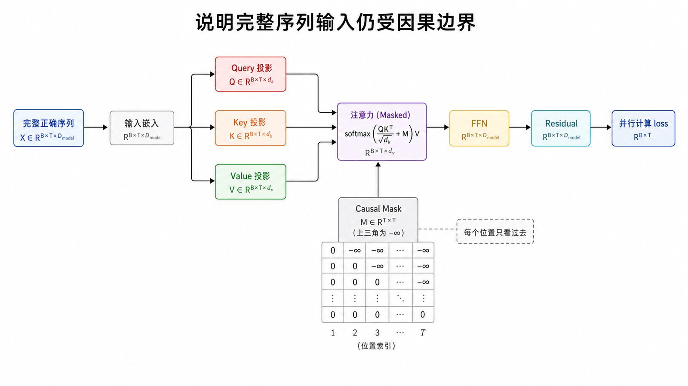

## 本篇要解决的问题

语言模型训练时为何会泄漏答案？Causal Mask 具体改了哪一个矩阵？为什么训练可以并行，生成仍要逐 Token 进行？

### 前置知识

读者应知道注意力分数 Shape 为 `[B,H,T,T]`，Softmax 沿最后一个 Key 维计算，并理解输入与下一个 Token 标签错开一位。

## 自回归目标：只用过去预测未来



给定 Token 序列 $(x_1,\dots,x_T)$，语言模型最大化：

$$
\sum_{t=1}^{T-1}\log p(x_{t+1}\mid x_{\le t})
$$

也就是说，每个位置都用截至当前位置的上下文预测下一个 Token。

## 不加 Mask 会发生什么



训练时我们一次把整段序列送进模型。如果位置 `t` 能在 Self-Attention 中读取 `t+1`，它就直接看到了自己的标签。训练损失可能很漂亮，但推理时没有未来 Token 可读。

Causal Mask 不是优化技巧，而是让训练信息条件与生成信息条件一致的基本约束。

## 下三角可见矩阵



第 `i` 个位置只允许关注 `j≤i`：

矩阵主对角线保留，表示位置可以读自己；严格预测下一个 Token 的标签通过序列右移构造，而不是把主对角线也删除。

## Mask 要加在 Softmax 之前



先得到缩放分数 $S=QK^T/\sqrt{d_k}$，再把非法位置改为 $-\infty$：

$$
A=\operatorname{softmax}(S+M)
$$

其中允许位置 $M_{ij}=0$，禁止位置 $M_{ij}=-\infty$。由于 $e^{-\infty}=0$，Softmax 后未来权重精确为 0。

```python
scores = scores.masked_fill(
    causal_mask[:T, :T] == 0,
    float("-inf"),
)
weights = scores.softmax(dim=-1)
```

### Mask 怎样广播到每个 Batch 和 Head



最小因果 Mask 可存为 `[1,1,T,T]`。前两个长度为 1 的轴会广播到所有 Batch 和 Head：

```text
scores      [B,H,T,T]
causal_mask [1,1,T,T]
result      [B,H,T,T]
```

Padding Mask 常从 `[B,T]` 扩展为 `[B,1,1,T]`，屏蔽的是 Key 轴。二者组合后，每个 Query 同时满足“不看未来”和“不读补齐位置”。实现时不要只看张量能否广播，还要确认被屏蔽的是正确的轴。

在半精度中，可使用框架提供的布尔 Mask 或 `torch.finfo(dtype).min`，避免手写一个不够小的负数导致未来位置仍获得非零权重。不同 PyTorch API 对布尔值 `True` 表示“允许”还是“屏蔽”可能不同，调用前应核对接口约定。

## Causal Mask 与 Padding Mask



批处理中，不同长度样本常补齐到相同 `T`。Padding Mask 阻止模型读取补齐位置；Causal Mask 阻止读取未来位置。两者可同时存在，但语义不同。

## 为什么训练并行、生成串行





训练时，整段正确序列已知。下三角 Mask 能让所有位置在一次矩阵计算中各自遵守因果边界，所以所有位置的 logits 可并行求出。

生成时，下一个 Token 尚不存在。模型必须先采样 $x_{t+1}$，把它拼回上下文，才能求 $x_{t+2}$。

KV Cache 可以避免每轮重算过去位置的 K/V，却不能消除“后一个 Token 依赖前一个已采样结果”的算法依赖。

### Teacher Forcing 为什么不等于作弊



训练时把完整正确目标序列作为输入，称为 Teacher Forcing。它让所有位置能在一次前向中计算损失，但 Causal Mask 保证位置 `t` 只能读取 `≤t` 的 Token。正确答案 `x_{t+1}` 虽然存在于同一个 Batch 张量中，却位于被遮挡的未来区域，因此不会泄漏给位置 `t`。

## 常见误区

- Mask 通常加到注意力分数，不是乘到最终输出。
- Causal Mask 与 Padding Mask 解决不同问题。
- Teacher forcing 不等于泄漏未来；配合因果 Mask 时每个位置仍只读过去。
- KV Cache 加速生成，但不会让标准自回归解码一次生成全部 Token。

## 本篇自检

1. 为什么 Causal Mask 保留主对角线？
2. `[B,T]` Padding Mask 通常要扩展成什么 Shape 才能屏蔽 Key？
3. Teacher Forcing 为什么仍符合因果训练条件？

<details>
<summary>查看答案</summary>

1. 当前位置可以读取自己；预测目标通过输入和标签右移一位实现。
2. `[B,1,1,T]`。
3. 因果 Mask 使位置 `t` 无法读取 `t+1` 及之后的正确 Token。

</details>

## 小结

Causal Mask 把注意力矩阵变成下三角可见结构，并在 Softmax 前把未来分数置为负无穷。至此模型拥有内容交换、顺序与因果边界；下一篇补齐 Block 中 Attention 之外的 FFN、残差与归一化。

**下一篇：** [Attention 之外还有什么](/posts/ai/transformer系列教程/transformer-08-transformer-block/)

## 参考资料

- [Attention Is All You Need：Decoder Mask](https://arxiv.org/abs/1706.03762)
- [The Annotated Transformer：subsequent_mask](https://nlp.seas.harvard.edu/annotated-transformer/)
- [Karpathy：nanoGPT](https://github.com/karpathy/nanoGPT)
