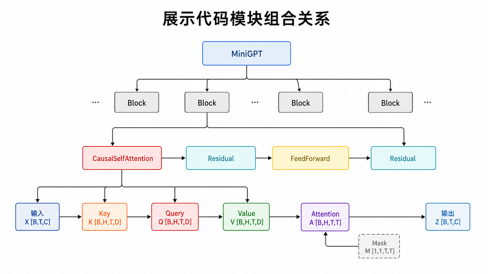
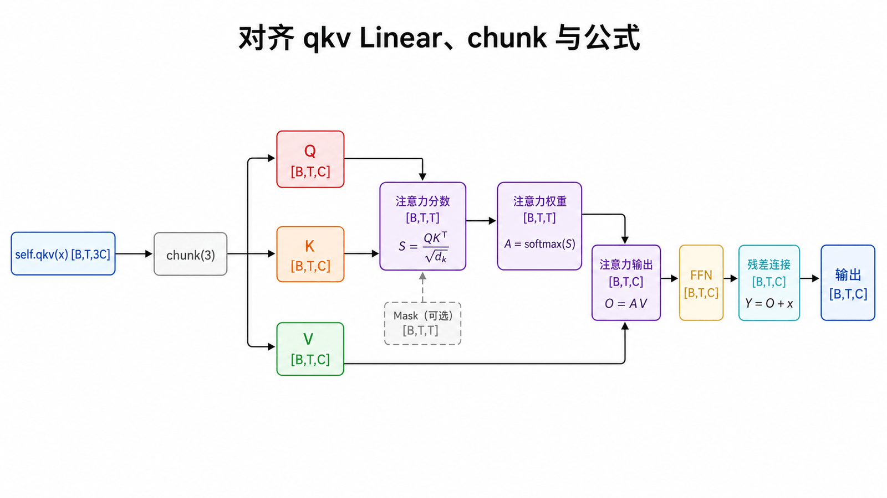
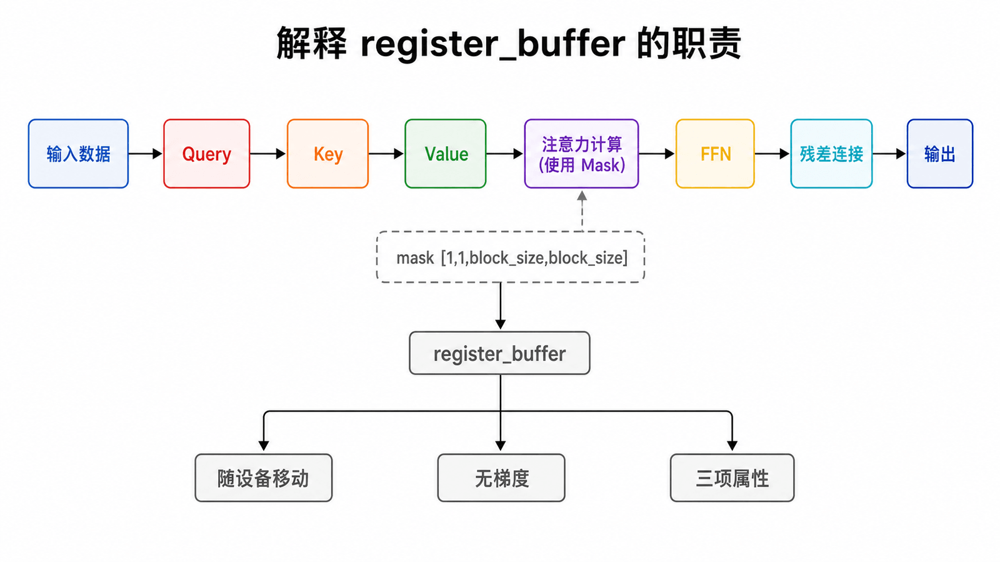
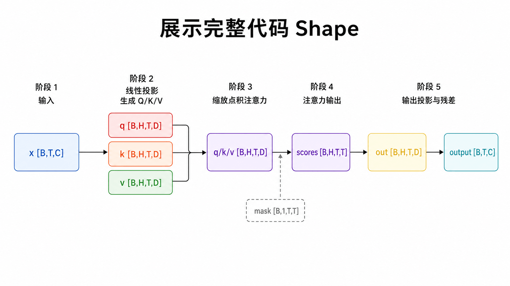
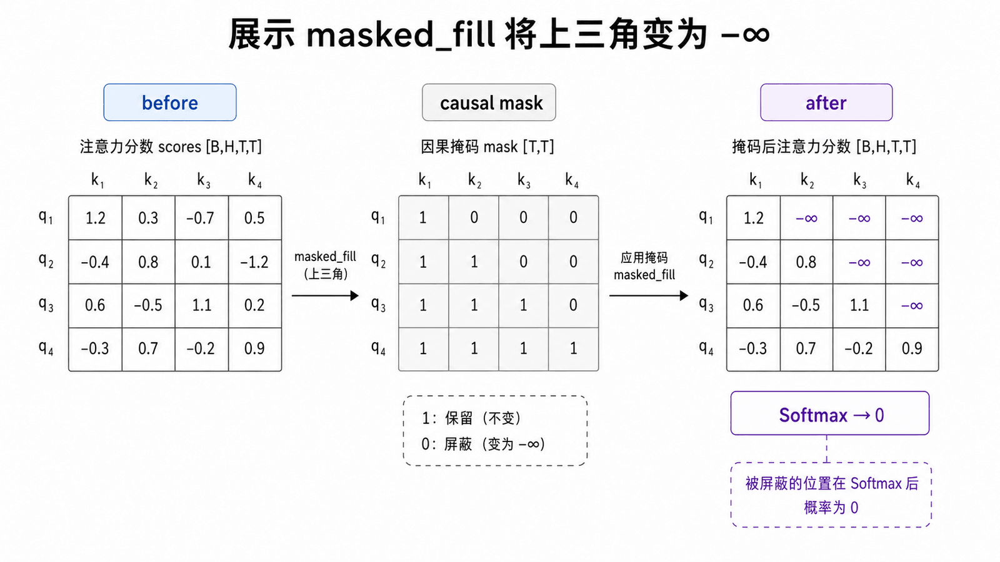
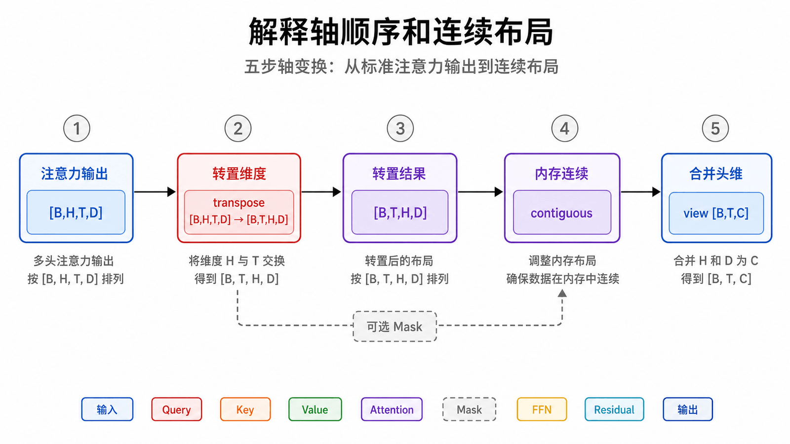
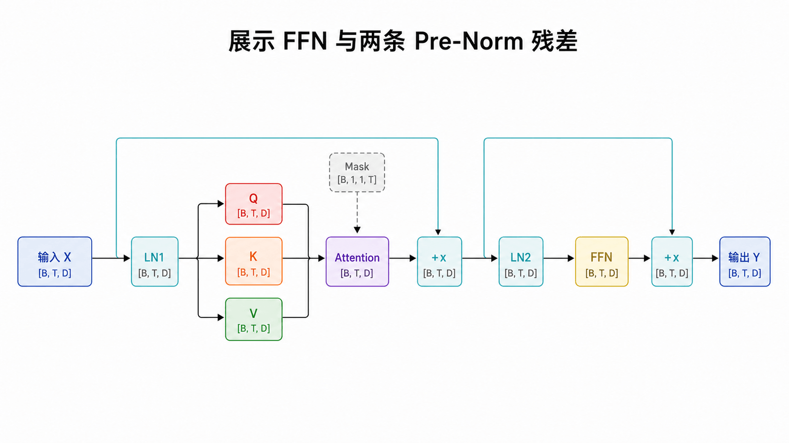
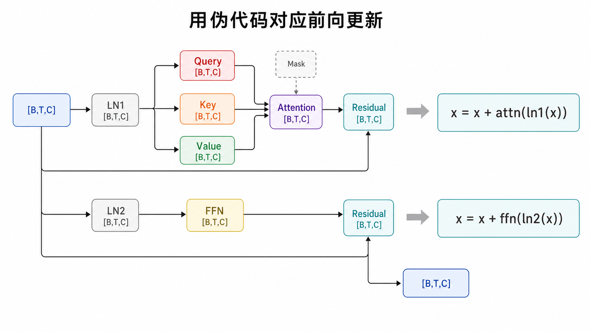
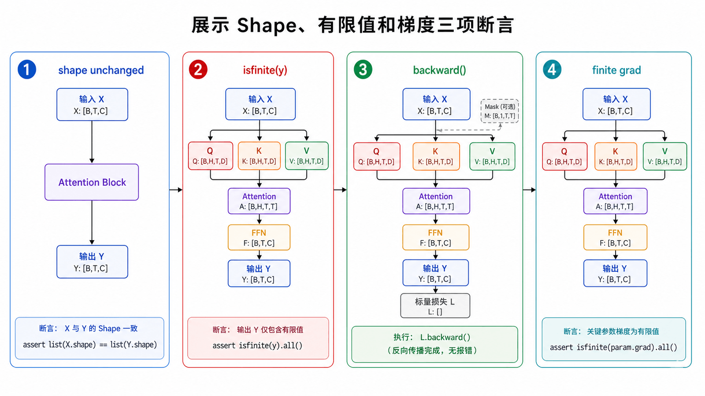
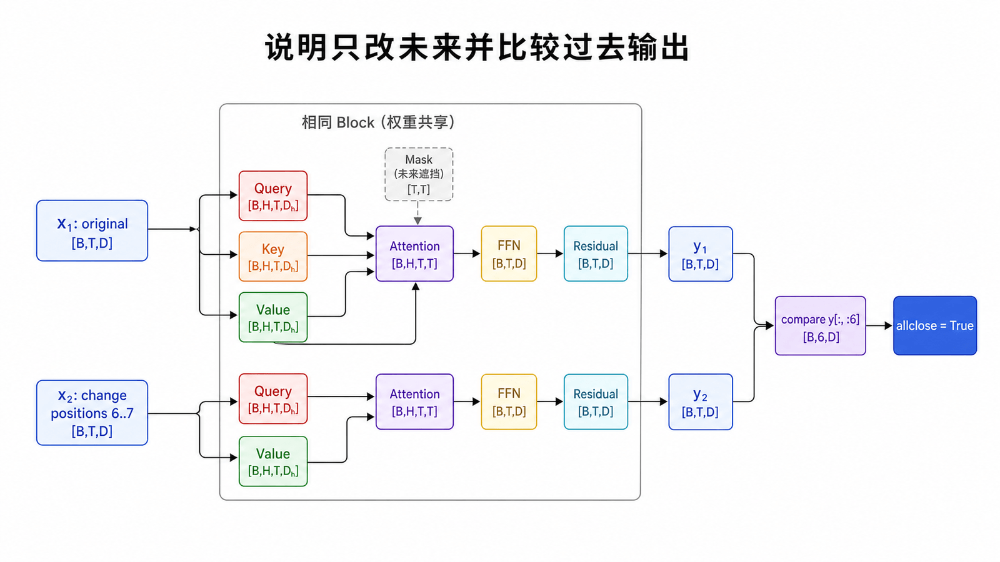

## 本篇要解决的问题

怎样把公式翻译成稳定的张量代码？`transpose`、`view`、Mask 的正确位置在哪里？怎样用 Shape 测试确认模块接口正确？

### 前置知识与本篇配置

需要掌握前 10 篇的 QKV、Multi-Head、Causal Mask、Pre-Norm 与残差。以下代码统一假设 `n_embd` 能被 `n_head` 整除，输入为 Embedding 后的浮点张量 `[B,T,C]`，且 `T≤block_size`。

## 模块依赖先行



我们实现 GPT 风格的 Pre-Norm Block。代码从单个 Causal Self-Attention 模块开始，再组合 FFN 与 Block。

为避免循环创建多个单头模块，这里采用一次投影后拆头的高效写法；数学上仍等价于多个独立头。

## Causal Multi-Head Self-Attention



### 初始化：参数与不可训练 Mask



```python
import torch
import torch.nn as nn
import torch.nn.functional as F

class CausalSelfAttention(nn.Module):
    def __init__(self, n_embd, n_head, block_size, dropout=0.1):
        super().__init__()
        assert n_embd % n_head == 0
        self.n_head = n_head
        self.head_dim = n_embd // n_head
        self.qkv = nn.Linear(n_embd, 3 * n_embd, bias=False)
        self.proj = nn.Linear(n_embd, n_embd)
        self.attn_drop = nn.Dropout(dropout)
        self.resid_drop = nn.Dropout(dropout)
        self.register_buffer(
            "mask",
            torch.tril(torch.ones(block_size, block_size, dtype=torch.bool))
                .view(1, 1, block_size, block_size),
        )

    def forward(self, x):
        B, T, C = x.shape
        q, k, v = self.qkv(x).chunk(3, dim=-1)

        q = q.view(B, T, self.n_head, self.head_dim).transpose(1, 2)
        k = k.view(B, T, self.n_head, self.head_dim).transpose(1, 2)
        v = v.view(B, T, self.n_head, self.head_dim).transpose(1, 2)

        scores = q @ k.transpose(-2, -1) / (self.head_dim ** 0.5)
        scores = scores.masked_fill(~self.mask[:, :, :T, :T], float("-inf"))
        weights = self.attn_drop(F.softmax(scores, dim=-1))
        out = weights @ v

        out = out.transpose(1, 2).contiguous().view(B, T, C)
        return self.resid_drop(self.proj(out))
```

### 前向：投影、拆头、注意力与合并



`self.qkv(x)` 一次得到 `[B,T,3C]`，`chunk` 再把最后一维切成 Q、K、V 三份。`view + transpose` 让 Head 成为独立批量轴；`weights @ v` 后再逆转这个过程。整个模块对外始终保持 `[B,T,C] → [B,T,C]`，这样才能接入残差。

## 看清 Mask 前后



`masked_fill` 在 Softmax 前执行，把上三角非法位置替换为 `-inf`。

布尔 Mask 注册为 buffer，会随模型移动设备，也会保存到 `state_dict`，但不会参与梯度更新。切片 `:T,:T` 让同一缓冲区支持不超过 `block_size` 的序列。

## 为什么要 transpose、contiguous、view



注意力计算需要 `[B,H,T,D]`，拼接需要 `[B,T,H,D] → [B,T,C]`。`transpose` 改变 strides 后，内存不一定连续；`contiguous()` 生成连续布局，随后 `view` 才能安全合并 `H,D`。

## FFN 与完整 Block





```python
class FeedForward(nn.Module):
    def __init__(self, n_embd, dropout=0.1):
        super().__init__()
        self.net = nn.Sequential(
            nn.Linear(n_embd, 4 * n_embd),
            nn.GELU(),
            nn.Linear(4 * n_embd, n_embd),
            nn.Dropout(dropout),
        )

    def forward(self, x):
        return self.net(x)

class Block(nn.Module):
    def __init__(self, n_embd, n_head, block_size, dropout=0.1):
        super().__init__()
        self.ln1 = nn.LayerNorm(n_embd)
        self.attn = CausalSelfAttention(n_embd, n_head, block_size, dropout)
        self.ln2 = nn.LayerNorm(n_embd)
        self.ffn = FeedForward(n_embd, dropout)

    def forward(self, x):
        x = x + self.attn(self.ln1(x))
        x = x + self.ffn(self.ln2(x))
        return x
```

## 先做接口测试



```python
block = Block(n_embd=64, n_head=4, block_size=32, dropout=0.0)
x = torch.randn(2, 8, 64, requires_grad=True)
y = block(x)

assert y.shape == x.shape
assert torch.isfinite(y).all()
y.square().mean().backward()
assert x.grad is not None and torch.isfinite(x.grad).all()
```

Shape 正确不代表算法一定正确，但它能快速捕获拆头、转置、Mask 广播和残差接口中的大部分机械错误。还可测试：未来 Token 改变时，较早位置输出是否保持不变。

### 因果不泄漏测试



```python
torch.manual_seed(7)
block = Block(n_embd=64, n_head=4, block_size=16, dropout=0.0).eval()

x1 = torch.randn(1, 8, 64)
x2 = x1.clone()
x2[:, 6:, :] = torch.randn_like(x2[:, 6:, :])  # 只改未来位置

with torch.no_grad():
    y1 = block(x1)
    y2 = block(x2)

# 位置 0..5 不允许读取 6..7，因此输出应一致
assert torch.allclose(y1[:, :6], y2[:, :6], atol=1e-5)
```

这个测试比只检查 Shape 更有价值：若 Mask 方向写反、切片错位或 Softmax 前没有屏蔽未来，它会直接失败。

### 与框架融合实现的关系

现代 PyTorch 提供 `torch.nn.functional.scaled_dot_product_attention`，可在满足条件时使用优化内核。教学实现仍值得保留，因为它把分数、Mask、Softmax 和 Value 聚合全部显式呈现；生产代码则应优先评估框架融合实现的正确性、性能与 Mask 语义。

## 常见误区

- 缩放使用 `head_dim`，不是总 `n_embd`。
- Softmax 的维度是最后的 Key 轴。
- Mask buffer 要与输入在同一设备。
- `view`、`reshape`、`transpose` 不是可以随意互换的同义词。
- Dropout 测试应设为 0 或切到 `eval()`，否则两次输出不确定。

## 本篇自检

1. 为什么缩放项使用 `head_dim` 而不是 `n_embd`？
2. `transpose` 后为什么常在 `view` 前调用 `contiguous()`？
3. 哪个测试能直接发现模型读取了未来位置？

<details>
<summary>查看答案</summary>

1. 每个头的点积只累加 `head_dim` 个分量。
2. 转置后的 strides 不一定支持直接按目标形状重解释，需要先得到连续内存布局。
3. 只修改未来输入并比较过去位置输出的因果不泄漏测试。

</details>

## 小结

一个可用 Block 已经完成：QKV 投影、拆头、因果注意力、拼接投影、FFN、Pre-Norm 与残差。最后一篇把它接上数据、Embedding、LM Head、损失、训练循环与生成循环，完成 Mini GPT。

**下一篇：** [从 Bigram 到 Mini GPT](/posts/ai/transformer系列教程/transformer-12-bigram-to-mini-gpt/)

## 参考资料

- [The Annotated Transformer](https://nlp.seas.harvard.edu/annotated-transformer/)
- [Karpathy：nanoGPT](https://github.com/karpathy/nanoGPT)
- [Karpathy：Let's build GPT from scratch](https://www.youtube.com/watch?v=kCc8FmEb1nY)
