## 本篇要解决的问题

怎样从原始文本构造 `(x,y)`？Bigram 为什么是好基线？Block 如何接成完整 GPT？训练与生成的输入输出分别是什么？

### 前置知识

本篇复用第 11 篇定义的 `Block`。读者应能运行基础 PyTorch 训练循环，并理解 logits、交叉熵和自回归采样。

## 从字符级数据开始

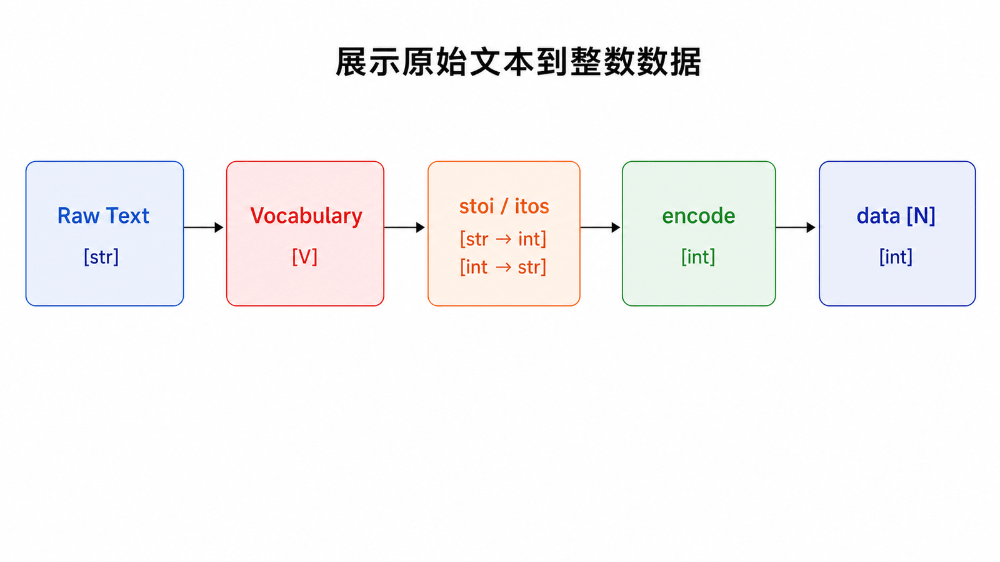

为了把注意力放在架构而不是 Tokenizer，本篇采用字符级词表。收集文本中所有不同字符，建立 `stoi` 与 `itos`，再编码为整数张量。

```python
import torch
import torch.nn as nn
import torch.nn.functional as F

torch.manual_seed(1337)
device = "cuda" if torch.cuda.is_available() else "cpu"

chars = sorted(set(text))
stoi = {ch: i for i, ch in enumerate(chars)}
itos = {i: ch for ch, i in stoi.items()}
encode = lambda s: [stoi[ch] for ch in s]
decode = lambda ids: "".join(itos[i] for i in ids)
data = torch.tensor(encode(text), dtype=torch.long)
```

字符 Tokenizer 适合教学，不代表生产模型都以字符为 Token；现代 LLM 通常使用子词或字节级方案。

### 训练集与验证集必须分开

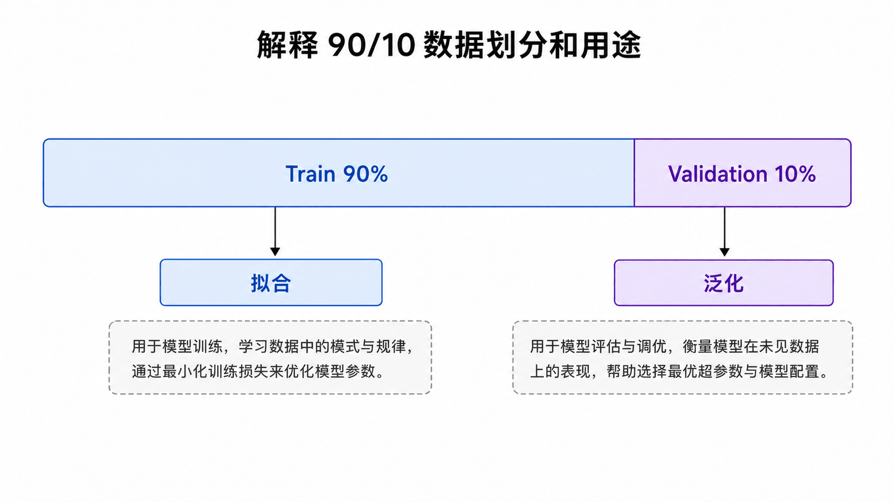

```python
n = int(0.9 * len(data))
train_data = data[:n]
val_data = data[n:]
```

训练损失回答“模型能否拟合见过的数据”，验证损失回答“这种能力能否迁移到未参与更新的文本”。对连续文本按前后切分实现简单，但如果文本不同部分风格差异很大，应考虑文档级划分，避免验证集缺乏代表性。

## 滑动窗口与右移标签

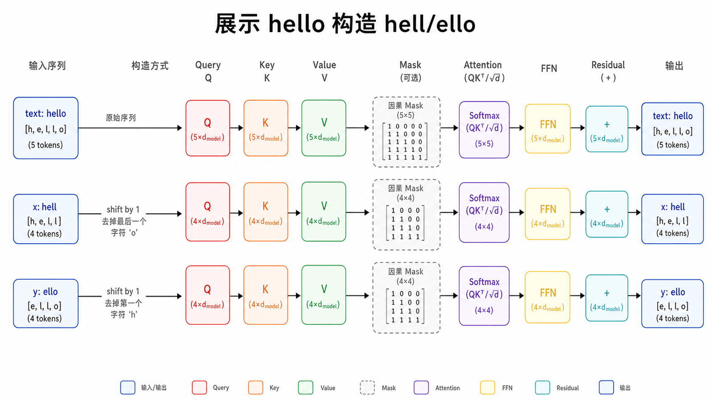

从长度 `block_size + 1` 的片段构造：`x=chunk[:-1]`，`y=chunk[1:]`。

```python
def get_batch(split, batch_size=32, block_size=128):
    source = train_data if split == "train" else val_data
    starts = torch.randint(len(source) - block_size, (batch_size,))
    x = torch.stack([source[i:i+block_size] for i in starts])
    y = torch.stack([source[i+1:i+block_size+1] for i in starts])
    return x.to(device), y.to(device)
```

## 先建立 Bigram 基线

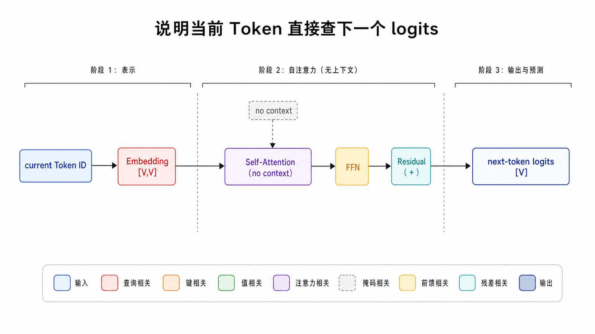

Bigram 只根据当前 Token 预测下一个 Token。用 `nn.Embedding(V,V)` 可把当前 ID 直接查成词表 logits。

```python
class BigramLanguageModel(nn.Module):
    def __init__(self, vocab_size):
        super().__init__()
        self.table = nn.Embedding(vocab_size, vocab_size)

    def forward(self, idx, targets=None):
        logits = self.table(idx)  # [B,T,V]
        loss = None
        if targets is not None:
            B, T, V = logits.shape
            loss = F.cross_entropy(logits.view(B*T, V), targets.view(B*T))
        return logits, loss
```

它跑通数据、损失和生成接口，却完全没有长上下文，是检验 Transformer 是否真正带来提升的好基线。

## 组装 Mini GPT

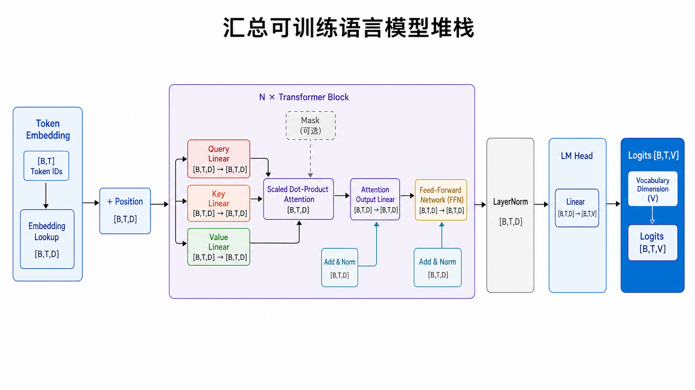

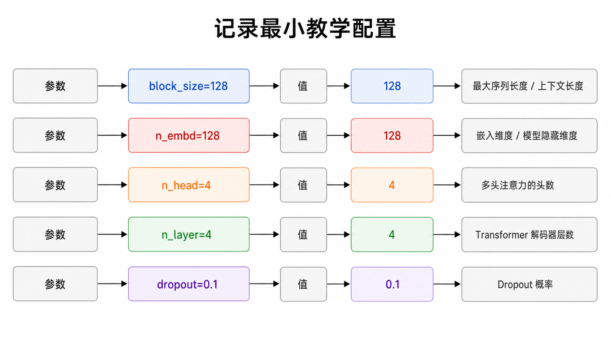

```python
class MiniGPT(nn.Module):
    def __init__(self, vocab_size, block_size, n_embd=128,
                 n_head=4, n_layer=4, dropout=0.1):
        super().__init__()
        self.block_size = block_size
        self.token_emb = nn.Embedding(vocab_size, n_embd)
        self.pos_emb = nn.Embedding(block_size, n_embd)
        self.blocks = nn.Sequential(*[
            Block(n_embd, n_head, block_size, dropout)
            for _ in range(n_layer)
        ])
        self.ln_f = nn.LayerNorm(n_embd)
        self.lm_head = nn.Linear(n_embd, vocab_size)

    def forward(self, idx, targets=None):
        B, T = idx.shape
        if T > self.block_size:
            raise ValueError("sequence exceeds block_size")
        x = self.token_emb(idx) + self.pos_emb(torch.arange(T, device=idx.device))
        x = self.blocks(x)
        logits = self.lm_head(self.ln_f(x))  # [B,T,V]
        loss = None
        if targets is not None:
            loss = F.cross_entropy(
                logits.reshape(B*T, -1), targets.reshape(B*T)
            )
        return logits, loss
```

建议先用可在普通电脑运行的教学配置：

```python
config = dict(
    block_size=128,
    n_embd=128,
    n_head=4,
    n_layer=4,
    dropout=0.1,
)
```

这不是性能最优配置，而是让 Shape、模块组合与训练闭环容易观察。扩大模型前应先确认小配置能过拟合一个很小 Batch，再确认验证损失能随训练下降。

## 从 Logits 到 Token

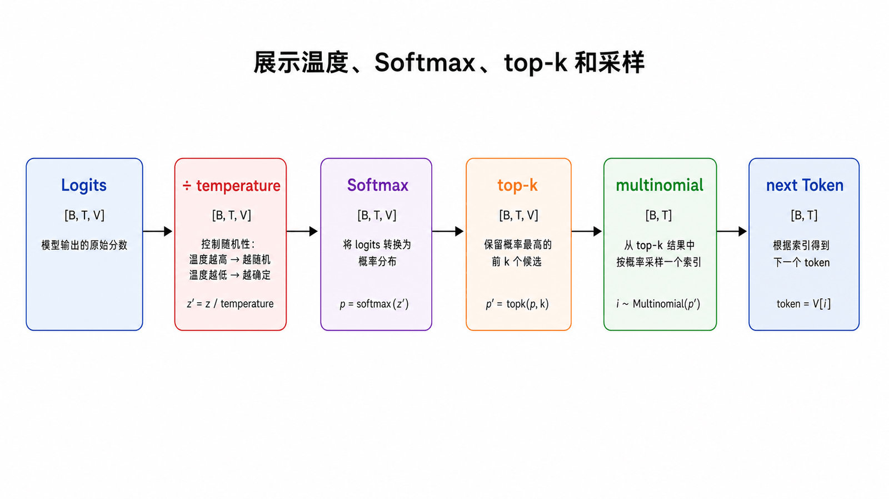

模型最后一维的 `V` 个数是未归一化 logits。生成时只取最后位置，按温度缩放、Softmax，再从分布采样。

温度小于 1 会让分布更尖，大于 1 更平；top-k 把候选限制为最高的 k 个。它们改变输出随机性，不会向模型注入新知识。

## 交叉熵连接预测与训练目标

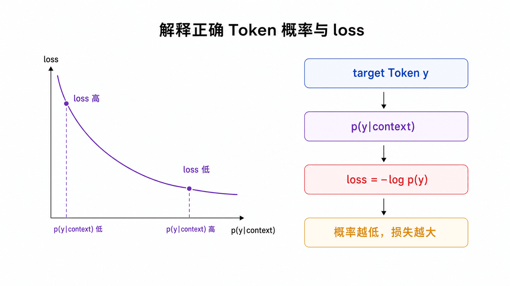

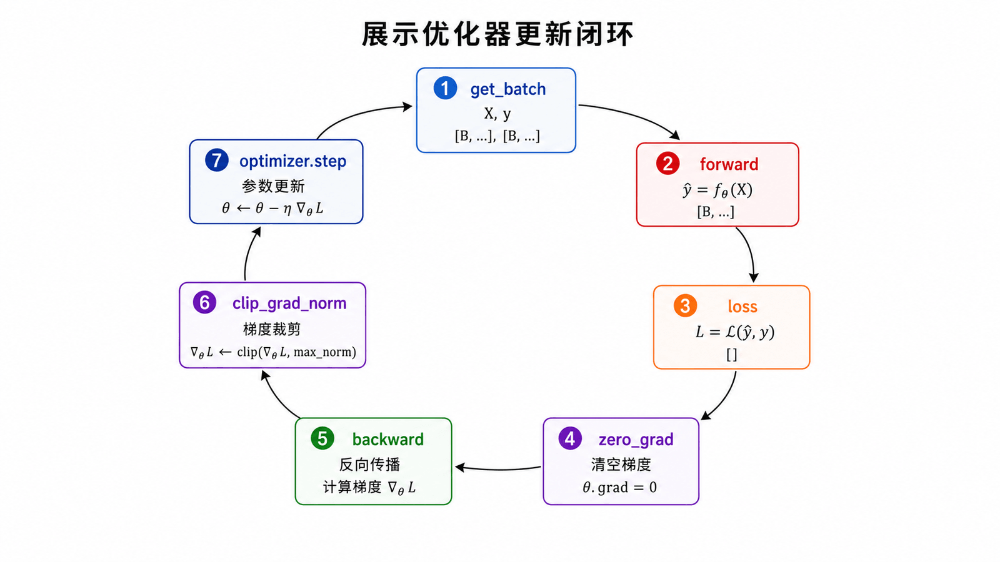

对正确 Token `y`，单位置负对数似然为：

$$
\mathcal{L}=-\log p(y\mid x_{\le t})
$$

训练循环保持简单：

```python
model = MiniGPT(vocab_size, block_size).to(device)
optimizer = torch.optim.AdamW(model.parameters(), lr=3e-4)

for step in range(max_steps):
    xb, yb = get_batch("train")
    _, loss = model(xb, yb)
    optimizer.zero_grad(set_to_none=True)
    loss.backward()
    torch.nn.utils.clip_grad_norm_(model.parameters(), 1.0)
    optimizer.step()
```

只看训练损失不够；应定期用 `eval()` 和 `torch.no_grad()` 估计验证损失。训练降而验证升通常意味着过拟合或数据分布差异。

### 一个最小验证损失函数

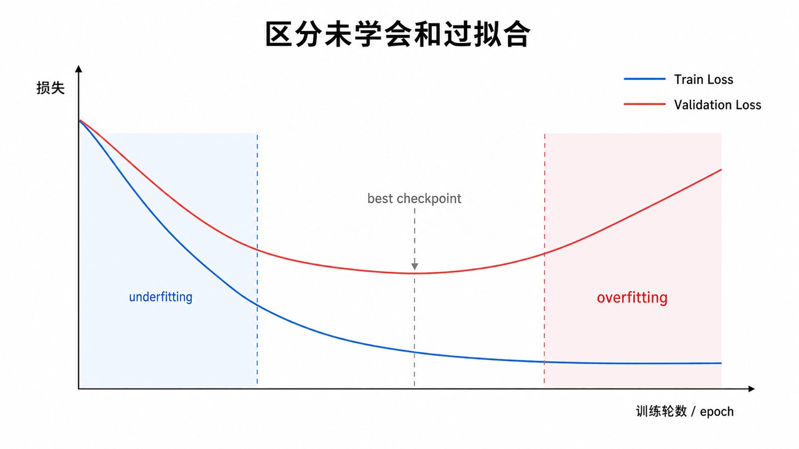

```python
@torch.no_grad()
def estimate_loss(model, eval_iters=50):
    model.eval()
    result = {}
    for split in ("train", "val"):
        losses = []
        for _ in range(eval_iters):
            xb, yb = get_batch(split)
            _, loss = model(xb, yb)
            losses.append(loss.item())
        result[split] = sum(losses) / len(losses)
    model.train()
    return result
```

评估时关闭 Dropout 并禁止梯度记录；完成后切回训练模式。固定间隔同时记录 train/val，才能区分“还没学会”和“开始过拟合”。

## 自回归生成循环

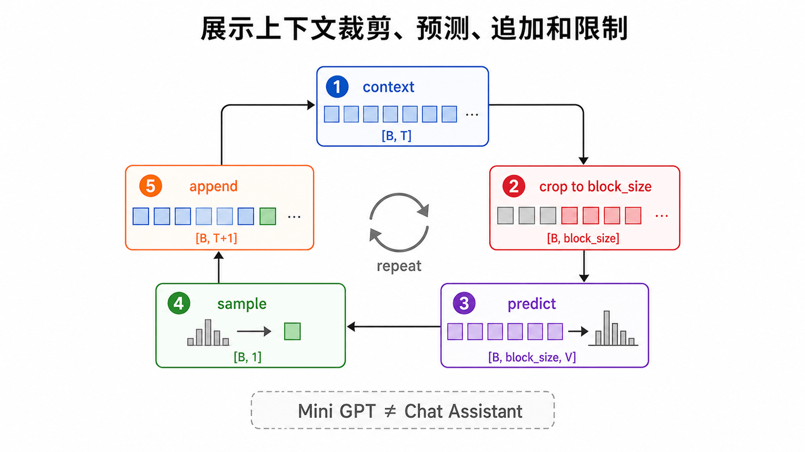

```python
@torch.no_grad()
def generate(model, idx, max_new_tokens, temperature=1.0, top_k=None):
    model.eval()
    for _ in range(max_new_tokens):
        idx_cond = idx[:, -model.block_size:]
        logits, _ = model(idx_cond)
        logits = logits[:, -1, :] / max(temperature, 1e-6)
        if top_k is not None:
            values, _ = torch.topk(logits, min(top_k, logits.size(-1)))
            logits[logits < values[:, [-1]]] = float("-inf")
        probs = F.softmax(logits, dim=-1)
        next_id = torch.multinomial(probs, num_samples=1)
        idx = torch.cat([idx, next_id], dim=1)
    return idx
```

这里为教学简洁每步重算上下文；生产推理一般用 KV Cache。字符级小模型只能学习局部风格，不应把“能生成字符”误解成已获得通用对话能力。

### 采样结果怎样判断

- 温度过低：输出重复、保守，容易陷入高概率循环；
- 温度过高：字符组合更随机，语法和局部结构变差；
- `top_k` 太小：多样性下降；太大则接近不截断采样；
- 训练损失下降但输出仍差：检查数据量、上下文长度、生成起始条件和 Tokenizer，而不是只盲目加层。

这个 Mini GPT 只完成预训练语言模型骨架，没有指令微调、偏好对齐、工具调用、安全策略和服务系统，因此不是一个缩小版 ChatGPT 产品。

## 终点检查清单

- Batch：`idx/targets [B,T]`；
- Hidden：`[B,T,C]`；
- Attention scores：`[B,H,T,T]`；
- Logits：`[B,T,V]`；
- Loss：标量；
- 生成：每轮在序列末尾追加一个 ID。

## 本篇自检

1. 为什么 `x` 与 `y` 只相差一个位置？
2. 为什么评估验证损失时要同时使用 `eval()` 和 `no_grad()`？
3. Mini GPT 能生成文本，为什么仍不能称为聊天助手？

<details>
<summary>查看答案</summary>

1. 每个输入位置的监督目标就是它的下一个 Token。
2. `eval()` 关闭 Dropout 等训练行为，`no_grad()` 避免构建梯度图并节省资源。
3. 它只有基础预训练目标，没有指令微调、偏好对齐、工具、安全和服务层。

</details>

## 小结

我们从 Token、Embedding 和 Attention 出发，完成多头、位置、Mask、FFN、残差、归一化、Encoder、原始 Decoder、GPT 迁移与 PyTorch 实现。Mini GPT 不等于现代聊天模型，但它已经包含预训练语言模型最关键的计算闭环：**上下文 → logits → 损失学习 / 概率采样 → 新 Token**。

**系列完成后的实践建议：** 把第 11、12 篇代码整理为单个可运行脚本，先在极小数据上验证因果性和过拟合能力，再逐步扩大数据、上下文和模型规模。

## 参考资料

- [Karpathy：Let's build GPT from scratch](https://www.youtube.com/watch?v=kCc8FmEb1nY)
- [Karpathy：nanoGPT](https://github.com/karpathy/nanoGPT)
- [The Annotated Transformer](https://nlp.seas.harvard.edu/annotated-transformer/)
- [Attention Is All You Need](https://arxiv.org/abs/1706.03762)
