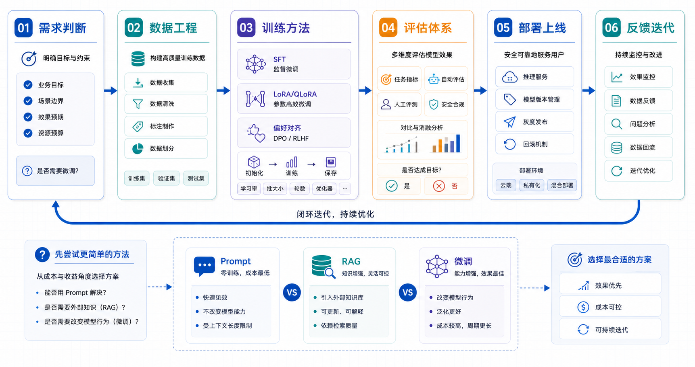

## 概述

微调（Fine-tuning）是指在已有基础模型上继续训练，让模型更适合某个特定任务、格式、风格或业务约束。它不是“给模型补充最新知识”的万能方案，而是让模型在已经具备通用能力的基础上，学会更稳定地按照你的规则输出。

这套系列文章会从概念、数据、训练、评估、部署一路讲到生产闭环。你可以把微调理解成一个工程系统，而不是一次训练命令。



## 核心概念

### 微调解决什么问题

微调最适合解决三类问题：

| 问题             | 典型表现                     | 微调价值               |
| ---------------- | ---------------------------- | ---------------------- |
| 输出格式不稳定   | JSON 字段缺失、模板不一致    | 让模型学习固定结构     |
| 专业任务习惯不足 | 分类、抽取、客服话术不稳定   | 强化特定任务模式       |
| 偏好与风格不一致 | 太啰嗦、太随意、拒答边界不清 | 学习组织标准和回答偏好 |

不适合优先微调的场景：

- 只是缺少最新知识：优先考虑 RAG。
- 只是提示词没写清楚：先优化 Prompt。
- 数据不足或质量很差：先做数据工程。
- 想让小模型凭空获得大模型能力：先换更强基座模型。

### 微调和 RAG 的区别

| 维度     | 微调                   | RAG                            |
| -------- | ---------------------- | ------------------------------ |
| 主要目标 | 改变模型行为           | 注入外部知识                   |
| 更新方式 | 重新训练或继续训练     | 更新知识库                     |
| 擅长内容 | 格式、风格、任务模式   | 最新事实、私有文档             |
| 主要风险 | 过拟合、灾难性遗忘     | 检索不准、上下文污染           |
| 验收方式 | 任务集、偏好集、回归集 | 召回率、引用准确性、答案可追溯 |

很多真实系统会同时使用二者：

```text
用户问题
  ↓
RAG 检索业务知识
  ↓
微调模型按照组织风格和固定格式回答
  ↓
评估、监控、反馈
```

## 技术路线

### 1. 全参数微调

全参数微调会更新模型的大部分或全部参数。它效果上限高，但显存、数据和工程成本都很高。

适用场景：

- 企业有较多高质量数据。
- 需要深度改变模型行为。
- 有稳定 GPU 集群和训练经验。

### 2. 参数高效微调

参数高效微调（PEFT）只训练少量新增参数。LoRA 和 QLoRA 是最常见路线。

```text
基础模型参数：冻结
LoRA 参数：训练
最终产物：base model + adapter
```

优点：

- 显存占用低。
- 训练速度快。
- 多个业务可以共用一个基座模型。
- 便于回滚和灰度。

### 3. 平台 API 微调

平台 API 微调把训练基础设施交给云服务。开发者主要负责数据准备、任务创建、评估和上线。

适用场景：

- 团队不想维护 GPU 训练环境。
- 微调数据规模中小。
- 需要快速验证业务价值。

### 4. 偏好对齐

偏好对齐不是让模型“知道更多”，而是让模型在多个可行答案中更倾向于选择组织认为更好的答案。DPO、ORPO、RFT 等方法都属于这个方向。

## 实战代码

先用一个很小的规则判断：到底要不要微调。

```python
def choose_strategy(problem: dict) -> str:
    """根据问题特征选择 Prompt、RAG 或微调。"""
    if problem.get("missing_latest_knowledge"):
        return "优先使用 RAG"

    if problem.get("prompt_not_stable") and not problem.get("many_examples"):
        return "先优化 Prompt 和输出解析"

    if problem.get("format_or_style_gap") and problem.get("many_examples"):
        return "可以考虑 SFT 或 LoRA 微调"

    if problem.get("preference_gap") and problem.get("chosen_rejected_pairs"):
        return "可以考虑 DPO/ORPO/RFT 偏好对齐"

    return "先收集失败样例和评估集"

case = {
    "format_or_style_gap": True,
    "many_examples": True,
    "missing_latest_knowledge": False,
}

print(choose_strategy(case))
```

再用最小目录组织一个微调项目：

```text
finetune-project/
├── data/
│   ├── raw/             # 原始样例
│   ├── processed/       # 清洗后 JSONL
│   └── eval/            # 固定评估集
├── scripts/
│   ├── prepare_data.py
│   ├── train_sft.py
│   └── evaluate.py
├── configs/
│   └── lora.yaml
├── outputs/
│   └── adapters/
└── README.md
```

## 常见问题

### 微调是不是一定比提示词效果好？

不一定。提示词可以快速改变单次调用行为，微调适合把大量稳定模式固化到模型里。如果需求经常变化，过早微调反而会增加迭代成本。

### 微调能不能让模型记住企业知识库？

可以记住部分模式和常见事实，但不适合作为知识库替代方案。企业知识、制度、产品文档经常变化，更适合 RAG；微调更适合学习回答方式和任务流程。

### 数据量越大越好吗？

不是。重复、低质、互相矛盾的数据会让模型变差。微调更看重“高质量、多样性、覆盖失败模式”，而不是单纯追求条数。

## 检查清单

- 是否先证明 Prompt 和 RAG 不能解决主要问题？
- 是否有一组固定评估集，而不是只看几个主观样例？
- 是否能描述微调要改变的具体行为？
- 是否能区分训练数据、验证数据和线上反馈数据？
- 是否有上线后的回滚和监控方案？

## 参考资料

- [OpenAI Fine-tuning Guide](https://platform.openai.com/docs/guides/fine-tuning)
- [OpenAI Fine-tuning API Reference](https://platform.openai.com/docs/api-reference/fine-tuning)
- [Hugging Face Transformers 文档](https://huggingface.co/docs/transformers)
- [Hugging Face PEFT 文档](https://huggingface.co/docs/peft)
