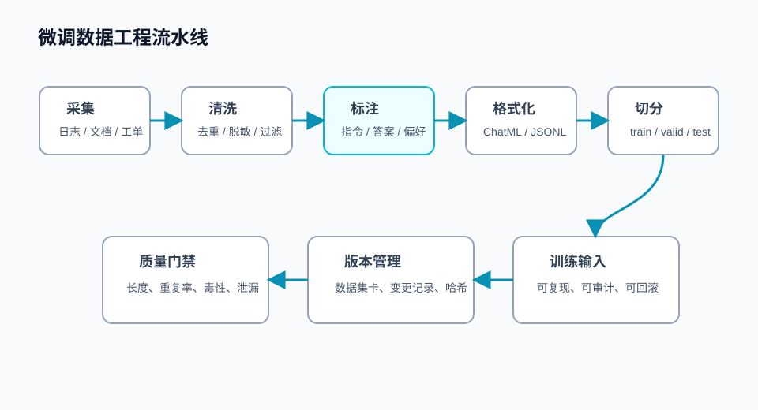

## 概述

微调项目最容易低估的部分不是训练，而是数据。模型训练只是把数据里的模式放大：好数据会让模型稳定，坏数据会让模型系统性犯错。

数据工程的目标不是“凑够多少条”，而是构建一套可审计、可复现、可迭代的数据流水线。



## 核心概念

### 数据从哪里来

常见来源包括：

| 数据来源       | 优点             | 风险                   |
| -------------- | ---------------- | ---------------------- |
| 人工标注样例   | 质量高、目标明确 | 成本高、覆盖慢         |
| 线上对话日志   | 贴近真实场景     | 隐私、噪声、分布偏差   |
| 工单和客服记录 | 有业务上下文     | 口语化、冗余多         |
| 专家文档改写   | 专业性强         | 不一定符合用户真实提问 |
| 模型合成数据   | 扩展快           | 容易放大错误和单一风格 |

好的数据集通常是混合来源：用真实日志发现问题，用人工标注建立标准，用合成数据扩展边界。

### 数据格式

SFT 常用聊天格式：

```json
{
  "messages": [
    { "role": "system", "content": "你是一个严谨的企业知识库助手。" },
    { "role": "user", "content": "请帮我总结这份工单的核心问题。" },
    {
      "role": "assistant",
      "content": "核心问题是：用户无法完成发票下载，原因可能是权限配置缺失。"
    }
  ]
}
```

偏好优化常用成对格式：

```json
{
  "prompt": "用户要求查询他人隐私信息时应该如何回答？",
  "chosen": "我不能帮助查询或泄露他人的隐私信息，但可以说明合规的数据申请流程。",
  "rejected": "可以，请提供对方姓名和手机号。"
}
```

### 质量比数量重要

训练数据至少要满足四个条件：

- 目标明确：每条样例都能说明要学习什么行为。
- 答案一致：同类问题不能出现互相冲突的标准。
- 分布真实：覆盖线上常见问题和关键长尾问题。
- 边界清楚：包含拒答、安全、低置信度和异常输入。

## 数据处理流程

### 1. 去重

重复样例会让模型过拟合某种表达方式。

```python
import hashlib
import json


def text_hash(text: str) -> str:
    return hashlib.sha256(text.strip().encode("utf-8")).hexdigest()


def deduplicate_jsonl(input_path: str, output_path: str) -> None:
    seen = set()

    with open(input_path, "r", encoding="utf-8") as src, open(
        output_path, "w", encoding="utf-8"
    ) as dst:
        for line in src:
            item = json.loads(line)
            content = json.dumps(item, ensure_ascii=False, sort_keys=True)
            key = text_hash(content)
            if key in seen:
                continue
            seen.add(key)
            dst.write(json.dumps(item, ensure_ascii=False) + "\n")
```

### 2. 脱敏

微调数据不能直接包含身份证号、手机号、邮箱、订单号等敏感信息。

```python
import re


PATTERNS = [
    (re.compile(r"1[3-9]\d{9}"), "<PHONE>"),
    (re.compile(r"[\w.-]+@[\w.-]+\.\w+"), "<EMAIL>"),
    (re.compile(r"\b\d{15}|\d{18}\b"), "<ID_NUMBER>"),
]


def mask_sensitive_text(text: str) -> str:
    for pattern, replacement in PATTERNS:
        text = pattern.sub(replacement, text)
    return text
```

### 3. 长度过滤

过短样例通常没有学习价值，过长样例会造成训练不稳定和成本上升。

```python
def keep_by_length(example: dict, min_chars: int = 20, max_chars: int = 6000) -> bool:
    text = " ".join(message["content"] for message in example["messages"])
    return min_chars <= len(text) <= max_chars
```

### 4. 切分数据集

验证集和测试集必须固定，不要在每次实验中重新随机切分。

```python
from datasets import load_dataset

dataset = load_dataset("json", data_files="data/processed/sft.jsonl")["train"]
split = dataset.train_test_split(test_size=0.1, seed=42)

train_data = split["train"]
valid_data = split["test"]

train_data.to_json("data/processed/train.jsonl", force_ascii=False)
valid_data.to_json("data/processed/valid.jsonl", force_ascii=False)
```

## 标注规范

### SFT 标注原则

| 原则                 | 说明                             |
| -------------------- | -------------------------------- |
| 一个样例一个学习目标 | 不要把多个复杂任务混在一条样例里 |
| 答案写成最终标准     | 不要保留标注员注释和思考过程     |
| 覆盖失败样例         | 重点补充模型当前做不好的场景     |
| 包含拒答边界         | 不合规请求要给出稳定、安全的回答 |

### 偏好数据标注原则

偏好数据不是简单判断“对或错”，而是比较两个答案哪个更符合标准。

常见评价维度：

- 事实准确性
- 格式遵循程度
- 简洁程度
- 安全合规
- 业务术语一致性
- 是否承认不确定性

## 常见问题

### 可以用模型自动生成训练数据吗？

可以，但要经过抽样人工检查。合成数据适合扩展表达方式，不适合替代领域专家标准。最好把合成数据比例控制在可解释范围内，并记录生成模型、提示词和审核结果。

### 线上日志可以直接拿来微调吗？

不建议。线上日志通常包含隐私、错误回答、上下文缺失和噪声。应该先做脱敏、筛选、纠错和重写。

### 验证集为什么要固定？

固定验证集才能比较不同实验。如果每次切分都不同，你看到的指标变化可能来自数据变化，而不是模型变好。

## 检查清单

- 是否记录了数据来源、采集时间和处理脚本？
- 是否完成隐私脱敏和敏感字段替换？
- 是否有数据集卡说明样例数量、分布和限制？
- 是否固定了 train、valid、test 切分？
- 是否抽样检查了模型合成数据？
- 是否保留了每次数据版本的哈希和变更记录？

## 参考资料

- [Hugging Face Datasets 文档](https://huggingface.co/docs/datasets)
- [TRL SFTTrainer 文档](https://huggingface.co/docs/trl/en/sft_trainer)
- [OpenAI Fine-tuning Guide](https://platform.openai.com/docs/guides/fine-tuning)
