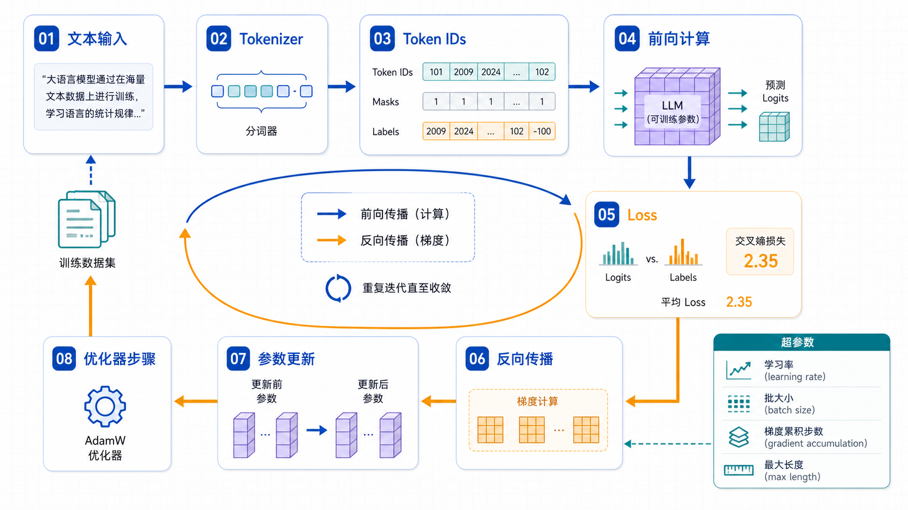

## 概述

想理解微调，必须先理解训练循环。无论你使用 Transformers Trainer、TRL SFTTrainer，还是 Axolotl、LLaMA-Factory 这样的配置化工具，底层都离不开同一件事：

```text
文本 → token → 前向计算 → loss → 反向传播 → 参数更新
```



## 核心概念

### Tokenizer

Tokenizer 负责把文本切成 token，并映射成整数 ID。模型看到的不是中文、英文或标点，而是一串数字。

```python
from transformers import AutoTokenizer

tokenizer = AutoTokenizer.from_pretrained("Qwen/Qwen2.5-0.5B-Instruct")

text = "请用三句话解释什么是 LoRA。"
encoded = tokenizer(text, return_tensors="pt")

print(encoded["input_ids"].shape)
print(tokenizer.decode(encoded["input_ids"][0]))
```

需要注意：

- 不同模型的 tokenizer 不通用。
- 聊天模型通常需要使用自己的 chat template。
- padding token、eos token 配置错误会直接影响训练。

### Labels

自回归语言模型训练时，通常让模型预测下一个 token。`labels` 表示希望模型学习的目标序列。

在指令微调里，常见做法是只让模型学习 assistant 的回答部分，而不是学习 user 的问题。

```text
system + user token：labels = -100，不计入 loss
assistant token：labels = token id，计入 loss
```

### Loss

大多数 SFT 使用交叉熵损失。它衡量模型在目标 token 上分配的概率是否足够高。

```text
loss 高：模型对目标答案不确定
loss 低：模型更倾向于生成目标答案
```

loss 下降不等于业务效果一定变好。模型可能只是记住训练集，所以必须配合验证集和人工评审。

## 关键超参数

| 参数                        | 作用                 | 常见风险                 |
| --------------------------- | -------------------- | ------------------------ |
| learning_rate               | 控制每次参数更新幅度 | 太大不稳定，太小收敛慢   |
| per_device_train_batch_size | 单卡 batch 大小      | 太大爆显存               |
| gradient_accumulation_steps | 多步累积后更新       | 太大反馈变慢             |
| max_seq_length              | 最大上下文长度       | 太短截断信息，太长成本高 |
| num_train_epochs            | 训练轮数             | 过多容易过拟合           |
| warmup_ratio                | 学习率预热比例       | 过小可能初期震荡         |

有效 batch size 的计算方式：

```text
effective_batch_size =
  per_device_train_batch_size
  × gradient_accumulation_steps
  × GPU 数量
```

## 实战代码

下面用一个最小 PyTorch 片段理解训练循环。真实项目会使用 Trainer，但底层逻辑类似。

```python
import torch
from transformers import AutoModelForCausalLM, AutoTokenizer

model_name = "Qwen/Qwen2.5-0.5B-Instruct"
tokenizer = AutoTokenizer.from_pretrained(model_name)
model = AutoModelForCausalLM.from_pretrained(model_name)

optimizer = torch.optim.AdamW(model.parameters(), lr=2e-5)

text = "用户：解释什么是微调。\n助手：微调是在基础模型上继续训练，使模型适应特定任务。"
batch = tokenizer(text, return_tensors="pt")
batch["labels"] = batch["input_ids"].clone()

model.train()
outputs = model(**batch)
loss = outputs.loss

loss.backward()
optimizer.step()
optimizer.zero_grad()

print(float(loss))
```

### 梯度累积

显存不够时，可以用小 batch 多次累积梯度，再统一更新。

```python
accumulation_steps = 4
optimizer.zero_grad()

for step, batch in enumerate(train_loader):
    outputs = model(**batch)
    loss = outputs.loss / accumulation_steps
    loss.backward()

    if (step + 1) % accumulation_steps == 0:
        optimizer.step()
        optimizer.zero_grad()
```

### 梯度裁剪

梯度过大时训练会不稳定，可以裁剪梯度范数。

```python
torch.nn.utils.clip_grad_norm_(model.parameters(), max_norm=1.0)
```

## 常见问题

### loss 越低越好吗？

不是。训练集 loss 持续下降、验证集 loss 上升，通常说明过拟合。业务效果要看固定评估集和人工评审。

### 为什么同样数据训练结果不一样？

随机种子、数据顺序、硬件并行、混合精度和框架版本都可能造成差异。生产实验要记录配置、代码版本、数据版本和模型版本。

### max_seq_length 应该设置多大？

根据真实输入长度分布决定。不要盲目拉满上下文长度，因为训练成本会随序列长度显著上升。

## 检查清单

- Tokenizer 是否与基座模型一致？
- 是否确认 chat template 和特殊 token 正确？
- 是否区分了输入 token 和需要学习的答案 token？
- 是否记录了有效 batch size？
- 是否同时观察训练集 loss 和验证集 loss？
- 是否保存了完整训练配置？

## 参考资料

- [Transformers Trainer 文档](https://huggingface.co/docs/transformers/main_classes/trainer)
- [Transformers Tokenizer 文档](https://huggingface.co/docs/transformers/main_classes/tokenizer)
- [PyTorch Autograd 文档](https://pytorch.org/docs/stable/autograd.html)
