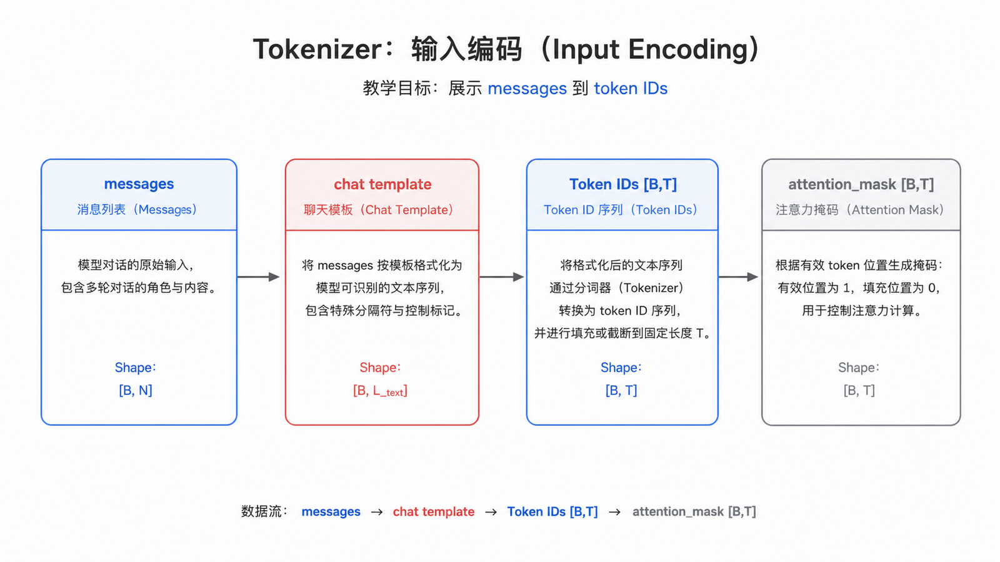
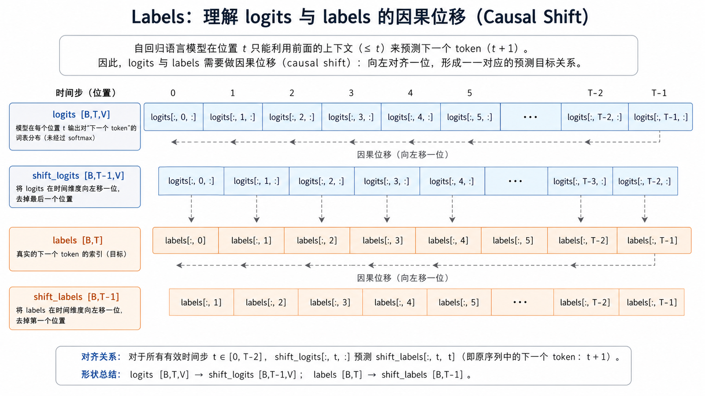
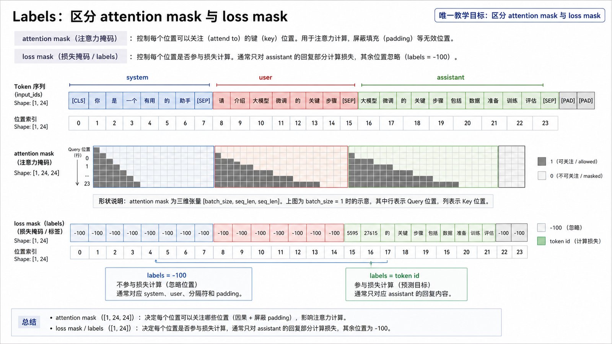
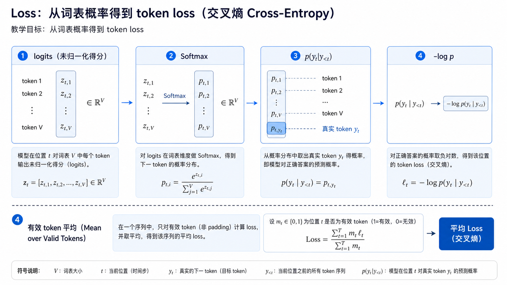
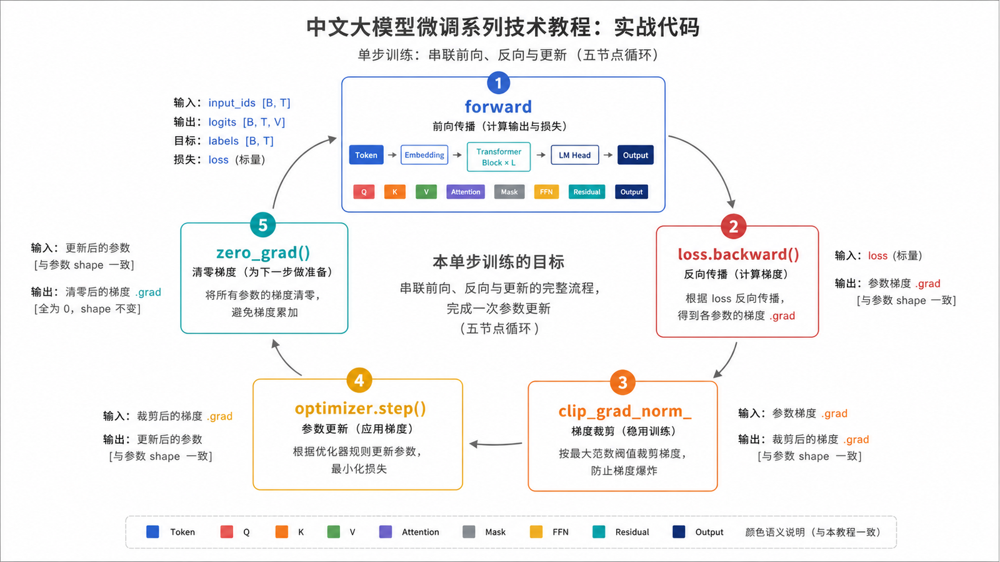
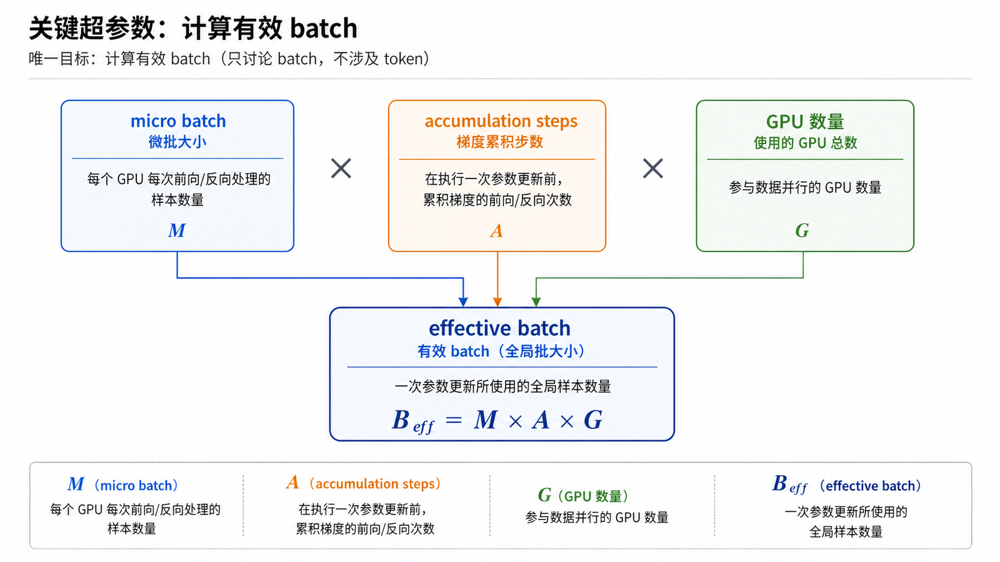
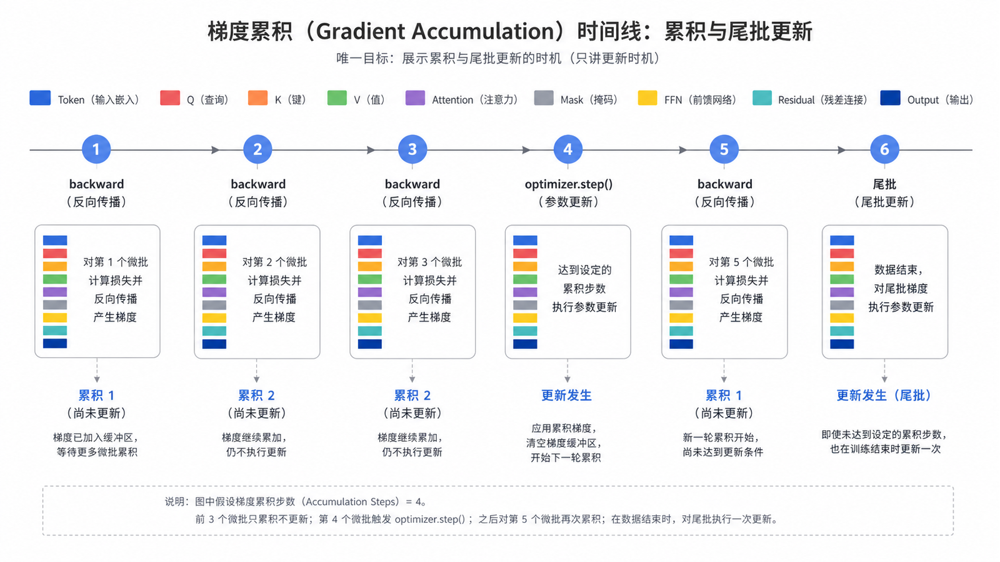
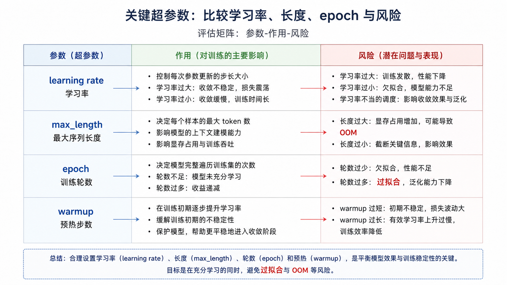
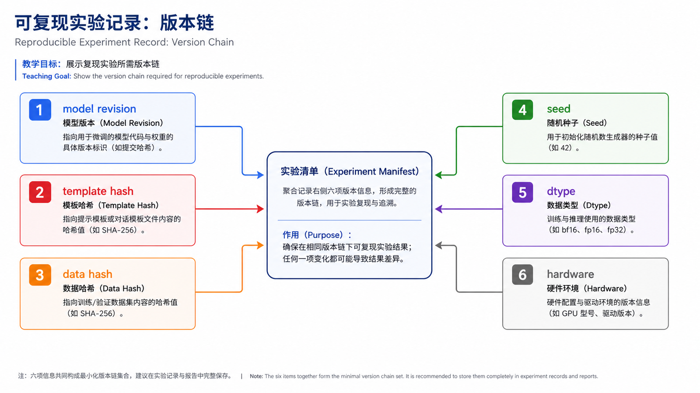

## 概述

想理解微调，必须先理解训练循环。无论你使用 Transformers Trainer、TRL SFTTrainer，还是 Axolotl、LLaMA-Factory 这样的配置化工具，底层都离不开同一件事：

```text
文本 → token → 前向计算 → loss → 反向传播 → 参数更新
```



















### 前置知识与学习目标

本篇假设你理解张量和反向传播。目标是能够从 `messages` 一直追踪到 `[B,T,V]` logits、shift 后的 labels 和最终 loss，并能验证哪些 token 真正参与训练。

## 核心概念

### Tokenizer

Tokenizer 负责把文本切成 token，并映射成整数 ID。模型看到的不是中文、英文或标点，而是一串数字。

```python
from transformers import AutoTokenizer

tokenizer = AutoTokenizer.from_pretrained("Qwen/Qwen2.5-0.5B-Instruct")

text = "请用三句话解释什么是 LoRA。"
encoded = tokenizer(text, return_tensors="pt")

print(encoded["input_ids"].shape)
print(tokenizer.decode(encoded["input_ids"][0]))
```

需要注意：

- 不同模型的 tokenizer 不通用。
- 聊天模型通常需要使用自己的 chat template。
- padding token、eos token 配置错误会直接影响训练。

### Labels

自回归语言模型训练时，通常让模型预测下一个 token。`labels` 表示希望模型学习的目标序列。

在指令微调里，常见做法是只让模型学习 assistant 的回答部分，而不是学习 user 的问题。

```text
system + user token：labels = -100，不计入 loss
assistant token：labels = token id，计入 loss
```

### Loss

大多数 SFT 使用交叉熵损失。它衡量模型在目标 token 上分配的概率是否足够高。

```text
loss 高：模型对目标答案不确定
loss 低：模型更倾向于生成目标答案
```

loss 下降不等于业务效果一定变好。模型可能只是记住训练集，所以必须配合验证集和人工评审。

设模型输出 `logits ∈ R^[B,T,V]`，其中 `V` 是词表大小。因果语言模型在位置 `t` 的 logits 预测位置 `t+1` 的 token，因此计算时会形成：

```text
shift_logits = logits[:, :-1, :]   # [B, T-1, V]
shift_labels = labels[:, 1:]       # [B, T-1]
```

对未被 `-100` 屏蔽的位置，交叉熵为 `-log p(y_t | y_<t)`；batch loss 是有效目标 token 的平均值。比较不同 packing 或截断配置时，应同时记录有效 token 数，不能只比较 step 数。

## 关键超参数

| 参数                        | 作用                 | 常见风险                 |
| --------------------------- | -------------------- | ------------------------ |
| learning_rate               | 控制每次参数更新幅度 | 太大不稳定，太小收敛慢   |
| per_device_train_batch_size | 单卡 batch 大小      | 太大爆显存               |
| gradient_accumulation_steps | 多步累积后更新       | 太大反馈变慢             |
| max_seq_length              | 最大上下文长度       | 太短截断信息，太长成本高 |
| num_train_epochs            | 训练轮数             | 过多容易过拟合           |
| warmup_ratio                | 学习率预热比例       | 过小可能初期震荡         |

有效 batch size 的计算方式：

```text
effective_batch_size =
  per_device_train_batch_size
  × gradient_accumulation_steps
  × GPU 数量
```

## 实战代码

下面用一个最小 PyTorch 片段理解训练循环。真实项目会使用 Trainer，但底层逻辑类似。

```python
import torch
from transformers import AutoModelForCausalLM, AutoTokenizer

model_name = "Qwen/Qwen2.5-0.5B-Instruct"
tokenizer = AutoTokenizer.from_pretrained(model_name)
model = AutoModelForCausalLM.from_pretrained(model_name)

optimizer = torch.optim.AdamW(model.parameters(), lr=2e-5)

messages = [
    {"role": "user", "content": "解释什么是微调。"},
    {"role": "assistant", "content": "微调是在基础模型上继续训练，使模型适应特定任务。"},
]
prompt_ids = tokenizer.apply_chat_template(
    messages[:-1], tokenize=True, add_generation_prompt=True
)
full_ids = tokenizer.apply_chat_template(messages, tokenize=True)

input_ids = torch.tensor([full_ids])
labels = input_ids.clone()
labels[:, : len(prompt_ids)] = -100
attention_mask = torch.ones_like(input_ids)

model.train()
outputs = model(input_ids=input_ids, attention_mask=attention_mask, labels=labels)
loss = outputs.loss

loss.backward()
optimizer.step()
optimizer.zero_grad()

print(float(loss))
assert torch.all(labels[:, : len(prompt_ids)] == -100)
assert torch.any(labels[:, len(prompt_ids) :] != -100)
```

这是教学用的单轮构造。生产代码应使用经过验证的 chat template assistant mask 或数据 collator，并测试多轮对话、空回答、截断和 padding；不能依赖字符串搜索“助手：”来定位 loss。

### 梯度累积

显存不够时，可以用小 batch 多次累积梯度，再统一更新。

```python
accumulation_steps = 4
optimizer.zero_grad()

for step, batch in enumerate(train_loader):
    outputs = model(**batch)
    loss = outputs.loss / accumulation_steps
    loss.backward()

    if (step + 1) % accumulation_steps == 0:
        optimizer.step()
        optimizer.zero_grad()

# 数据条数不是 accumulation_steps 整数倍时，还要更新最后一批已累积梯度。
if len(train_loader) % accumulation_steps:
    optimizer.step()
    optimizer.zero_grad()
```

### 梯度裁剪

梯度过大时训练会不稳定，可以裁剪梯度范数。

```python
torch.nn.utils.clip_grad_norm_(model.parameters(), max_norm=1.0)
```

梯度裁剪应位于 `loss.backward()` 之后、`optimizer.step()` 之前。使用混合精度 scaler 时，要先 unscale 再裁剪。

## 可复现实验记录

至少记录模型 revision、tokenizer/chat template 哈希、数据哈希、PyTorch/Transformers/TRL 版本、seed/data seed、精度、GPU 型号、有效 batch token 数和梯度累积方式。即使固定随机种子，分布式规约和某些 GPU kernel 仍可能带来小幅非确定性，因此复现目标应是指标落在容差内，而非权重逐 bit 相同。

## 常见问题

### loss 越低越好吗？

不是。训练集 loss 持续下降、验证集 loss 上升，通常说明过拟合。业务效果要看固定评估集和人工评审。

### 为什么同样数据训练结果不一样？

随机种子、数据顺序、硬件并行、混合精度和框架版本都可能造成差异。生产实验要记录配置、代码版本、数据版本和模型版本。

### max_seq_length 应该设置多大？

根据真实输入长度分布决定。不要盲目拉满上下文长度，因为训练成本会随序列长度显著上升。

## 检查清单

- Tokenizer 是否与基座模型一致？
- 是否确认 chat template 和特殊 token 正确？
- 是否区分了输入 token 和需要学习的答案 token？
- 是否记录了有效 batch size？
- 是否同时观察训练集 loss 和验证集 loss？
- 是否保存了完整训练配置？

## 自检题

<details><summary>1. 为什么 logits 的 Shape 是 [B,T,V]，labels 却是 [B,T]？</summary>

每个位置都要给词表中每个 token 一个分数，所以 logits 多一个词表轴；label 只保存该位置的目标 token ID。

</details>

<details><summary>2. `attention_mask=0` 和 `labels=-100` 是同一件事吗？</summary>

不是。attention mask 控制模型是否读取 padding/被遮挡位置；`-100` 控制该目标位置是否进入交叉熵。

</details>

<details><summary>3. 梯度累积为什么要除以 accumulation_steps？</summary>

为了让累积后的梯度近似对应大 batch 的平均 loss；否则梯度会随累积步数成比例放大。

</details>

## 参考资料

- [Transformers Trainer 文档](https://huggingface.co/docs/transformers/main_classes/trainer)
- [Transformers Tokenizer 文档](https://huggingface.co/docs/transformers/main_classes/tokenizer)
- [PyTorch Autograd 文档](https://pytorch.org/docs/stable/autograd.html)
