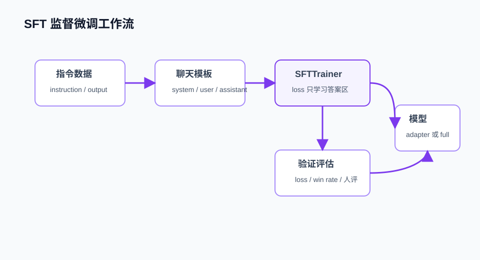

## 概述

SFT（Supervised Fine-tuning，监督微调）是大模型微调最常见的第一步。它用高质量的“输入-理想输出”样例训练模型，让模型学会任务格式、语气、边界和回答结构。



## 核心概念

### SFT 数据长什么样

对聊天模型来说，推荐使用 messages 格式：

```json
{
  "messages": [
    { "role": "system", "content": "你是一个专业的售后工单分析助手。" },
    {
      "role": "user",
      "content": "用户反馈付款后订单仍显示待支付，请分析原因。"
    },
    {
      "role": "assistant",
      "content": "可能原因包括支付回调延迟、订单状态同步失败或第三方支付通知丢失。建议先查询支付流水，再核对订单状态变更日志。"
    }
  ]
}
```

SFT 的核心不是让模型背答案，而是让模型学习：

- 如何理解任务。
- 如何组织答案。
- 如何遵守输出格式。
- 什么时候拒答或承认不确定。

### 训练目标

SFT 通常只训练 assistant 部分。这样可以避免模型学习用户提问方式，也能把训练信号集中在理想答案上。

```text
system/user：提供上下文
assistant：计算 loss
```

## 实战代码

### 1. 安装依赖

```bash
pip install transformers datasets accelerate trl peft
```

### 2. 准备数据

`data/train.jsonl`：

```json
{
  "messages": [
    { "role": "system", "content": "你是一个工单分析助手。" },
    { "role": "user", "content": "订单付款成功但状态未更新怎么办？" },
    {
      "role": "assistant",
      "content": "先确认支付流水是否成功，再检查支付回调日志和订单状态同步任务。如果流水成功但订单未更新，应触发补偿任务并记录异常原因。"
    }
  ]
}
```

`data/valid.jsonl`：

```json
{
  "messages": [
    { "role": "system", "content": "你是一个工单分析助手。" },
    { "role": "user", "content": "用户说无法下载发票，应该排查什么？" },
    {
      "role": "assistant",
      "content": "优先检查用户是否具备开票权限、订单是否已完成、发票服务是否返回错误，以及下载链接是否过期。"
    }
  ]
}
```

### 3. 训练脚本

```python
from datasets import load_dataset
from transformers import AutoModelForCausalLM, AutoTokenizer
from trl import SFTConfig, SFTTrainer

model_name = "Qwen/Qwen2.5-0.5B-Instruct"

tokenizer = AutoTokenizer.from_pretrained(model_name)
model = AutoModelForCausalLM.from_pretrained(
    model_name,
    device_map="auto",
)

dataset = load_dataset(
    "json",
    data_files={
        "train": "data/train.jsonl",
        "validation": "data/valid.jsonl",
    },
)


training_args = SFTConfig(
    output_dir="outputs/sft",
    max_length=2048,
    per_device_train_batch_size=1,
    gradient_accumulation_steps=8,
    learning_rate=2e-5,
    num_train_epochs=3,
    logging_steps=10,
    eval_strategy="steps",
    eval_steps=50,
    save_steps=50,
    bf16=True,
)

trainer = SFTTrainer(
    model=model,
    args=training_args,
    train_dataset=dataset["train"],
    eval_dataset=dataset["validation"],
    processing_class=tokenizer,
)

trainer.train()
trainer.save_model("outputs/sft/final")
tokenizer.save_pretrained("outputs/sft/final")
```

### 4. 推理验证

```python
import torch
from transformers import AutoModelForCausalLM, AutoTokenizer

model_dir = "outputs/sft/final"
tokenizer = AutoTokenizer.from_pretrained(model_dir)
model = AutoModelForCausalLM.from_pretrained(model_dir, device_map="auto")

messages = [
    {"role": "system", "content": "你是一个工单分析助手。"},
    {"role": "user", "content": "用户付款成功但订单仍待支付，怎么排查？"},
]

text = tokenizer.apply_chat_template(
    messages,
    tokenize=False,
    add_generation_prompt=True,
)

inputs = tokenizer(text, return_tensors="pt").to(model.device)
with torch.no_grad():
    output_ids = model.generate(**inputs, max_new_tokens=256, temperature=0.2)

print(tokenizer.decode(output_ids[0], skip_special_tokens=True))
```

## 关键配置

| 配置           | 建议                           |
| -------------- | ------------------------------ |
| 学习率         | SFT 常从 `1e-5` 到 `2e-5` 试起 |
| epoch          | 小数据集从 1 到 3 轮开始       |
| max_seq_length | 根据样例长度分布设置           |
| eval_steps     | 保证每轮能看到多次验证结果     |
| save_steps     | 结合训练耗时和磁盘空间设置     |

## 常见问题

### SFT 后模型为什么变啰嗦？

训练数据可能普遍啰嗦，或者系统提示没有约束回答长度。可以增加简洁答案样例，并在评估集中加入长度指标。

### 为什么训练后格式仍然不稳定？

常见原因是格式样例太少、格式不一致、推理时没有使用相同 chat template，或者训练时没有只对 assistant 部分计算 loss。

### 小数据集能训练吗？

可以做验证，但不要期待泛化很强。小数据集适合证明方向，大规模上线需要更丰富的失败样例和覆盖集。

## 检查清单

- 数据是否统一为 messages 格式？
- 训练和推理是否使用同一个 chat template？
- 是否有独立验证集？
- 是否记录了训练配置和依赖版本？
- 是否用业务样例人工检查输出质量？
- 是否和原始基座模型做了对比？

## 参考资料

- [TRL SFTTrainer 文档](https://huggingface.co/docs/trl/en/sft_trainer)
- [Transformers TrainingArguments 文档](https://huggingface.co/docs/transformers/main_classes/trainer)
- [Hugging Face Chat Templates 文档](https://huggingface.co/docs/transformers/chat_templating)
