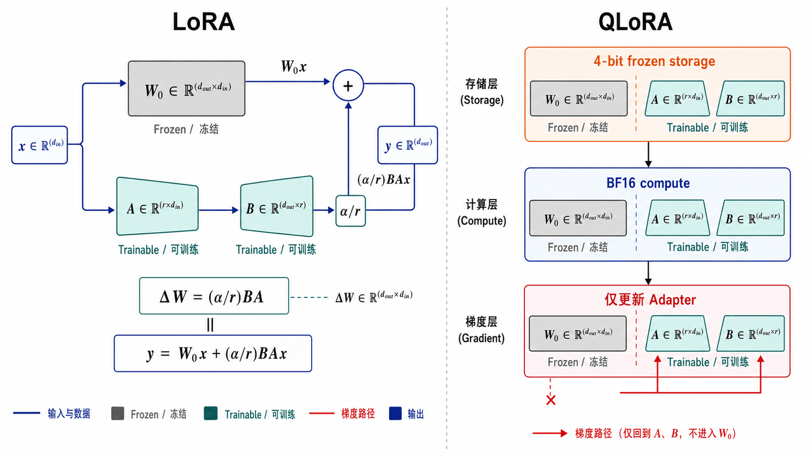
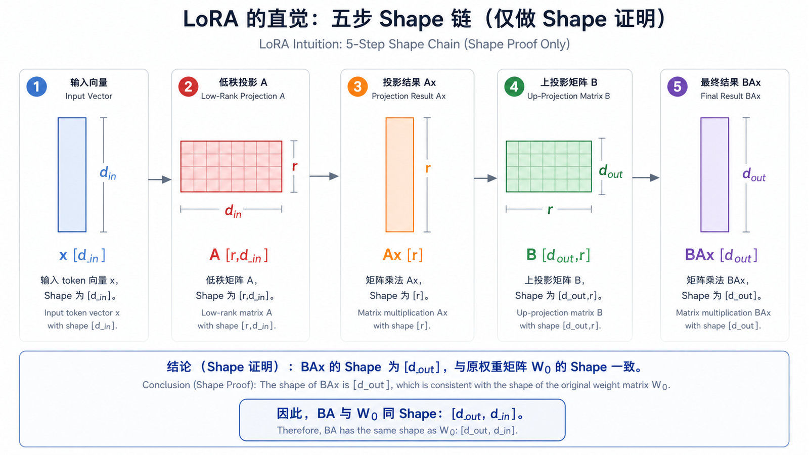
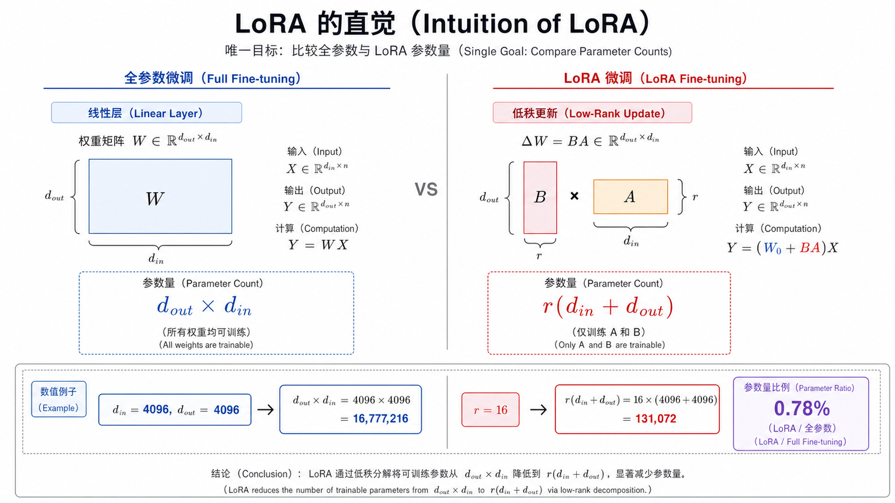
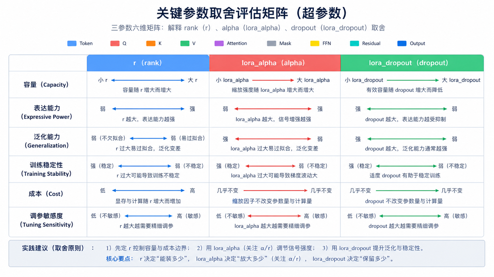
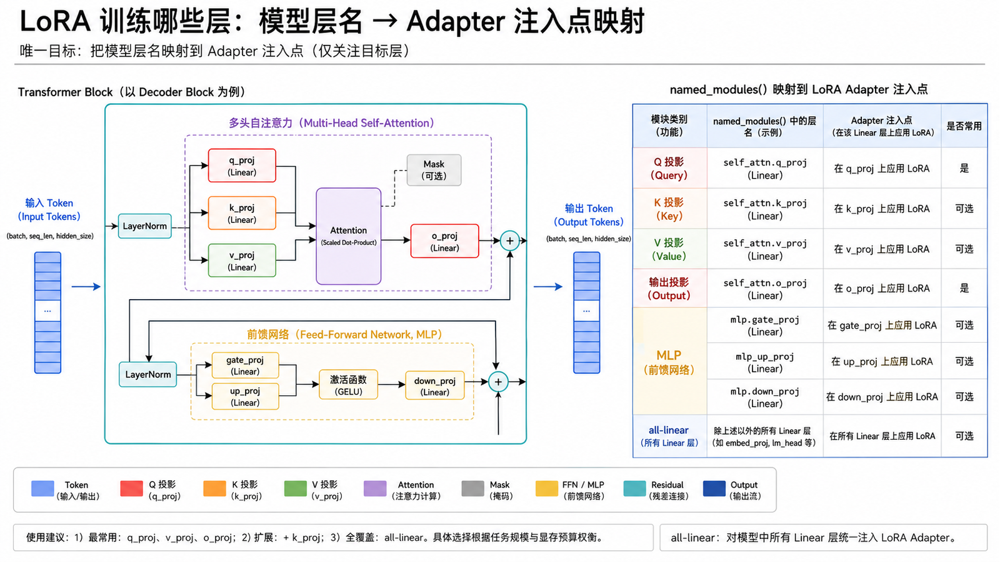
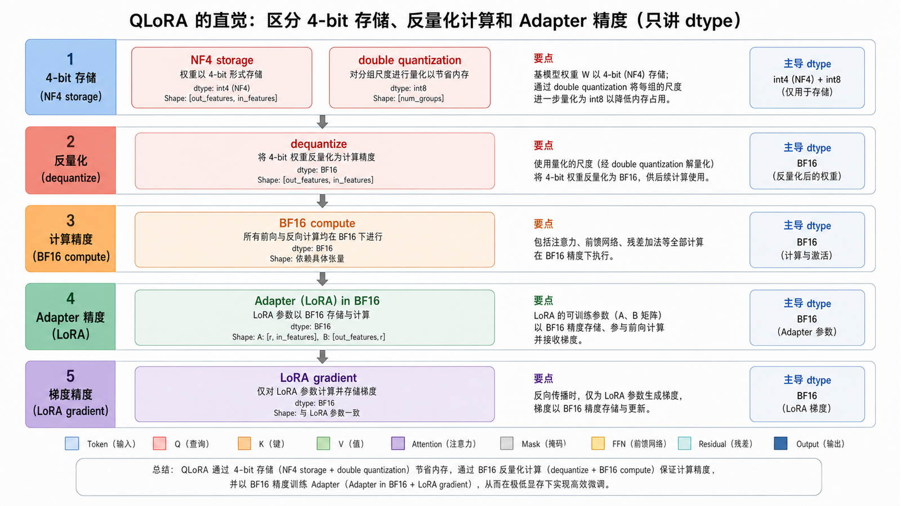
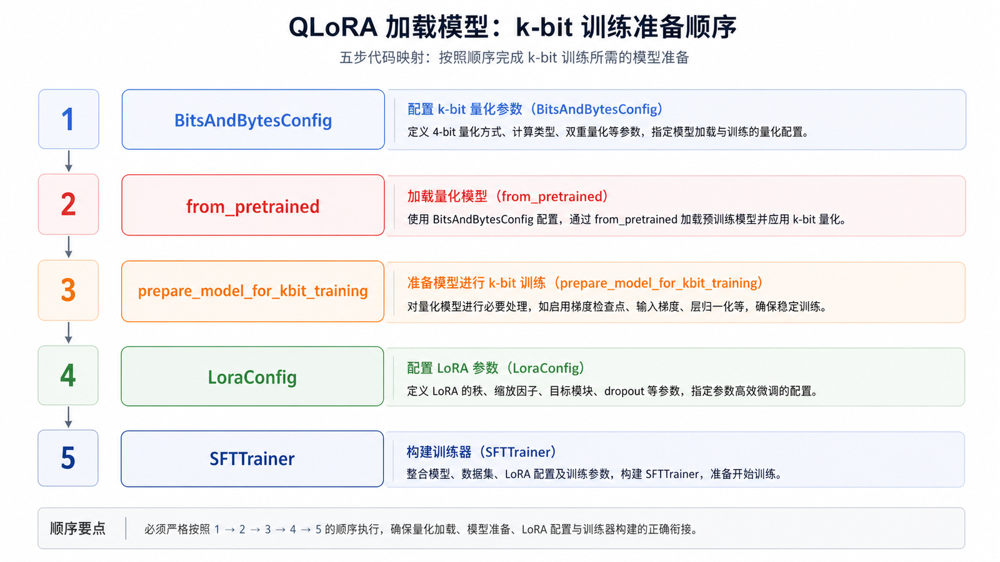
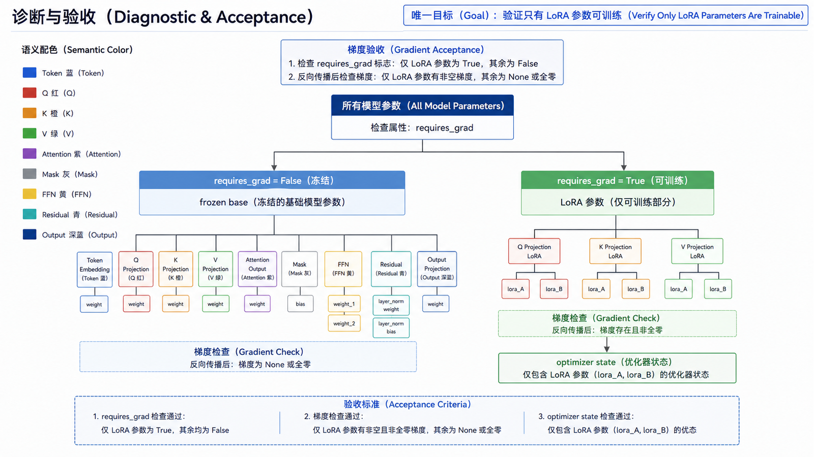
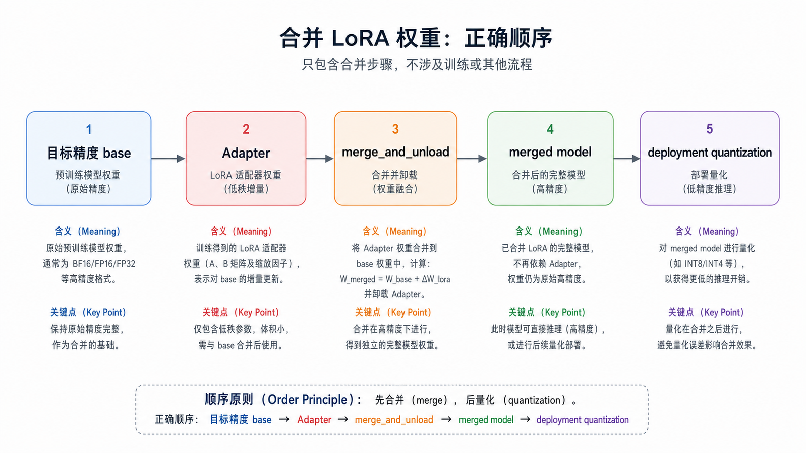
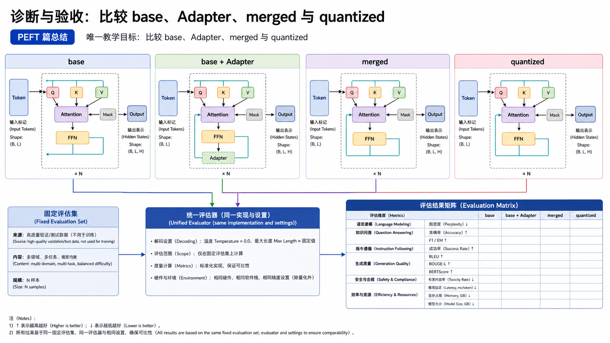

## 概述

全参数微调成本高、显存压力大，不适合大多数团队作为第一选择。LoRA 和 QLoRA 属于参数高效微调（PEFT）方法，它们通过训练少量新增参数，让模型在较低成本下适应新任务。





















> 现有总览图只作概念参考：图中的 A/B Shape 标注互换。以本篇公式和后续重绘图为准。

### 前置知识与学习目标

你应理解线性层 `y=Wx` 和反向传播。学完后应能手算 LoRA 参数量、确认实际注入层、解释 QLoRA 的存储与计算 dtype，并验证 Adapter 与合并模型的一致性。

## 核心概念

### LoRA 的直觉

LoRA 的核心思想是：不直接更新原始权重，而是在某些线性层旁边增加两个低秩矩阵。

```text
原始输出：y = W₀x
LoRA 输出：y = W₀x + (α/r)BAx
```

其中：

- `W₀ ∈ R^(d_out×d_in)` 是冻结的原始权重。
- `A ∈ R^(r×d_in)`、`B ∈ R^(d_out×r)` 是可训练矩阵。
- `ΔW=(α/r)BA` 与 `W₀` Shape 相同，但只需训练 `r(d_in+d_out)` 个参数。
- rank `r` 越大，可学习能力越强，参数和显存也越高。

例如 `d_in=d_out=4096、r=16` 时，原线性层有 `4096²=16,777,216` 个权重；LoRA 只增加 `16×4096+4096×16=131,072` 个参数，约为该层的 0.78%。这只是参数量对比，不代表端到端显存按同一比例下降，因为激活、临时 buffer 和量化元数据仍然存在。

### QLoRA 的直觉

QLoRA 会用 4-bit 方式加载基座模型，再训练 LoRA adapter。它进一步降低显存占用，适合单卡或小规模 GPU 环境。

```text
基座模型：4-bit 量化加载
训练参数：LoRA adapter
优化目标：在低显存下完成 SFT
```

### LoRA 训练哪些层

常见目标层包括：

| 模块              | 作用                 | 是否常训练       |
| ----------------- | -------------------- | ---------------- |
| q_proj            | attention query 投影 | 常见             |
| k_proj            | attention key 投影   | 常见             |
| v_proj            | attention value 投影 | 常见             |
| o_proj            | attention 输出投影   | 常见             |
| gate_proj         | MLP 门控             | 视任务而定       |
| up_proj/down_proj | MLP 升降维           | 视显存和效果而定 |

层名依赖模型架构。先运行 `for name, module in model.named_modules()` 查看真实名称，再决定目标层。PEFT 的 `target_modules="all-linear"` 可以覆盖多数线性层，但会增加可训练参数和实验变量；固定列表也不能从 Qwen、Llama 直接照搬到所有模型。

## 关键参数

| 参数             | 说明           | 建议                  |
| ---------------- | -------------- | --------------------- |
| `r`              | 低秩维度       | 从 8、16、32 试起     |
| `lora_alpha`     | LoRA 缩放系数  | 常设置为 `2r` 或 `r`  |
| `lora_dropout`   | LoRA dropout   | 小数据可设 0.05       |
| `target_modules` | 注入 LoRA 的层 | 先覆盖 attention 投影 |
| `bias`           | 是否训练 bias  | 多数场景设为 `none`   |

## 实战代码

### 1. LoRA 配置

```python
from peft import LoraConfig, TaskType, prepare_model_for_kbit_training

lora_config = LoraConfig(
    task_type=TaskType.CAUSAL_LM,
    r=16,
    lora_alpha=32,
    lora_dropout=0.05,
    bias="none",
    target_modules=[
        "q_proj",
        "k_proj",
        "v_proj",
        "o_proj",
        "gate_proj",
        "up_proj",
        "down_proj",
    ],
)
```

### 2. QLoRA 加载模型

```python
import torch
from peft import prepare_model_for_kbit_training
from transformers import AutoModelForCausalLM, AutoTokenizer, BitsAndBytesConfig

model_name = "Qwen/Qwen2.5-0.5B-Instruct"

quant_config = BitsAndBytesConfig(
    load_in_4bit=True,
    bnb_4bit_quant_type="nf4",
    bnb_4bit_compute_dtype=torch.bfloat16,
    bnb_4bit_use_double_quant=True,
)

tokenizer = AutoTokenizer.from_pretrained(model_name)
model = AutoModelForCausalLM.from_pretrained(
    model_name,
    quantization_config=quant_config,
    device_map="auto",
)
model = prepare_model_for_kbit_training(model)
```

### 3. 结合 SFTTrainer

```python
import torch
from datasets import load_dataset
from peft import LoraConfig, TaskType, prepare_model_for_kbit_training
from transformers import AutoModelForCausalLM, AutoTokenizer, BitsAndBytesConfig
from trl import SFTConfig, SFTTrainer

model_name = "Qwen/Qwen2.5-0.5B-Instruct"

quant_config = BitsAndBytesConfig(
    load_in_4bit=True,
    bnb_4bit_quant_type="nf4",
    bnb_4bit_compute_dtype=torch.bfloat16,
    bnb_4bit_use_double_quant=True,
)

tokenizer = AutoTokenizer.from_pretrained(model_name)
model = AutoModelForCausalLM.from_pretrained(
    model_name,
    quantization_config=quant_config,
    device_map="auto",
)
model = prepare_model_for_kbit_training(model)

peft_config = LoraConfig(
    task_type=TaskType.CAUSAL_LM,
    r=16,
    lora_alpha=32,
    lora_dropout=0.05,
    bias="none",
    target_modules=["q_proj", "k_proj", "v_proj", "o_proj"],
)

dataset = load_dataset(
    "json",
    data_files={"train": "data/train.jsonl", "validation": "data/valid.jsonl"},
)

args = SFTConfig(
    output_dir="outputs/qlora",
    max_length=2048,
    per_device_train_batch_size=1,
    gradient_accumulation_steps=8,
    learning_rate=2e-4,
    num_train_epochs=3,
    logging_steps=10,
    eval_steps=50,
    save_steps=50,
    assistant_only_loss=True,
    seed=42,
    data_seed=42,
    report_to="none",
)

trainer = SFTTrainer(
    model=model,
    args=args,
    train_dataset=dataset["train"],
    eval_dataset=dataset["validation"],
    peft_config=peft_config,
    processing_class=tokenizer,
)

trainer.train()
trainer.save_model("outputs/qlora/final-adapter")
```

在 QLoRA 中，4-bit 描述的是冻结基座权重的存储形式；矩阵计算会使用配置的计算 dtype，LoRA 参数与梯度也不是 4-bit。NF4、双重量化和 BF16 是常用组合，但必须根据 GPU 能力验证，不能把它们当作所有硬件的固定答案。

### 4. 合并 LoRA 权重

部署时可以保留 adapter，也可以合并到基座模型。

```python
from peft import PeftModel
from transformers import AutoModelForCausalLM, AutoTokenizer

base_model = "Qwen/Qwen2.5-0.5B-Instruct"
adapter_dir = "outputs/qlora/final-adapter"
merged_dir = "outputs/merged-model"

tokenizer = AutoTokenizer.from_pretrained(base_model)
model = AutoModelForCausalLM.from_pretrained(base_model, device_map="auto")
model = PeftModel.from_pretrained(model, adapter_dir)

merged_model = model.merge_and_unload()
merged_model.save_pretrained(merged_dir)
tokenizer.save_pretrained(merged_dir)
```

合并时应从未量化或目标部署精度的基座权重重新加载 Adapter；不要把训练时的 4-bit 存储误当成理想的合并来源。验收顺序为：基座 → Adapter 组合 → 合并模型 → 量化部署模型，每一步都在同一固定评估集上比较。

## 诊断与验收

```python
trainable = [name for name, p in model.named_parameters() if p.requires_grad]
assert trainable, "没有可训练参数"
assert all("lora_" in name for name in trainable), trainable[:10]

model.print_trainable_parameters()
```

还应检查目标模块数量是否符合预期、一个训练 step 后 LoRA 参数是否变化、冻结基座是否保持不变，以及保存后重新加载 Adapter 的输出是否在数值容差内一致。

## 常见问题

### LoRA rank 越大越好吗？

不一定。rank 越大，表达能力越强，但更容易过拟合，训练成本也更高。建议从小 rank 开始，用验证集和人工评审比较。

### Adapter 部署和合并部署怎么选？

adapter 部署便于多个业务共用基座模型，也方便回滚。合并部署推理链路更简单，但每个业务模型会占用完整权重空间。

### QLoRA 会不会影响效果？

通常会有一些量化误差，但对很多 SFT 任务是可接受的。关键是用固定评估集比较 LoRA、QLoRA 和基座模型，而不是只看训练 loss。

## 检查清单

- 是否确认目标层名称与模型结构匹配？
- 是否记录 LoRA rank、alpha、dropout 和目标模块？
- 是否比较 LoRA、QLoRA 和全参数微调成本？
- 是否保存 adapter、tokenizer 和训练配置？
- 是否设计了合并和回滚策略？

## 自检题

<details><summary>1. 当 W₀ 是 [4096,4096]、r=16 时，A 和 B 的 Shape 是什么？</summary>

`A=[16,4096]`，`B=[4096,16]`，所以 `BA=[4096,4096]`。

</details>

<details><summary>2. QLoRA 是否用 4-bit 梯度训练 Adapter？</summary>

不是。4-bit 主要用于冻结基座权重的存储；计算和可训练 Adapter 使用更高精度 dtype。

</details>

<details><summary>3. 为什么合并后必须重新评估？</summary>

重新加载精度、权重合并、序列化和后续量化都可能引入变化；合并成功不等于业务行为一致。

</details>

## 参考资料

- [Hugging Face PEFT LoRA 文档](https://huggingface.co/docs/peft)
- [TRL SFTTrainer 文档](https://huggingface.co/docs/trl/en/sft_trainer)
- [Transformers bitsandbytes 量化文档](https://huggingface.co/docs/transformers/quantization/bitsandbytes)
