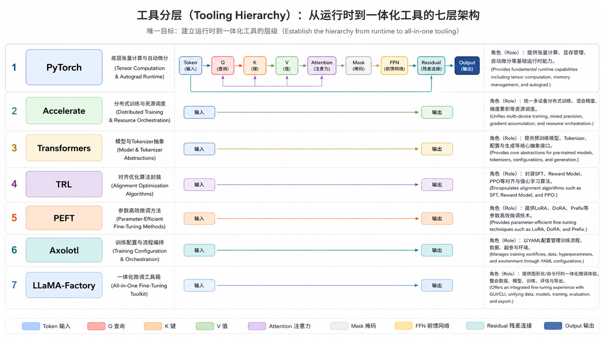
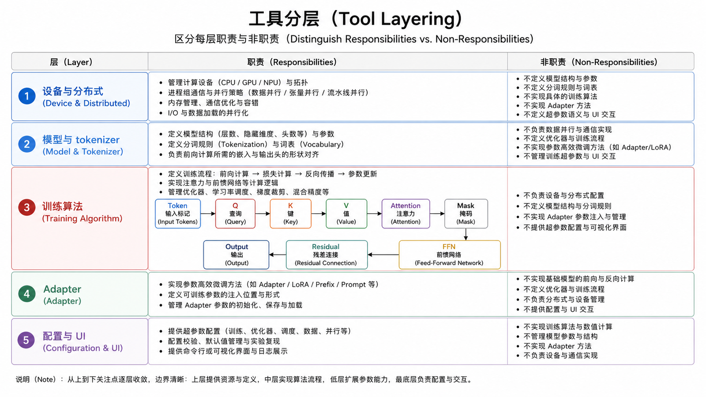
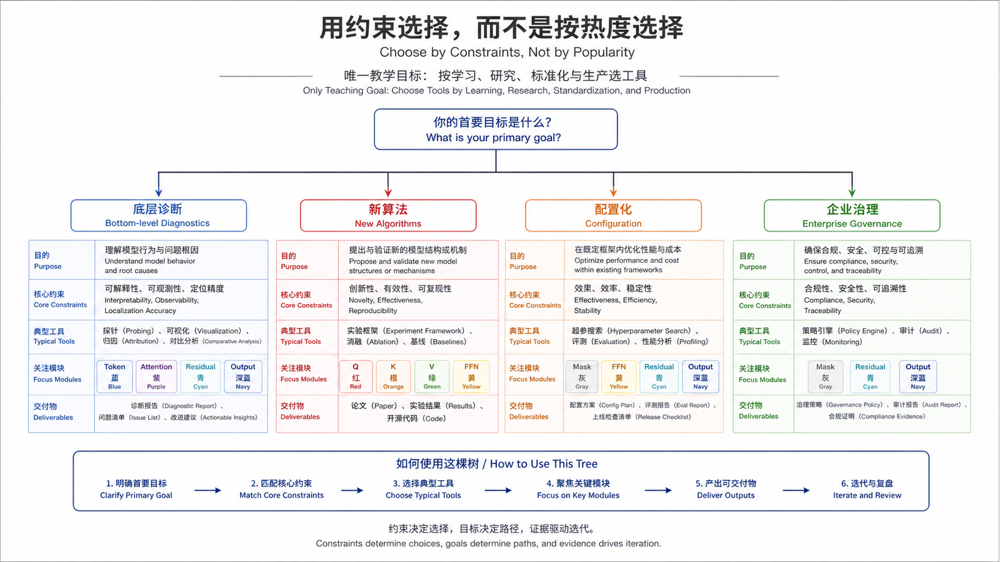
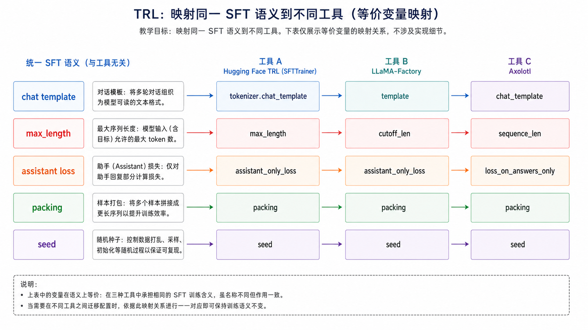
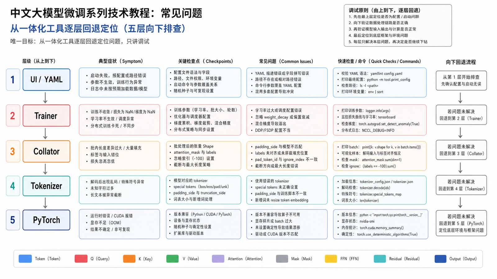
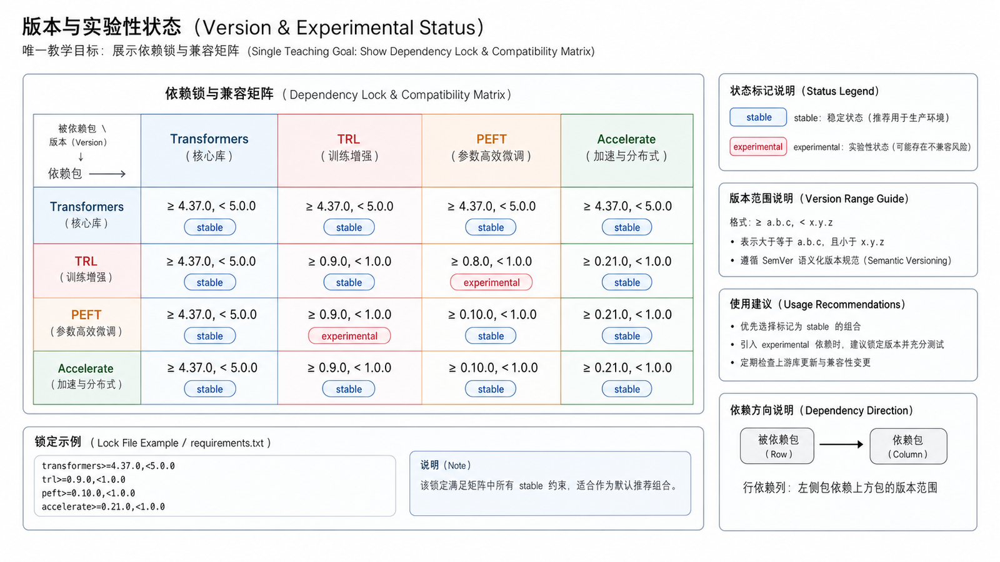
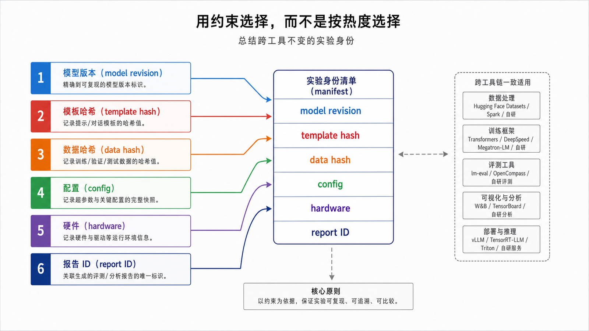

## 概述

开源微调生态很丰富，但很多初学者会被工具名淹没。一个清晰的理解方式是：底层运行时负责训练能力，中层库负责模型和算法，上层工具负责配置化工程流程。















### 前置知识与学习目标

本篇不再把工具当作互斥选项。目标是理解每一层负责什么、同一实验如何跨工具保持数据与评估等价，以及出现错误时应回退到哪一层诊断。

## 核心概念

### 工具分层

| 层级       | 代表工具                             | 主要职责                           |
| ---------- | ------------------------------------ | ---------------------------------- |
| 运行时     | PyTorch、Accelerate、DeepSpeed、FSDP | 设备、分布式、混合精度、显存优化   |
| 模型接口   | Transformers                         | 模型加载、Tokenizer、Trainer、推理 |
| 训练算法   | TRL                                  | SFT、DPO、偏好优化训练器           |
| 参数高效   | PEFT                                 | LoRA、QLoRA、Adapter 管理          |
| 一体化工具 | Axolotl、LLaMA-Factory               | 配置驱动训练、评估、合并、导出     |

### 什么时候用哪个工具

| 场景           | 推荐路线                          |
| -------------- | --------------------------------- |
| 学习原理       | Transformers + TRL + PEFT         |
| 快速复现实验   | LLaMA-Factory 或 Axolotl          |
| 自定义训练逻辑 | Transformers Trainer 或纯 PyTorch |
| 偏好优化       | TRL DPOTrainer / ORPOTrainer      |
| 多模型批量实验 | 配置化工具 + 实验追踪             |

## Transformers

Transformers 是 Hugging Face 生态的核心库，负责模型、Tokenizer、配置和 Trainer。

```python
from transformers import AutoModelForCausalLM, AutoTokenizer

model_name = "Qwen/Qwen2.5-0.5B-Instruct"

tokenizer = AutoTokenizer.from_pretrained(model_name)
model = AutoModelForCausalLM.from_pretrained(model_name, device_map="auto")

messages = [{"role": "user", "content": "解释什么是微调。"}]
text = tokenizer.apply_chat_template(
    messages,
    tokenize=False,
    add_generation_prompt=True,
)

inputs = tokenizer(text, return_tensors="pt").to(model.device)
outputs = model.generate(**inputs, max_new_tokens=128)
print(tokenizer.decode(outputs[0], skip_special_tokens=True))
```

## TRL

TRL 面向大模型后训练，常用于 SFT、DPO 等训练流程。它的价值是把常见后训练算法封装成可复用 Trainer。

```python
from datasets import load_dataset
from trl import SFTConfig, SFTTrainer

dataset = load_dataset("json", data_files="data/train.jsonl")["train"]

args = SFTConfig(
    output_dir="outputs/sft",
    max_length=2048,
    per_device_train_batch_size=1,
    gradient_accumulation_steps=8,
    assistant_only_loss=True,
    seed=42,
    report_to="none",
)

trainer = SFTTrainer(
    model="Qwen/Qwen2.5-0.5B-Instruct",
    args=args,
    train_dataset=dataset,
)

trainer.train()
```

## PEFT

PEFT 用来管理参数高效微调。它可以和 Transformers、TRL 组合，也可以单独加载和合并 adapter。

```python
from peft import LoraConfig, get_peft_model

config = LoraConfig(
    r=16,
    lora_alpha=32,
    target_modules=["q_proj", "v_proj"],
    lora_dropout=0.05,
    bias="none",
)

model = get_peft_model(model, config)
model.print_trainable_parameters()
```

## Axolotl

Axolotl 更偏训练工程平台。它用 YAML 管理模型、数据、LoRA、分布式、评估和导出，适合批量实验。

典型配置形态：

```yaml
base_model: Qwen/Qwen2.5-0.5B-Instruct
load_in_4bit: true
adapter: qlora
sequence_len: 2048
datasets:
  - path: data/train.jsonl
    type: chat_template
output_dir: outputs/axolotl
micro_batch_size: 1
gradient_accumulation_steps: 8
num_epochs: 3
learning_rate: 0.0002
```

## LLaMA-Factory

LLaMA-Factory 适合想快速跑通训练、评估和导出的团队。它提供命令行和 Web UI，降低了配置门槛。

典型命令形态：

```bash
llamafactory-cli train examples/train_lora/llama3_lora_sft.yaml
```

它适合：

- 快速验证数据集是否有效。
- 给非底层训练工程师使用。
- 统一常见模型和数据格式。

## 选型建议

### 用约束选择，而不是按热度选择

| 约束                      | 首选入口                  | 原因                           |
| ------------------------- | ------------------------- | ------------------------------ |
| 学习底层与定位 mask/Shape | Transformers + TRL + PEFT | 行为透明、容易插入断言         |
| 统一多模型训练配置        | Axolotl 或 LLaMA-Factory  | 配置化、减少重复脚本           |
| 研究新对齐算法            | TRL/算法原仓库            | 能直接访问 loss 与 trainer     |
| 企业生产平台              | 封装上述稳定层            | 加入版本、权限、评估和注册治理 |

一体化工具不应成为数据格式、评估指标和产物命名的唯一真相。建立一个独立的实验 manifest，至少包含：基座 revision、tokenizer/template 哈希、数据哈希、算法、关键超参数、依赖锁、硬件、seed、输出目录和评估报告 ID。

### 版本与实验性状态

TRL、Transformers 与 PEFT 的构造参数变化较快，示例必须绑定经验证的版本。遇到文档中的 experimental trainer 或 main 分支功能时，应明确标注“实验性”，不能把它作为长期兼容接口。一体化工具的字段还要核对它最终映射到的底层参数，尤其是 `max_length`、packing、assistant loss、gradient checkpointing 和保存策略。

### 学习路线

```text
先学 Transformers 和 Tokenizer
  ↓
再学 TRL 的 SFTTrainer
  ↓
然后加入 PEFT/LoRA
  ↓
最后使用 Axolotl 或 LLaMA-Factory 提升效率
```

### 生产路线

```text
Notebook 小样本实验
  ↓
脚本化训练
  ↓
配置化批量实验
  ↓
训练记录、评估报告、模型注册
```

## 常见问题

### 一开始就用一体化工具可以吗？

可以，但建议至少理解 Transformers、TRL 和 PEFT 的基本概念。否则训练失败时很难判断是数据问题、模型问题、配置问题还是分布式问题。

### 不同工具训练结果会完全一样吗？

通常不会。默认参数、数据 packing、chat template、随机种子和精度设置都会影响结果。对比实验时要尽量固定这些变量。

### 企业内部应该封装自己的工具吗？

当团队有稳定训练流程、统一数据格式和模型发布规范时，可以封装。但不要过早封装，否则会把还没弄清楚的实验流程固化。

## 检查清单

- 是否清楚每个工具负责哪一层？
- 是否统一 chat template 和 tokenizer？
- 是否记录所有训练配置？
- 是否能从一体化工具回退到底层脚本排查问题？
- 是否建立模型产物、数据版本和评估报告的对应关系？

## 自检题

<details><summary>1. TRL 和 PEFT 是互相替代的吗？</summary>

不是。TRL 提供 SFT/DPO 等训练器，PEFT 提供 LoRA 等参数高效方法，两者经常组合使用。

</details>

<details><summary>2. 为什么两个工具使用同一数据也可能结果不同？</summary>

chat template、packing、loss mask、默认优化器、精度、seed 和保存/评估策略都可能不同。

</details>

<details><summary>3. 一体化工具报 loss 异常时先检查什么？</summary>

先检查渲染后的 token、labels mask、截断和有效 token 数，再逐层检查 trainer 与分布式配置。

</details>

## 参考资料

- [Transformers 文档](https://huggingface.co/docs/transformers)
- [TRL 文档](https://huggingface.co/docs/trl)
- [PEFT 文档](https://huggingface.co/docs/peft)
- [Axolotl 文档](https://docs.axolotl.ai/)
- [LLaMA-Factory 项目](https://github.com/hiyouga/LLaMA-Factory)
