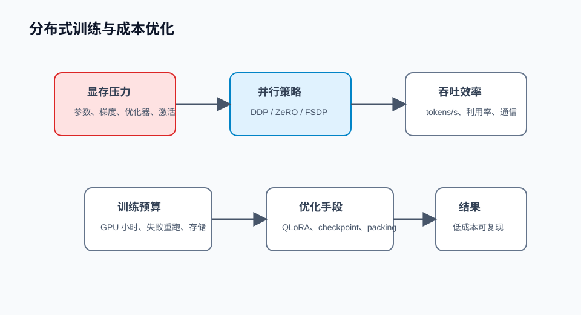

## 概述

分布式训练不是“多加几张卡”这么简单。它要同时处理显存、吞吐、通信、失败重跑和成本控制。微调项目真正昂贵的地方，往往不是一次成功训练，而是多次失败实验和不可复现的调参。



## 核心概念

### 显存主要花在哪里

训练时显存通常来自：

| 部分       | 说明                  | 优化方式                      |
| ---------- | --------------------- | ----------------------------- |
| 模型参数   | 基座模型权重          | 量化、LoRA、FSDP              |
| 梯度       | 反向传播保存的梯度    | ZeRO、梯度检查点              |
| 优化器状态 | Adam 的一阶和二阶动量 | ZeRO、8-bit optimizer         |
| 激活值     | 前向计算中间结果      | gradient checkpointing        |
| batch 数据 | token、mask、labels   | 控制 max length 和 batch size |

### 吞吐指标

训练效率不要只看“跑得动”，还要看：

```text
tokens_per_second = 训练 token 数 / 训练时间
gpu_utilization = GPU 实际计算利用率
step_time = 每个训练 step 耗时
```

一个显存刚好跑满但吞吐很低的配置，可能并不便宜。

## 优化策略

### 1. 梯度累积

小显存机器可以用小 batch 多次累积梯度。

```python
effective_batch_size = (
    per_device_train_batch_size
    * gradient_accumulation_steps
    * num_gpus
)

print(effective_batch_size)
```

### 2. Gradient Checkpointing

梯度检查点会少保存一部分激活值，反向传播时重新计算，以时间换显存。

```python
model.gradient_checkpointing_enable()
```

适合：

- 序列长度较长。
- 显存不足。
- 可以接受训练速度下降。

### 3. 数据 Packing

短样例很多时，如果每条样例单独 padding，会浪费大量 token。packing 会把多个短样例拼到一个序列里。

```text
不 packing：
[短样例 + padding]
[短样例 + padding]

packing：
[短样例 + eos + 短样例 + eos + 短样例]
```

注意：packing 要确保样例边界清楚，避免不同对话互相污染。

### 4. DeepSpeed ZeRO

DeepSpeed ZeRO 会把优化器状态、梯度和参数切分到不同 GPU 上。

ZeRO 阶段：

| 阶段   | 切分内容                 | 显存收益 |
| ------ | ------------------------ | -------- |
| ZeRO-1 | 优化器状态               | 中       |
| ZeRO-2 | 优化器状态 + 梯度        | 高       |
| ZeRO-3 | 优化器状态 + 梯度 + 参数 | 更高     |

示例配置：

```json
{
  "bf16": { "enabled": true },
  "zero_optimization": {
    "stage": 2,
    "overlap_comm": true,
    "contiguous_gradients": true
  },
  "gradient_accumulation_steps": 8,
  "train_micro_batch_size_per_gpu": 1
}
```

### 5. FSDP

FSDP（Fully Sharded Data Parallel）是 PyTorch 原生的全分片数据并行方案，适合希望减少外部依赖、深度使用 PyTorch 生态的团队。

典型思路：

```text
每张 GPU 只保存部分参数
前向和反向时按需 all-gather
计算完成后释放临时完整参数
```

## 成本控制方法

### 小步实验

不要一开始就全量训练。推荐顺序：

```text
100 条样例验证格式
  ↓
1000 条样例验证趋势
  ↓
完整训练集跑正式实验
```

### 固定实验矩阵

| 实验      | 数据     | 方法       | 目标         |
| --------- | -------- | ---------- | ------------ |
| baseline  | 无微调   | 基座模型   | 评估原始能力 |
| sft-small | 1k 样例  | LoRA       | 验证方向     |
| sft-full  | 全量     | LoRA/QLoRA | 比较业务指标 |
| align     | 偏好数据 | DPO/ORPO   | 优化答案偏好 |

## 常见问题

### GPU 越多越快吗？

不一定。GPU 增加后通信成本会上升。如果 batch 太小、网络慢、数据加载慢，更多 GPU 可能利用率更低。

### DeepSpeed 和 FSDP 怎么选？

DeepSpeed 配置成熟、资料多，适合大量训练项目。FSDP 是 PyTorch 原生方案，适合希望贴近原生生态的团队。实际选择要看团队经验、模型规模和运维栈。

### 为什么显存没满但训练很慢？

可能瓶颈在 CPU 数据处理、磁盘读取、网络通信、padding 浪费或过于频繁的评估保存。

## 检查清单

- 是否记录 tokens/s，而不只是记录训练耗时？
- 是否统计样例长度分布并设置合理 max length？
- 是否启用梯度累积和 gradient checkpointing 做对比？
- 是否有小样本试跑，避免全量失败？
- 是否记录 GPU 利用率、显存峰值和失败重跑成本？

## 参考资料

- [DeepSpeed ZeRO 文档](https://www.deepspeed.ai/tutorials/zero/)
- [PyTorch FSDP 文档](https://pytorch.org/docs/stable/fsdp.html)
- [Accelerate DeepSpeed 文档](https://huggingface.co/docs/accelerate/usage_guides/deepspeed)
- [Transformers 性能优化文档](https://huggingface.co/docs/transformers/perf_train_gpu_one)
