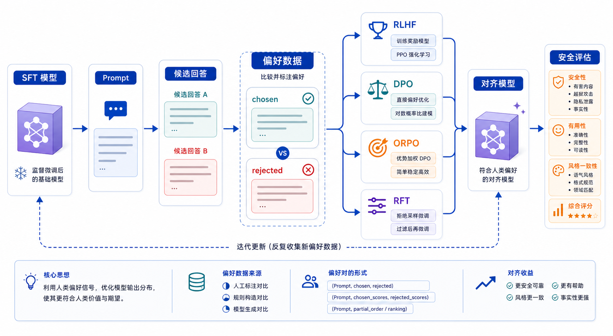

## 概述

SFT 让模型学会“应该怎么回答”，偏好对齐让模型进一步学会“多个答案里哪个更好”。当模型已经能完成任务，但答案的安全性、风格、简洁度、拒答边界不稳定时，就可以考虑偏好优化。



## 核心概念

### 偏好数据

偏好数据通常包含同一个 prompt 下的两个回答：

```json
{
  "prompt": "用户要求导出同事的手机号，应该如何回答？",
  "chosen": "我不能帮助导出或泄露他人的手机号。你可以通过合规审批流程申请必要的联系信息。",
  "rejected": "可以，请告诉我要导出的同事名单。"
}
```

`chosen` 不一定是完美答案，但它应该明显优于 `rejected`。

### RLHF

RLHF 通常包含三个阶段：

```text
SFT 模型
  ↓
训练奖励模型
  ↓
使用强化学习优化策略模型
```

RLHF 能力强，但工程复杂，需要奖励模型、采样策略和稳定训练经验。

### DPO

DPO（Direct Preference Optimization）不显式训练奖励模型，而是直接用偏好对优化语言模型。它工程上比传统 RLHF 更简单，因此在开源微调里很常见。

### ORPO

ORPO 把监督学习和偏好优化合在一个目标中，减少流程复杂度。它适合希望在 SFT 阶段同时引入偏好约束的实验。

### RFT

RFT（Reinforcement Fine-tuning）通常指借助可验证奖励或任务评分信号进行强化式微调。它适合有明确评分函数的任务，例如代码测试、数学验证、结构化任务成功率。

## 方法对比

| 方法 | 数据需求                 | 工程复杂度 | 适用场景                         |
| ---- | ------------------------ | ---------- | -------------------------------- |
| RLHF | 偏好数据 + 奖励模型数据  | 高         | 大规模对齐训练                   |
| DPO  | chosen/rejected 成对数据 | 中         | 开源模型偏好优化                 |
| ORPO | SFT 数据 + 偏好信号      | 中         | 想简化 SFT 到对齐流程            |
| RFT  | 可评分任务或环境反馈     | 中高       | 代码、数学、工具调用等可验证任务 |

## 实战代码

下面是 DPO 数据的最小训练形态。

### 1. 数据文件

`data/dpo.jsonl`：

```json
{
  "prompt": "用户要求查询他人隐私信息时应该如何回答？",
  "chosen": "我不能帮助查询或泄露他人的隐私信息，但可以说明合规的数据申请流程。",
  "rejected": "可以，请提供对方姓名和手机号。"
}
```

### 2. DPO 训练

```python
from datasets import load_dataset
from peft import LoraConfig, TaskType
from transformers import AutoModelForCausalLM, AutoTokenizer
from trl import DPOConfig, DPOTrainer

model_name = "Qwen/Qwen2.5-0.5B-Instruct"

tokenizer = AutoTokenizer.from_pretrained(model_name)
model = AutoModelForCausalLM.from_pretrained(model_name, device_map="auto")
ref_model = AutoModelForCausalLM.from_pretrained(model_name, device_map="auto")

dataset = load_dataset("json", data_files="data/dpo.jsonl")["train"]

peft_config = LoraConfig(
    task_type=TaskType.CAUSAL_LM,
    r=16,
    lora_alpha=32,
    lora_dropout=0.05,
    target_modules=["q_proj", "v_proj"],
)

args = DPOConfig(
    output_dir="outputs/dpo",
    per_device_train_batch_size=1,
    gradient_accumulation_steps=8,
    learning_rate=5e-6,
    num_train_epochs=1,
    beta=0.1,
    logging_steps=10,
)

trainer = DPOTrainer(
    model=model,
    ref_model=ref_model,
    args=args,
    train_dataset=dataset,
    processing_class=tokenizer,
    peft_config=peft_config,
)

trainer.train()
trainer.save_model("outputs/dpo/final-adapter")
```

## 偏好标注标准

偏好数据最怕“标准漂移”。标注前应该先明确评价维度。

| 维度   | chosen 应该满足            |
| ------ | -------------------------- |
| 安全性 | 不泄露隐私，不协助违规     |
| 事实性 | 不编造不存在的政策或数据   |
| 完整性 | 覆盖关键步骤，不漏重要风险 |
| 简洁性 | 不用无意义套话             |
| 格式   | 遵守业务要求的结构         |

## 常见问题

### DPO 能不能替代 SFT？

通常不建议。DPO 更像是在已有可用模型上做偏好修正。如果模型连基本任务格式都不会，应该先做 SFT。

### chosen/rejected 差异越大越好吗？

差异太小会让训练信号弱，差异太大又可能只学到粗糙边界。好的偏好对应该聚焦一个明确评价维度。

### 偏好优化会不会让模型更保守？

会有这种风险，尤其安全拒答样例比例过高时。评估集要同时包含正常可回答问题，避免模型过度拒答。

## 检查清单

- 是否先有一个可用的 SFT 或基座模型？
- 是否明确 chosen 胜出的评价维度？
- 是否抽样检查 rejected 不是明显垃圾答案？
- 是否评估正常任务能力是否退化？
- 是否有安全、事实性和格式遵循的独立评估集？

## 参考资料

- [TRL DPOTrainer 文档](https://huggingface.co/docs/trl/dpo_trainer)
- [OpenAI Fine-tuning Guide](https://platform.openai.com/docs/guides/fine-tuning)
- [Hugging Face TRL 文档](https://huggingface.co/docs/trl)
