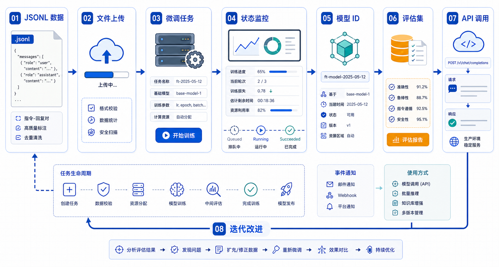

## 概述

平台 API 微调把训练基础设施交给模型服务商，开发者主要负责数据、任务创建、评估和上线。它适合快速验证业务价值，也适合不想维护 GPU 训练环境的团队。

需要注意的是，平台能力和可微调模型会变化，实际项目应以当前官方文档和账号权限为准。



## 核心概念

### 平台微调流程

```text
准备 JSONL 数据
  ↓
上传训练文件
  ↓
创建 fine-tuning job
  ↓
监控训练状态
  ↓
拿到 fine_tuned_model
  ↓
用固定评估集对比基座模型和微调模型
```

### 平台微调适合什么

| 场景                           | 是否适合 |
| ------------------------------ | -------- |
| 分类、抽取、格式化输出         | 适合     |
| 固定语气和回答模板             | 适合     |
| 减少长提示词里的 few-shot 样例 | 适合     |
| 注入经常变化的知识库           | 不优先   |
| 需要完全控制训练细节           | 不优先   |

## 数据格式

OpenAI SFT 常用 JSONL，每一行是一个训练样例：

```json
{
  "messages": [
    { "role": "system", "content": "你是一个严谨的工单分类助手。" },
    { "role": "user", "content": "用户付款成功但订单显示待支付，请分类。" },
    { "role": "assistant", "content": "支付状态同步异常" }
  ]
}
```

建议至少准备：

```text
train.jsonl      # 训练数据
valid.jsonl      # 验证数据
eval.jsonl       # 自己保留的业务评估集
```

`eval.jsonl` 不上传训练，专门用于比较基座模型和微调模型。

## 实战代码

### 1. 安装 SDK

```bash
pip install openai
```

### 2. 上传训练文件

API key 只从环境变量读取，不写进代码。

```python
from openai import OpenAI

client = OpenAI()

training_file = client.files.create(
    file=open("data/train.jsonl", "rb"),
    purpose="fine-tune",
)

validation_file = client.files.create(
    file=open("data/valid.jsonl", "rb"),
    purpose="fine-tune",
)

print(training_file.id)
print(validation_file.id)
```

### 3. 创建 SFT 任务

下面使用文档中支持微调的模型示例。真实项目要先确认当前账号可用模型。

```python
job = client.fine_tuning.jobs.create(
    training_file=training_file.id,
    validation_file=validation_file.id,
    model="gpt-4.1-nano-2025-04-14",
    method={
        "type": "supervised",
        "supervised": {
            "hyperparameters": {
                "n_epochs": 3
            }
        },
    },
)

print(job.id)
```

### 4. 查询任务状态

```python
job = client.fine_tuning.jobs.retrieve("ftjob_example")

print(job.status)
print(job.fine_tuned_model)
```

常见状态：

| 状态               | 含义         |
| ------------------ | ------------ |
| `validating_files` | 校验训练文件 |
| `queued`           | 排队中       |
| `running`          | 训练中       |
| `succeeded`        | 成功完成     |
| `failed`           | 任务失败     |

### 5. 调用微调模型

```python
response = client.responses.create(
    model="ft:gpt-4.1-nano-2025-04-14:org:project:model-id",
    input="用户付款成功但订单显示待支付，请分类并给出排查方向。",
)

print(response.output_text)
```

## 评估流程

平台微调完成后不要直接上线。至少做三组对比：

| 对比                     | 目的                         |
| ------------------------ | ---------------------------- |
| 基座模型 vs 微调模型     | 判断是否真的提升             |
| 新提示词 vs 微调模型     | 判断微调是否优于 Prompt 工程 |
| 微调模型旧版本 vs 新版本 | 判断是否出现回归             |

最小评估脚本：

```python
def run_eval(client, model: str, cases: list[dict]) -> list[dict]:
    results = []
    for case in cases:
        response = client.responses.create(
            model=model,
            input=case["input"],
        )
        results.append(
            {
                "id": case["id"],
                "expected": case["expected"],
                "actual": response.output_text,
            }
        )
    return results
```

## 常见问题

### 平台微调是不是更简单？

训练基础设施更简单，但数据、评估和上线仍然复杂。平台只替你管理训练任务，不会替你判断业务目标是否正确。

### 微调后还需要提示词吗？

需要。微调减少了对大量 few-shot 的依赖，但系统指令、工具说明、安全边界和输出格式仍然要写清楚。

### 如果平台微调入口或模型变化怎么办？

把微调流程抽象成数据准备、任务创建、评估和发布四层。具体平台 API 变化时，只替换任务创建和调用层。

## 检查清单

- 是否确认账号具备微调权限？
- 是否使用官方当前支持的微调模型？
- 是否保留不参与训练的评估集？
- 是否记录训练文件 ID、任务 ID 和微调模型 ID？
- 是否对比基座模型、提示词方案和微调模型？
- 是否设计失败任务的重试和费用控制策略？

## 参考资料

- [OpenAI Model optimization](https://developers.openai.com/api/docs/guides/model-optimization)
- [OpenAI Supervised fine-tuning](https://developers.openai.com/api/docs/guides/supervised-fine-tuning)
- [OpenAI Fine-tuning API Reference](https://platform.openai.com/docs/api-reference/fine-tuning)
