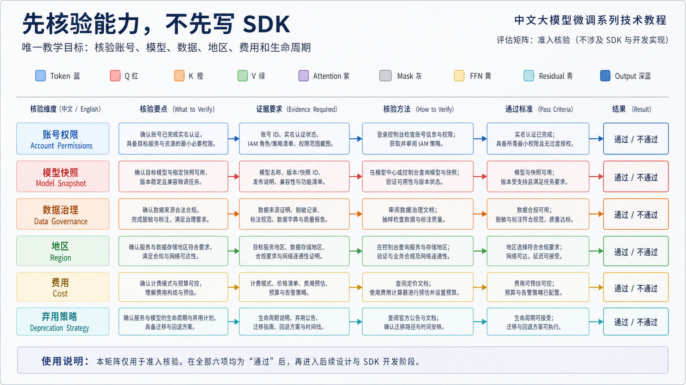
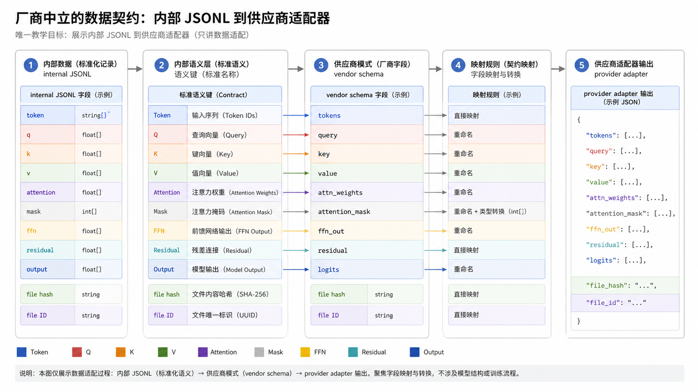
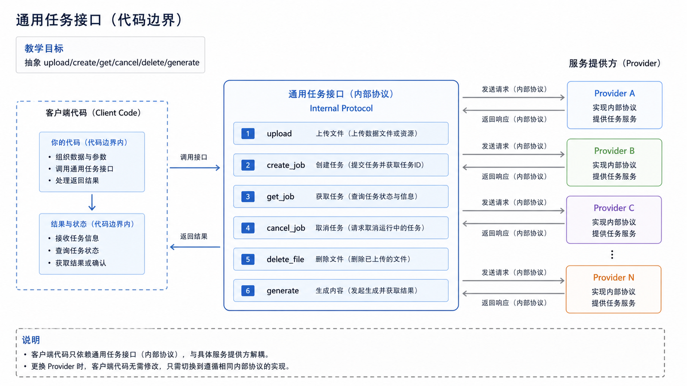
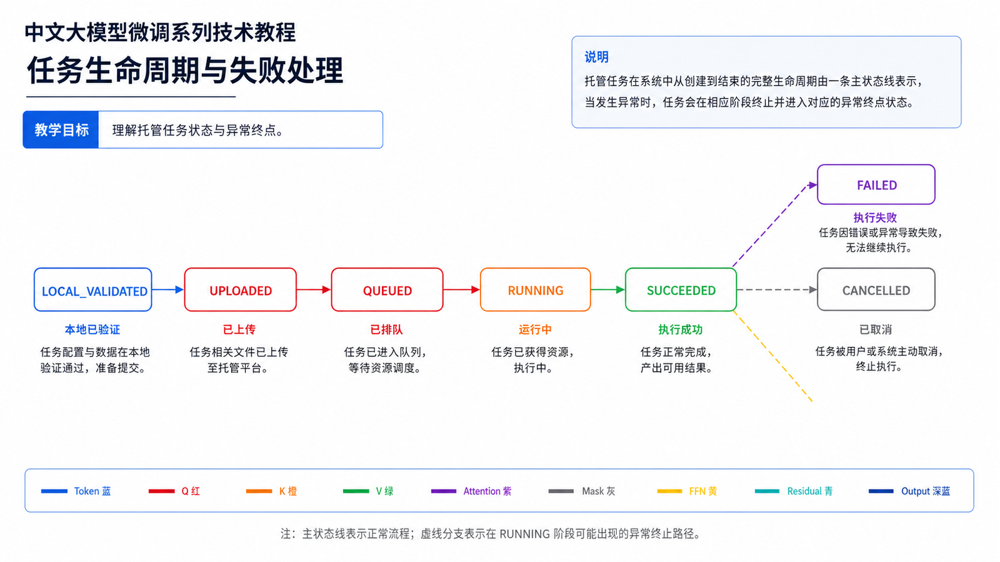
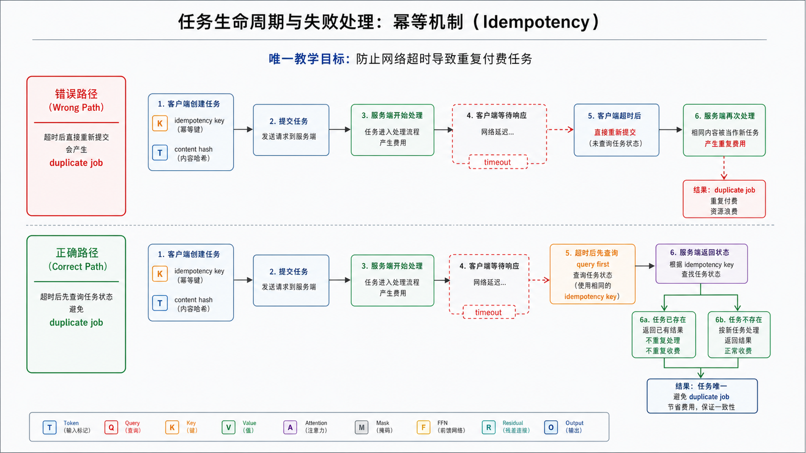
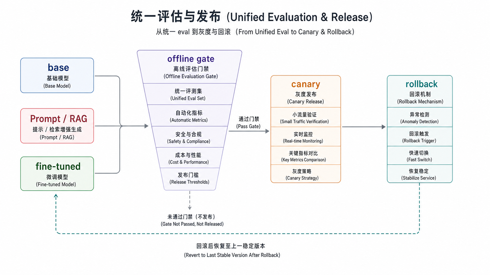
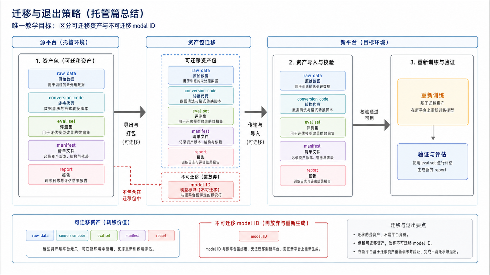

## 概述

托管微调把训练基础设施交给模型服务商，团队主要负责数据、任务配置、评估和发布。它减少了 GPU 运维工作，却不会替你解决数据许可、指标设计、费用控制、供应商锁定和回滚问题。

本篇采用厂商中立接口，不把任何一家平台的模型名或权限当作长期事实。平台能力必须在实验开始当天按官方文档和账号实际权限重新核验。















### 前置知识与学习目标

学完本篇后，你应该能够：

- 用能力矩阵判断托管平台是否满足数据、算法、地区和发布要求。
- 把上传、建任务、轮询、评估、发布抽象成可迁移的内部接口。
- 处理重试、幂等、费用上限、数据删除和平台停止服务等失败模式。

## 先核验能力，不先写 SDK

| 维度     | 必须确认的问题                       | 证据               |
| -------- | ------------------------------------ | ------------------ |
| 账号     | 新用户是否可创建任务，是否需要审批   | 控制台与账号实测   |
| 模型     | 哪些精确快照支持 SFT/DPO/RFT         | 官方模型与微调文档 |
| 数据     | 格式、最小/最大规模、保留与删除策略  | 数据文档与合同     |
| 地区     | 数据驻留、跨境和加密要求             | 合规文档           |
| 训练     | 超参数、checkpoint、事件和取消能力   | API reference      |
| 推理     | 微调模型支持的端点、工具和结构化输出 | 推理 API 文档      |
| 费用     | 训练、存储、推理和失败任务计费       | 当前价格页与账单   |
| 生命周期 | 基座退役后微调模型如何处理           | deprecation policy |

> **时效案例，核验于 2026-07-12：**OpenAI 官方 Model optimization 文档说明其微调平台正在收缩，对新用户不再开放，存量用户仅能在后续数月继续创建训练任务；微调模型的推理生命周期还受基座模型弃用影响。因此 OpenAI API 示例只能作为存量权限场景，不能作为所有读者可执行的默认路线。

## 厂商中立的数据契约

内部数据先使用不绑定 SDK 的 JSONL。SFT 的逻辑格式可以是：

```json
{
  "id": "ticket_001",
  "messages": [
    { "role": "system", "content": "你是严谨的工单分类助手。" },
    { "role": "user", "content": "付款成功但订单显示待支付，请分类。" },
    { "role": "assistant", "content": "支付状态同步异常" }
  ],
  "metadata": { "dataset_version": "sft-2026-07-12" }
}
```

保留三套互不混用的数据：

```text
train.jsonl       # 上传训练
validation.jsonl  # 训练过程验证；是否上传取决于平台
eval.jsonl        # 永不训练，用于内部统一评估
```

适配器负责把内部格式转换成供应商格式。转换后必须重新做 schema、token 长度、角色顺序、敏感信息和 train/eval 泄漏检查，并保存输入文件哈希与远端 file ID 的映射。

## 通用任务接口

不要让业务代码直接散落供应商 SDK 调用。定义最小协议，将变化限制在适配层：

```python
from typing import Protocol

class HostedFineTuningProvider(Protocol):
    def upload(self, path: str, *, purpose: str) -> str: ...
    def create_job(
        self,
        *,
        training_file_id: str,
        validation_file_id: str | None,
        base_model: str,
        method: str,
        idempotency_key: str,
    ) -> str: ...
    def get_job(self, job_id: str) -> dict: ...
    def cancel_job(self, job_id: str) -> None: ...
    def delete_file(self, file_id: str) -> None: ...
    def generate(self, model_id: str, input_text: str) -> str: ...
```

内部 manifest 至少记录：provider、账号/项目、地区、数据哈希、远端 file ID、job ID、基座快照、method、超参数、创建时间、费用预算、状态、最终 model ID、评估报告和删除时间。

## 任务生命周期与失败处理

```text
LOCAL_VALIDATED
  → UPLOADED
  → QUEUED
  → RUNNING
  → SUCCEEDED → EVALUATED → CANARY → ACTIVE
                  ↘ REJECTED
  ↘ FAILED / CANCELLED / EXPIRED
```

- 上传和建任务要使用内容哈希或幂等键，网络超时后先查询，不能直接重复创建付费任务。
- 轮询使用退避和超时；若平台支持 webhook，要验签并仍保留补偿查询。
- `FAILED` 必须记录平台错误、已产生费用和可否重试；参数错误不能无限自动重试。
- 创建前设置预算门禁，运行中监控已训练 token、预计完成时间和异常事件。
- 取消任务不等于删除文件或模型，要分别执行并保留审计记录。

## 统一评估与发布

平台训练完成后不能直接上线。内部评估器应对不同供应商使用相同的输入集、系统指令、采样参数和输出解析：

```python
def run_eval(provider, model_id: str, cases: list[dict]) -> list[dict]:
    results = []
    for case in cases:
        actual = provider.generate(model_id, case["input"])
        results.append(
            {
                "id": case["id"],
                "expected": case["expected"],
                "actual": actual,
            }
        )
    return results
```

至少比较：基座模型、最佳 Prompt/RAG 方案、候选微调模型和当前生产版本。通过离线门禁后先走影子流量或小比例灰度，监控质量、延迟、错误率、单次成本和安全回归；旧模型必须保留到回滚窗口结束。

## 迁移与退出策略

平台不可用时，团队至少应能导出原始数据、转换脚本、评估集、训练 manifest 和输出报告。供应商微调权重通常不可导出，因此“换平台”往往意味着在新基座上重新训练，而不是搬运 model ID。

迁移前先回答：新基座的 tokenizer/chat template 是否改变、同一训练数据是否合法、评估阈值是否仍适用、Prompt 与工具接口是否兼容、旧平台数据和模型如何删除。把平台能力快照标记核验日期，并为停止新任务、基座退役和区域不可用设置运行手册。

## 常见问题

### 托管微调是不是一定更便宜？

不一定。它减少基础设施维护，但可能增加训练单价、推理溢价、存储和锁定成本。应按达到同一质量门槛所需的总成本比较。

### 微调后还需要 Prompt 和 RAG 吗？

需要。微调适合固化行为；系统指令、工具协议、安全边界仍需 Prompt，变化知识仍应由 RAG 或工具提供。

### 文档显示支持，为什么账号仍创建不了任务？

功能可能受账号、地区、模型快照、审批或灰度影响。以账号实测为最终证据，并把不可用作为正常选型结果。

## 检查清单

- 是否记录了能力核验日期、官方来源和账号实测结果？
- 是否保留独立于供应商的原始数据与评估集？
- 是否用幂等键和预算门禁防止重复付费任务？
- 是否记录 file/job/model ID 与数据、配置、报告的映射？
- 是否明确远端数据保留、删除和审计要求？
- 是否设计平台停止新任务或基座退役时的迁移与回滚？

## 自检题

<details><summary>1. 为什么官方文档支持某模型仍不足以立项？</summary>

还需确认当前账号、地区和项目实际具备权限，并核对费用、数据和生命周期约束。

</details>

<details><summary>2. 网络超时后为什么不能直接再次创建训练任务？</summary>

首次请求可能已成功；直接重试会创建重复付费任务。应使用幂等键或先查询 manifest/远端状态。

</details>

<details><summary>3. 供应商退出时最重要的可迁移资产是什么？</summary>

原始数据、转换脚本、固定评估集、实验 manifest 和报告；远端专有权重通常不能直接迁移。

</details>

## 参考资料

- [OpenAI Model optimization](https://developers.openai.com/api/docs/guides/model-optimization)
- [OpenAI Supervised fine-tuning（存量权限参考）](https://developers.openai.com/api/docs/guides/supervised-fine-tuning)
- [OpenAI Fine-tuning API Reference](https://developers.openai.com/api/reference/resources/fine_tuning)
- 各候选供应商当前官方微调、数据治理、价格与弃用文档（实施时记录核验日期）
