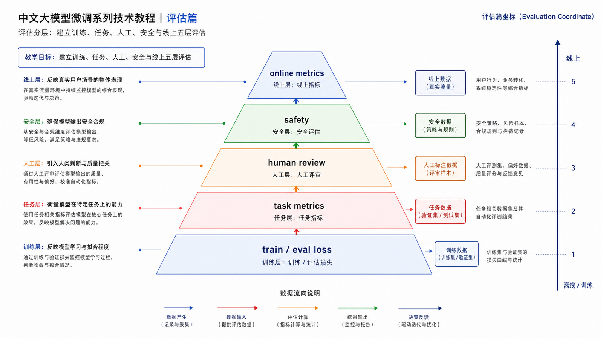
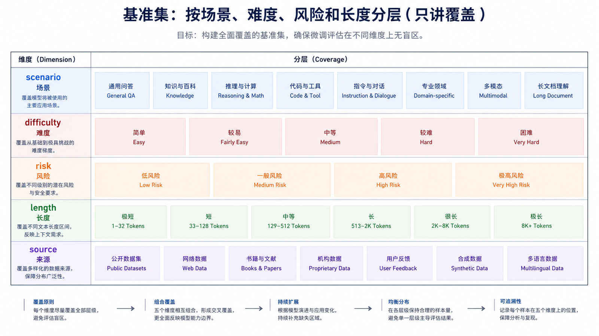
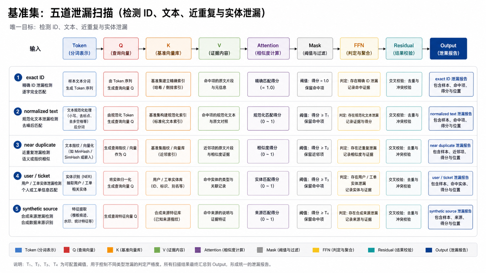
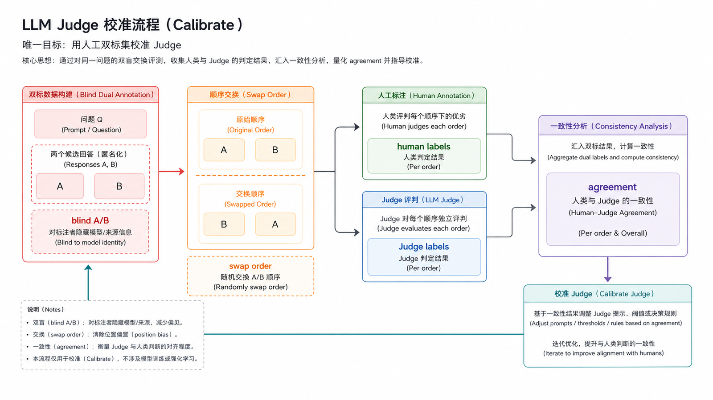
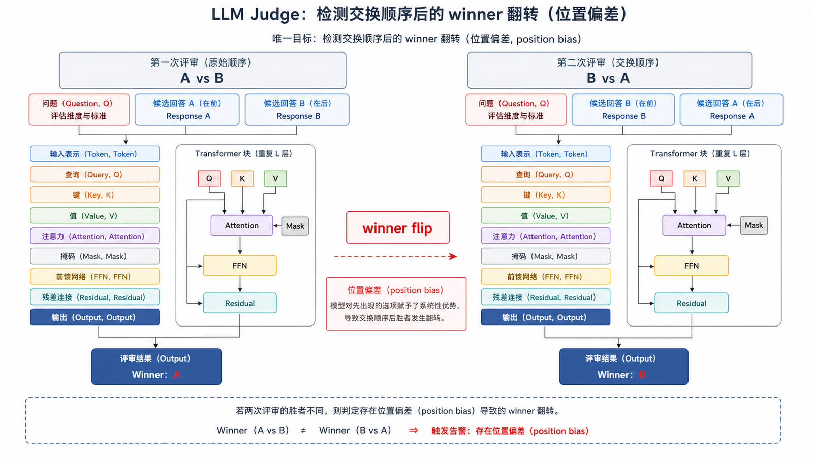
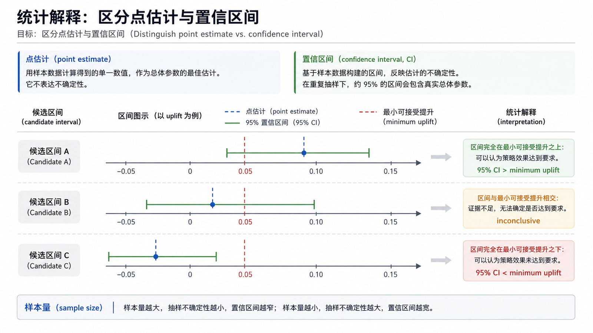
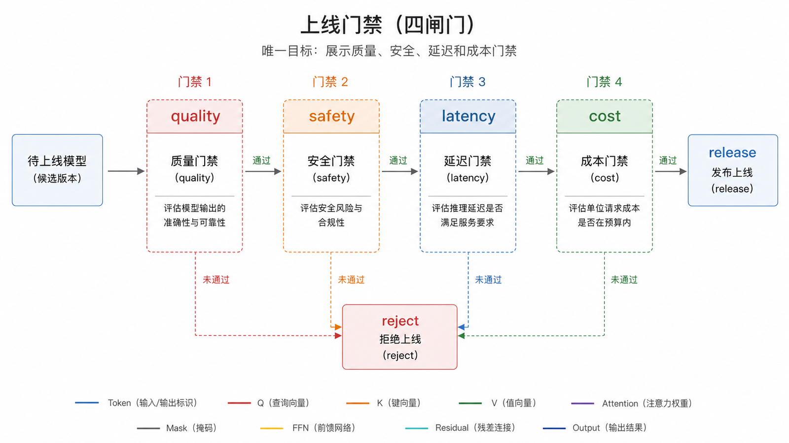
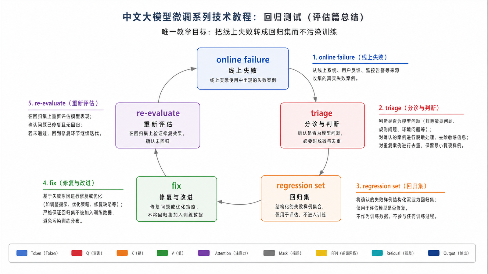

## 概述

没有评估体系的微调，只是在赌训练结果。微调项目的目标不是让训练 loss 下降，而是让真实业务效果稳定提升，并且不破坏安全、成本和延迟边界。

















### 前置知识与学习目标

本篇假设你已经有基座和候选微调模型。目标是建立能够发现真实增益、数据泄漏、Judge 偏差和安全回归的评估体系，而不是只报告 eval loss。

## 核心概念

### 评估分层

| 层级     | 关注点           | 示例                             |
| -------- | ---------------- | -------------------------------- |
| 离线指标 | 训练是否正常     | train loss、eval loss            |
| 任务指标 | 是否完成业务目标 | 分类准确率、抽取 F1、格式通过率  |
| 人工评审 | 答案是否真的可用 | 胜率、错误类型、可读性           |
| 安全评估 | 是否违反边界     | 隐私泄露、越权、危险建议         |
| 线上指标 | 生产效果         | 用户满意度、转人工率、成本、延迟 |

### 基准集

基准集应该固定并版本化。

```text
eval/
├── format_following.jsonl
├── business_cases.jsonl
├── safety_cases.jsonl
├── regression_cases.jsonl
└── README.md
```

每个评估样例至少包含：

```json
{
  "id": "case_001",
  "input": "用户付款成功但订单仍待支付，请分类。",
  "expected": "支付状态同步异常",
  "rubric": "必须给出分类，并说明至少两个排查方向。"
}
```

基准集应按业务场景、难度、风险和输入长度分层。训练数据按精确 ID、规范化文本和近重复检测与 eval 对照；同一用户、工单、模板族或合成源不能跨集合泄漏。每个 case 保留来源、加入原因和最后人工复核时间。

## 自动评估

### 格式检查

格式类任务可以优先用程序评估。

```python
import json

def is_valid_json_output(text: str, required_fields: list[str]) -> bool:
    try:
        data = json.loads(text)
    except json.JSONDecodeError:
        return False

    return all(field in data for field in required_fields)

print(is_valid_json_output('{"category":"支付问题"}', ["category"]))
```

### 分类准确率

```python
def accuracy(records: list[dict]) -> float:
    correct = 0
    for record in records:
        if record["expected"] == record["actual"]:
            correct += 1
    return correct / len(records)
```

### LLM Judge

LLM Judge 适合开放式回答评估，但要注意偏差。建议把评分标准写清楚，并抽样做人类复核。

```python
judge_prompt = """
你是模型输出评审员。请根据评分标准判断回答是否合格。

评分标准：
1. 是否回答了用户问题
2. 是否包含关键排查步骤
3. 是否避免编造事实
4. 是否符合企业语气

只输出 PASS 或 FAIL，并给出一句原因。
"""
```

Judge 不是客观真值。上线前用人工双标样本校准 Judge 与人的一致性，并随机交换 A/B 顺序、隐藏模型身份、固定 Judge 模型快照与 prompt、允许平局、保存原始理由并复核争议样本。若交换顺序后 winner 大量变化，说明位置偏差过大。

## 统计解释

“83% 高于 80%”并不自动代表显著提升。对准确率报告样本数和置信区间；对成对胜率可使用 bootstrap 置信区间，并按场景分层查看。少量高风险 case 可以设置零容忍门禁，但普通质量指标应使用相对基线、最小可接受增益和不劣化边界，而不是复制通用百分比。

同一次比较必须固定模型快照、系统提示、工具、检索版本、采样参数和最大输出长度。若模型输出随机，应重复采样或使用确定性解码，并把方差纳入结论。

## 人工评审

人工评审不要只问“哪个好”。要拆成具体维度。

| 维度   | 评分说明             |
| ------ | -------------------- |
| 正确性 | 是否事实准确         |
| 完整性 | 是否覆盖关键步骤     |
| 简洁性 | 是否没有冗余套话     |
| 稳定性 | 多次回答是否风格一致 |
| 安全性 | 是否触碰隐私或越权   |

推荐输出：

```text
case_id: case_001
winner: fine_tuned_model
scores:
  correctness: 4
  completeness: 5
  safety: 5
comment: 回答给出了支付流水、回调日志和补偿任务，优于基座模型。
```

## 回归测试

每次新模型发布前，都要跑旧问题集。

回归集来源：

- 上线后用户投诉。
- 安全红队样例。
- 历史误答样例。
- 高价值客户场景。
- 法务、合规、品牌风险样例。

回归测试要回答两个问题：

```text
新模型是否修复了目标问题？
新模型是否破坏了原本正确的能力？
```

## 上线门禁

可以定义一个简单门禁：

| 指标         | 门槛                                         |
| ------------ | -------------------------------------------- |
| 格式通过率   | 达到业务 schema SLA，且置信区间下界过线      |
| 业务任务指标 | 超过预先登记的最小增益，或在降本目标下不劣化 |
| 安全测试     | 关键零容忍样例无失败，其他风险不劣化         |
| 人工胜率     | 相对生产基线的区间结论达到门槛               |
| 延迟与成本   | 不超过当前线上 SLA 与预算                    |

具体数字必须在实验前根据业务风险登记，避免看到结果后调整门槛。评估报告同时列出总体结论、分层结果、失败样例、置信区间、已知限制和发布建议。

## 常见问题

### eval loss 下降，业务效果没提升怎么办？

说明训练目标和业务目标不一致。要检查训练数据是否覆盖真实问题，评估集是否合理，以及模型是否只是学习了表面格式。

### LLM Judge 可以完全替代人工评审吗？

不建议。LLM Judge 适合扩展评估规模，但关键样例、争议样例和安全样例仍要人工复核。

### 评估集需要多大？

先保证覆盖关键场景和失败模式。几十条高质量样例比几千条低质量样例更有价值。上线前再逐步扩展规模。

## 检查清单

- 是否有不参与训练的固定评估集？
- 是否同时评估基座模型、提示词方案和微调模型？
- 是否区分自动指标和人工评审？
- 是否有安全、隐私、越权、拒答样例？
- 是否将线上失败样例回流到回归集？
- 是否为发布设置明确门禁？

## 自检题

<details><summary>1. eval loss 下降为什么不能证明业务提升？</summary>

loss 衡量目标 token 概率，可能受答案长度和数据分布影响；业务正确性、安全和格式必须单独评估。

</details>

<details><summary>2. 如何检测 LLM Judge 的位置偏差？</summary>

随机交换候选顺序并比较 winner 稳定性，同时用人工双标集校准。

</details>

<details><summary>3. 为什么发布门槛要在看结果前登记？</summary>

避免根据候选结果事后移动目标，降低选择性报告和过拟合评估集的风险。

</details>

## 参考资料

- [OpenAI Evals 文档](https://platform.openai.com/docs/guides/evals)
- [OpenAI Model optimization](https://developers.openai.com/api/docs/guides/model-optimization)
- [Hugging Face Evaluate 文档](https://huggingface.co/docs/evaluate)
