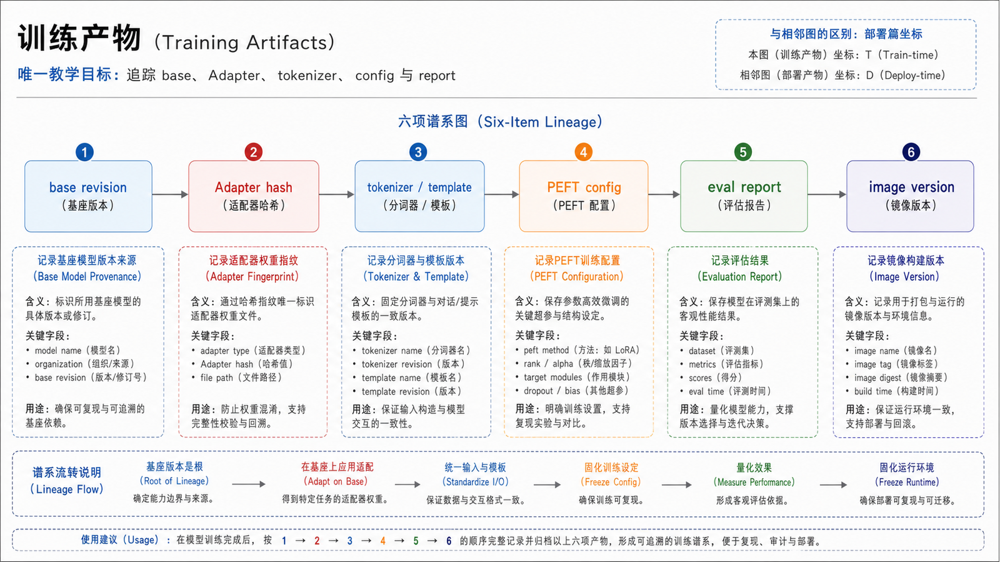
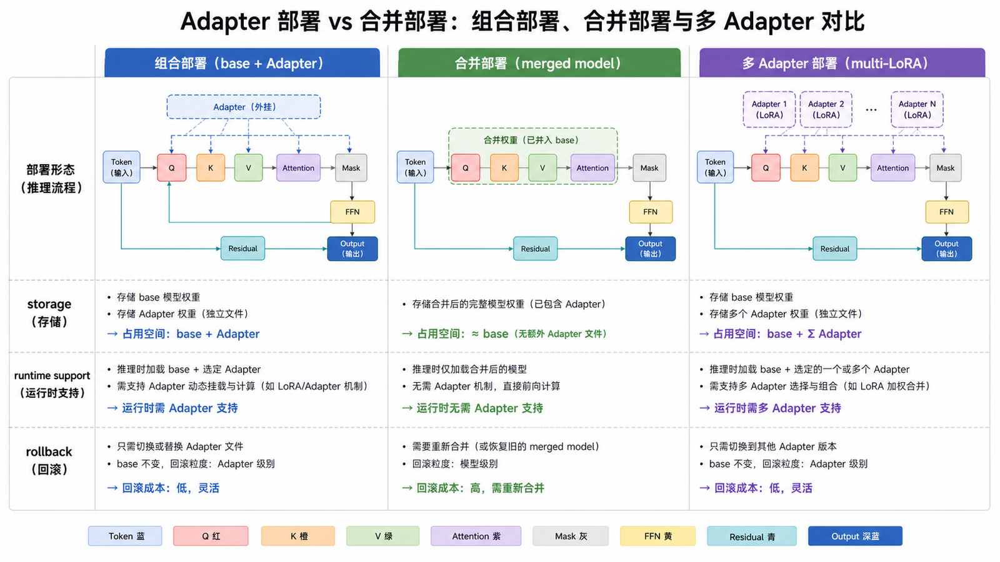
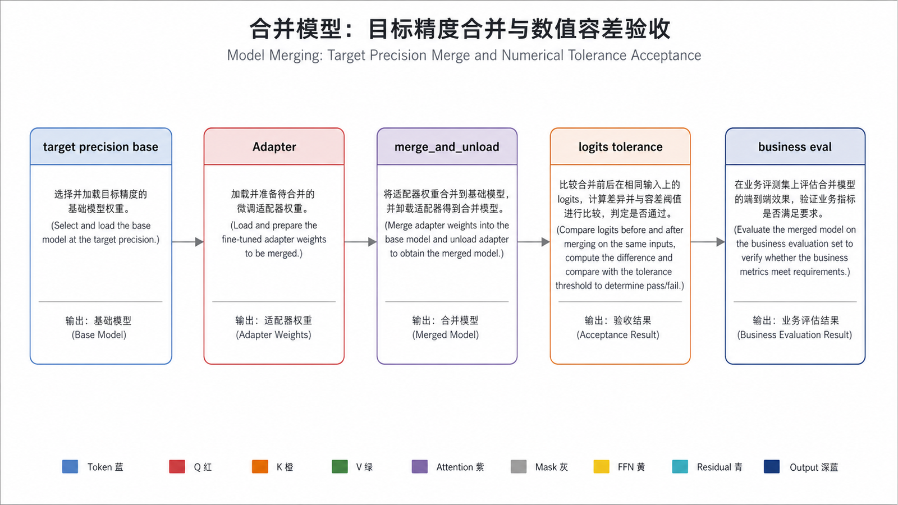
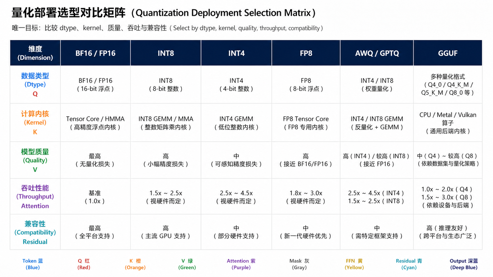
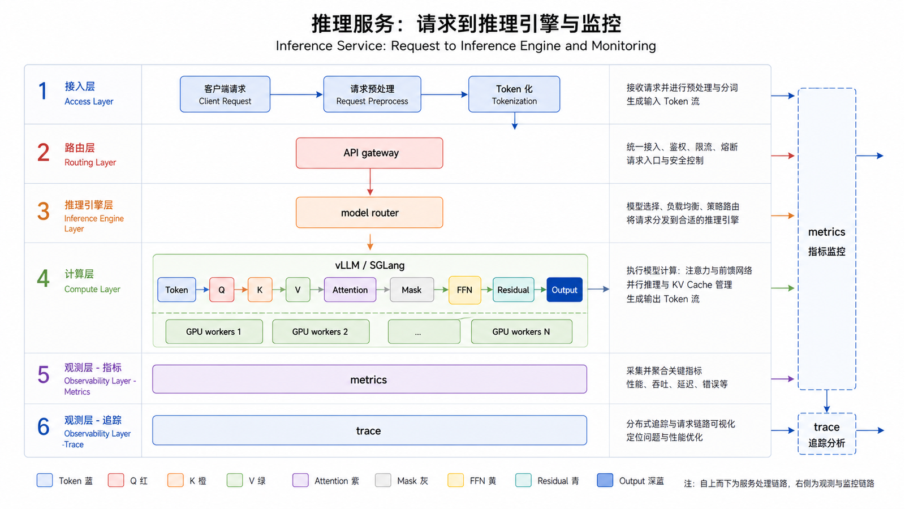
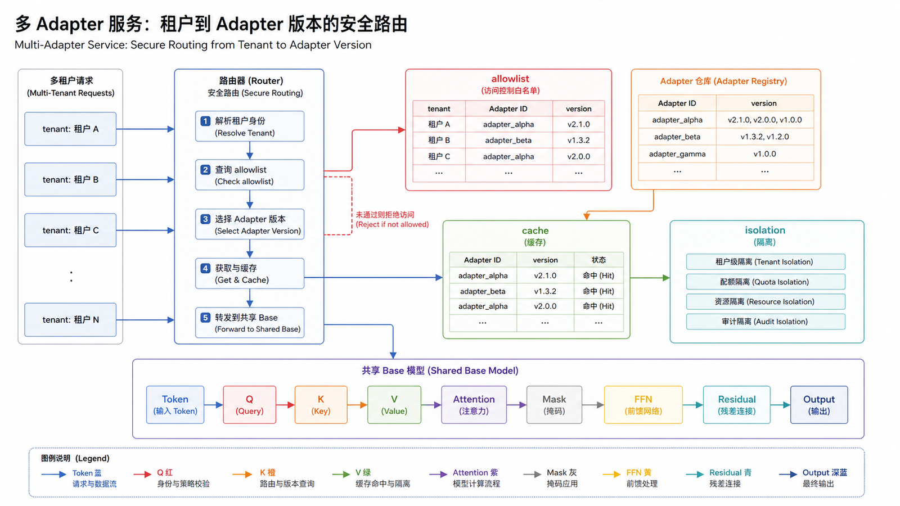
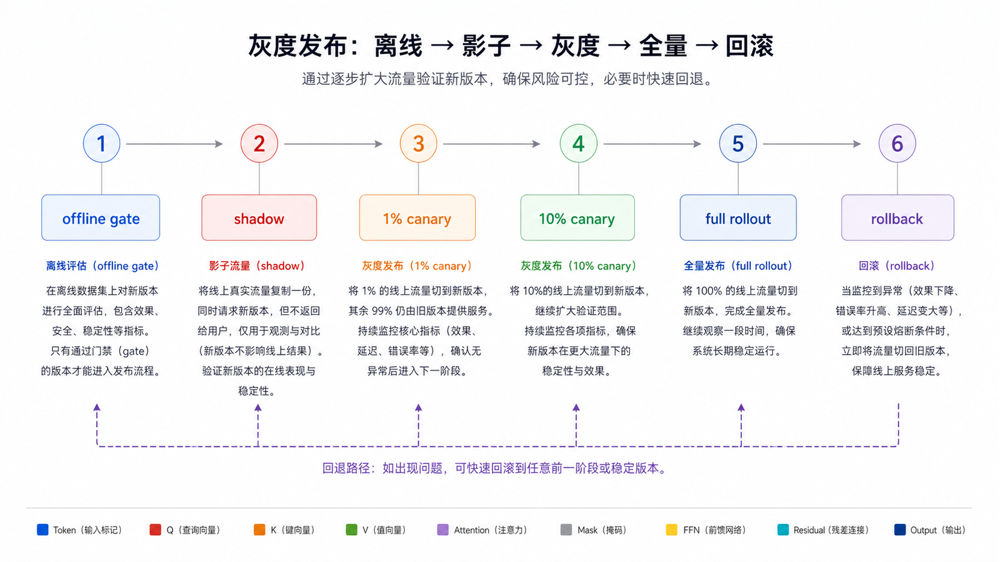
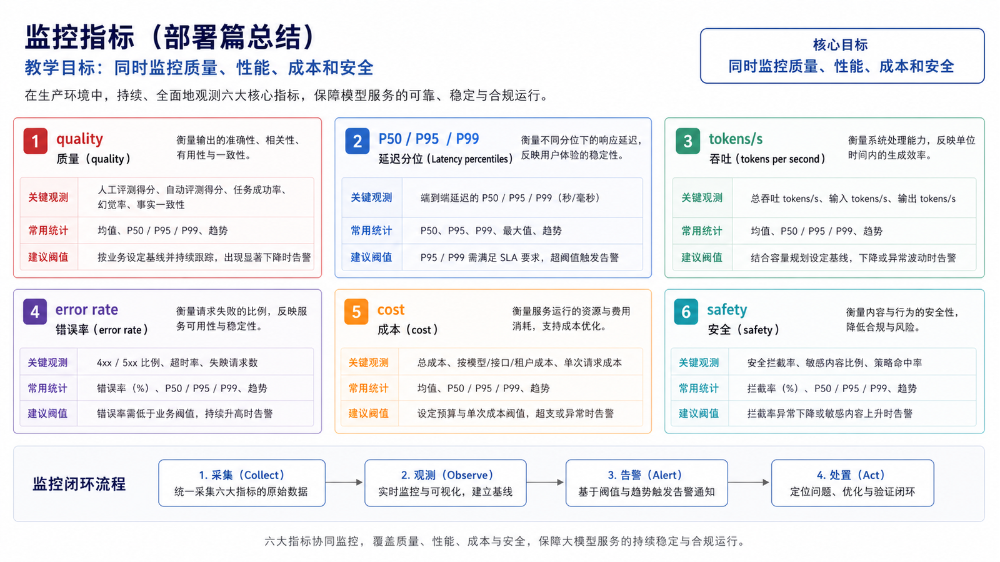

## 概述

训练完成不代表项目完成。微调模型要进入生产，还要经过产物管理、合并或 adapter 加载、量化、推理服务、灰度发布、监控和回滚。

















### 前置知识与学习目标

学完后你应能建立 base、Adapter、tokenizer 和配置的产物谱系，选择组合部署或合并部署，验证量化影响，并设计可回滚的灰度发布。

## 核心概念

### 训练产物

常见产物有三类：

| 产物         | 说明                 | 部署方式           |
| ------------ | -------------------- | ------------------ |
| full model   | 完整模型权重         | 直接部署           |
| adapter      | LoRA/QLoRA 适配器    | 与基座模型组合部署 |
| merged model | adapter 合并后的权重 | 像普通模型一样部署 |

### Adapter 部署 vs 合并部署

| 方式         | 优点                           | 缺点                   |
| ------------ | ------------------------------ | ---------------------- |
| Adapter 部署 | 省存储、易回滚、多业务共享基座 | 推理服务要支持 adapter |
| 合并部署     | 服务链路简单、兼容性好         | 每个模型占完整权重空间 |

无论选择哪条路线，都要保存不可变 manifest：基座仓库与 revision、Adapter 哈希、PEFT 配置、tokenizer/chat template 哈希、合并 dtype、量化方法、生成配置、评估报告和镜像版本。只有“目录名称相同”不足以证明产物兼容。

## 合并模型

LoRA adapter 可以合并到基座模型。

```python
from peft import PeftModel
from transformers import AutoModelForCausalLM, AutoTokenizer

base_model_dir = "Qwen/Qwen2.5-0.5B-Instruct"
adapter_dir = "outputs/qlora/final-adapter"
merged_dir = "outputs/models/ticket-assistant-v1"

tokenizer = AutoTokenizer.from_pretrained(base_model_dir)
model = AutoModelForCausalLM.from_pretrained(
    base_model_dir,
    device_map="auto",
)

model = PeftModel.from_pretrained(model, adapter_dir)
merged_model = model.merge_and_unload()

merged_model.save_pretrained(merged_dir)
tokenizer.save_pretrained(merged_dir)
```

合并后要重新跑评估，因为合并、精度转换和量化都可能影响结果。

合并验收还应在同一输入、同一 dtype 和关闭采样条件下比较 Adapter 组合与 merged model 的 logits 或生成结果，并使用明确数值容差。QLoRA Adapter 应合入重新加载的目标精度基座，而不是直接把 4-bit 训练存储当作理想合并来源。

## 量化部署

量化可以降低显存和推理成本。

| 量化方式  | 特点                       |
| --------- | -------------------------- |
| FP16/BF16 | 质量稳定，显存较高         |
| INT8      | 显存降低，质量损失通常较小 |
| INT4      | 显存更低，需要重点评估质量 |
| AWQ/GPTQ  | 常见离线量化方案           |

量化方案还可能包括 FP8、GGUF 等不同运行时路线。不能只按 bit 数选择：要同时核对硬件 kernel、校准数据、模型架构支持、吞吐、首 token 延迟、长上下文稳定性和任务质量。量化完成后生成新的不可变产物与评估报告，不能覆盖未量化模型。

量化前后要重点比较：

- 任务准确率
- 格式通过率
- 拒答边界
- 长文本稳定性
- 延迟和吞吐

## 推理服务

### vLLM

vLLM 适合高吞吐推理服务。

```bash
vllm serve outputs/models/ticket-assistant-v1 \
  --served-model-name ticket-assistant-v1 \
  --host 0.0.0.0 \
  --port 8000
```

调用方式：

```python
from openai import OpenAI

client = OpenAI(
    base_url="http://localhost:8000/v1",
    api_key="local-dev-token",
)

response = client.chat.completions.create(
    model="ticket-assistant-v1",
    messages=[
        {"role": "user", "content": "付款成功但订单显示待支付，如何排查？"}
    ],
)

print(response.choices[0].message.content)
```

### SGLang 与 TGI 的位置

SGLang 是需要评估的另一条高性能服务路线，选择时用目标模型和真实请求比较兼容性、吞吐、延迟、结构化输出、监控和多 Adapter 能力。

Hugging Face 已将 Text Generation Inference（TGI）置于维护模式，并建议新部署考虑 vLLM、SGLang 等引擎。因此 TGI 只保留为存量系统迁移背景，不再作为本系列的新项目主线。

### 多 Adapter 服务

多 LoRA 可以节省基座权重存储，但需要额外治理：请求必须显式绑定 Adapter ID 与版本；限制可动态加载来源；设置显存缓存和并发上限；防止租户串用；灰度与回滚以 Adapter 为单位。运行时支持范围必须按锁定版本实测。

## 灰度发布

不要直接全量替换模型。推荐流程：

```text
离线评估通过
  ↓
内部流量验证
  ↓
1% 线上灰度
  ↓
扩大到 10%
  ↓
全量发布
```

灰度期间同时保留旧模型，用于对照和快速回滚。

## 监控指标

| 指标             | 目的                   |
| ---------------- | ---------------------- |
| 请求量           | 判断流量变化           |
| 延迟 P50/P95/P99 | 判断服务性能           |
| tokens/s         | 判断推理吞吐           |
| 错误率           | 发现服务异常           |
| 格式失败率       | 发现输出回归           |
| 用户满意度       | 判断业务效果           |
| 安全拒答率       | 判断是否过度拒答或放松 |
| 单次请求成本     | 控制预算               |

## 常见问题

### 合并后效果变差怎么办？

先确认 tokenizer 是否一致，再确认合并前后精度、特殊 token、推理参数是否一致。必要时保留 adapter 部署，避免合并引入额外变量。

### 量化后怎么判断能不能上线？

不能只看几个样例。要跑固定评估集，尤其是长文本、格式输出、安全样例和高价值业务场景。

### 微调模型上线后还要继续收集数据吗？

要。线上失败样例是下一轮微调最有价值的数据来源，但必须脱敏、审核和版本化。

## 检查清单

- 是否保存 base、adapter、merged model 的版本关系？
- 是否确认 tokenizer 和 chat template 随模型一起发布？
- 是否在合并和量化后重新跑评估？
- 是否有灰度、回滚和旧模型对照？
- 是否监控质量、延迟、成本和安全指标？
- 是否把线上失败样例回流到数据闭环？

## 自检题

<details><summary>1. Adapter 与基座模型同架构就一定兼容吗？</summary>

不一定。还要匹配精确 revision、层名、tokenizer/chat template、PEFT 配置和新增 token。

</details>

<details><summary>2. 为什么量化后必须重新跑业务评估？</summary>

量化误差对任务、层和输入长度的影响不同，不能从 bit 数推断线上质量。

</details>

<details><summary>3. 多 Adapter 服务新增了什么风险？</summary>

版本路由、租户隔离、动态加载安全、显存缓存和 Adapter 级回滚都需要独立治理。

</details>

## 参考资料

- [vLLM 文档](https://docs.vllm.ai/)
- [SGLang 文档](https://docs.sglang.ai/)
- [Text Generation Inference 维护模式说明](https://huggingface.co/docs/text-generation-inference)
- [PEFT Adapter 合并文档](https://huggingface.co/docs/peft)
- [Transformers 量化文档](https://huggingface.co/docs/transformers/quantization)
