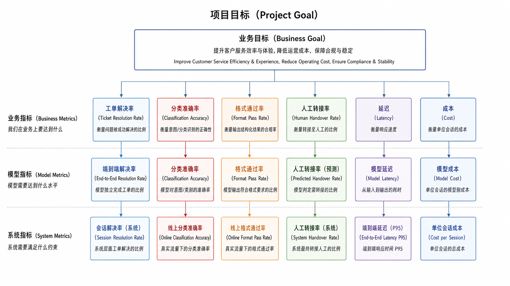
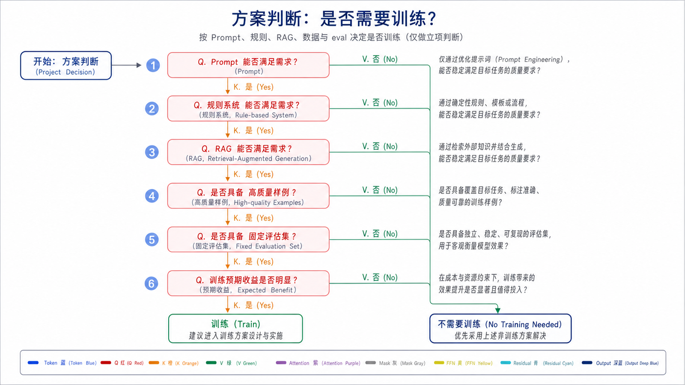
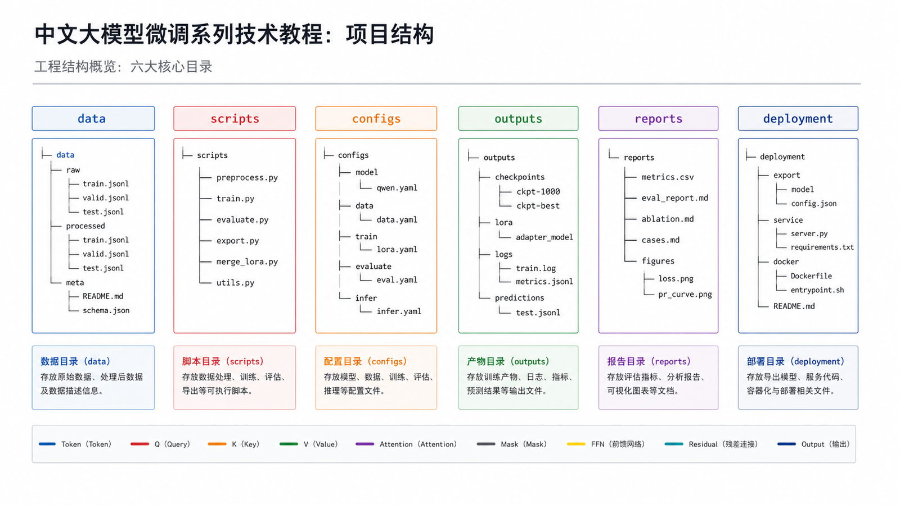
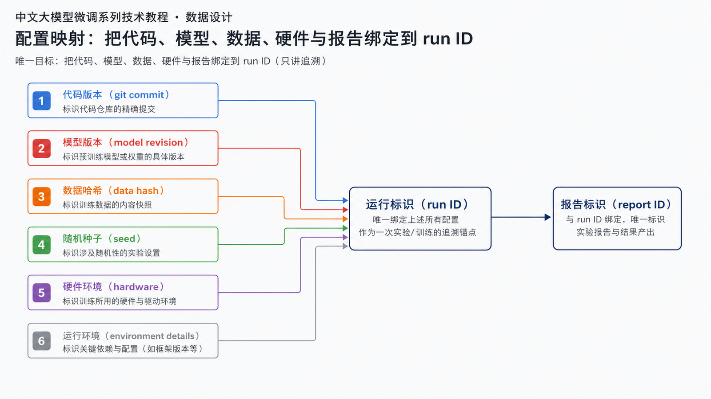
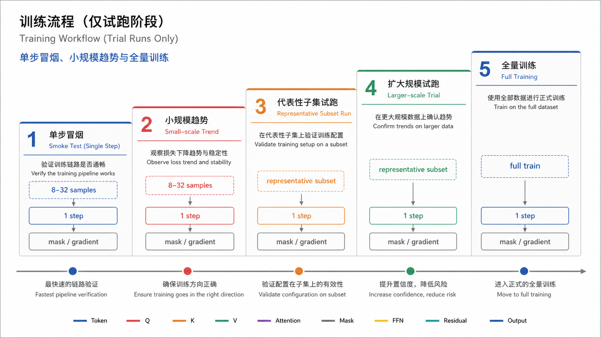
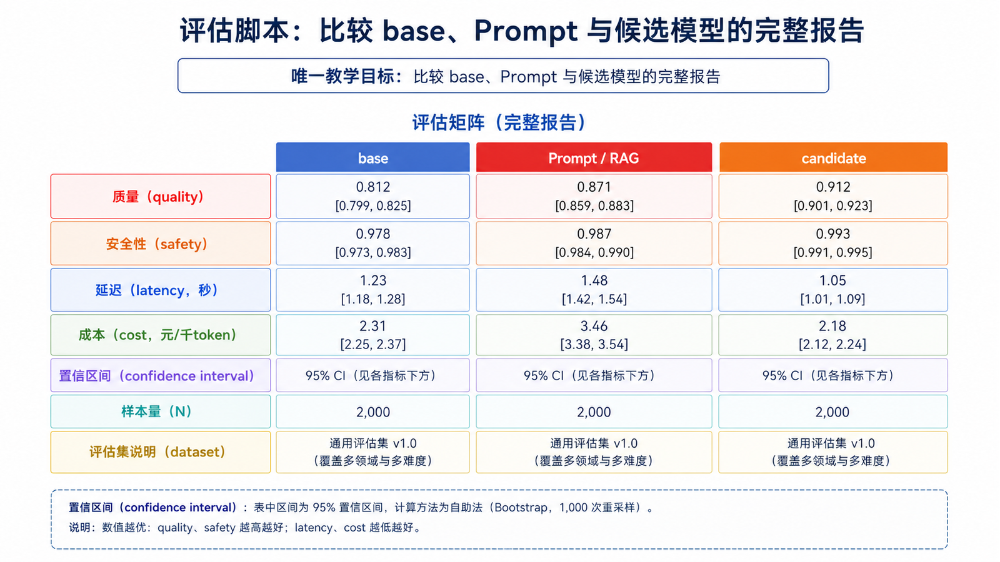
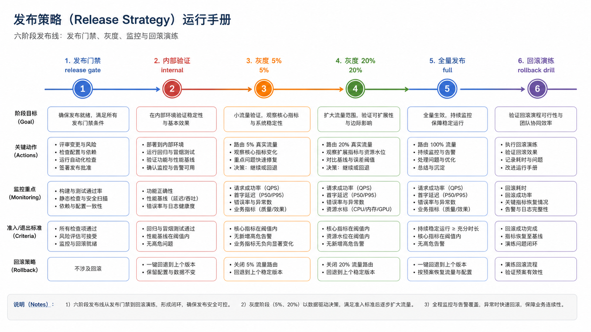
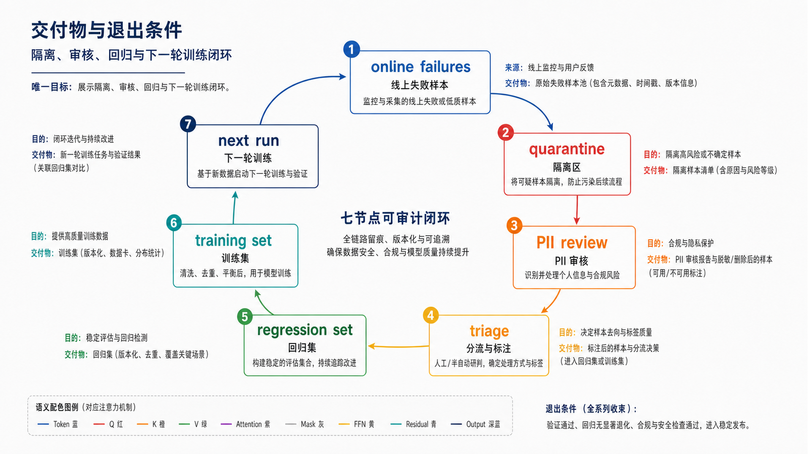

## 概述

最后一篇把前面的知识串起来：如何从一个业务问题开始，判断是否需要微调，准备数据，训练模型，评估效果，上线服务，再把线上反馈变成下一轮数据。

示例场景：企业工单助手。目标是把用户描述转成标准分类、排查建议和下一步处理动作。

















### 前置知识与学习目标

本篇将前 11 篇串成一条可审计交付链。完成后，你应能从业务指标出发，产出数据卡、实验 manifest、候选模型、评估报告、发布记录和下一轮数据，而不是只留下一个权重目录。

## 核心概念

### 项目目标

不要把目标写成“训练一个更好的模型”。要写成可评估的业务指标：

| 目标           | 指标                    |
| -------------- | ----------------------- |
| 工单分类更准   | 分类准确率提升          |
| 输出更稳定     | JSON 格式通过率提升     |
| 排查建议更有用 | 人工评审胜率提升        |
| 成本可控       | 单次请求成本不超过预算  |
| 风险可控       | 安全评估关键样例 0 失败 |

### 方案判断

微调前先问：

```text
Prompt 能否解决？
RAG 能否解决？
规则系统能否解决？
是否有足够高质量样例？
是否有固定评估集？
```

如果答案是“没有评估集”，先不要训练。

## 项目结构

```text
ticket-finetune/
├── data/
│   ├── raw/
│   ├── processed/
│   ├── eval/
│   └── README.md
├── scripts/
│   ├── prepare_data.py
│   ├── train_lora_sft.py
│   ├── evaluate.py
│   └── merge_adapter.py
├── configs/
│   ├── sft_lora.yaml
│   └── eval.yaml
├── outputs/
│   ├── adapters/
│   ├── merged/
│   └── reports/
└── deployment/
    ├── serve_vllm.sh
    └── rollback.md
```

## 数据设计

项目根目录还应包含锁定依赖和实验 manifest。manifest 记录代码提交、基座 revision、tokenizer/template 哈希、数据哈希、seed、硬件、精度、LoRA 配置、训练输出和评估报告 ID，使任意线上模型都能追溯到唯一实验。

### SFT 样例

```json
{
  "messages": [
    {
      "role": "system",
      "content": "你是一个企业工单分析助手，必须输出 JSON。"
    },
    { "role": "user", "content": "用户付款成功但订单仍显示待支付。" },
    {
      "role": "assistant",
      "content": "{\"category\":\"支付状态同步异常\",\"reason\":\"支付成功后订单状态未及时更新\",\"next_steps\":[\"查询支付流水\",\"检查支付回调日志\",\"触发订单状态补偿任务\"]}"
    }
  ]
}
```

### 评估样例

```json
{
  "id": "eval_payment_001",
  "input": "用户付款后订单没有变成已支付。",
  "expected_fields": ["category", "reason", "next_steps"],
  "expected_category": "支付状态同步异常"
}
```

## 训练流程

推荐先用 LoRA SFT 做第一版。

```python
from datasets import load_dataset
from peft import LoraConfig, TaskType
from trl import SFTConfig, SFTTrainer

dataset = load_dataset(
    "json",
    data_files={
        "train": "data/processed/train.jsonl",
        "validation": "data/processed/valid.jsonl",
    },
)

peft_config = LoraConfig(
    task_type=TaskType.CAUSAL_LM,
    r=16,
    lora_alpha=32,
    lora_dropout=0.05,
    target_modules=["q_proj", "v_proj"],
)

args = SFTConfig(
    output_dir="outputs/adapters/ticket-v1",
    max_length=2048,
    per_device_train_batch_size=1,
    gradient_accumulation_steps=8,
    learning_rate=2e-4,
    num_train_epochs=3,
    eval_strategy="steps",
    eval_steps=50,
    save_strategy="steps",
    save_steps=50,
    save_total_limit=2,
    assistant_only_loss=True,
    seed=42,
    data_seed=42,
    report_to="none",
)

trainer = SFTTrainer(
    model="Qwen/Qwen2.5-0.5B-Instruct",
    args=args,
    train_dataset=dataset["train"],
    eval_dataset=dataset["validation"],
    peft_config=peft_config,
)

trainer.train()
trainer.save_model("outputs/adapters/ticket-v1/final")
```

正式训练前先执行两级试跑：用 8–32 条样例跑一个 step，验证 schema、assistant mask、有限 loss、梯度与保存加载；再用小规模代表性数据验证学习趋势、评估脚本和成本估算。两级都通过后才运行全量实验。

## 评估脚本

最小格式评估：

```python
import json

def check_ticket_output(text: str) -> dict:
    try:
        data = json.loads(text)
    except json.JSONDecodeError:
        return {"ok": False, "reason": "invalid_json"}

    required = ["category", "reason", "next_steps"]
    missing = [field for field in required if field not in data]
    if missing:
        return {"ok": False, "reason": f"missing_fields:{missing}"}

    if not isinstance(data["next_steps"], list):
        return {"ok": False, "reason": "next_steps_not_list"}

    return {"ok": True, "reason": "pass"}
```

格式通过只是第一层。完整评估还要比较分类正确性、排查步骤覆盖、安全边界、过度拒答、延迟和成本，并同时运行基座、最佳 Prompt 与候选微调模型。下面表格中的数字只能来自真实报告，不使用示例数字冒充实验结果。

评估报告建议包含：

| 模型      | 格式通过率 | 分类准确率 | 人工胜率 | P95 延迟 |
| --------- | ---------- | ---------- | -------- | -------- |
| base      | 待实测     | 待实测     | 参考线   | 待实测   |
| ticket-v1 | 待实测     | 待实测     | 待实测   | 待实测   |

评估报告必须附样本数、分层结果、置信区间、失败案例和运行配置。发布门槛在训练前登记；如果结果没有超过最小增益，就保留基座或 Prompt 方案，而不是为了交付强行上线。

## 发布策略

### 灰度上线

```text
内部测试账号
  ↓
客服团队 5% 流量
  ↓
低风险工单 20% 流量
  ↓
全量发布
```

### 回滚条件

出现以下情况立即回滚：

- 格式失败率超过门槛。
- 安全样例线上复现失败。
- 转人工率明显上升。
- 延迟超过 SLA。
- 用户投诉集中在同一类任务。

## 迭代闭环

线上反馈要进入下一轮数据，而不是直接丢进训练集。

```text
线上失败样例
  ↓
脱敏与去重
  ↓
错误分类
  ↓
人工修正标准答案
  ↓
加入回归集或训练集
  ↓
下一轮实验
```

## 常见问题

线上日志先进入隔离区：完成用户授权/合规判断、脱敏、去重、错误分类和人工修订后，才决定加入回归集还是训练集。同一失败样例不能同时进入两者；高风险问题优先加入回归集，确认稳定修复后再考虑训练扩展。

## 交付物与退出条件

一次迭代只有在以下产物齐全时才算完成：数据卡及哈希、锁定依赖、实验 manifest、训练日志与 checkpoint、基座/候选评估报告、模型卡、部署 manifest、灰度记录、监控面板和回滚演练记录。若数据许可不清、评估集泄漏、安全门禁失败或无法回滚，应停止发布，而不是继续调参掩盖问题。

### 第一版要追求一次到位吗？

不要。第一版目标是证明微调方向有效，并建立可复现流水线。后续再逐步扩展数据和优化方法。

### 什么时候从 SFT 进入 DPO？

当模型已经能完成任务，但多个答案之间的质量、语气、安全边界仍不稳定时，再引入偏好数据和 DPO。

### 什么时候用平台 API，什么时候用开源本地？

需要快速验证、数据规模中小、团队缺少 GPU 运维时，用平台 API 更快。需要控制模型、私有化部署、深度调参时，用开源本地路线。

## 检查清单

- 是否把业务目标写成可评估指标？
- 是否先建立基座模型和 Prompt baseline？
- 是否有数据版本、训练配置和模型版本对应关系？
- 是否有固定评估集和上线门禁？
- 是否支持灰度、监控和回滚？
- 是否把线上反馈转成可审计的数据闭环？

## 自检题

<details><summary>1. 为什么项目第一份产物应该是基线与评估集？</summary>

没有基线就无法证明微调增益，也无法提前定义停止条件和发布门槛。

</details>

<details><summary>2. 单步试跑应验证哪些核心不变量？</summary>

数据可解析、assistant mask 正确、loss 有限、预期参数有梯度、冻结参数不更新、产物可保存并重新加载。

</details>

<details><summary>3. 线上失败样例为什么不能直接加入训练集？</summary>

它可能包含隐私、错误答案、重复数据和评估样例；必须先隔离、审核、修订并决定唯一用途。

</details>

## 参考资料

- [TRL SFTTrainer 文档](https://huggingface.co/docs/trl/en/sft_trainer)
- [PEFT 文档](https://huggingface.co/docs/peft)
- [OpenAI Model optimization](https://developers.openai.com/api/docs/guides/model-optimization)
- [vLLM 文档](https://docs.vllm.ai/)
