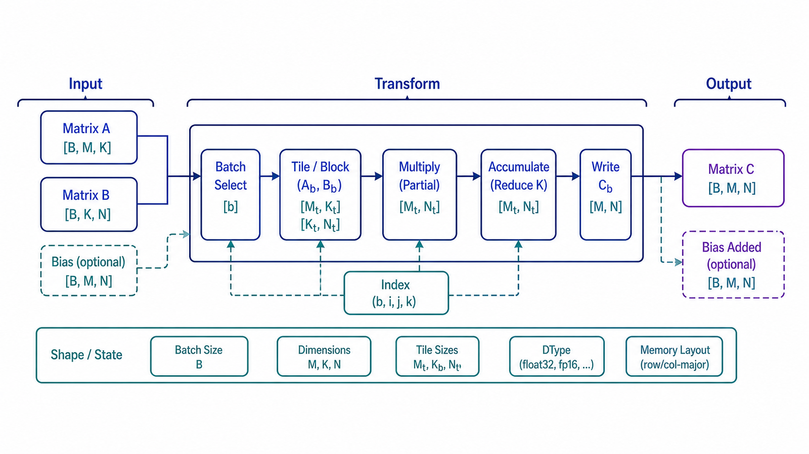

## 前置知识与学习目标

**前置知识**：数学预备知识。本文承接《点积、向量范数与归一化》，只简短复用其中已经定义的概念。

**核心问题**：如何准确解释“矩阵乘法与批量计算”，并把它用于理解 Embedding、矩阵变换和 Attention，同时识别错误输入、成本和不适用边界？

学完“矩阵乘法与批量计算”后你应该能够：

- 用自己的话说明核心机制，而不是只背术语；
- 写出输入、输出和关键中间状态；
- 运行一个最小实现并解释结果；
- 判断它在 AI 工程中的适用条件与失败模式。

## 从一个工程问题开始

假设团队正在实现一个可评估的 RAG/Agent 服务。系统需要处理模型输入、候选结果和运行状态，但线上指标出现波动。只知道“应该使用矩阵乘法与批量计算”不足以定位问题：必须说明数据从哪里来、经过什么变换、在哪个边界可能丢失信息，以及结果如何被验证。

本文围绕“矩阵乘法与批量计算”使用一个最小记录：输入包含请求 `request_id`、若干候选值和预算；输出除了计算结果，还保留用于排错的中间量。例子刻意缩小规模，使相关步骤能手算和执行。

## 核心概念与直觉

矩阵乘法把多个输入向量一次性投影到新的特征空间，内维必须相等，外维决定输出 Shape。

理解“矩阵乘法与批量计算”时采用四层心智模型：

1. **语义层**：它解决什么问题，不解决什么问题；
2. **数学或结构层**：输入如何变成输出；
3. **工程层**：复杂度、精度、并发或状态成本；
4. **验证层**：什么观测能证明实现符合预期。

把“矩阵乘法与批量计算”的四层含义分开，可以避免把模型概率当作事实概率、把近似检索当作精确检索，或把框架默认行为当作算法保证。

## 数学或算法过程



$$
Y=XW+b
$$

`X∈R^{B×d}` 是输入，`W∈R^{d×h}` 是权重，`b∈R^h` 是偏置，输出 `Y∈R^{B×h}`。

计算时先写出输入 Shape，再核对聚合维度和输出 Shape；不能只验证数值类型。

## Shape、输入与输出

| 项目     | 本文约定                                                |
| -------- | ------------------------------------------------------- |
| 输入     | 一个请求及规模为 $N$ 的候选集合                         |
| 中间状态 | 经过校验、变换或聚合得到的可观测量                      |
| 输出     | 结果值、状态与必要诊断信息                              |
| 动态维度 | $N$ 表示候选、样本、节点或 Token 数，具体含义由场景决定 |

“矩阵乘法与批量计算”若使用张量，统一写作 `[batch_size, sequence_length, hidden_size]`；任何 reshape、拼接、广播或聚合都指出变化轴。若使用图或队列，则用节点数 $V$、边数 $E$ 和任务数 $N$ 描述规模。

## 最小可运行实现

下面代码只验证本文最小不变量，不依赖远程模型或外部服务。

<!-- runnable: true -->

```python
import numpy as np

# [batch, input_dim] @ [input_dim, output_dim]
x = np.array([[1.0, 2.0], [3.0, 4.0]])
w = np.array([[0.5, 1.0, -1.0], [1.5, 0.0, 2.0]])
y = x @ w
assert x.shape == (2, 2) and w.shape == (2, 3)
assert y.shape == (2, 3)
print(y)
```

运行“矩阵乘法与批量计算”示例后应看到确定性输出。断言比打印更重要：它把“看起来合理”转换为可重复验证的行为。生产代码还应记录输入规模、耗时、失败类型和降级路径。

## 在大模型与 Agent 工程中的应用

**场景一：离线质量验证。** 在索引构建、训练或评估阶段，用固定小数据验证“矩阵乘法与批量计算”的输入输出和边界，再扩展到真实数据量。这样能把算法错误与数据质量问题分开。

**场景二：在线请求诊断。** 在应用“矩阵乘法与批量计算”的 RAG 或 Agent 请求中记录候选数、排序分数、状态转移、重试次数或张量 Shape，用它判断故障位于数据、检索、排序、生成还是工具执行阶段。

工程化实现至少需要：输入校验、确定性种子或请求标识、超时/规模上限、结构化日志，以及针对空输入、极端值和重复请求的测试。

## 复杂度、成本与调试

分析“矩阵乘法与批量计算”时不要只写一个大 O 结论。先说明规模变量，再测量真实瓶颈：CPU 算法通常关注 $N$、$V$、$E$；模型计算还关注 Batch、Sequence、Hidden Size；分布式执行还要计入网络往返、序列化和重试放大。

“矩阵乘法与批量计算”的调试顺序固定为：

1. 用 2–5 个元素手算期望结果；
2. 检查类型、Shape、单位和排序方向；
3. 对空输入、重复输入、零值和极端值运行断言；
4. 扩大规模并分别记录质量、延迟、内存和成本；
5. 只修改一个变量做消融，避免多个优化同时上线。

## 常见误区与不适用场景

- **只看“矩阵乘法与批量计算”名称不看数据契约**：同名算法在不同库中的默认参数和输出约定可能不同。
- **把代理指标当成最终目标**：局部得分提高不保证任务成功率提高。
- **忽略近似、随机与浮点误差**：小规模正确不代表大规模仍稳定。
- **用重试掩盖错误**：没有幂等、超时预算和失败分类的重试会扩大副作用。

当问题规模很小、规则可以直接表达，或缺少可靠监督/评估数据时，不应为了“使用矩阵乘法与批量计算”而增加复杂度。优先选择能够解释、测试和回滚的最简单方案。

## 与相邻概念的边界

本文只完整解释“矩阵乘法与批量计算”。前置概念只做必要回顾，框架级完整调用链留给现有 Transformer、RAG、Agent 或 LangGraph 系列。这样一个概念只有一个权威解释位置，其他文章通过链接复用。

- 现有工程文章：</posts/ai/transformer系列教程/transformer-04-self-attention-math/>
- 现有工程文章：</posts/ai/transformer系列教程/transformer-02-token-embedding/>

## 自检与实践任务

1. 用一句话说明“矩阵乘法与批量计算”的输入和输出。
2. 为什么局部指标改善不一定带来端到端任务成功？
3. 修改最小代码，增加一个空输入或极端值测试。
4. 记录一个关键中间状态，并解释它如何帮助定位故障。
5. 为真实 RAG/Agent 场景写出一个不采用该方案的反例。

<details>
<summary>参考答案</summary>

1. “矩阵乘法与批量计算”的答案应同时包含数据类型、规模变量和结果语义。
2. 端到端结果还受数据、上游召回、下游生成、工具副作用和评估口径影响。
3. 测试必须有断言，并明确是拒绝输入、返回空结果还是采用降级值。
4. 可记录 Shape、候选数、状态、耗时、重试次数或误差范围，具体取决于本文主题。
5. 合格反例应指出数据不足、规模太小、成本过高、解释性不足或失败后无法安全恢复中的至少一项。

</details>

## 本文总结与下一篇

- 矩阵乘法把多个输入向量一次性投影到新的特征空间，内维必须相等，外维决定输出 Shape。
- 可靠实现必须同时定义输入、输出、中间状态和失败边界。
- 先用小数据和断言验证，再讨论规模与性能。
- 在 AI 系统中，局部算法必须由端到端质量、成本和延迟共同约束。

下一篇《线性变换与神经网络层》将以上述输入继续展开。

## 参考资料

- [NumPy User Guide](https://numpy.org/doc/stable/user/)
- [PyTorch documentation](https://docs.pytorch.org/docs/stable/)
- [Attention Is All You Need](https://arxiv.org/abs/1706.03762)
