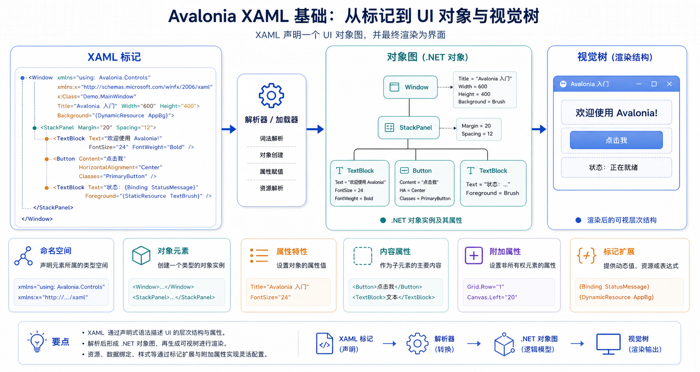

## 概述

XAML（eXtensible Application Markup Language）是一种基于 XML 的语言，用于声明对象图。在 Avalonia 中，XAML 用于声明式定义用户界面。每个 XML 元素映射到 .NET 对象，XML 属性设置这些对象的属性。



### Avalonia XAML 文件

Avalonia 使用 `.axaml` 文件扩展名（Avalonia XAML）来区分其 XAML 文件与其他 XAML 方言。

---

## XAML 命名空间

### 默认命名空间

```xml
<Window xmlns="https://github.com/avaloniaui"
        Title="My Window">
</Window>
```

### x: 命名空间

<!-- xmlns:x 定义 XAML 内部指令和标记扩展的命名空间 -->
<!-- 包含 x:Class、x:Name、x:DataType 等内置指令 -->

```xml
<Window xmlns="https://github.com/avaloniaui"
        xmlns:x="http://schemas.microsoft.com/winfx/2006/xaml">
</Window>
```

### 自定义命名空间

```xml
<Window xmlns="https://github.com/avaloniaui"
        xmlns:local="clr-namespace:MyApp.Controls">
    <local:MyControl />
</Window>
```

---

## XAML 语法

### 对象元素

XML 元素创建命名类型的实例：

```xml
<Button />

<TextBlock />

<StackPanel />
```

### 属性特性

使用 XML 属性设置属性：

```xml
<Button Content="点击我" Width="200" Background="Blue" />
```

Avalonia 使用类型转换器将字符串属性值转换为适当的 .NET 类型。

### 属性元素语法

对于无法用字符串表示的复杂值，使用属性元素语法：

```xml
<Button>
    <Button.Background>
        <LinearGradientBrush StartPoint="0%,0%" EndPoint="100%,100%">
            <GradientStop Color="Red" Offset="0" />
            <GradientStop Color="Blue" Offset="1" />
        </LinearGradientBrush>
    </Button.Background>
    <Button.Content>
        <StackPanel Orientation="Horizontal">
            <Image Source="/Assets/icon.png" Width="16" Height="16" />
            <TextBlock Text="点击我" Margin="4,0,0,0" />
        </StackPanel>
    </Button.Content>
</Button>
```

### 内容属性

许多控件指定默认内容属性。直接放在控件标签内的子元素被分配给该属性：

```xml
<!-- 等价于 -->
<Button>点击我</Button>

<Button Content="点击我" />
```

```xml
<!-- StackPanel 的内容属性是 Children -->
<StackPanel>
    <TextBlock Text="第一个" />
    <TextBlock Text="第二个" />
</StackPanel>
```

---

## x: 指令

### x:Class

指定与 XAML 文件关联的代码隐藏类：

```xml
<Window xmlns="https://github.com/avaloniaui"
        xmlns:x="http://schemas.microsoft.com/winfx/2006/xaml"
        x:Class="MyApp.Views.MainWindow">
</Window>
```

```csharp
public partial class MainWindow : Window
{
    public MainWindow()
    {
        InitializeComponent();
    }
}
```

### x:Name

为元素指定名称，以便在代码中引用：

```xml
<Button x:Name="SubmitButton" Content="提交" />
```

```csharp
// 在代码后置中，x:Name 声明的控件会自动生成为字段
// 可以直接通过字段名访问 XAML 中的元素
// 注意：submitButton 为 PascalCase（首字母大写），符合 C# 字段命名规范
SubmitButton.IsEnabled = false;  // 禁用提交按钮
```

### x:DataType

指定编译绑定的数据类型：

```xml
<UserControl xmlns="https://github.com/avaloniaui"
            xmlns:x="http://schemas.microsoft.com/winfx/2006/xaml"
            xmlns:vm="clr-namespace:MyApp.ViewModels"
            x:DataType="vm:MainViewModel">

    <TextBlock Text="{Binding Message}" />
</UserControl>
```

---

## 标记扩展

### Binding 扩展

用于数据绑定：

```xml
<TextBlock Text="{Binding Message}" />
<TextBox Text="{Binding UserName, Mode=TwoWay}" />
```

### StaticResource 扩展

引用静态资源：

```xml
<Button Background="{StaticResource PrimaryBrush}" />
```

### DynamicResource 扩展

引用动态资源：

```xml
<Button Background="{DynamicResource PrimaryBrush}" />
```

### TemplateBinding 扩展

在控件模板中使用：

```xml
<ControlTemplate>
    <Button Content="{TemplateBinding Content}" />
</ControlTemplate>
```

---

## 集合语法

### 标准集合语法

```xml
<Grid.ColumnDefinitions>
    <ColumnDefinition Width="Auto" />
    <ColumnDefinition Width="*" />
    <ColumnDefinition Width="200" />
</Grid.ColumnDefinitions>
```

### 紧凑集合语法

```xml
<Grid ColumnDefinitions="Auto,*,200" RowDefinitions="Auto,*" />
```

### 集合语法说明

| 语法   | 说明                   |
| ------ | ---------------------- |
| `Auto` | 自动计算大小           |
| `*`    | 剩余空间               |
| `n*`   | 按比例分配（n 是数字） |
| `100`  | 固定像素值             |

---

## 附加属性

### 什么是附加属性

附加属性是可以在任何 AvaloniaObject 上设置的属性，通常由布局面板使用。

### Grid 附加属性

```xml
<Grid>
    <Button Grid.Row="0" Grid.Column="1" Content="单元格 (0,1)" />
</Grid>
```

### DockPanel 附加属性

```xml
<DockPanel>
    <Button DockPanel.Dock="Top" Content="顶部" />
    <Button DockPanel.Dock="Left" Content="左边" />
</DockPanel>
```

### 常用附加属性

| 面板          | 附加属性                                                     |
| ------------- | ------------------------------------------------------------ |
| Grid          | `Grid.Row`, `Grid.Column`, `Grid.RowSpan`, `Grid.ColumnSpan` |
| DockPanel     | `DockPanel.Dock`                                             |
| Canvas        | `Canvas.Left`, `Canvas.Top`, `Canvas.Right`, `Canvas.Bottom` |
| RelativePanel | `RelativePanel.AlignLeftWith`, `RelativePanel.Above` 等      |

---

## 类型转换器

### 内置转换

Avalonia 自动转换常见类型：

```xml
<Button Background="Blue" />
<!-- "Blue" 转换为 SolidColorBrush -->

<Button Width="200" />
<!-- "200" 转换为 double -->

<Button Opacity="0.5" />
<!-- "0.5" 转换为 double -->
```

### 常见颜色转换

```xml
<Button Background="Red" />
<Button Background="#FF0000" />
<Button Background="#FFFF0000" />
<Button Background="rgb(255,0,0)" />
<Button Background="hsl(0,100%,50%)" />
```

---

## 常用属性语法

### 尺寸属性

```xml
<Button Width="200" Height="50" />
<Button Width="Auto" Height="Auto" />
<Button MinWidth="100" MaxWidth="500" />
```

### 边距和内边距

```xml
<Button Margin="10" />
<Button Margin="10,20" />
<Button Margin="10,20,30,40" />
<Button Padding="10" />
```

### 对齐方式

```xml
<Button HorizontalAlignment="Center" VerticalAlignment="Center" />
```

---

## 代码隐藏交互

### 在代码中查找元素

```xml
<Window x:Name="MainWindow">
    <Button x:Name="SubmitButton" Content="提交" />
</Window>
```

### 处理事件

```xml
<Button Click="OnButtonClick" Content="提交" />
```

```csharp
private void OnButtonClick(object? sender, RoutedEventArgs e)
{
    Debug.WriteLine("按钮被点击了");
}
```

---

## 实用示例

### 示例 1：复杂布局

```xml
<Window Title="用户信息"
        Width="400" Height="300">

    <StackPanel Margin="20" Spacing="10">
        <TextBlock Text="用户名:" FontWeight="Bold" />
        <TextBox Watermark="请输入用户名" />

        <TextBlock Text="邮箱:" FontWeight="Bold" />
        <TextBox Watermark="请输入邮箱" />

        <StackPanel Orientation="Horizontal"
                    HorizontalAlignment="Right"
                    Spacing="10">
            <Button Content="取消" />
            <Button Content="确定" />
        </StackPanel>
    </StackPanel>
</Window>
```

### 示例 2：嵌套面板

```xml
<DockPanel Margin="10">
    <!-- 顶部菜单 -->
    <Menu DockPanel.Dock="Top">
        <MenuItem Header="文件">
            <MenuItem Header="新建" />
            <MenuItem Header="打开" />
            <MenuItem Header="保存" />
        </MenuItem>
    </Menu>

    <!-- 左侧导航 -->
    <StackPanel DockPanel.Dock="Left" Width="150">
        <Button Content="首页" Margin="5" />
        <Button Content="设置" Margin="5" />
        <Button Content="关于" Margin="5" />
    </StackPanel>

    <!-- 主内容区域 -->
    <Grid Background="LightGray">
        <TextBlock Text="主内容区域"
                   HorizontalAlignment="Center"
                   VerticalAlignment="Center" />
    </Grid>
</DockPanel>
```

### 示例 3：资源引用

```xml
<Window>
    <Window.Styles>
        <Style Selector="Button.primary">
            <Setter Property="Background" Value="{StaticResource PrimaryBrush}" />
        </Style>
    </Window.Styles>

    <Button Classes="primary" Content="主按钮" />
</Window>
```

---

## 常见问题

### 1. 属性值不生效

**检查项：**

- 是否正确使用属性元素语法
- 属性类型是否正确
- 是否有类型转换器支持

### 2. 绑定不工作

**检查项：**

- 是否设置了 DataContext
- 绑定路径是否正确
- 是否使用编译绑定（x:DataType）

### 3. 命名冲突

**解决方式：**

```xml
<Window xmlns="https://github.com/avaloniaui"
        xmlns:x="http://schemas.microsoft.com/winfx/2006/xaml"
        xmlns:local="clr-namespace:MyApp.Controls">
</Window>
```

---

## 总结

| 语法               | 说明     |
| ------------------ | -------- |
| `<Button />`       | 对象元素 |
| `Content="text"`   | 属性特性 |
| `<Button.Content>` | 属性元素 |
| `{Binding Path}`   | 标记扩展 |
| `Grid.Row="0"`     | 附加属性 |

### XAML 文件结构

```xml
<Window xmlns="https://github.com/avaloniaui"
        xmlns:x="http://schemas.microsoft.com/winfx/2006/xaml"
        x:Class="Namespace.ClassName"
        Title="标题">

    <!-- 样式 -->
    <Window.Styles>
    </Window.Styles>

    <!-- 内容 -->
    <StackPanel>
    </StackPanel>
</Window>
```

---

## 相关资源

- [Avalonia XAML 参考](https://docs.avaloniaui.net/docs/xaml/)
- [XAML 命名空间](https://docs.avaloniaui.net/docs/xaml/namespaces)
- [x: 指令](https://docs.avaloniaui.net/docs/xaml/directives)
- [标记扩展](https://docs.avaloniaui.net/docs/xaml/markup-extensions)
- [类型转换器](https://docs.avaloniaui.net/docs/xaml/type-converters)
