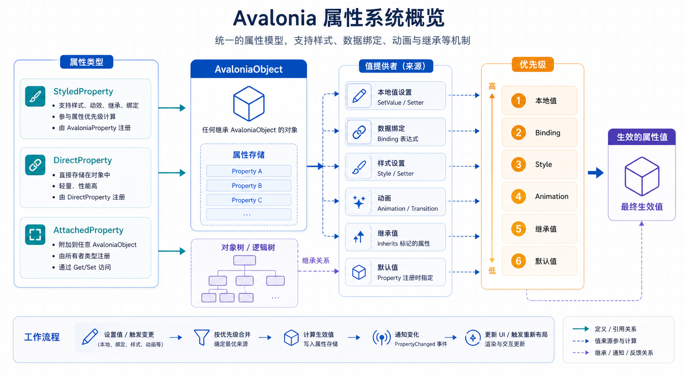

## 概述

Avalonia 有自己的属性系统，扩展了标准 .NET 属性模型。Avalonia 属性支持样式、数据绑定、动画、属性值继承和变化通知。理解属性系统对于创建自定义控件和有效使用框架至关重要。



### 属性类型概述

| 属性类型              | 基类                             | 用途                           |
| --------------------- | -------------------------------- | ------------------------------ |
| **Styled Property**   | `StyledProperty<T>`              | 参与样式系统的属性             |
| **Direct Property**   | `DirectProperty<TOwner, TValue>` | 由常规 C# 字段支持             |
| **Attached Property** | `AttachedProperty<T>`            | 可在任何 AvaloniaObject 上设置 |

---

## StyledProperty（样式属性）

### 什么是 StyledProperty

StyledProperty 是 Avalonia 中的标准属性类型。Styled 属性将值存储在 Avalonia 属性系统中（而不是在支持字段中），使它们能够参与样式、动画和值优先级。

### 注册 StyledProperty

```csharp
public class MyControl : Control
{
    public static readonly StyledProperty<double> CornerRadiusProperty =
        AvaloniaProperty.Register<MyControl, double>(
            nameof(CornerRadius),
            defaultValue: 0.0);

    public double CornerRadius
    {
        get => GetValue(CornerRadiusProperty);
        set => SetValue(CornerRadiusProperty, value);
    }
}
```

### Register 方法参数

| 参数                 | 说明                                                     |
| -------------------- | -------------------------------------------------------- |
| `name`               | 属性名称，必须与 CLR 属性名匹配（区分大小写）            |
| `defaultValue`       | 属性的默认值                                             |
| `inherits`           | 属性值是否沿可视树向下继承（父控件设置后子控件自动获得） |
| `defaultBindingMode` | 默认绑定模式（OneWay、TwoWay 等）                        |
| `validate`           | 验证函数，返回 false 的值永远不会生效                    |
| `coerce`             | 强制函数，在应用值之前对其进行调整                       |

### 完整示例

```csharp
public static readonly StyledProperty<double> OpacityProperty =
    AvaloniaProperty.Register<MyControl, double>(
        nameof(Opacity),
        defaultValue: 1.0,
        inherits: false,
        defaultBindingMode: BindingMode.OneWay,
        validate: v => v >= 0 && v <= 1,
        coerce: (control, value) => Math.Max(0, Math.Min(1, value)));

public double Opacity
{
    get => GetValue(OpacityProperty);
    set => SetValue(OpacityProperty, value);
}
```

### 复用现有属性

```csharp
public class MyControl : Control
{
    public static readonly StyledProperty<IBrush?> BackgroundProperty =
        Border.BackgroundProperty.AddOwner<MyControl>();

    public IBrush? Background
    {
        get => GetValue(BackgroundProperty);
        set => SetValue(BackgroundProperty, value);
    }
}
```

---

## DirectProperty（直接属性）

### 什么是 DirectProperty

DirectProperty 由常规 C# 字段支持。Avalonia 属性系统通过你提供的 getter 和 setter 委托读写值。Direct 属性在以下情况下有用：

- 需要不参与样式的属性
- 需要只读属性
- 要避免样式属性值存储的开销

### 注册 DirectProperty

```csharp
public class MyControl : Control
{
    public static readonly DirectProperty<MyControl, string?> StatusProperty =
        AvaloniaProperty.RegisterDirect<MyControl, string?>(
            nameof(Status),
            o => o.Status,
            (o, v) => o.Status = v);

    private string? _status;

    public string? Status
    {
        get => _status;
        set => SetAndRaise(StatusProperty, ref _status, value);
    }
}
```

### SetAndRaise 方法

在 DirectProperty 的 setter 中必须使用 `SetAndRaise` 而非直接赋值：

```csharp
// 推荐：SetAndRaise 会自动触发 PropertyChanged 事件
SetAndRaise(StatusProperty, ref _status, value);

// 不推荐：手动实现容易遗漏事件触发
_status = value;
PropertyChanged?.Invoke(this, ...);
```

> **为什么 DirectProperty 用 SetAndRaise？**
> 虽然 DirectProperty 由 CLR 字段支持，但它仍然支持数据绑定和 PropertyChanged 通知。`SetAndRaise` 会比较新旧值，仅在值实际变化时触发通知，性能更优。

### 只读 DirectProperty

```csharp
public static readonly DirectProperty<MyControl, bool> IsActiveProperty =
    AvaloniaProperty.RegisterDirect<MyControl, bool>(
        nameof(IsActive),
        o => o.IsActive);
```

### StyledProperty vs DirectProperty

| 行为         | Styled Property | Direct Property |
| ------------ | --------------- | --------------- |
| 参与样式     | 是              | 否              |
| 参与动画     | 是              | 否              |
| 支持值优先级 | 是              | 否（单一值）    |
| 可以继承值   | 是              | 否              |
| 支持强制     | 是              | 否              |
| 性能         | 属性存储查找    | 直接字段访问    |
| 可以只读     | 否              | 是              |

---

## AttachedProperty（附加属性）

### 什么是 AttachedProperty

AttachedProperty 是一种可以在任何 AvaloniaObject 上设置的样式属性。附加属性通常由父布局面板定义并设置在其子元素上。

### 注册 AttachedProperty

```csharp
public class MyPanel : Panel
{
    public static readonly AttachedProperty<int> ColumnProperty =
        AvaloniaProperty.RegisterAttached<MyPanel, Control, int>("Column", defaultValue: 0);

    public static int GetColumn(Control element) => element.GetValue(ColumnProperty);
    public static void SetColumn(Control element, int value) => element.SetValue(ColumnProperty, value);
}
```

### 在 XAML 中使用

```xml
<local:MyPanel>
    <Button local:MyPanel.Column="1" Content="在第1列" />
</local:MyPanel>
```

### 完整示例

```csharp
public class MyPanel : Panel
{
    public static readonly AttachedProperty<int> ColumnProperty =
        AvaloniaProperty.RegisterAttached<MyPanel, Control, int>(
            "Column",
            defaultValue: 0);

    public static int GetColumn(Control element) => element.GetValue(ColumnProperty);
    public static void SetColumn(Control element, int value) => element.SetValue(ColumnProperty, value);
}
```

---

## 获取和设置属性值

### AvaloniaObject 方法

所有 Avalonia 属性通过 AvaloniaObject 基类读写：

```csharp
// 获取属性值
double radius = myControl.GetValue(MyControl.CornerRadiusProperty);

// 设置属性值
myControl.SetValue(MyControl.CornerRadiusProperty, 8.0);

// 清除属性值（恢复默认/样式值）
myControl.ClearValue(MyControl.CornerRadiusProperty);
```

### 绑定属性值

```xml
<Border CornerRadius="{Binding CornerRadius}" />
```

---

## 属性变化观察

### 使用 GetObservable

```csharp
myControl.GetObservable(MyControl.CornerRadiusProperty)
    .Subscribe(newValue => Console.WriteLine($"CornerRadius 变为 {newValue}"));
```

### 重写 OnPropertyChanged

```csharp
protected override void OnPropertyChanged(AvaloniaPropertyChangedEventArgs change)
{
    base.OnPropertyChanged(change);

    if (change.Property == CornerRadiusProperty)
    {
        var oldValue = change.GetOldValue<double>();
        var newValue = change.GetNewValue<double>();
        // 响应变化
    }
}
```

### 完整示例

```csharp
public class MyControl : Control
{
    public static readonly StyledProperty<double> ValueProperty =
        AvaloniaProperty.Register<MyControl, double>(nameof(Value), defaultValue: 0.0);

    public double Value
    {
        get => GetValue(ValueProperty);
        set => SetValue(ValueProperty, value);
    }

    protected override void OnPropertyChanged(AvaloniaPropertyChangedEventArgs change)
    {
        // 先调用基类处理程序，确保属性系统正常工作
        base.OnPropertyChanged(change);

        // change.Property：变化的属性
        // change.GetOldValue<T>() / change.GetNewValue<T>()：新旧属性值
        if (change.Property == ValueProperty)
        {
            UpdateVisual();
        }
    }

    private void UpdateVisual()
    {
        // 更新视觉效果
    }
}
```

---

## 属性值优先级

### 优先级层次

| 优先级 | 值来源    |
| ------ | --------- |
| 1      | 动画      |
| 2      | 本地值    |
| 3      | 样式/模板 |
| 4      | 继承的值  |
| 5      | 默认值    |

### 优先级说明

```csharp
// 优先级从高到低：
// 1. 动画设置的值
// 2. 通过 SetValue 或绑定设置的值
// 3. 样式 setter 设置的值
// 4. 继承的属性值
// 5. 注册时的默认值
```

---

## 属性元数据

### Metadata 回调

```csharp
public static readonly StyledProperty<double> SizeProperty =
    AvaloniaProperty.Register<MyControl, double>(
        nameof(Size),
        defaultValue: 100.0,
        coerce: (control, value) => Math.Max(10, value));
```

### 验证函数

```csharp
public static readonly StyledProperty<int> CountProperty =
    AvaloniaProperty.Register<MyControl, int>(
        nameof(Count),
        defaultValue: 0,
        validate: v => v >= 0);
```

---

## 实用示例

### 示例 1：自定义圆角控件

```csharp
public class RoundedBorder : Border
{
    public static readonly StyledProperty<double> CornerRadiusXProperty =
        AvaloniaProperty.Register<RoundedBorder, double>(nameof(CornerRadiusX), defaultValue: 0);

    public double CornerRadiusX
    {
        get => GetValue(CornerRadiusXProperty);
        set => SetValue(CornerRadiusXProperty, value);
    }

    public static readonly StyledProperty<double> CornerRadiusYProperty =
        AvaloniaProperty.Register<RoundedBorder, double>(nameof(CornerRadiusY), defaultValue: 0);

    public double CornerRadiusY
    {
        get => GetValue(CornerRadiusYProperty);
        set => SetValue(CornerRadiusYProperty, value);
    }
}
```

### 示例 2：只读状态属性

```csharp
public class MyControl : Control
{
    public static readonly DirectProperty<MyControl, bool> IsLoadingProperty =
        AvaloniaProperty.RegisterDirect<MyControl, bool>(
            nameof(IsLoading),
            o => o._isLoading,
            (o, v) => o._isLoading = v);

    private bool _isLoading;

    public bool IsLoading
    {
        get => _isLoading;
        private set => SetAndRaise(IsLoadingProperty, ref _isLoading, value);
    }

    public async Task LoadDataAsync()
    {
        IsLoading = true;
        try
        {
            await _dataService.LoadAsync();
        }
        finally
        {
            IsLoading = false;
        }
    }
}
```

### 示例 3：布局附加属性

```csharp
public class MyGrid : Panel
{
    public static readonly AttachedProperty<int> RowProperty =
        AvaloniaProperty.RegisterAttached<MyGrid, Control, int>("Row", defaultValue: 0);

    public static int GetRow(Control element) => element.GetValue(RowProperty);
    public static void SetRow(Control element, int value) => element.SetValue(RowProperty, value);

    public static readonly AttachedProperty<int> ColumnProperty =
        AvaloniaProperty.RegisterAttached<MyGrid, Control, int>("Column", defaultValue: 0);

    public static int GetColumn(Control element) => element.GetValue(ColumnProperty);
    public static void SetColumn(Control element, int value) => element.SetValue(ColumnProperty, value);
}
```

---

## 常见问题

### 1. 属性不参与样式

**检查项：**

- 是否使用 StyledProperty 而非 DirectProperty
- 属性是否正确注册

### 2. 属性值不更新

**检查项：**

- 是否使用 SetValue 而非直接赋值
- 绑定是否正确设置

### 3. 只读属性可写

**解决方式：**

```csharp
// 创建只读 StyledProperty
public static readonly StyledProperty<string> ReadOnlyProperty =
    AvaloniaProperty.Register<MyControl, string>(nameof(ReadOnly));

// 属性只提供 getter
public string ReadOnly => GetValue(ReadOnlyProperty);

// 内部提供 setter
internal void SetReadOnlyValue(string value) => SetValue(ReadOnlyProperty, value);
```

---

## 总结

### 属性类型对比

| 类型             | 存储位置 | 样式支持 | 动画支持 | 继承支持 |
| ---------------- | -------- | -------- | -------- | -------- |
| StyledProperty   | 属性系统 | ✅       | ✅       | ✅       |
| DirectProperty   | CLR 字段 | ❌       | ❌       | ❌       |
| AttachedProperty | 任意元素 | ✅       | ✅       | ✅       |

### 注册方法

| 类型             | 注册方法                            |
| ---------------- | ----------------------------------- |
| StyledProperty   | `AvaloniaProperty.Register`         |
| DirectProperty   | `AvaloniaProperty.RegisterDirect`   |
| AttachedProperty | `AvaloniaProperty.RegisterAttached` |

### 核心方法

| 方法          | 用途             |
| ------------- | ---------------- |
| `GetValue`    | 获取属性值       |
| `SetValue`    | 设置属性值       |
| `ClearValue`  | 清除属性值       |
| `SetAndRaise` | 设置值并触发通知 |

---

## 相关资源

- [Avalonia 属性系统文档](https://docs.avaloniaui.net/docs/properties/)
- [属性值优先级](https://docs.avaloniaui.net/docs/properties/value-precedence)
- [元数据和回调](https://docs.avaloniaui.net/docs/properties/metadata-and-callbacks)
- [属性值继承](https://docs.avaloniaui.net/docs/properties/property-value-inheritance)
