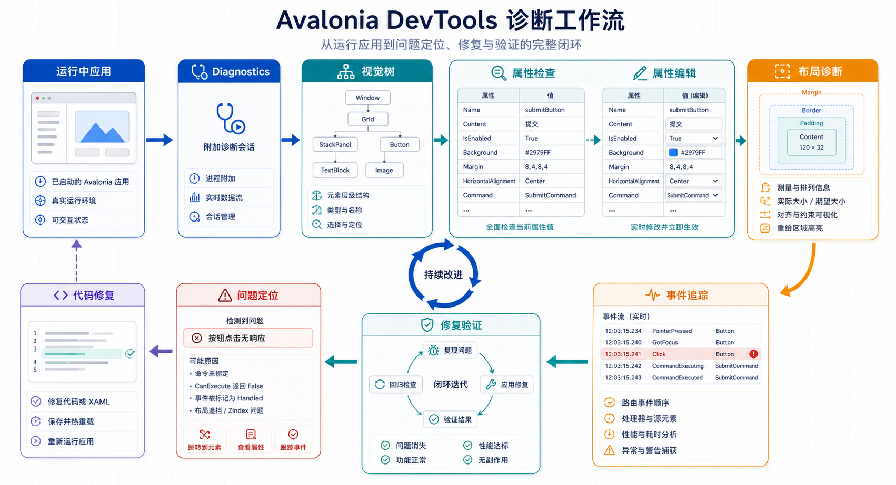

## 概述

Avalonia DevTools 是一套强大的内置调试和诊断工具，帮助开发者快速定位 UI 问题、调试布局、检查属性和事件。本教程将详细介绍如何安装、配置和使用 DevTools 🚀



---

## 前置要求

### DevTools 系统要求

| 要求 | 版本/详情 |
|------|----------|
| **.NET 运行时** | 6.0 或更高版本 |
| **Windows** | 10 或更高版本 |
| **macOS** | 13 或更高版本 |
| **Linux** | X11 和 glibc 2.27 或 musl 1.22.2 兼容发行版 |

### Diagnostics Support 要求

- **Avalonia 11.2.0** 或更高版本
- 基于 **.NET Standard 2.0** 构建的 API
- 支持 Browser 和 Android/iOS 项目

---

## 安装步骤

### Step 1: 安装 AvaloniaUI Developer Tools

AvaloniaUI Developer Tools 是一个原生 [.NET 工具](https://learn.microsoft.com/zh-cn/dotnet/core/tools/global-tools)，通过 SDK 提供更新机制。

#### .NET 10+ 版本

```powershell
dotnet tool install --global AvaloniaUI.DeveloperTools
```

如果是从 .NET 8/9 升级，先卸载旧版本：

```powershell
dotnet tool uninstall --global AvaloniaUI.DeveloperTools.Windows
# 或使用简写命令
avdt uninstall
```

更新工具：

```powershell
dotnet tool update --global AvaloniaUI.DeveloperTools
```

#### .NET 8/9 版本

需要根据运行平台安装特定包：

**Windows:**

```powershell
dotnet tool install --global AvaloniaUI.DeveloperTools.Windows
```

**macOS:**

```powershell
dotnet tool install --global AvaloniaUI.DeveloperTools.macOS
```

**Linux:**

```powershell
dotnet tool install --global AvaloniaUI.DeveloperTools.Linux
```

---

### Step 2: 安装 Diagnostics Support 包

`Diagnostics Support` 包负责在用户应用和 Developer Tools 进程之间建立连接桥接。

```powershell
dotnet add package AvaloniaUI.DiagnosticsSupport
```

> [!NOTE]
> 旧包 `Avalonia.Diagnostics` 可以安全移除，新版 Developer Tools 不再使用它。

---

### Step 3: 配置项目

在 `Application` 类中启用 Diagnostics Support：

```csharp
public override void Initialize()
{
    AvaloniaXamlLoader.Load(this);

#if DEBUG
    this.AttachDeveloperTools();
#endif
}
```

或者使用 `.WithDeveloperTools()` 扩展方法配置 `AppBuilder`：

```csharp
public static AppBuilder BuildAvaloniaApp()
{
    return AppBuilder.Configure<App>()
        .UsePlatformDetect()
        .UseFluentTheme()
        .LogToTrace()
#if DEBUG
        .WithDeveloperTools();
#endif
}
```

这些方法还接受 `DeveloperToolsOptions` 选项类来自定义诊断支持设置。默认使用 **29414** 端口，可通过选项配置。

---

### Step 4: 运行工具

目标应用运行后，按 **F12** 初始化连接。`Diagnostics Support` 将自动运行 Developer Tools 可执行文件并启动进程间的连接。

> [!NOTE]
> macOS 上首次执行可能需要几秒钟，因为 Gatekeeper 验证。后续启动会更快。

---

### Step 5: 激活工具

首次激活后，需要输入 `AvaloniaUI Portal` 凭据。这是工具唯一需要网络连接的时刻，之后可以离线使用或直到许可证会话过期。

---

### Step 6: 完成！

激活后，与应用的连接将恢复，工具窗口将打开。

---

## DevTools 工具概览

DevTools 提供以下核心工具：

| 工具 | 说明 |
|------|------|
| **Elements** | 检查和修改元素属性，查看视觉/逻辑树 |
| **Assets** | 查看和管理应用资源 |
| **Resources** | 查看应用资源字典 |
| **Logs** | 查看运行时日志 |
| **Events** | 追踪和监控事件流 |
| **Metrics** | 性能指标可视化 |

---

## Elements 元素工具

Elements Tree 提供了结合视觉树和逻辑树的统一视图。它仅加载可见元素以优化性能，同时以逻辑树为基础组织结构。模板内容在 `/template/` 节点下折叠显示。

### 检查模式

Elements 工具提供多种方式来识别和选择运行应用中的特定 UI 元素：

| 模式 | 快捷键 | 说明 |
|------|--------|------|
| **焦点追踪** | `Ctrl+Shift+K` | 自动选择当前焦点元素 |
| **检查元素** | `Ctrl+Shift+C` | 将光标转换为元素选择器，点击即可定位 |

### 上下文菜单

右键点击元素可访问以下操作：

- **Expand Children** - 展开直接子级
- **Expand Recursively** - 递归展开
- **Expand Recursively with templates** - 包含模板递归展开
- **Collapse** - 折叠节点
- **Copy** - 复制元素或选择器
- **Focus** - 聚焦元素
- **Bring Into View** - 使元素可见
- **Invalidate** - 使视觉失效
- **Debug Overlays** - 渲染调试叠加层（如 FPS）

整个树支持搜索功能，可以按名称或类型快速定位元素。

### 伪类选择器

每个元素显示在其上定义的伪类。此功能对于测试元素在不同状态下的响应特别有价值，无需通过用户交互手动触发。

---

## Element Properties 元素属性

Elements 工具右侧面板显示选中元素的属性，可以实时编辑。

### 属性列说明

| 列名 | 说明 |
|------|------|
| **Property** | 属性名称 |
| **Value** | 当前值 |
| **Type** | 当前值类型 |
| **Priority** | 值优先级 |

### 布局检查

Layout 选项卡允许检查和编辑常见布局属性（`Margin`、`Border`、`Padding`）。

- 如果 `Width` 或 `Height` 带下划线，表示存在活动约束
- 悬停值可查看包含相关信息的工具提示

### 样式检查

- **Properties** 面板显示属性的当前活动值
- **Styles** 面板显示所有值及其来源
- 切换 `Show inactive` 选项可查看所有可能匹配此控件的样式
- 快照功能：按 `Snapshot` 按钮或悬停目标窗口时按 `Alt+S`
- 如果 setter 值绑定到资源，将以圆形后跟资源键表示
- 如果值带有删除线，表示被更高优先级的样式值覆盖

---

## In-App Overlay 应用内叠加层

直接在应用中显示调试信息，包括：

- 工具提示信息
- 边距和填充可视化
- 标尺显示
- 扩展线

---

## Element 3D Viewer 元素 3D 查看器

可视化元素在 3D 空间中的布局，便于理解层级关系和布局结构。

---

## Events 事件工具

Events 选项卡用于追踪事件的传播，可以检测重复的指针/键盘事件。

### 默认追踪的事件

| 事件类型 |
|---------|
| `Button.ClickEvent` |
| `InputElement.KeyDownEvent` |
| `InputElement.KeyUpEvent` |
| `InputElement.TextInputEvent` |
| `InputElement.PointerReleasedEvent` |
| `InputElement.PointerPressedEvent` |

---

## Metrics 性能指标工具

### 可视化指标

| 指标类型 | 说明 |
|----------|------|
| **FPS** | 每秒帧数 |
| **DirtyRects** | 每帧重绘的区域 |
| **LayoutTime** | 每帧布局持续时间 |
| **RenderTime** | 每帧渲染持续时间 |

### 配置选项

| 选项 | 默认值 | 说明 |
|------|--------|------|
| 可观察仪表轮询间隔 | 1000ms | 越低更新越频繁，但可能影响应用性能 |
| 测量帧间隔 | 250ms | 测量捕获和更新的频率 |
| 聚合帧测量 | true | 启用时合并同一帧内的多个测量 |
| 测量历史时长 | 60s | 保留和显示的过去测量时间 |

---

## Logs 日志工具

查看运行时日志，便于诊断运行时问题和调试应用行为。

---

## Resources 资源工具

查看应用资源字典，了解可用的资源和样式。

---

## Assets 资源工具

查看和管理应用中的图片、字体等资源。

---

## 快捷键参考

### 全局快捷键

| 快捷键 | 功能 | 平台 |
|--------|------|------|
| **F12** | 打开 DevTools | 所有 |
| `Ctrl+Shift+K` | 焦点追踪模式 | Windows/Linux |
| `Ctrl+Shift+C` | 检查元素模式 | Windows/Linux |
| `Cmd+Shift+K` | 焦点追踪模式 | macOS |
| `Cmd+Shift+C` | 检查元素模式 | macOS |

### Elements Tree 快捷键

| 快捷键 | 功能 |
|--------|------|
| `Ctrl + Shift` | 选中当前悬停控件对应的节点 |
| `Ctrl + Alt` | 选中当前节点的 TemplatedParent 或 Parent |
| `Alt + ↑` | 选中前一个节点 |
| `Alt + ↓` | 选中后一个节点 |
| `Alt + ←` | 折叠/选中前一个父节点 |
| `Alt + →` | 展开/选中后一个子节点 |
| `Ctrl + K` | 固定/取消固定 PopupRoot |
| `Ctrl + 滚轮` | 调整 DevTools 窗口高度 |
| `Ctrl + Shift + 滚轮` | 调整 DevTools 窗口宽度 |

### 属性视图命令

| 表达式 | 描述 |
|--------|------|
| `property` | 查看属性 |
| `-field` | 查看字段 |
| `method()` | 查看方法结果（仅无参函数） |
| `attachedClass @ attachedProperty` | 查看附加属性 |
| `list[n]` | 查看集合指定项 |
| `expression1.expression2` | 连续求值 |
| `expression1,expression2` | 查看多个表达式 |

> [!TIP]
> 示例表达式：`margin,borderthickness,background,grid@row,gethashcode(),children[0],-_isloaded`

---

## Developer Tools 设置

通过系统托盘图标菜单（Windows/Linux）或 macOS 全局菜单访问设置页面。

### 外观设置

| 设置项 | 默认值 | 说明 |
|--------|--------|------|
| Theme Variant | Dark | 应用程序颜色主题 |
| Exit On Last Window Close | true | 最后窗口关闭时退出应用 |
| Skip Welcome Window | false | 跳过启动欢迎屏幕 |
| Enable Protocol Monitor | false | 显示诊断通信协议监控窗口 |

### Elements Tree 设置

| 设置项 | 默认值 | 说明 |
|--------|--------|------|
| Aggregate Templates | true | 将模板视觉子级合并到单个树节点 |
| InlinePseudoclasses | false | 内联所有伪类而非仅显示可见的 |
| Contextual Properties | true | 仅显示与当前上下文相关的属性 |
| Include CLR Properties | false | 显示 .NET CLR 属性 |

### Overlay 设置

| 设置项 | 默认值 | 说明 |
|--------|--------|------|
| Show ToolTip Info | true | 在悬停元素上显示工具提示 |
| Visualize Margin & Padding | true | 高亮显示边距、填充和边框区域 |
| Show Rulers | true | 显示测量标尺 |
| Show Extension Lines | true | 显示悬停元素和标尺之间的辅助线 |

### Protocol 设置

| 设置项 | 默认值 | 说明 |
|--------|--------|------|
| HTTP Port | 29414 | 监听应用连接的 HTTP 端口（修改后需重启） |

---

## 高级功能

### 自定义 DeveloperToolsOptions

```csharp
#if DEBUG
this.AttachDeveloperTools(new DeveloperToolsOptions
{
    Protocol = 29415,  // 自定义端口
    StartupScreenIndex = 1  // 多显示器配置
});
#endif
```

### 渲染诊断 API

每个 `TopLevel` 都暴露了 `IRenderer Diagnostics`：

```csharp
if (TopLevel is { Renderer: { } renderer })
{
    renderer.SceneInvalidated += (_, e) =>
    {
        Debug.WriteLine($"Invalidated {e.Rect}");
    };
}
```

### 调试叠加层

通过代码启用调试叠加层：

```csharp
if (this.ApplicationLifetime is IClassicDesktopStyleApplicationLifetime desktop)
{
    desktop.MainWindow.AttachedToVisualTree += (_, __) =>
    {
        if (desktop.MainWindow?.Renderer is { } renderer)
            renderer.DebugOverlays = RendererDebugOverlays.Fps | RendererDebugOverlays.DirtyRects;
    };
}
```

---

## 常见问题

### Q: DevTools 无法启动？

确保：
1. 已安装 `AvaloniaUI.DiagnosticsSupport` 包
2. 项目中已启用开发者工具
3. 端口 29414 未被占用

### Q: 看不到元素属性？

检查是否正确选择了应用中的元素，并确保 "Include CLR Properties" 设置已启用。

### Q: 如何调试移动端应用？

DevTools 支持 Browser 和 Android/iOS 项目的远程诊断功能。

---

## 相关资源

- [官方 DevTools 文档](https://docs.avaloniaui.net/accelerate/tools/dev-tools/getting-started)
- [DeveloperToolsOptions 参考](https://docs.avaloniaui.net/accelerate/tools/dev-tools/advanced/options-reference)
- [常见问题解答](https://docs.avaloniaui.net/accelerate/tools/dev-tools/faq)
- [示例项目](https://github.com/AvaloniaUI/AvaloniaUI.DeveloperTools/tree/main/samples/SimpleToDoList)

---

## 下一步

| 主题 | 说明 |
|------|------|
| [动画基础](file:///d:\Workspace\blg\astro-paper-own/src/data/blog/Avalonia/Avalonia%20动画基础详解.md) | 创建流畅的 UI 动画 |
| [自定义控件](file:///d:\Workspace\blg\astro-paper-own/src/data/blog/Avalonia/Avalonia%20自定义控件详解.md) | 构建可复用的自定义控件 |

---

## 总结

DevTools 是 Avalonia 开发中不可或缺的调试利器，通过本教程你应该能够：

| 步骤 | 内容 |
|------|------|
| 1 | 安装 DevTools 和 Diagnostics Support 包 |
| 2 | 配置项目以启用诊断功能 |
| 3 | 使用 Elements 工具检查 UI 结构 |
| 4 | 编辑属性实时调试布局 |
| 5 | 追踪事件诊断交互问题 |
| 6 | 监控系统性能指标 |
