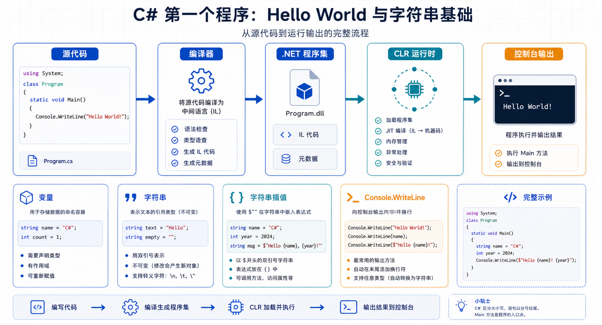

## 概述

本文将带你编写第一个 C# 程序，开启编程之旅。我们将从最简单的"Hello World"开始，逐步学习变量声明、字符串处理等核心概念。



### 学习目标

| 目标               | 说明                     |
| ------------------ | ------------------------ |
| **编写第一个程序** | 掌握 C# 程序的基本结构   |
| **理解变量**       | 学会声明和使用变量       |
| **字符串操作**     | 掌握字符串的常见操作方法 |

---

## 第一个 C# 程序

### Hello World

最经典的入门程序，一行代码即可打印"Hello World"：

```csharp
Console.WriteLine("Hello, World!");
```

**代码解析：**

| 组件          | 说明                   |
| ------------- | ---------------------- |
| `Console`     | 表示控制台窗口的类型   |
| `.`           | 访问成员的操作符       |
| `WriteLine()` | 在控制台输出文本的方法 |
| `;`           | 语句结束符（必须！）   |

### 运行环境

如果你安装了 .NET SDK，可以创建一个完整的项目：

```bash
dotnet new console -n HelloWorld
cd HelloWorld
dotnet run
```

- `dotnet new` - 创建新项目
- `console` - 模板类型（控制台应用）
- `-n HelloWorld` - 项目名称（Name）

执行后的结果：

```
HelloWorld/
├── HelloWorld.csproj     # 项目文件
├── Program.cs            # 主程序文件
└── obj/                  # 临时编译文件夹
```

---

## 变量与数据类型

### 声明变量

变量是用于存储数据的容器。在 C# 中，声明变量时需要指定类型：

```csharp
string aFriend = "Bill";
Console.WriteLine(aFriend);
```

**变量声明的组成：**

```
类型    变量名    =    初始值;
string  name     =    "Alice";
```

### 修改变量值

变量可以重新赋值：

```csharp
string aFriend = "Bill";
Console.WriteLine(aFriend);

aFriend = "Maira";
Console.WriteLine(aFriend);
```

**输出结果：**

```
Bill
Maira
```

### 字符串拼接

使用 `+` 运算符连接字符串：

```csharp
string aFriend = "Maira";
Console.WriteLine("Hello " + aFriend);
```

---

## 字符串插值

字符串插值是更优雅的字符串格式化方式。

### 基本语法

在字符串前添加 `$` 符号，在 `{ }` 中放入变量名：

```csharp
string name = "Maira";
Console.WriteLine($"Hello {name}");
```

### 多变量插值

一个字符串中可以包含多个变量：

```csharp
string firstFriend = "Maria";
string secondFriend = "Sage";
Console.WriteLine($"My friends are {firstFriend} and {secondFriend}");
```

---

## 字符串常用方法

### 获取字符串长度

使用 `Length` 属性获取字符数：

```csharp
string name = "Maria";
Console.WriteLine($"The name {name} has {name.Length} letters.");
```

### 去除空格

- `Trim()` - 去除首尾空格
- `TrimStart()` - 去除首部空格
- `TrimEnd()` - 去除尾部空格

```csharp
string greeting = " Hello World! ";
Console.WriteLine($"[{greeting}]");

string trimmed = greeting.Trim();
Console.WriteLine($"[{trimmed}]");
```

**输出：**

```
[ Hello World! ]
[Hello World!]
```

### 搜索与替换

```csharp
string sayHello = "Hello World!";
sayHello = sayHello.Replace("Hello", "Greetings");
Console.WriteLine(sayHello);
```

### 大小写转换

```csharp
string text = "Hello World";

// 转为大写
Console.WriteLine(text.ToUpper());  // HELLO WORLD

// 转为小写
Console.WriteLine(text.ToLower());  // hello world
```

### 搜索子字符串

`Contains()` 方法检查是否包含指定文本：

```csharp
string songLyrics = "You say goodbye, and I say hello";
Console.WriteLine(songLyrics.Contains("goodbye"));   // True
Console.WriteLine(songLyrics.Contains("greetings")); // False
```

`Contains()` 返回 **布尔值**（`bool`），值为 `true` 或 `false`。

### 判断开头和结尾

```csharp
string text = "You say goodbye, and I say hello";

Console.WriteLine(text.StartsWith("You"));   // True
Console.WriteLine(text.StartsWith("goodbye")); // False
Console.WriteLine(text.EndsWith("hello"));    // True
Console.WriteLine(text.EndsWith("goodbye"));  // False
```

---

## 完整示例

```csharp
string friend = "Alice";
string greeting = "Hello";
string space = " ";
string exclamation = "!";

Console.WriteLine(greeting + space + friend + exclamation);
Console.WriteLine($"{greeting} {friend}!");

string message = "Welcome to C# programming";
Console.WriteLine($"Message: {message}");
Console.WriteLine($"Length: {message.Length}");
Console.WriteLine($"Uppercase: {message.ToUpper()}");
Console.WriteLine($"Contains 'C#': {message.Contains("C#")}");
```

**输出：**

```
Hello Alice!
Hello Alice!
Message: Welcome to C# programming
Length: 26
Uppercase: WELCOME TO C# PROGRAMMING
Contains 'C#': True
```

---

## 关键概念总结

| 概念           | 说明                           |
| -------------- | ------------------------------ |
| **变量**       | 存储数据的容器，需声明类型     |
| **字符串插值** | `$"Hello {name}"` 格式化字符串 |
| **方法**       | 执行特定操作的代码块           |
| **属性**       | 对象的特征值（如 `Length`）    |
| **布尔值**     | `true` 或 `false`              |

---

## 常见错误

### 忘记分号

```csharp
Console.WriteLine("Hello")  // ❌ 缺少分号
Console.WriteLine("Hello"); // ✅ 正确
```

### 变量未声明

```csharp
name = "Alice";  // ❌ 变量未声明
string name = "Alice"; // ✅ 正确
```

### 大小写敏感

```csharp
string name = "Alice";
string Name = "Bob";  // ✅ 这是另一个变量
console.WriteLine(name); // ❌ C# 大小写敏感
Console.WriteLine(name); // ✅ 正确
```

---

## 相关资源

- [C# 文档 - Microsoft Learn](https://learn.microsoft.com/zh-cn/dotnet/csharp/)
- [字符串编程指南](https://learn.microsoft.com/zh-cn/dotnet/csharp/programming-guide/strings/)
- [Hello World 教程](https://learn.microsoft.com/zh-cn/dotnet/csharp/tour-of-csharp/tutorials/hello-world)
