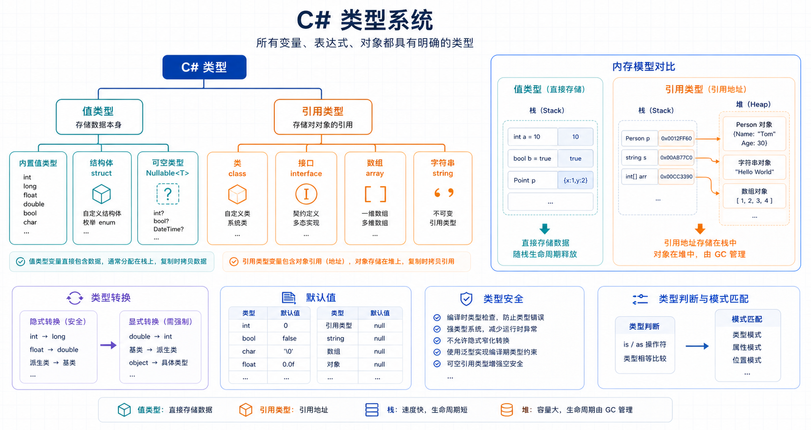

## 概述

C# 是一种强类型语言，每个变量和表达式都有一个确定的类型。了解数据类型是编写正确、高效 C# 代码的基础。



### C# 类型系统

| 类别         | 说明                                 |
| ------------ | ------------------------------------ |
| **值类型**   | 直接存储数据值，包括简单类型和结构体 |
| **引用类型** | 存储对数据的引用（内存地址）         |
| **指针类型** | 仅在不安全代码中使用                 |

---

## 内置值类型

### 整型

整型用于表示整数。C# 提供多种整型，以满足不同的内存和范围需求。

| 类型         | 关键字   | .NET 类型      | 范围                                                   | 大小     |
| ------------ | -------- | -------------- | ------------------------------------------------------ | -------- |
| 有符号字节   | `sbyte`  | System.SByte   | -128 ~ 127                                             | 8 位     |
| 无符号字节   | `byte`   | System.Byte    | 0 ~ 255                                                | 8 位     |
| 短整型       | `short`  | System.Int16   | -32,768 ~ 32,767                                       | 16 位    |
| 无符号短整型 | `ushort` | System.UInt16  | 0 ~ 65,535                                             | 16 位    |
| 整型         | `int`    | System.Int32   | -2,147,483,648 ~ 2,147,483,647                         | 32 位    |
| 无符号整型   | `uint`   | System.UInt32  | 0 ~ 4,294,967,295                                      | 32 位    |
| 长整型       | `long`   | System.Int64   | -9,223,372,036,854,775,808 ~ 9,223,372,036,854,775,807 | 64 位    |
| 无符号长整型 | `ulong`  | System.UInt64  | 0 ~ 18,446,744,073,709,551,615                         | 64 位    |
| 平台相关     | `nint`   | System.IntPtr  | 取决于平台                                             | 32/64 位 |
| 平台相关     | `nuint`  | System.UIntPtr | 取决于平台                                             | 32/64 位 |

### 整型字面量

```csharp
// 十进制（默认）
int decimalNum = 42;

// 十六进制（前缀 0x）
int hexNum = 0x2A;

// 二进制（前缀 0b）
int binaryNum = 0b101010;

// 长整型后缀 L
long bigNumber = 42L;

// 无符号后缀 U
uint unsignedNum = 42U;

// 组合后缀 UL, LU, ULL, LLU
ulong bigUnsigned = 42UL;
```

### 浮点型

浮点型用于表示带小数点的数字。

| 类型   | 关键字    | .NET 类型      | 精度        | 范围                     |
| ------ | --------- | -------------- | ----------- | ------------------------ |
| 单精度 | `float`   | System.Single  | 约 6-9 位   | ±1.5×10⁻⁴⁵ ~ ±3.4×10³⁸   |
| 双精度 | `double`  | System.Double  | 约 15-17 位 | ±5.0×10⁻³²⁴ ~ ±1.7×10³⁰⁸ |
| 高精度 | `decimal` | System.Decimal | 28-29 位    | ±1.0×10⁻²⁸ ~ ±7.9×10²⁸   |

### 浮点型字面量

```csharp
// double（默认）
double d = 3.14;

// float 后缀 F 或 f
float f = 3.14F;

// decimal 后缀 M 或 m
decimal money = 99.99M;

// 科学计数法
double scientific = 1.5e-10;
```

### 浮点型选择建议

```csharp
// 使用 double：大多数科学计算
double pi = 3.14159265359;

// 使用 float：内存敏感的场景
float position = 100.5f;

// 使用 decimal：金融计算（精确性至关重要）
decimal price = 19.99m;
decimal tax = price * 0.08m;
```

### 布尔型

布尔类型表示逻辑值。

```csharp
bool isActive = true;
bool hasPermission = false;

// 布尔表达式
bool isGreater = 10 > 5;  // true
bool isEqual = (3 == 3);  // true
```

### 字符型

字符类型表示单个 Unicode 字符。

```csharp
// 使用单引号
char grade = 'A';
char digit = '5';
char symbol = '@';

// Unicode 转义序列
char chinese = '\u4E2D';  // 中
char emoji = '\u2764';     // ❤

// 转义字符
char newline = '\n';
char tab = '\t';
char quote = '\'';
char backslash = '\\';
```

### 字符串插值中的字符

```csharp
char letter = 'A';
string text = $"The letter is {letter}";
Console.WriteLine(text);  // 输出: The letter is A
```

---

## 内置引用类型

### object 类型

`object` 是所有类型的基类。

```csharp
object obj1 = 42;           // 装箱 int
object obj2 = "Hello";     // string 是引用类型
object obj3 = new int[] { 1, 2, 3 };  // 数组

// 拆箱需要强制转换
int num = (int)obj1;
string str = (string)obj2;
```

### string 类型

`string` 表示 Unicode 字符序列。

```csharp
// 基本声明
string greeting = "Hello, World!";

// 逐字字符串（忽略转义）
string path = @"C:\Users\John\Documents";

// 多行字符串
string multiLine = """
    这是第一行
    这是第二行
    "";

// 空字符串
string empty = "";
string nullStr = null;

// 字符串比较
string a = "Hello";
string b = "Hello";
bool areEqual = a == b;  // true（值比较）

// 字符串是不可变的
string s = "Hello";
s = s + " World";  // 创建新字符串，原字符串不变
```

### String 方法

```csharp
string text = "Hello, World!";

// 长度
int length = text.Length;  // 13

// 大小写
string upper = text.ToUpper();   // HELLO, WORLD!
string lower = text.ToLower();   // hello, world!

// 查找
int index = text.IndexOf("World");  // 7
bool contains = text.Contains("Hello");  // true

// 截取
string sub = text.Substring(0, 5);  // Hello
string sub2 = text.Substring(7);    // World!

// 替换
string replaced = text.Replace("World", "C#");  // Hello, C#!

// 分割
string csv = "apple,banana,cherry";
string[] fruits = csv.Split(',');  // ["apple", "banana", "cherry"]

// 去除空白
string withSpaces = "  Hello  ";
string trimmed = withSpaces.Trim();  // "Hello"

// 判空
string empty = "";
bool isNullOrEmpty = string.IsNullOrEmpty(empty);  // true
bool isNullOrWhiteSpace = string.IsNullOrWhiteSpace("   ");  // true
```

### StringBuilder

对于频繁修改字符串的场景，使用 StringBuilder 更高效，避免每次拼接都创建新字符串：

```csharp
using System.Text;

// 创建 StringBuilder 实例，内部维护可变字符缓冲区
var sb = new StringBuilder();
sb.Append("Hello");              // 追加字符串
sb.AppendLine(" World!");        // 追加字符串并换行
sb.AppendFormat("Count: {0}", 42); // 按格式追加
sb.Insert(5, ",");                // 在指定位置插入字符
sb.Remove(0, 6);                 // 删除前6个字符（Hello + 空格）
sb.Replace("World", "C#");       // 替换字符串

// 最后一次性调用 ToString() 生成最终字符串
string result = sb.ToString();
Console.WriteLine(result);
```

---

## 值类型详解

### 结构体 (struct)

结构体是轻量级的值类型，适合小型数据结构：

```csharp
public struct Point
{
    public int X { get; set; }
    public int Y { get; set; }

    public Point(int x, int y)
    {
        X = x;
        Y = y;
    }

    public double DistanceTo(Point other)
    {
        int dx = X - other.X;
        int dy = Y - other.Y;
        return Math.Sqrt(dx * dx + dy * dy);
    }
}

// 使用
Point p1 = new Point(0, 0);
Point p2 = new Point(3, 4);
double dist = p1.DistanceTo(p2);  // 5
```

### 类与结构体的区别

| 特性     | 类 (class) | 结构体 (struct)      |
| -------- | ---------- | -------------------- |
| 类型     | 引用类型   | 值类型               |
| 存储位置 | 堆         | 栈（取决于情况）     |
| 默认值   | null       | 成员默认值           |
| 继承     | 支持       | 不支持（可实现接口） |
| 构造函数 | 可以无参   | 必须有完整构造函数   |

### 元组 (Tuple)

元组用于组合多个值：

```csharp
// 命名元组（C# 7+）
var person = (Name: "Alice", Age: 30);
Console.WriteLine(person.Name);  // Alice
Console.WriteLine(person.Age);    // 30

// 访问元素
(string Name, int Age) = person;
Console.WriteLine(Name);  // Alice

// 元组比较
var a = (X: 1, Y: 2);
var b = (X: 1, Y: 2);
bool equal = a == b;  // true
```

### 记录 (Record)

记录是 C# 9+ 引入的引用类型，适合用于不可变数据：

```csharp
// 引用记录
public record Person(string Name, int Age);

// 使用
Person p1 = new Person("Alice", 30);
Person p2 = p1 with { Age = 31 };  // 创建副本，修改 Age

// 值相等性
Person p3 = new Person("Alice", 30);
bool areEqual = p1 == p3;  // true（内容相等）

// 结构记录
public record struct Point(int X, int Y);

// 使用
Point pt = new Point(1, 2);
```

---

## 可空类型

### 可空值类型

值类型默认不能为 null，使用 `?` 使其可空：

```csharp
int? nullableInt = null;
double? nullableDouble = 3.14;
bool? nullableBool = true;

// 检查值
if (nullableInt.HasValue) // 检查是否为 null, 有值时为 true;false 不执行代码块
{
    int value = nullableInt.Value; // 如果 nullableInt 为 null, 会抛出异常 ArgumentNullException
}

// 使用空合并运算符
int result = nullableInt ?? 0;  // 左边为 null → 返回右边值（0）;左边有值 → 返回左边的值

// 空条件访问
int? length = nullableInt?.ToString()?.Length; //nullableInt 是 null，所以整个表达式的值是 null ;length = null

```

### 可空引用类型

C# 8+ 可以启用可空引用类型：

```csharp
// 可空上下文启用时
string? nullableString = null;  // 允许
string nonNullable = "Hello";    // 不能为 null

// 空包容运算符 !
string safe = nullableString!;  // 告诉编译器确定不为 null
```

---

## 枚举类型

枚举是一组命名的整数常量：

```csharp
// 基本枚举
public enum LogLevel
{
    Debug = 0,
    Info = 1,
    Warning = 2,
    Error = 3
}

// 使用
LogLevel level = LogLevel.Warning;
int value = (int)level;  // 2

// switch 配合枚举
string GetColor(LogLevel level) => level switch
{
    LogLevel.Debug => "灰色",
    LogLevel.Info => "蓝色",
    LogLevel.Warning => "黄色",
    LogLevel.Error => "红色",
    _ => "未知"
};

// Flags 枚举（位标志）
[Flags]
public enum FileAccess
{
    None = 0,
    Read = 1,
    Write = 2,
    Execute = 4,
    All = Read | Write | Execute
}

FileAccess access = FileAccess.Read | FileAccess.Write;
bool canRead = (access & FileAccess.Read) != 0;  // true
```

---

## 隐式类型转换

隐式转换是编译器自动执行的安全转换，不需要特殊语法。

### 何时发生隐式转换

隐式转换发生在数据类型范围较小时转换为范围较大的类型时：

```csharp
// byte → int：byte 范围（0-255）完全包含在 int 中
byte small = 100;
int large = small;  // 隐式转换，编译器自动完成

// int → long：int 的所有值都是 long 的有效值
int number = 42;
long bigger = number;  // 隐式转换

// int → double：整数可以无损转换为浮点数
int count = 100;
double ratio = count;  // 100.0

// 数值类型的隐式转换方向
// sbyte → short → int → long → float → double
// byte → ushort → int → uint → long → ulong → float → double
// char  → int
```

### 隐式转换安全的原因

| 源类型  | 目标类型                                                      | 是否安全                                         |
| ------- | ------------------------------------------------------------- | ------------------------------------------------ |
| `sbyte` | `short` `int` `long` `float` `double`                         | ✅ 目标范围更大                                  |
| `byte`  | `short` `ushort` `int` `uint` `long` `ulong` `float` `double` | ✅ 目标范围更大                                  |
| `int`   | `long` `float` `double`                                       | ✅ long 范围更大，double 精度足够表示所有 int 值 |
| `int`   | `decimal`                                                     | ✅ decimal 精度更高                              |
| `uint`  | `long` `ulong` `float` `double` `decimal`                     | ✅ 目标范围更大                                  |
| `char`  | `int` `uint` `long` `ulong` `float` `double` `decimal`        | ✅ char 对应 Unicode 码点                        |

### 隐式转换示例

```csharp
// 整数之间的隐式转换
sbyte sb = 10;
short sh = sb;   // sbyte → short
int i = sh;      // short → int
long l = i;      // int → long

// 浮点类型的隐式转换
int intVal = 50;
float floatVal = intVal;   // int → float（可能丢失精度，但仍是隐式）
double doubleVal = floatVal; // float → double

// char 的隐式转换
char letter = 'A';
int asciiCode = letter;  // char → int，'A' 的 Unicode 值是 65
```

---

## 显示类型转换

显式转换（强制转换）需要手动指定转换方向，编译器不会自动执行。

### 何时需要显式转换

显式转换发生在数据范围可能变小时：

| 源类型   | 目标类型 | 说明                            |
| -------- | -------- | ------------------------------- |
| `int`    | `byte`   | int 可能超出 byte 范围（0-255） |
| `long`   | `int`    | long 可能超出 int 范围          |
| `double` | `int`    | 小数部分会被截断                |
| `string` | `int`    | 字符串不是数字类型              |

### 基本强制转换

```csharp
// double → int：小数部分会被截断（不是四舍五入）
double d = 3.999;
int i = (int)d;  // 结果为 3，不是 4

// long → int：可能丢失数据
long bigNumber = 1_000_000;
int small = (int)bigNumber;  // 正常转换

// 超出范围会回绕（C# 默认不检查溢出）
long overflow = 300;
byte b = (byte)overflow;  // 44（300 % 256 = 44）

// int → byte
int val = 256;
byte result = (byte)val;  // 0（256 % 256 = 0）
```

### checked 和 unchecked

控制是否检查整数溢出：

```csharp
// unchecked（默认）：不检查溢出，结果回绕
unchecked
{
    int a = int.MaxValue;       // 2,147,483,647
    int b = (int)(a + 1);     // -2,147,483,648（回绕）
}

// checked：启用溢出检查，超出范围时抛出 OverflowException
checked
{
    int a = int.MaxValue;
    int b = (int)(a + 1);     // 抛出 OverflowException
}

// 项目级设置可在 .csproj 中配置
// <CheckForOverflowUnderflow>true</CheckForOverflowUnderflow>
// 例如：CheckForOverflowUnderflow 设为 true 后整个项目默认启用溢出检查
```

### checked 上下文对显式转换的影响

```csharp
int big = 1000;
checked
{
    // 强制转换也会检查溢出
    byte explicit = (byte)big;  // 232（1000 % 256），如果 big 超出 byte 范围则抛异常
}

unchecked
{
    byte explicit = (byte)big;  // 232，不会抛异常
}
```

### Convert 类安全转换

Convert 类提供检查溢出的安全转换方法：

```csharp
// ToInt32：超出范围时抛出异常，而不是回绕
string str = "1000";
int result = Convert.ToInt32(str);  // 1000

// ToByte：超出 0-255 范围时抛出 OverflowException
try
{
    long bigVal = 1000;
    byte safe = Convert.ToByte(bigVal);  // 抛出 OverflowException
}
catch (OverflowException)
{
    Console.WriteLine("值超出 byte 范围");
}

// 安全截断
double d = 99.9;
int truncated = Convert.ToInt32(d);  // 100（四舍五入）
```

### ToByte 与 (byte) 强制转换的区别

| 转换方式         | 超出范围时             |
| ---------------- | ---------------------- |
| `(byte)强制转换` | 回绕（取模）           |
| `Convert.ToByte` | 抛出 OverflowException |

```csharp
long value = 300;

// 强制转换：回绕
byte cast = (byte)value;       // 44（300 % 256）

// Convert.ToByte：抛异常
try
{
    byte safe = Convert.ToByte(value);  // OverflowException
}
catch (OverflowException)
{
    Console.WriteLine("超出范围");
}
```

### float / double / decimal 之间的转换

```csharp
// double → float：精度可能降低
double large = 3.14159265358979;
float single = (float)large;  // 3.1415927

// float/double → decimal：需要显式转换
float pi = 3.14F;
decimal money = (decimal)pi;  // 3.14M

// decimal → float/double：可能丢失精度
decimal precise = 0.1234567890123456789012345678M;
double approx = (double)precise;  // 精度降低

// int ↔ decimal：需要显式转换（int → decimal 其实是隐式）
int integer = 100;
decimal fromInt = integer;  // 隐式转换，100.0M
decimal explicit = (decimal)integer;  // 也可以显式

decimal dec = 99.9M;
int toInt = (int)dec;  // 99（截断）
```

---

## 类型默认值

每种类型都有默认值：

| 类型     | 默认值         |
| -------- | -------------- |
| 数值类型 | 0              |
| char     | '\0'           |
| bool     | false          |
| 引用类型 | null           |
| 枚举     | 0              |
| 结构体   | 所有成员默认值 |

```csharp
int num = default;         // 0
bool flag = default;       // false
string str = default;      // null
int? nullable = default;   // null
```

---

## 类型推断

使用 `var` 让编译器推断类型：

```csharp
// 编译器推断为 int
var num = 42;

// 编译器推断为 string
var message = "Hello";

// 编译器推断为 List<int>
var numbers = new List<int>();

// 不能推断的情况
var array = new[] { 1, 2, 3 };  // int[]
```

---

## 实用示例

### 示例1：日期计算

```csharp
DateTime start = new DateTime(2024, 1, 1);
DateTime end = DateTime.Now;

TimeSpan duration = end - start;
Console.WriteLine($"已过去 {duration.Days} 天");

// 格式化输出
string formatted = end.ToString("yyyy-MM-dd HH:mm:ss");
Console.WriteLine(formatted);
```

### 示例2：货币计算

```csharp
decimal price = 99.99m;
decimal quantity = 3;
decimal discount = 0.1m;

decimal subtotal = price * quantity;
decimal discountAmount = subtotal * discount;
decimal total = subtotal - discountAmount;
decimal tax = total * 0.08m;
decimal grandTotal = total + tax;

Console.WriteLine($"小计: {subtotal:C2}");
Console.WriteLine($"折扣: -{discountAmount:C2}");
Console.WriteLine($"税费: {tax:C2}");
Console.WriteLine($"总计: {grandTotal:C2}");
```

### 示例3：文件大小格式化

```csharp
long bytes = 1_500_000_000L;  // ~1.4 GB

string FormatSize(long bytes)
{
    string[] sizes = { "B", "KB", "MB", "GB", "TB" };
    int order = 0;
    double size = bytes;

    while (size >= 1024 && order < sizes.Length - 1)
    {
        order++;
        size /= 1024;
    }

    return $"{size:0.##} {sizes[order]}";
}

Console.WriteLine(FormatSize(bytes));  // 1.4 GB
```

---

## 常见错误

### 1. 浮点精度问题

```csharp
// ❌ 错误：精度丢失
double a = 0.1;
double b = 0.2;
bool equal = (a + b == 0.3);  // false！

// ✅ 正确：使用容差比较
bool approxEqual = Math.Abs((a + b) - 0.3) < 0.0001;

// ✅ 正确：使用 decimal
decimal a2 = 0.1m;
decimal b2 = 0.2m;
bool equal2 = (a2 + b2 == 0.3m);  // true
```

### 2. 整数除法

```csharp
int a = 5;
int b = 2;

// ❌ 错误：结果被截断
double wrong = a / b;  // 2.0

// ✅ 正确：转换为浮点
double right = (double)a / b;  // 2.5
```

### 3. 空字符串 vs null

```csharp
string a = "";   // 空字符串
string b = null; // null 引用

// ❌ 错误
Console.WriteLine(a.Length);  // 0，没问题
Console.WriteLine(b.Length);  // NullReferenceException！

// ✅ 正确
if (!string.IsNullOrEmpty(a))
{
    Console.WriteLine(a.Length);
}
```

### 4. 可空类型的常见错误

```csharp
int? a = null;
int? b = 10;

// ✅ 简洁且正确 - 利用运算符提升
int? result1 = a + b;        // null
int? result2 = a * 5;        // null
int? result3 = b * 5;        // 50

// ❌ 冗余 - 不需要手动检查
int? result4 = a.HasValue && b.HasValue ? a + b : null;

// ✅ 只在需要默认值时使用空合并
int final = (a + b) ?? 0;    // 0
int final2 = (b + 5) ?? 0;   // 15
```

---

## 总结

| 类型类别     | 示例                   | 特点       |
| ------------ | ---------------------- | ---------- |
| **整型**     | int, long, byte        | 表示整数   |
| **浮点型**   | float, double, decimal | 表示小数   |
| **布尔型**   | bool                   | true/false |
| **字符型**   | char                   | 单个字符   |
| **字符串**   | string                 | 字符序列   |
| **结构体**   | struct                 | 轻量值类型 |
| **枚举**     | enum                   | 命名常量   |
| **可空类型** | int?, string?          | 可为 null  |

---

## 相关资源

- [C# 内置类型](https://learn.microsoft.com/zh-cn/dotnet/csharp/language-reference/builtin-types/built-in-types)
- [整型数值类型](https://learn.microsoft.com/zh-cn/dotnet/csharp/language-reference/builtin-types/integral-numeric-types)
- [浮点数值类型](https://learn.microsoft.com/zh-cn/dotnet/csharp/language-reference/builtin-types/floating-point-numeric-types)
- [类型系统](https://learn.microsoft.com/zh-cn/dotnet/csharp/fundamentals/types/)
