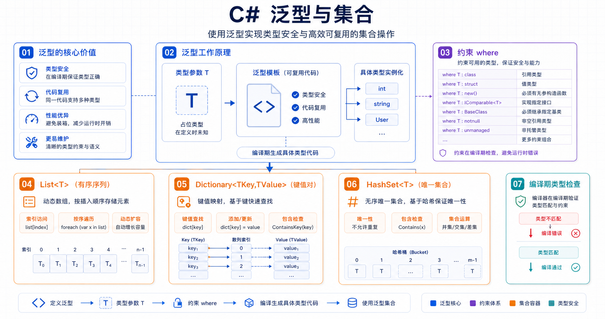

## 概述

泛型允许编写适用于任何类型的代码，同时保持完整的类型安全性。本文将详细介绍泛型类型、泛型方法、类型约束，以及常用的泛型集合。



### 泛型的优势

| 优势         | 说明                   |
| ------------ | ---------------------- |
| **类型安全** | 编译时检查类型错误     |
| **性能优化** | 避免装箱和拆箱操作     |
| **代码复用** | 一套代码适用于多种类型 |
| **可读性**   | 代码更清晰、更易维护   |

---

## 泛型类型参数

### 什么是泛型

泛型通过类型参数（通常用 `T` 表示）来编写可重用的代码：

```csharp
// 非泛型 - 需要为每种类型编写不同代码
class IntStack
{
    private int[] _items;
    public void Push(int item) { /* ... */ }
}

class StringStack
{
    private string[] _items;
    public void Push(string item) { /* ... */ }
}

// 泛型 - 一套代码适用于所有类型
class Stack<T>
{
    private T[] _items;
    public void Push(T item) { /* ... */ }
}
```

### 使用泛型类型

```csharp
// 创建整数栈
var intStack = new Stack<int>();
intStack.Push(1);
intStack.Push(2);

// 创建字符串栈
var stringStack = new Stack<string>();
stringStack.Push("Hello");
stringStack.Push("World");

// 创建自定义类型栈
var personStack = new Stack<Person>();
personStack.Push(new Person("Alice", 25));
```

---

## 泛型方法

### 基本语法

泛型方法声明自己的类型参数：

```csharp
// 泛型方法
static void Print<T>(T value)
{
    Console.WriteLine($"Value: {value}");
}

// 编译器自动推断类型
Print(42);           // T 推断为 int
Print("Hello");       // T 推断为 string
Print(3.14);          // T 推断为 double
```

### 多个类型参数

```csharp
// 多个类型参数
static TReturn Execute<TInput, TReturn>(TInput input, Func<TInput, TReturn> transform)
{
    return transform(input);
}

// 使用
var result = Execute("Hello", s => s.ToUpper());  // HELLO
var num = Execute(5, n => n * n);                 // 25
```

### 带约束的泛型方法

```csharp
// 要求 T 实现 IComparable<T>
static T Max<T>(T a, T b) where T : IComparable<T>
{
    return a.CompareTo(b) >= 0 ? a : b;
}

Console.WriteLine(Max(3, 7));              // 7
Console.WriteLine(Max("apple", "banana")); // banana
```

---

## 类型约束

### 常用约束

| 约束                   | 说明                       |
| ---------------------- | -------------------------- |
| `where T : class`      | T 必须是引用类型           |
| `where T : struct`     | T 必须是值类型             |
| `where T : new()`      | T 必须有公共无参数构造函数 |
| `where T : BaseClass`  | T 必须派生自 BaseClass     |
| `where T : IInterface` | T 必须实现 IInterface      |

### 约束示例

```csharp
// 必须有默认构造函数
static T CreateDefault<T>() where T : new()
{
    return new T();
}

// 必须实现接口
static decimal Sum<T>(IEnumerable<T> items) where T : INumber<T>
{
    return items.Sum();
}

// 必须派生自某个类
static void Save<T>(T entity) where T : BaseEntity
{
    entity.Save();
}

// 组合多个约束
class Factory<T> where T : class, new()
{
    public T Create()
    {
        return new T();
    }
}
```

### 少见约束

```csharp
// 必须是枚举类型
static T EnumToString<T>() where T : Enum
{
    return default;
}

// 必须是委托类型
static void InvokeDelegate<T>(T del) where T : Delegate
{
    del.DynamicInvoke();
}

// 必须是非托管类型
static unsafe void* ToPointer<T>(T value) where T : unmanaged
{
    return &value;
}
```

---

## 泛型集合

### 集合类型概览

| 集合                       | 特点             | 适用场景     |
| -------------------------- | ---------------- | ------------ |
| `List<T>`                  | 动态数组、有索引 | 需要随机访问 |
| `Dictionary<TKey, TValue>` | 键值对、键唯一   | 需要按键查找 |
| `HashSet<T>`               | 不重复、无序     | 需要去重     |
| `Queue<T>`                 | 先进先出         | 任务队列     |
| `Stack<T>`                 | 先进后出         | 撤销操作     |
| `LinkedList<T>`            | 双向链表         | 频繁插入删除 |

---

## List<T> 详解

### 创建和初始化

```csharp
// 创建空列表
var list1 = new List<int>();

// 创建带初始容量
var list2 = new List<int>(100);

// 从集合初始化
var list3 = new List<int> { 1, 2, 3, 4, 5 };

// C# 12 简写
List<string> names = ["Alice", "Bob", "Charlie"];
```

### 添加元素

```csharp
var list = new List<int>();

list.Add(1);        // 添加单个元素
list.Add(2);

list.AddRange(new[] { 3, 4, 5 });  // 添加多个元素

list.Insert(0, 0);  // 在指定位置插入
list.InsertRange(2, new[] { 1, 2 });  // 批量插入
```

### 访问元素

```csharp
var list = new List<int> { 10, 20, 30, 40, 50 };

Console.WriteLine(list[0]);   // 第一个元素
Console.WriteLine(list[^1]);  // 最后一个元素 (C# 8+)
Console.WriteLine(list.Count); // 元素个数

// 遍历
foreach (var item in list)
{
    Console.WriteLine(item);
}
```

### 查找元素

```csharp
var list = new List<int> { 1, 2, 3, 4, 5 };

// 是否包含
bool has3 = list.Contains(3);  // true

// 查找位置
int index = list.IndexOf(3);   // 2
int lastIndex = list.LastIndexOf(3);  // 2

// 条件查找
int firstEven = list.Find(n => n % 2 == 0);  // 2
List<int> allEven = list.FindAll(n => n % 2 == 0);  // [2, 4]

// 查找索引
int firstEvenIndex = list.FindIndex(n => n % 2 == 0);  // 1
```

### 删除元素

```csharp
var list = new List<int> { 1, 2, 3, 2, 4, 2 };

list.Remove(2);       // 删除第一个匹配的 2
list.RemoveAt(0);     // 删除指定索引的元素
list.RemoveRange(0, 2);  // 删除范围内元素
list.RemoveAll(n => n == 2);  // 删除所有匹配的
list.Clear();         // 清空所有元素
```

### 排序和搜索

```csharp
var list = new List<int> { 3, 1, 4, 1, 5, 9, 2, 6 };

list.Sort();          // 升序排序
list.Reverse();      // 反转顺序

// 自定义排序
list.Sort((a, b) => b.CompareTo(a));  // 降序

// 二分查找（需要已排序）
int idx = list.BinarySearch(5);  // 查找 5 的位置
```

### 其他方法

```csharp
var list = new List<int> { 1, 2, 3, 4, 5 };

// 转换所有元素
List<string> strNums = list.ConvertAll(n => n.ToString());
// 结果: ["1", "2", "3", "4", "5"]

// 判断是否存在
bool hasEven = list.Exists(n => n % 2 == 0);  // true
bool hasNegative = list.Exists(n => n < 0);   // false

// 判断所有元素
bool allPositive = list.TrueForAll(n => n > 0);  // true

// 转换为数组
int[] array = list.ToArray();

// 获取子列表
var sub = list.GetRange(1, 3);  // 从索引1开始取3个元素
// 结果: [2, 3, 4]
```

### 遍历时修改

```csharp
var list = new List<int> { 1, 2, 3, 4, 5 };

// ❌ 错误：foreach 中直接修改
foreach (var n in list)
{
    if (n > 3) list.Remove(n);
}

// ✅ 正确：倒序遍历
for (int i = list.Count - 1; i >= 0; i--)
{
    if (list[i] > 3) list.RemoveAt(i);
}

// ✅ 正确：使用 RemoveAll
list.RemoveAll(n => n > 3);
```

---

## Dictionary<TKey, TValue> 详解

### 创建和初始化

```csharp
// 创建空字典
var dict1 = new Dictionary<string, int>();

// 创建带初始数据
var dict2 = new Dictionary<string, int>
{
    ["Alice"] = 90,
    ["Bob"] = 85,
    ["Charlie"] = 92
};

// 使用对象初始化器
var dict3 = new Dictionary<string, int>
{
    { "Alice", 90 },
    { "Bob", 85 }
};
```

### 添加和访问

```csharp
var dict = new Dictionary<string, int>
{
    ["Alice"] = 90,
    ["Bob"] = 85
};

// 添加
dict["Charlie"] = 92;
dict.Add("Diana", 88);

// 访问
int aliceScore = dict["Alice"];
Console.WriteLine(aliceScore);  // 90

// 安全访问
bool found = dict.TryGetValue("Bob", out int score);
Console.WriteLine(score);  // 85

// 遍历
foreach (var kvp in dict)
{
    Console.WriteLine($"{kvp.Key}: {kvp.Value}");
}
```

### 常用操作

```csharp
var dict = new Dictionary<string, int>
{
    ["Alice"] = 90,
    ["Bob"] = 85,
    ["Charlie"] = 92
};

// 是否包含
bool hasAlice = dict.ContainsKey("Alice");
bool has90 = dict.ContainsValue(90);

// 删除
dict.Remove("Bob");

// 清空
dict.Clear();

// 统计
int count = dict.Count;
```

### 高级用法

```csharp
var dict = new Dictionary<string, int>
{
    ["Alice"] = 90,
    ["Bob"] = 85,
    ["Charlie"] = 92
};

// 获取所有键
foreach (var key in dict.Keys)
{
    Console.WriteLine(key);
}

// 获取所有值
foreach (var value in dict.Values)
{
    Console.WriteLine(value);
}

// 合并字典
var defaults = new Dictionary<string, int>
{
    ["Timeout"] = 30,
    ["Retries"] = 3
};

var overrides = new Dictionary<string, int>
{
    ["Timeout"] = 60
};

var config = new Dictionary<string, int>(defaults);
foreach (var kvp in overrides)
{
    config[kvp.Key] = kvp.Value;
}
```

---

### 语法演进对比

C# 在不同版本中逐步简化了字典的初始化语法：

```csharp
// C# 2.0（2005）- 手动 Add
Dictionary<string, int> dict = new Dictionary<string, int>();
dict.Add("Alice", 90);
dict.Add("Bob", 85);

// C# 3.0（2007）- 集合初始化器
var dict = new Dictionary<string, int>
{
    { "Alice", 90 },
    { "Bob", 85 }
};

// C# 6.0（2015）- 索引初始化器
var dict = new Dictionary<string, int>
{
    ["Alice"] = 90,
    ["Bob"] = 85
};

// C# 12（2023）- 集合表达式
Dictionary<string, int> dict = ["Alice": 90, "Bob": 85];
```

| 语法         | 示例                     | 底层调用     | 重复键处理               |
| ------------ | ------------------------ | ------------ | ------------------------ |
| 索引初始化器 | `["key"] = value`        | 索引器 `set` | 覆盖已有值               |
| 集合初始化器 | `{ "key", value }`       | `Add` 方法   | 抛出 `ArgumentException` |
| 构造后赋值   | `dict["key"] = value`    | 索引器 `set` | 覆盖已有值               |
| `Add` 方法   | `dict.Add("key", value)` | `Add` 方法   | 抛出 `ArgumentException` |

### 选择建议

| 场景             | 推荐语法                        | 原因                           |
| ---------------- | ------------------------------- | ------------------------------ |
| 需要覆盖已有数据 | 索引初始化器 `["key"] = value`  | 自动覆盖，不抛异常             |
| 需要唯一性保证   | 集合初始化器 `{ "key", value }` | 重复键时抛出异常，提前发现错误 |
| 从外部加载配置   | 索引初始化器                    | 支持覆盖，更灵活               |
| 初始化固定常量   | 集合初始化器                    | 防止意外重复键                 |

---

## HashSet<T> 详解

### 基本用法

```csharp
// 创建 HashSet
var set = new HashSet<int> { 1, 2, 3, 4, 5 };

// 添加
set.Add(6);
set.Add(1);  // 重复，不会添加

Console.WriteLine(set.Count);  // 6

// 是否包含
bool has3 = set.Contains(3);  // true
```

### 集合操作

```csharp
var set1 = new HashSet<int> { 1, 2, 3, 4 };
var set2 = new HashSet<int> { 3, 4, 5, 6 };

// 并集
var union = new HashSet<int>(set1);
union.UnionWith(set2);  // { 1, 2, 3, 4, 5, 6 }

// 交集
var intersect = new HashSet<int>(set1);
intersect.IntersectWith(set2);  // { 3, 4 }

// 差集
var except = new HashSet<int>(set1);
except.ExceptWith(set2);  // { 1, 2 }

// 对称差集
var symmetric = new HashSet<int>(set1);
symmetric.SymmetricExceptWith(set2);  // { 1, 2, 5, 6 }

// 子集判断
bool isSubset = set1.IsSubsetOf(union);  // true
bool isSuperset = union.IsSupersetOf(set1);  // true
```

---

## LinkedList<T> 详解

### 双向链表

LinkedList 是双向链表，适合频繁插入删除的场景：

```csharp
var linked = new LinkedList<int>();

// 添加节点
linked.AddFirst(1);      // 头部添加
linked.AddLast(5);      // 尾部添加
linked.AddAfter(linked.First!, 2);  // 在首节点后添加
linked.AddBefore(linked.Last!, 4);  // 在尾节点前添加

// 结果: 1 → 2 → 4 → 5
```

> **关于 `!`（空条件抑制运算符）**
>
> `linked.First!` 和 `linked.Last!` 中的 `!` 是 C# 8.0+ 的**空条件抑制运算符**（Null-forgiving operator）。`LinkedList<T>.First` 和 `LinkedList<T>.Last` 的类型是 `LinkedListNode<T>?`（可空），但实际业务中调用 `AddAfter`/`AddBefore` 时通常已知列表非空，因此用 `!` 告诉编译器："我确信这里不会是 null，请当作非空处理"。如果省略 `!`，需要写成空值判断：`if (linked.First != null) { linked.AddAfter(linked.First, 2); }`。`!` 仅用于可空引用类型的上下文中，不改变运行时行为。

### 遍历和访问

```csharp
var linked = new LinkedList<string>();
linked.AddLast("A");
linked.AddLast("B");
linked.AddLast("C");

// 正向遍历
for (LinkedListNode<string>? node = linked.First; node != null; node = node.Next)
{
    Console.WriteLine(node.Value);
}

// 反向遍历
for (LinkedListNode<string>? node = linked.Last; node != null; node = node.Previous)
{
    Console.WriteLine(node.Value);
}

// 直接访问
Console.WriteLine(linked.First?.Value);   // 第一个: "A"
Console.WriteLine(linked.Last?.Value);    // 最后一个: "C"
Console.WriteLine(linked.Count);          // 元素个数: 3
```

### 插入和删除

```csharp
var linked = new LinkedList<int>(new[] { 1, 3, 5 });

// 插入节点
var node2 = linked.Find(3);
linked.AddAfter(node2!, 4);   // 在 3 后插入 4

var node4 = linked.Find(4);
linked.AddBefore(node4!, 2);  // 在 4 前插入 2

// 删除节点
linked.Remove(3);             // 删除值 3
linked.RemoveFirst();        // 删除第一个
linked.RemoveLast();         // 删除最后一个
linked.Clear();              // 清空所有

// 结果: 1 → 2 → 4 → 5
```

### 适用场景

| 场景                 | 说明                       |
| -------------------- | -------------------------- |
| **频繁插入删除**     | O(1) 时间复杂度            |
| **不需要随机访问**   | 只能顺序遍历               |
| **实现其他数据结构** | 如栈、队列、双端队列       |
| **迭代时需要删除**   | 安全地在迭代中删除当前节点 |

---

## Queue<T> 详解

### 先进先出集合

```csharp
var queue = new Queue<int>();

// 入队
queue.Enqueue(1);
queue.Enqueue(2);
queue.Enqueue(3);

// 查看队首
int first = queue.Peek();  // 1

// 出队
int item = queue.Dequeue();  // 1
item = queue.Dequeue();       // 2

// 遍历
foreach (var item in queue)
{
    Console.WriteLine(item);
}
```

---

## Stack<T> 详解

### 先进后出集合

```csharp
var stack = new Stack<int>();

// 压栈
stack.Push(1);
stack.Push(2);
stack.Push(3);

// 查看栈顶
int top = stack.Peek();  // 3

// 弹栈
int item = stack.Pop();  // 3
item = stack.Pop();      // 2

// 遍历
foreach (var item in stack)
{
    Console.WriteLine(item);
}
```

---

## 协变和逆变

### 先理解继承关系

协变和逆变的前提是类型之间有继承关系。先看一个类层次：

```csharp
public class Animal
{
    public string Name => "动物";
}

public class Dog : Animal  // Dog 继承自 Animal
{
    public string Name => "狗";
}
```

在这个关系中，`Dog` 是"更具体"的类型，`Animal` 是"更一般"的类型。

### 协变 (out) — "只出不进"

**协变**用 `out` 关键字修饰，用于**输出**场景（如返回值）。它允许把"更具体"的泛型赋值给"更一般"的泛型。

通俗理解：**"狗"是"动物"，所以装"狗"的容器可以当成装"动物"的容器来用。**

```csharp
// 创建一个装 Dog 的列表
IEnumerable<Dog> dogs = new List<Dog> { new Dog() };

// dogs 是装"狗"的容器
// IEnumerable<Animal> 是装"动物"的容器
// 装"狗"的容器 → 可以当作装"动物"的容器（协变）
IEnumerable<Animal> animals = dogs;  // ✅ 允许！

// 解释：dogs 里每个元素都是 Dog，Dog 是 Animal 的子类，
//       所以把 dogs 当作 animals 用，完全安全，不会出乱子。
```

`Func<TResult>` 也是协变的——它只能**产出** `TResult`，所以可以把产出"狗"的函数当成产出"动物"的函数：

```csharp
// 一个返回 Dog 的函数
Func<Dog> dogFunc = () => new Dog();

// Func<Animal> 表示一个返回"动物"的函数
// 返回"狗"的函数 → 可以当作返回"动物"的函数（协变）
Func<Animal> animalFunc = dogFunc;  // ✅ 允许！

// 解释：dogFunc 返回 Dog，Dog 肯定是 Animal，所以当 animalFunc 用完全没问题。
```

### 逆变 (in) — "只进不出"

**逆变**用 `in` 关键字修饰，用于**输入**场景（如参数）。它允许把"更一般"的泛型赋值给"更具体"的泛型。

通俗理解：**如果一个方法接受"动物"，那它肯定也能接受"狗"，因为"狗"就是"动物"。**

```csharp
// 一个接受 Animal 参数的 lambda
Action<Animal> printAnimal = animal =>
{
    Console.WriteLine(animal.Name);
};

// Action<Dog> 表示接受"狗"的方法
// 接受"动物"的方法 → 可以当作接受"狗"的方法（逆变）
Action<Dog> printDog = printAnimal;  // ✅ 允许！

printDog(new Dog());  // 调用时会当作 Animal 处理

// 解释：printAnimal 接受 Animal，什么动物都行，当然也能接受 Dog。
//       所以把它当 printDog 用完全安全。
```

### 对比总结

| 类型 | 方向        | 场景                            | `out`/`in` |
| ---- | ----------- | ------------------------------- | ---------- |
| 协变 | 具体 → 一般 | 返回值、只读的 `IEnumerable<T>` | `out T`    |
| 逆变 | 一般 → 具体 | 参数、只写的 `Action<T>`        | `in T`     |

> **记忆技巧**
>
> - **协变（out）**：产出者（Producer），用 `out`。"产出的东西"可以用更宽泛的类型接收。
> - **逆变（in）**：消费者（Consumer），用 `in`。"接受的东西"可以用更具体的类型表示。

### 自定义协变和逆变接口

```csharp
// 定义一个只生产 T 的接口，用 out 标记为协变
public interface IProducer<out T>
{
    T Produce();  // T 是"产出"的，所以用 out
}

// 定义一个只消费 T 的接口，用 in 标记为逆变
public interface IConsumer<in T>
{
    void Consume(T item);  // T 是"消耗"的，所以用 in
}

// 使用 IProducer
IProducer<Dog> dogProducer = () => new Dog();

// IProducer<Animal> 是"更一般"的接口，IProducer<Dog> 是"更具体"的
// 生产"狗"的 producer → 可以当作生产"动物"的 producer（协变）
IProducer<Animal> animalProducer = dogProducer;  // ✅

// 使用 IConsumer
IConsumer<Animal> animalConsumer = animal => Console.WriteLine(animal);

// IConsumer<Dog> 是"更具体"的接口，IConsumer<Animal> 是"更一般"的
// 接受"动物"的 consumer → 可以当作接受"狗"的 consumer（逆变）
IConsumer<Dog> dogConsumer = animalConsumer;  // ✅
```

---

## 集合表达式 (C# 12)

### 基本语法

```csharp
// 创建列表
List<int> numbers = [1, 2, 3, 4, 5];

// 创建数组
int[] array = [1, 2, 3];

// 范围操作符
var first = numbers[..3];   // 前3个
var last = numbers[^2..];   // 后2个
```

### 展开操作符

```csharp
var first = new List<int> { 1, 2, 3 };
var second = new List<int> { 4, 5, 6 };

// 合并列表
var combined = [.. first, .. second];
Console.WriteLine(string.Join(", ", combined));  // 1, 2, 3, 4, 5, 6

// 带额外元素
var withExtras = [0, .. first, 99, .. second];
```

---

## 实用示例

### 示例1：单词频率统计

```csharp
string text = "hello world hello C# hello";
var words = text.Split(' ');

var wordCounts = new Dictionary<string, int>();
foreach (var word in words)
{
    if (wordCounts.ContainsKey(word))
        wordCounts[word]++;
    else
        wordCounts[word] = 1;
}

// 使用 GetValueOrDefault 简化
var counts = new Dictionary<string, int>();
foreach (var word in words)
{
    counts[word] = counts.GetValueOrDefault(word) + 1;
}
```

### 示例2：分组统计

```csharp
var students = new[]
{
    new { Name = "Alice", Class = "A", Score = 90 },
    new { Name = "Bob", Class = "B", Score = 85 },
    new { Name = "Charlie", Class = "A", Score = 92 },
    new { Name = "Diana", Class = "B", Score = 88 }
};

var byClass = new Dictionary<string, List<int>>();
foreach (var s in students)
{
    if (!byClass.ContainsKey(s.Class))
        byClass[s.Class] = new List<int>();
    byClass[s.Class].Add(s.Score);
}

// 计算各班平均分
foreach (var kvp in byClass)
{
    double avg = kvp.Value.Average();
    Console.WriteLine($"Class {kvp.Key}: {avg:F2}");
}
```

### 示例3：LRU 缓存

```csharp
public class LRUCache<TKey, TValue> where TKey : notnull
{
    private readonly int _capacity;
    private readonly Dictionary<TKey, TValue> _cache;
    private readonly Queue<TKey> _order;

    public LRUCache(int capacity)
    {
        _capacity = capacity;
        _cache = new Dictionary<TKey, TValue>(capacity);
        _order = new Queue<TKey>();
    }

    public TValue Get(TKey key)
    {
        if (_cache.TryGetValue(key, out var value))
        {
            // 重新排序
            var newOrder = new Queue<TKey>();
            while (_order.Count > 0)
            {
                var k = _order.Dequeue();
                if (!k?.Equals(key) == true)
                    newOrder.Enqueue(k);
            }
            newOrder.Enqueue(key);
            _order = newOrder;
            return value;
        }
        throw new KeyNotFoundException();
    }

    public void Put(TKey key, TValue value)
    {
        if (_cache.Count >= _capacity && !_cache.ContainsKey(key))
        {
            var removed = _order.Dequeue();
            _cache.Remove(removed);
        }
        _cache[key] = value;
        _order.Enqueue(key);
    }
}
```

---

## 常见错误

### 1. 类型不匹配

```csharp
List<int> intList = new List<int>();
List<object> objList = intList;  // ❌ 编译错误
```

### 2. 约束不足

```csharp
static T Max<T>(T a, T b)
{
    return a > b ? a : b;  // ❌ T 不一定能比较
}

// ✅ 正确：添加约束
static T Max<T>(T a, T b) where T : IComparable<T>
{
    return a.CompareTo(b) >= 0 ? a : b;
}
```

### 3. 修改集合时遍历

```csharp
var list = new List<int> { 1, 2, 3, 4, 5 };

// ❌ 错误：遍历时修改
foreach (var n in list)
{
    if (n > 3)
        list.Remove(n);
}

// ✅ 正确：倒序遍历
for (int i = list.Count - 1; i >= 0; i--)
{
    if (list[i] > 3)
        list.RemoveAt(i);
}

// ✅ 正确：使用 RemoveAll
list.RemoveAll(n => n > 3);
```

---

## 总结

| 集合                       | 特点               |
| -------------------------- | ------------------ |
| `List<T>`                  | 动态数组，支持索引 |
| `Dictionary<TKey, TValue>` | 键值对映射         |
| `HashSet<T>`               | 不重复集合         |
| `Queue<T>`                 | 先进先出           |
| `Stack<T>`                 | 先进后出           |
| **泛型约束**               | 限制类型参数的能力 |

---

## 相关资源

- [泛型文档](https://learn.microsoft.com/zh-cn/dotnet/csharp/fundamentals/types/generics)
- [集合概述](https://learn.microsoft.com/zh-cn/dotnet/csharp/tutorials/working-with-linq)
- [.NET 集合](https://learn.microsoft.com/zh-cn/dotnet/standard/collections/)
