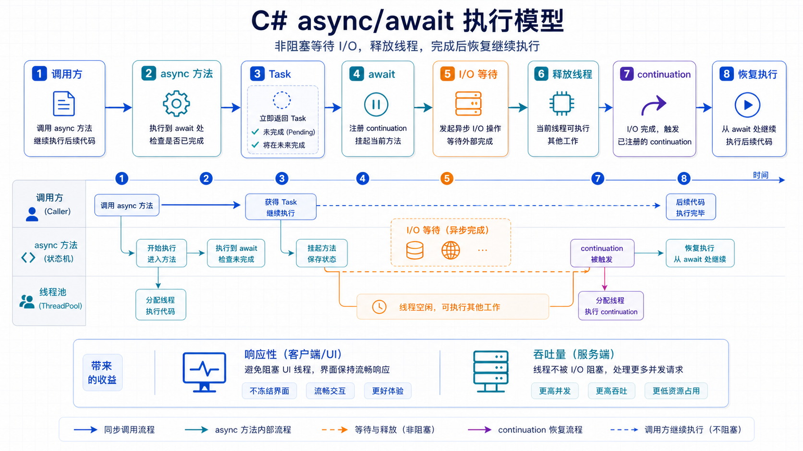

## 概述

异步编程是现代 C# 开发的核心技能之一。它允许程序在等待长时间操作（如 I/O 操作）时继续执行其他任务，从而提高应用程序的响应性和吞吐量。



### 异步编程的优势

| 优势         | 说明                                   |
| ------------ | -------------------------------------- |
| **响应性**   | UI 应用程序不冻结，用户体验更好        |
| **效率**     | 更好地利用系统资源                     |
| **可扩展性** | 用更少的线程处理更多请求               |
| **简洁**     | async/await 让异步代码看起来像同步代码 |

---

## async 和 await 关键字

### 基本概念

`async` 和 `await` 是 C# 中用于编写异步代码的关键字：

```csharp
// 同步方法
string GetWebPage(string url)
{
    var client = new HttpClient();
    return client.GetStringAsync(url).Result;
}

// 异步方法
async Task<string> GetWebPageAsync(string url)
{
    var client = new HttpClient();
    return await client.GetStringAsync(url);
}
```

### async 方法规则

1. 方法必须返回 `Task`、`Task<T>` 或 `void`
2. 方法内必须包含至少一个 `await` 表达式
3. `async` 关键字只是编译器标志，不影响方法签名

```csharp
// 正确的返回类型
async Task<string> Method1() { }
async Task Method2() { }
async void Method3() { }  // 仅限事件处理

// 错误的返回类型
async string Method4() { }  // ❌ 编译错误
```

---

## Task 和 Task<T>

### Task 简介

`Task` 表示一个异步操作：

```csharp
// 创建并启动 Task
Task task = Task.Run(() =>
{
    Console.WriteLine("后台任务执行中...");
    Thread.Sleep(1000);
});

// 等待 Task 完成
await task;
Console.WriteLine("任务完成！");
```

### Task<T> 返回值

`Task<T>` 表示返回 `T` 类型的异步操作：

```csharp
// 返回 string 的异步方法
async Task<string> DownloadStringAsync(string url)
{
    using var client = new HttpClient();
    string content = await client.GetStringAsync(url);
    return content;
}

// 调用异步方法
var result = await DownloadStringAsync("https://example.com");
Console.WriteLine($"下载了 {result.Length} 个字符");
```

### Task 状态

```csharp
Task<string> task = Task.Run(() =>
{
    Thread.Sleep(1000);
    return "完成";
});

Console.WriteLine(task.Status);  // Running

await task;

Console.WriteLine(task.Status);  // RanToCompletion
Console.WriteLine(task.Result); // 完成
```

---

## 创建异步方法

### 基本模式

```csharp
// 标准异步方法模式
public async Task<MyResult> DoSomethingAsync()
{
    // 1. 可能需要的准备工作

    // 2. 调用异步操作
    var result = await SomeAsyncOperation();

    // 3. 处理结果
    var processed = Process(result);

    // 4. 返回结果
    return processed;
}
```

### 异步操作示例

```csharp
// 异步文件读取
async Task<string> ReadFileAsync(string path)
{
    using var reader = new StreamReader(path);
    return await reader.ReadToEndAsync();
}

// 异步 HTTP 请求
async Task<User> GetUserAsync(int id)
{
    using var client = new HttpClient();
    var response = await client.GetAsync($"https://api.example.com/users/{id}");
    response.EnsureSuccessStatusCode();
    return await response.Content.ReadAsAsync<User>();
}

// 异步数据库查询
async Task<List<Product>> GetProductsAsync()
{
    var products = new List<Product>();
    using var connection = new SqlConnection(connectionString);
    await connection.OpenAsync();

    using var command = new SqlCommand("SELECT * FROM Products", connection);
    using var reader = await command.ExecuteReaderAsync();

    while (await reader.ReadAsync())
    {
        products.Add(new Product
        {
            Id = reader.GetInt32(0),
            Name = reader.GetString(1)
        });
    }

    return products;
}
```

---

## 并行执行多个异步任务

### 同时启动多个任务

```csharp
// 同时下载多个网页
async Task<List<string>> DownloadAllAsync(string[] urls)
{
    using var client = new HttpClient();

    var tasks = urls.Select(url => client.GetStringAsync(url));
    string[] results = await Task.WhenAll(tasks);

    return results.ToList();
}
```

### Task.WhenAll

等待所有任务完成：

```csharp
async Task ProcessAllAsync()
{
    var task1 = DoSomethingAsync();
    var task2 = DoAnotherAsync();
    var task3 = DoMoreAsync();

    // 等待所有任务完成
    await Task.WhenAll(task1, task2, task3);

    // 获取结果
    var result1 = await task1;
    var result2 = await task2;
    var result3 = await task3;
}
```

### Task.WhenAny

等待任一任务完成：

```csharp
async Task<string> GetFirstResultAsync()
{
    var task1 = SlowOperationAsync();
    var task2 = AnotherSlowOperationAsync();

    // 等待第一个完成的
    var completed = await Task.WhenAny(task1, task2);

    return await completed;
}
```

### 顺序 vs 并行

```csharp
// 顺序执行 - 慢
async Task SequentialAsync()
{
    await Operation1Async();  // 1秒
    await Operation2Async();  // 1秒
    await Operation3Async();  // 1秒
    // 总计: 3秒
}

// 并行执行 - 快
async Task ParallelAsync()
{
    var task1 = Operation1Async();
    var task2 = Operation2Async();
    var task3 = Operation3Async();

    await Task.WhenAll(task1, task2, task3);
    // 总计: 1秒
}
```

---

## 异常处理

### 捕获单个异常

```csharp
async Task TryAsync()
{
    try
    {
        await RiskyOperationAsync();
    }
    catch (Exception ex)
    {
        Console.WriteLine($"发生错误: {ex.Message}");
    }
}
```

### 捕获多个异常

```csharp
async Task MultiExceptionAsync()
{
    var task1 = Operation1Async();
    var task2 = Operation2Async();
    var task3 = Operation3Async();

    try
    {
        await Task.WhenAll(task1, task2, task3);
    }
    catch (Exception)
    {
        // 收集所有异常
        var exceptions = new List<Exception>();

        if (task1.IsFaulted)
            exceptions.Add(task1.Exception!);
        if (task2.IsFaulted)
            exceptions.Add(task2.Exception!);
        if (task3.IsFaulted)
            exceptions.Add(task3.Exception!);

        foreach (var ex in exceptions)
        {
            Console.WriteLine($"异常: {ex.Message}");
        }
    }
}
```

### AggregateException

当多个任务同时失败时：

```csharp
try
{
    await Task.WhenAll(task1, task2, task3);
}
catch (Exception)
{
    if (task1.Exception != null)
    {
        foreach (var ex in task1.Exception.InnerExceptions)
        {
            Console.WriteLine($"任务1异常: {ex.Message}");
        }
    }
}
```

---

## 取消操作

### CancellationToken

```csharp
async Task DownloadWithCancelAsync(CancellationToken token)
{
    using var client = new HttpClient();

    try
    {
        // 传递 CancellationToken
        var response = await client.GetAsync(url, token);
        return await response.Content.ReadAsStringAsync();
    }
    catch (OperationCanceledException)
    {
        Console.WriteLine("操作被取消");
        throw;
    }
}

// 使用
var cts = new CancellationTokenSource();

try
{
    var task = DownloadWithCancelAsync(cts.Token);

    // 5秒后取消
    cts.CancelAfter(TimeSpan.FromSeconds(5));

    await task;
}
catch (OperationCanceledException)
{
    Console.WriteLine("下载已取消");
}
```

### CancellationTokenSource 选项

```csharp
// 手动取消
var cts = new CancellationTokenSource();
cts.Cancel();

// 定时取消
var cts = new CancellationTokenSource(TimeSpan.FromSeconds(30));

// 带超时取消
var cts = new CancellationTokenSource();
cts.CancelAfter(5000);
```

---

## async void 的使用

### 仅用于事件处理

```csharp
// ✅ 正确：事件处理器
private async void Button_Click(object sender, EventArgs e)
{
    try
    {
        await LoadDataAsync();
    }
    catch (Exception ex)
    {
        MessageBox.Show($"错误: {ex.Message}");
    }
}

// ❌ 错误：普通方法不应返回 void
private async void NormalMethod()  // 不要这样做！
{
    await DoSomethingAsync();
}
```

### 火焰事件

```csharp
public event Func<Task>? MyEvent;

protected async Task OnMyEventAsync()
{
    if (MyEvent != null)
    {
        foreach (var handler in MyEvent.GetInvocationList())
        {
            await ((Func<Task>)handler)();
        }
    }
}
```

---

## ConfigureAwait

### 避免上下文切换

```csharp
// 默认行为 - 返回到原始上下文
async Task DefaultBehaviorAsync()
{
    await OperationAsync();  // 可能切换回原始上下文
}

// 避免上下文切换 - 更好的性能
async Task OptimizedAsync()
{
    await OperationAsync().ConfigureAwait(false);  // 不切换上下文
}
```

### 使用场景

```csharp
// 库代码中使用 ConfigureAwait(false)
public async Task<string> GetDataAsync()
{
    using var client = new HttpClient();
    var response = await client.GetAsync(url).ConfigureAwait(false);
    return await response.Content.ReadAsStringAsync().ConfigureAwait(false);
}

// 应用代码中使用默认行为（需要 UI/ASP.NET 上下文）
private async void Button_Click(object sender, EventArgs e)
{
    var data = await GetDataAsync();  // 默认行为，更新 UI
    textBox.Text = data;  // 需要在 UI 线程
}
```

---

## 实用示例

### 示例1：异步文件处理

```csharp
public class FileProcessor
{
    public async Task ProcessFilesAsync(string[] filePaths, IProgress<int>? progress = null)
    {
        int processed = 0;

        foreach (var path in filePaths)
        {
            await ProcessFileAsync(path);
            processed++;
            progress?.Report(processed * 100 / filePaths.Length);
        }
    }

    private async Task ProcessFileAsync(string path)
    {
        // 读取文件
        string content = await File.ReadAllTextAsync(path);

        // 处理内容
        var processed = content.ToUpperInvariant();

        // 写入结果
        string resultPath = Path.ChangeExtension(path, ".processed.txt");
        await File.WriteAllTextAsync(resultPath, processed);
    }
}
```

### 示例2：带重试的异步操作

```csharp
public async Task<T> RetryAsync<T>(
    Func<Task<T>> operation,
    int maxRetries = 3,
    int delayMs = 1000)
{
    for (int i = 0; i < maxRetries; i++)
    {
        try
        {
            return await operation();
        }
        catch (Exception ex) when (i < maxRetries - 1)
        {
            Console.WriteLine($"重试 {i + 1}/{maxRetries}: {ex.Message}");
            await Task.Delay(delayMs * (i + 1));
        }
    }

    return await operation(); // 最后一次尝试
}

// 使用
var result = await RetryAsync(async () =>
{
    return await client.GetStringAsync(url);
});
```

### 示例3：超时处理

```csharp
public static async Task<T> WithTimeoutAsync<T>(Task<T> task, TimeSpan timeout)
{
    using var cts = new CancellationTokenSource(timeout);

    try
    {
        return await task.WaitAsync(cts.Token);
    }
    catch (OperationCanceledException)
    {
        throw new TimeoutException($"操作超时: {timeout}");
    }
}
```

---

## 常见错误

### 1. 忘记 await

```csharp
// ❌ 错误：没有等待
async Task WrongAsync()
{
    SomeAsyncOperation();  // 任务不会执行！
}

// ✅ 正确
async Task CorrectAsync()
{
    await SomeAsyncOperation();
}
```

### 2. 阻塞异步代码

```csharp
// ❌ 错误：使用 .Result 阻塞
async Task WrongAsync()
{
    var result = SomeAsyncOperation().Result;  // 死锁风险！
}

// ✅ 正确：使用 await
async Task CorrectAsync()
{
    var result = await SomeAsyncOperation();
}
```

### 3. async void 的陷阱

```csharp
// ❌ 错误：异常无法捕获
async void BadAsync()
{
    await RiskyOperationAsync();  // 如果这里抛异常，程序会崩溃
}

// ✅ 正确：使用 Task
async Task GoodAsync()
{
    try
    {
        await RiskyOperationAsync();
    }
    catch
    {
        // 异常可以被捕获
    }
}
```

### 4. 忘记 Dispose

```csharp
// ❌ 错误：资源泄漏
async Task WrongAsync()
{
    var client = new HttpClient();
    var content = await client.GetStringAsync(url);
    // client 没有被释放
}

// ✅ 正确：使用 using
async Task CorrectAsync()
{
    using var client = new HttpClient();
    var content = await client.GetStringAsync(url);
}
```

---

## 最佳实践

### 1. 优先返回 Task<T>

```csharp
// ✅ 好的：返回 Task<T>
async Task<string> GetDataAsync() { }

// ❌ 避免：返回 void
async void EventHandler(object sender, EventArgs e) { }
```

### 2. 使用 CancellationToken

```csharp
public async Task<IReadOnlyList<T>> GetItemsAsync(
    CancellationToken cancellationToken = default)
{
    var items = new List<T>();

    await foreach (var item in GetItemsAsync(cancellationToken))
    {
        cancellationToken.ThrowIfCancellationRequested();
        items.Add(item);
    }

    return items;
}
```

### 3. 避免过度异步

```csharp
// ❌ 过度使用
async Task<string> GetNameAsync() => await Task.FromResult("Alice");

// ✅ 简单操作不需要异步
string GetName() => "Alice";
```

### 4. 保持方法小而专注

```csharp
// ✅ 好的：方法职责单一
async Task<User> GetUserAsync(int id) { }
async Task<Order> GetOrderAsync(int userId) { }

// ❌ 不好的：方法过大
async Task DoEverythingAsync()
{
    // 太长的代码...
}
```

---

## 总结

| 概念                | 说明              |
| ------------------- | ----------------- |
| `async`             | 标记方法为异步    |
| `await`             | 等待异步操作完成  |
| `Task`              | 表示异步操作      |
| `Task<T>`           | 返回 T 的异步操作 |
| `Task.WhenAll`      | 等待所有任务      |
| `Task.WhenAny`      | 等待任一任务      |
| `CancellationToken` | 取消操作          |
| `ConfigureAwait`    | 控制上下文切换    |

---

## 相关资源

- [异步编程文档](https://learn.microsoft.com/zh-cn/dotnet/csharp/asynchronous-programming/)
- [Task 异步编程模型](https://learn.microsoft.com/zh-cn/dotnet/csharp/asynchronous-programming/task-asynchronous-programming-model)
- [异步最佳实践](https://learn.microsoft.com/zh-cn/dotnet/csharp/asynchronous-programming/async-samples)
