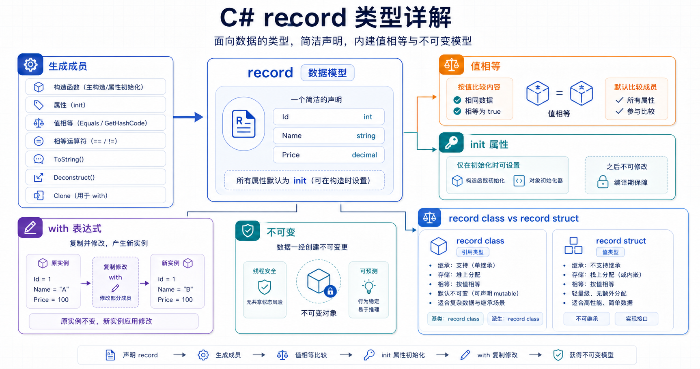

## 概述

记录（Record）是 C# 9 引入的一种新类型，它是一个**类或结构**，为数据模型提供特定的语法和行为。`record` 修饰符使编译器合成对主要角色存储数据的类型有用的成员，包括支持值相等的 `ToString()` 和成员重载。



## 什么时候使用 Record

在以下情况下，优先考虑使用记录而不是类或结构：

1. **需要值相等性**：当类型匹配且所有属性值都匹配时，两个记录变量相等
2. **需要不可变性**：防止对象实例化后修改属性值
3. **需要简洁的数据模型定义**：使用位置参数快速声明

## Record vs Class vs Struct

| 特性 | Class | Struct | Record |
|------|-------|--------|--------|
| 值相等性 | 引用相等 | 值相等 | 值相等 |
| 不可变性 | 支持但不强制 | 值类型，不共享 | 天然支持 |
| 语法简洁性 | 普通 | 普通 | 位置语法 |
| with 表达式 | 不支持 | 支持（可空） | 完整支持 |
| 继承 | 支持 | 不支持继承 | 支持继承 |

## 基础声明与实例化

### record class（引用类型记录）

```csharp
// 使用位置参数声明记录
public record Person(string FirstName, string LastName);

// 实例化方式
var person = new Person("张三", "李四");
Console.WriteLine(person);
// 输出: Person { FirstName = 张三, LastName = 李四 }
```

### record struct（值类型记录）

```csharp
// 位置记录结构
public readonly record struct DailyTemperature(double HighTemp, double LowTemp)
{
    // 可以添加计算属性
    public double Mean => (HighTemp + LowTemp) / 2.0;
}

// 实例化
var temp = new DailyTemperature(30.0, 20.0);
Console.WriteLine(temp.Mean);  // 输出: 25.0
```

### 普通声明（与 class 相同）

```csharp
// 使用传统属性语法声明记录
public record Person
{
    public string FirstName { get; init; }
    public string LastName { get; init; }
};

// 实例化
var person = new Person { FirstName = "张三", LastName = "李四" };
```

## 值相等性

### 与 Class 的对比

```csharp
// Class：引用相等
public class PersonClass
{
    public string Name { get; set; }
    public PersonClass(string name) => Name = name;
}

// Record：值相等
public record Person(string Name);

// 测试
var phoneNumbers = new string[2];
var class1 = new PersonClass("张三");
var class2 = new PersonClass("张三");

Console.WriteLine(class1 == class2);         // False（引用不相等）
Console.WriteLine(ReferenceEquals(class1, class2));  // False

var record1 = new Person("张三");
var record2 = new Person("张三");

Console.WriteLine(record1 == record2);         // True（值相等）
Console.WriteLine(ReferenceEquals(record1, record2)); // False
```

### 包含引用类型属性的记录

```csharp
public record Person(string Name, string[] PhoneNumbers);

// 两个记录引用同一个数组
var phones = new string[] { "123", "456" };
var person1 = new Person("张三", phones);
var person2 = new Person("张三", phones);

// 即使修改数组，两个记录仍然相等（因为数组引用相同）
Console.WriteLine(person1 == person2);  // True

// 修改 person1 的数组内容
person1.PhoneNumbers[0] = "999";
Console.WriteLine(person1 == person2);  // True（因为比较的是引用，不是内容）
```

## 不可变性与 with 表达式

### 不可变性基础

```csharp
// 使用 init 访问器确保不可变性
public record Person
{
    public string FirstName { get; init; }
    public string LastName { get; init; }
};

var person = new Person { FirstName = "张三", LastName = "李四" };
// person.FirstName = "王五";  // 编译错误！无法修改
```

### with 表达式创建修改副本

```csharp
public record Person(string FirstName, string LastName)
{
    public string[] PhoneNumbers { get; init; }
};

var person1 = new Person("张三", "李四") { PhoneNumbers = new[] { "123" } };

// 使用 with 创建修改后的副本（不改变原对象）
var person2 = person1 with { FirstName = "王五" };
Console.WriteLine(person2);
// 输出: Person { FirstName = 王五, LastName = 李四, PhoneNumbers = System.String[] }

// person1 保持不变
Console.WriteLine(person1.FirstName);  // 张三

// 修改嵌套属性
var person3 = person1 with { PhoneNumbers = new[] { "456" } };

// 创建完全相同的副本
var person4 = person1 with { };
Console.WriteLine(person1 == person4);  // True
```

## 位置语法与主构造函数

### 自动生成属性

```csharp
// 编译器自动为每个参数生成属性
public record Person(string FirstName, string LastName, int Age);

// 编译后等价于：
public class Person
{
    public string FirstName { get; init; }
    public string LastName { get; init; }
    public int Age { get; init; }
    
    public Person(string firstName, string lastName, int age)
    {
        FirstName = firstName;
        LastName = lastName;
        Age = age;
    }
}
```

### 位置记录结构的可变性

```csharp
// record struct：属性默认可变
public record struct Point(int X, int Y);

var point = new Point(1, 2);
point.X = 10;  // 可以修改！

// readonly record struct：属性不可变
public readonly record struct ReadOnlyPoint(int X, int Y);

var readOnlyPoint = new ReadOnlyPoint(1, 2);
// readOnlyPoint.X = 10;  // 编译错误！
```

## 继承

### 记录继承记录

```csharp
// 基记录
public abstract record Person(string Name, int Age);

// 派生记录
public record Student(string Name, int Age, int Grade) : Person(Name, Age);
public record Teacher(string Name, int Age, string Subject) : Person(Name, Age);

// 实例化
var student = new Student("张三", 15, 8);
var teacher = new Teacher("李老师", 35, "数学");

Console.WriteLine(student);
// 输出: Student { Name = 张三, Age = 15, Grade = 8 }
```

### 继承中的值相等性

```csharp
public record Person(string Name);
public record Student(string Name, int Grade) : Person(Name);

var p1 = new Person("张三");
var p2 = new Person("张三");
var s1 = new Student("张三", 5);
var s2 = new Student("张三", 5);

// 同一类型比较值
Console.WriteLine(p1 == p2);  // True
Console.WriteLine(s1 == s2);  // True

// 不同类型比较（即使基类属性相同）
Console.WriteLine(p1 == s1);  // False！
Console.WriteLine(s1 == p1);  // False！
```

### 继承中的 with 表达式

```csharp
public record Person(string Name, int Age);
public record Student(string Name, int Age, int Grade) : Person(Name, Age);

var student = new Student("张三", 15, 8);

// 在派生记录上使用 with
var olderStudent = student with { Age = 16 };

// 只能使用基记录中存在的属性进行修改
// var error = student with { Grade = 9 };  // 编译错误！
```

## ToString 重写

### 默认行为

```csharp
public record Point(int X, int Y);

var p = new Point(10, 20);
Console.WriteLine(p);
// 输出: Point { X = 10, Y = 20 }
```

### 自定义 PrintMembers

```csharp
public abstract record DegreeDays(double BaseTemperature)
{
    // 重写 PrintMembers 自定义输出格式
    protected virtual bool PrintMembers(StringBuilder builder)
    {
        builder.Append($"BaseTemperature = {BaseTemperature}");
        return true;
    }
}

public record HeatingDegreeDays(double BaseTemperature, double DegreeDaysValue) 
    : DegreeDays(BaseTemperature);

var hdd = new HeatingDegreeDays(65, 120);
Console.WriteLine(hdd);
// 输出: HeatingDegreeDays { BaseTemperature = 65, DegreeDaysValue = 120 }
```

## Deconstruct 解构

### 自动合成解构方法

```csharp
public record Person(string Name, int Age, string City);

var person = new Person("张三", 25, "北京");

// 使用 Deconstruct 解构
var (name, age, city) = person;
Console.WriteLine($"{name}, {age}岁, 住在{city}");
// 输出: 张三, 25岁, 住在北京

// 也可以只解构部分属性
var (nameOnly, _) = person;
```

## 实际应用场景

### 1. DTO / 数据传输对象

```csharp
// 简洁的 DTO 定义
public record UserDto(int Id, string Name, string Email, DateTime CreatedAt);

// 使用 with 创建更新副本
var updatedUser = originalUser with { Email = "new@email.com" };
```

### 2. 不可变配置

```csharp
// 配置类
public record AppSettings
{
    public string ConnectionString { get; init; }
    public int MaxRetries { get; init; }
    public bool EnableLogging { get; init; }
}

// 使用 with 创建修改后的配置
var devSettings = baseSettings with 
{ 
    EnableLogging = true,
    ConnectionString = "dev-connection-string"
};
```

### 3. 层次结构数据建模

```csharp
// 基础记录
public abstract record DegreeDays(double BaseTemperature);

// 派生记录
public sealed record HeatingDegreeDays(double BaseTemperature, double Degrees) 
    : DegreeDays(BaseTemperature);

public sealed record CoolingDegreeDays(double BaseTemperature, double Degrees) 
    : DegreeDays(BaseTemperature);

// 使用
var heating = new HeatingDegreeDays(65, 120);
var cooling = new CoolingDegreeDays(65, 50);
```

## 总结

| 特性 | 说明 |
|------|------|
| 值相等性 | 两个记录的所有属性值相等时，记录相等 |
| 不可变性 | 使用 `init` 访问器或 `readonly` |
| with 表达式 | 创建修改后的副本 |
| 位置语法 | 简洁的数据模型声明 |
| ToString | 自动生成格式化输出 |
| Deconstruct | 自动合成解构方法 |
| 继承 | 支持从一个记录继承到另一个记录 |

## 相关资源

- [C# 记录类型简介](https://learn.microsoft.com/zh-cn/dotnet/csharp/fundamentals/types/records)
- [记录类型（C# 参考）](https://learn.microsoft.com/zh-cn/dotnet/csharp/language-reference/builtin-types/record)
- [教程：使用记录类型](https://learn.microsoft.com/zh-cn/dotnet/csharp/whats-new/tutorials/records)
