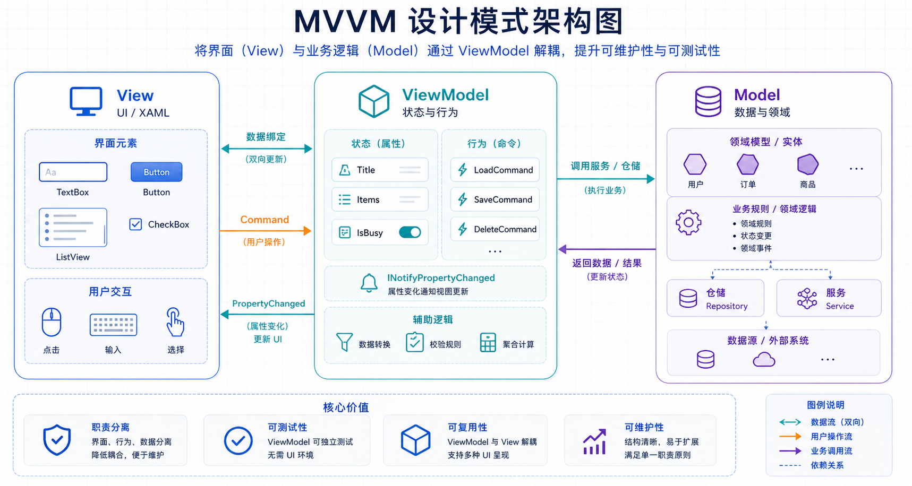

## 概述

MVVM（Model-View-ViewModel）是一种软件架构模式，广泛应用于 WPF、Xamarin、Avalonia UI 等 XAML 技术的桌面和移动应用开发中。MVVM 模式的核心思想是将用户界面（View）与业务逻辑（ViewModel）分离，通过数据绑定实现 UI 与逻辑的解耦。



### MVVM 的核心价值

| 价值         | 说明                                             |
| ------------ | ------------------------------------------------ |
| **职责分离** | View 负责 UI，ViewModel 负责逻辑，Model 负责数据 |
| **可测试性** | ViewModel 可独立于 UI 进行单元测试               |
| **可维护性** | 代码结构清晰，修改 UI 不影响逻辑                 |
| **团队协作** | 设计器与开发者可以并行工作                       |
| **数据绑定** | 自动同步 View 和 ViewModel 的数据                |

---

## MVVM 三层架构

### 架构图

```
┌─────────────────────────────────────────────────────────┐
│                        View（视图层）                      │
│  • XAML 文件                                           │
│  • 用户界面元素                                        │
│  • 数据绑定声明                                        │
│  • 用户交互事件                                       │
└───────────────────────┬─────────────────────────────────┘
                        │ 数据绑定/命令绑定
                        ▼
┌─────────────────────────────────────────────────────────┐
│                   ViewModel（视图模型层）                │
│  • 业务逻辑                                          │
│  • 数据转换                                          │
│  • 命令实现                                          │
│  • 属性通知（INotifyPropertyChanged）                  │
└───────────────────────┬─────────────────────────────────┘
                        │
                        ▼
┌─────────────────────────────────────────────────────────┐
│                       Model（模型层）                    │
│  • 数据模型                                          │
│  • 业务实体                                          │
│  • 数据访问层                                        │
│  • 服务层                                            │
└─────────────────────────────────────────────────────────┘
```

### 各层职责

| 层            | 职责           | 包含内容                     |
| ------------- | -------------- | ---------------------------- |
| **View**      | 用户界面展示   | XAML、样式、模板、资源字典   |
| **ViewModel** | 界面逻辑与状态 | 属性、命令、导航逻辑         |
| **Model**     | 数据与业务规则 | 实体、值对象、服务、数据访问 |

---

## View 层详解

### View 的职责

View 是用户看到并与之交互的界面，主要职责包括：

- 定义用户界面的结构和布局
- 使用数据绑定显示 ViewModel 的数据
- 触发用户交互事件
- 应用样式和模板

### View 示例代码

```xml
<Window x:Class="MainWindow"
        xmlns="http://schemas.microsoft.com/winfx/2006/xaml/presentation"
        xmlns:x="http://schemas.microsoft.com/winfx/2006/xaml"
        xmlns:vm="clr-namespace:MyApp.ViewModels"
        Title="用户管理">

    <Window.DataContext>
        <vm:UserListViewModel/>
    </Window.DataContext>

    <Grid>
        <Grid.RowDefinitions>
            <RowDefinition Height="Auto"/>
            <RowDefinition Height="*"/>
            <RowDefinition Height="Auto"/>
        </Grid.RowDefinitions>

        <!-- 搜索区域 -->
        <StackPanel Grid.Row="0" Orientation="Horizontal" Margin="10">
            <TextBox Text="{Binding SearchText, UpdateSourceTrigger=PropertyChanged}"
                    Width="200"/>
            <Button Content="搜索"
                    Command="{Binding SearchCommand}"
                    Margin="10,0,0,0"/>
        </StackPanel>

        <!-- 用户列表 -->
        <DataGrid Grid.Row="1"
                  ItemsSource="{Binding Users}"
                  SelectedItem="{Binding SelectedUser}">
            <DataGrid.Columns>
                <DataGridTextColumn Header="姓名" Binding="{Binding Name}"/>
                <DataGridTextColumn Header="邮箱" Binding="{Binding Email}"/>
                <DataGridTextColumn Header="状态" Binding="{Binding Status}"/>
            </DataGrid.Columns>
        </DataGrid>

        <!-- 操作按钮 -->
        <StackPanel Grid.Row="2" Orientation="Horizontal" Margin="10">
            <Button Content="新增" Command="{Binding AddCommand}"/>
            <Button Content="编辑" Command="{Binding EditCommand}"/>
            <Button Content="删除" Command="{Binding DeleteCommand}"/>
        </StackPanel>
    </Grid>
</Window>
```

---

## ViewModel 层详解

### ViewModel 的职责

ViewModel 是 View 和 Model 之间的桥梁，主要职责包括：

- 持有 View 所需的数据和命令
- 处理用户交互逻辑
- 实现数据绑定所需的属性变更通知
- 提供数据转换和格式化

### 使用 CommunityToolkit.Mvvm

Modern MVVM Toolkit 简化了 ViewModel 的编写：

```csharp
using CommunityToolkit.Mvvm.ComponentModel;
using CommunityToolkit.Mvvm.Input;

public partial class UserListViewModel : ObservableObject
{
    // 可观察属性
    [ObservableProperty]
    private string _searchText = string.Empty;

    [ObservableProperty]
    private User? _selectedUser;

    [ObservableProperty]
    private bool _isLoading;

    // 可观察集合
    [ObservableProperty]
    private ObservableCollection<User> _users = new();

    // 命令
    [RelayCommand]
    private async Task LoadUsersAsync()
    {
        IsLoading = true;
        try
        {
            Users = new ObservableCollection<User>(
                await _userService.GetUsersAsync(SearchText));
        }
        finally
        {
            IsLoading = false;
        }
    }

    [RelayCommand]
    private async Task DeleteUserAsync()
    {
        if (SelectedUser == null) return;

        await _userService.DeleteUserAsync(SelectedUser.Id);
        Users.Remove(SelectedUser);
    }
}
```

### 数据绑定基础

#### 属性绑定

```xml
<!-- 单向绑定（默认） -->
<TextBlock Text="{Binding UserName}"/>

<!-- 双向绑定 -->
<TextBox Text="{Binding UserName, Mode=TwoWay}"/>

<!-- 实时更新 -->
<TextBox Text="{Binding SearchText, UpdateSourceTrigger=PropertyChanged}"/>
```

#### 命令绑定

```xml
<Button Content="保存" Command="{Binding SaveCommand}"/>
<Button Content="保存" Command="{Binding SaveCommand}" CommandParameter="{Binding SelectedItem}"/>
```

### 属性变更通知

当数据变化时，通知 UI 更新：

```csharp
public class UserViewModel : INotifyPropertyChanged
{
    private string _name;

    public event PropertyChangedEventHandler? PropertyChanged;

    public string Name
    {
        get => _name;
        set
        {
            if (_name != value)
            {
                _name = value;
                OnPropertyChanged(nameof(Name));
            }
        }
    }

    protected virtual void OnPropertyChanged(string propertyName)
    {
        PropertyChanged?.Invoke(this, new PropertyChangedEventArgs(propertyName));
    }
}
```

---

## Model 层详解

### Model 的职责

Model 是应用程序的数据和业务逻辑层：

- 定义业务实体
- 实现业务规则
- 数据访问逻辑
- 与服务层交互

### Model 示例

```csharp
public class User
{
    public int Id { get; set; }
    public string Name { get; set; } = string.Empty;
    public string Email { get; set; } = string.Empty;
    public UserStatus Status { get; set; }
    public DateTime CreatedAt { get; set; }
}

public enum UserStatus
{
    Active,
    Inactive,
    Suspended
}
```

### 分层架构

```
Model 层
├── Entities（实体）
│   ├── User.cs
│   ├── Case.cs
│   └── Product.cs
├── ValueObjects（值对象）
│   ├── Money.cs
│   ├── Email.cs
│   └── PhoneNumber.cs
├── Services（服务）
│   ├── IUserService.cs
│   └── UserService.cs
└── Repositories（仓储）
    ├── IUserRepository.cs
    └── UserRepository.cs
```

---

## 数据绑定详解

### 绑定模式

| 模式             | 说明             | 使用场景     |
| ---------------- | ---------------- | ------------ |
| `OneWay`         | ViewModel → View | 显示只读数据 |
| `TwoWay`         | 双向同步         | 表单输入     |
| `OneWayToSource` | View → ViewModel | 用户输入场景 |
| `OneTime`        | 仅首次绑定       | 静态数据     |

### 绑定路径

```xml
<!-- 简单属性 -->
<TextBlock Text="{Binding UserName}"/>

<!-- 嵌套属性 -->
<TextBlock Text="{Binding User.Address.City}"/>

<!-- 索引器 -->
<TextBlock Text="{Binding Users[0].Name}"/>

<!-- 附加属性 -->
<TextBlock Text="{Binding RelativeSource AncestorType=Window, Path=DataContext.Title}"/>
```

### 值转换器

```csharp
public class BoolToVisibilityConverter : IValueConverter
{
    public object Convert(object value, Type targetType,
        object parameter, CultureInfo culture)
    {
        return value is bool b && b ? Visibility.Visible : Visibility.Collapsed;
    }

    public object ConvertBack(object value, Type targetType,
        object parameter, CultureInfo culture)
    {
        return value is Visibility v && v == Visibility.Visible;
    }
}
```

注册和使用转换器：

```xml
<Window.Resources>
    <local:BoolToVisibilityConverter x:Key="BoolToVisibility"/>
</Window.Resources>

<TextBlock Visibility="{Binding IsLoading, Converter={StaticResource BoolToVisibility}}"/>
```

---

## 命令模式详解

### ICommand 接口

```csharp
public interface ICommand
{
    void Execute(object? parameter);
    bool CanExecute(object? parameter);
    event EventHandler? CanExecuteChanged;
}
```

### RelayCommand 实现

```csharp
public class RelayCommand : ICommand
{
    private readonly Action<object?> _execute;
    private readonly Func<object?, bool>? _canExecute;

    public RelayCommand(Action<object?> execute, Func<object?, bool>? canExecute = null)
    {
        _execute = execute ?? throw new ArgumentNullException();
        _canExecute = canExecute;
    }

    public event EventHandler? CanExecuteChanged
    {
        add => CommandManager.RequerySuggested += value;
        remove => CommandManager.RequerySuggested -= value;
    }

    public bool CanExecute(object? parameter) => _canExecute?.Invoke(parameter) ?? true;

    public void Execute(object? parameter) => _execute(parameter);
}
```

### 命令参数

```csharp
[RelayCommand]
private void DeleteUser(User? user)
{
    if (user != null)
    {
        _userService.DeleteAsync(user.Id);
    }
}
```

```xml
<ListBox ItemsSource="{Binding Users}">
    <ListBox.ItemTemplate>
        <DataTemplate>
            <StackPanel Orientation="Horizontal">
                <TextBlock Text="{Binding Name}"/>
                <Button Content="删除"
                        Command="{Binding DataContext.DeleteUserCommand,
                                RelativeSource={RelativeSource AncestorType=ListBox}}"
                        CommandParameter="{Binding}"/>
            </StackPanel>
        </DataTemplate>
    </ListBox.ItemTemplate>
</ListBox>
```

---

## 依赖注入集成

### 在 MVVM 中使用 DI

```csharp
public partial class MainViewModel : ObservableObject
{
    private readonly IUserService _userService;
    private readonly INavigationService _navigationService;

    public MainViewModel(IUserService userService, INavigationService navigationService)
    {
        _userService = userService;
        _navigationService = navigationService;
    }
}
```

### 注入到 View

```csharp
public partial class MainWindow : Window
{
    public MainWindow(IUserService userService)
    {
        InitializeComponent();
        DataContext = App.GetService<MainViewModel>();
    }
}
```

---

## 实用示例

### 示例：用户管理界面

完整的 MVVM 架构示例：

#### Model 层

```csharp
// Models/User.cs
public class User : ObservableObject
{
    [ObservableProperty]
    private int _id;

    [ObservableProperty]
    [NotifyPropertyChangedFor(nameof(FearchName))]
    private string _name = string.Empty;

    [ObservableProperty]
    [NotifyPropertyChangedFor(nameof(FearchName))]
    private string _email = string.Empty;

    public string FearchName => $"{Name} ({Email})";
}
```

#### ViewModel 层

```csharp
// ViewModels/UserListViewModel.cs
public partial class UserListViewModel : ObservableObject
{
    private readonly IUserService _userService;

    public UserListViewModel(IUserService userService)
    {
        _userService = userService;
    }

    [ObservableProperty]
    private ObservableCollection<User> _users = new();

    [ObservableProperty]
    private User? _selectedUser;

    [ObservableProperty]
    private bool _isLoading;

    [RelayCommand]
    private async Task LoadUsersAsync()
    {
        IsLoading = true;
        try
        {
            var users = await _userService.GetUsersAsync();
            Users = new ObservableCollection<User>(users);
        }
        finally
        {
            IsLoading = false;
        }
    }

    [RelayCommand]
    private async Task DeleteUserAsync(User? user)
    {
        if (user == null) return;

        await _userService.DeleteAsync(user.Id);
        Users.Remove(user);
    }
}
```

#### View 层

```xml
<!-- UserListView.xaml -->
<UserControl x:Class="Views.UserListView"
             xmlns="http://schemas.microsoft.com/winfx/2006/xaml/presentation"
             xmlns:vm="clr-namespace:MyApp.ViewModels">

    <UserControl.DataContext>
        <vm:UserListViewModel/>
    </UserControl.DataContext>

    <Grid>
        <!-- 用户列表 -->
        <DataGrid ItemsSource="{Binding Users}"
                  SelectedItem="{Binding SelectedUser}"
                  AutoGenerateColumns="False"
                  IsReadOnly="True">
            <DataGrid.Columns>
                <DataGridTextColumn Header="姓名" Binding="{Binding Name}"/>
                <DataGridTextColumn Header="邮箱" Binding="{Binding Email}"/>
                <DataGridTextColumn Header="操作">
                    <DataGridTemplateColumn>
                        <DataTemplate>
                            <Button Content="删除"
                                    Command="{Binding DataContext.DeleteUserCommand,
                                            RelativeSource={RelativeSource AncestorType=UserControl}}"
                                    CommandParameter="{Binding}"/>
                        </DataTemplate>
                    </DataGridTemplateColumn>
                </DataGrid.Columns>
        </DataGrid>

        <!-- 加载指示器 -->
        <Border Background="#80000000"
                Visibility="{Binding IsLoading, Converter={StaticResource BoolToVisibility}}">
            <ProgressBar IsIndeterminate="True" Width="100"/>
        </Border>
    </Grid>
</UserControl>
```

---

## 最佳实践

### 1. 保持 ViewModel 纯净

- ViewModel 不应直接引用 UI 控件
- 避免在 ViewModel 中使用 `System.Windows` 命名空间的类型
- 使用接口解耦依赖

### 2. 善用 CommunityToolkit.Mvvm

- 使用 `[ObservableProperty]` 自动生成属性
- 使用 `[RelayCommand]` 简化命令定义
- 使用源生成器提高性能

### 3. 正确使用数据绑定

- 避免复杂的绑定表达式
- 使用 ValueConverter 处理数据转换
- 注意绑定模式的正确性

### 4. 命令设计

- 为用户操作创建命令
- 使用 `CanExecute` 控制按钮状态
- 命令参数化设计

### 5. 导航服务

```csharp
public interface INavigationService
{
    Task NavigateToAsync<TViewModel>() where TViewModel : ObservableObject;
    Task GoBackAsync();
}
```

---

## 常见问题

### 1. 属性不更新视图

**检查项：**

- 属性是否实现了 `INotifyPropertyChanged`
- 是否调用了 `OnPropertyChanged`
- 是否使用了正确的绑定模式

### 2. 命令不执行

**检查项：**

- 命令是否正确初始化
- `CanExecute` 返回值是否为 true
- 绑定路径是否正确

### 3. 内存泄漏

**处理方式：**

- 使用弱引用事件处理器
- 及时取消订阅事件
- ViewModel 实现 `IDisposable`

---

## 总结

| 组件          | 职责           | 关键技术                       |
| ------------- | -------------- | ------------------------------ |
| **View**      | 用户界面展示   | XAML、数据绑定、样式           |
| **ViewModel** | 界面逻辑与状态 | ObservableObject、RelayCommand |
| **Model**     | 数据与业务     | 实体、服务、仓储               |

### 核心要点

1. **职责分离**：View 不含业务逻辑，ViewModel 不含 UI 代码
2. **数据绑定**：实现 UI 与逻辑的双向通信
3. **命令模式**：解耦用户操作与业务逻辑
4. **依赖注入**：提高可测试性和可维护性

---

## 相关资源

- [WPF MVVM 官方文档](https://learn.microsoft.com/zh-cn/dotnet/architecture/blazor-for-web-forms-developers/mvvm)
- [CommunityToolkit.Mvvm GitHub](https://github.com/CommunityToolkit/dotnet-mvvm)
- [MVVM 模式详解](https://learn.microsoft.com/zh-cn/windows/uwp/xaml-platform/xaml-and-relative-source-markup-extension)
