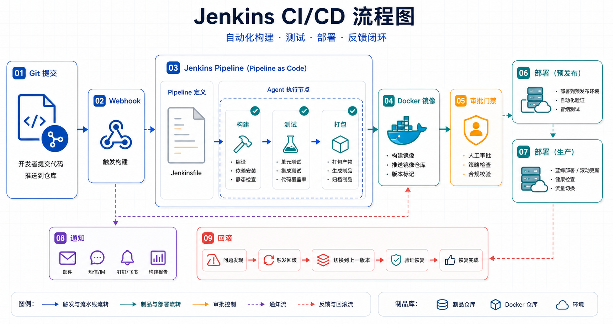

# Jenkins CI/CD 详解

## 简介

Jenkins 是开源的、用 Java 编写的持续集成和持续交付（CI/CD）工具。它本质上是一个自动化服务器，用于自动化软件开发过程中的各种任务，例如编译、测试、打包、部署等。

Jenkins 拥有超过 1800 个插件，生态系统极为丰富，可以与 Git、Docker、Kubernetes、Slack 等几乎所有主流开发工具无缝集成。



## 阅读路线

Jenkins 的落地重点不只是“把命令搬进界面”，而是把交付流程固化为可审查、可回滚、可复用的流水线代码。建议按下面顺序阅读：

1. 先理解 CI、持续交付、持续部署和 Pipeline as Code 的边界。
2. 再掌握 Declarative Pipeline、Credentials、Docker agent 和 post 通知。
3. 最后把多分支流水线、Shared Libraries 和常见排查纳入团队规范。

生产环境优先把 `Jenkinsfile` 放进代码仓库，避免在 Jenkins UI 中维护难以审查的关键脚本。

## 核心概念

### 什么是 CI/CD

- **持续集成（CI）**：开发人员向版本控制系统提交代码后，Jenkins 自动侦听（通过 Webhook）拉取最新代码、执行编译、运行测试，尽早发现集成错误。
- **持续交付（CD）**：将构建好的、通过测试的软件包自动部署到各种环境中，通常需要人工审批。
- **持续部署（CD）**：完全自动化部署流程，无需人工干预。

### Jenkins 核心术语

- **任务/项目（Job/Project）**：Jenkins 中自动化流程的配置单元。
- **流水线（Pipeline）**：将整个构建、测试、部署流程以代码形式（`Jenkinsfile`）定义，使得流程可版本化、可审查、可重复。
- **构建（Build）**：执行一次任务的过程。
- **工作空间（Workspace）**：Jenkins 每次构建时存放源代码和生成产物的目录。
- **代理（Agent）**：执行流水线或阶段的环境。
- **阶段（Stage）**：流水线的逻辑分组，如 Build、Test、Deploy。
- **步骤（Step）**：在阶段内执行的具体命令或函数。

## 安装 Jenkins

### 环境要求

- Java 11+（Jenkins 基于 Java）
- 2GB+ RAM，10GB+ 磁盘空间
- Git 已安装

### Docker 安装（推荐）

```bash
docker run -d \
  --name jenkins \
  --restart unless-stopped \
  -p 8080:8080 \
  -p 50000:50000 \
  -v jenkins-data:/var/jenkins_home \
  -v /var/run/docker.sock:/var/run/docker.sock \
  jenkins/jenkins:lts

docker exec jenkins cat /var/jenkins_home/secrets/initialAdminPassword
```

### Ubuntu/Debian 安装

```bash
curl -fsSL https://pkg.jenkins.io/debian-stable/jenkins.io-2023.key | sudo tee \
  /usr/share/keyrings/jenkins-keyring.asc > /dev/null

echo "deb [signed-by=/usr/share/keyrings/jenkins-keyring.asc] \
  https://pkg.jenkins.io/debian-stable binary/" | sudo tee \
  /etc/apt/sources.list.d/jenkins.list > /dev/null

sudo apt update
sudo apt install jenkins
sudo systemctl start jenkins
```

### 初始化配置

1. 访问 `http://your-server:8080`
2. 输入初始管理员密码
3. 选择安装建议的插件
4. 创建第一个管理员用户

## Pipeline 快速入门

### 创建流水线任务

1. Jenkins Dashboard → **新建任务（New Item）**
2. 输入任务名称（如 `my-first-pipeline`）
3. 选择 **流水线（Pipeline）** 类型
4. 点击 **确定（OK）**

### 定义 Pipeline 的方式

1. **通过 Blue Ocean**：可视化编辑器创建
2. **通过经典 UI**：直接在界面输入 Pipeline 脚本
3. **通过 SCM**：从代码仓库的 `Jenkinsfile` 读取（推荐方式）

### Pipeline 脚本示例

```groovy
pipeline {
    agent any

    environment {
        APP_NAME = 'my-web-app'
        DEPLOY_ENV = 'staging'
    }

    stages {
        stage('Checkout') {
            steps {
                checkout scm
            }
        }

        stage('Build') {
            steps {
                echo 'Building...'
                sh 'npm ci'
            }
        }

        stage('Test') {
            steps {
                echo 'Running tests...'
                sh 'npm test -- --watchAll=false'
            }
            post {
                always {
                    junit 'test-results/**/*.xml'
                }
            }
        }

        stage('Deploy') {
            when {
                branch 'main'
            }
            steps {
                echo 'Deploying...'
                sh './deploy.sh ${DEPLOY_ENV}'
            }
        }
    }

    post {
        failure {
            mail to: 'team@example.com',
                 subject: "Pipeline Failed: ${APP_NAME} #${BUILD_NUMBER}",
                 body: "Check: ${BUILD_URL}"
        }
        success {
            echo 'Pipeline completed successfully!'
        }
    }
}
```

## Declarative Pipeline 语法

### 核心结构

```groovy
pipeline {
    agent any        // 定义执行位置
    options { }     // 流水线选项
    environment { }  // 环境变量
    parameters { }   // 参数定义
    triggers { }     // 触发器
    stages { }       // 阶段列表
    post { }         // 后处理
}
```

### agent 指令

```groovy
// 在任何可用代理上执行
agent any

// 不全局分配代理，每个 stage 单独指定
agent none

// 在指定标签的代理上执行
agent { label 'my-build-agent' }

// 使用 Docker 容器作为代理
agent {
    docker {
        image 'node:18-alpine'
        args '-v $HOME/.npm:/root/.npm'
        label 'docker-agent'
    }
}

// 使用 Kubernetes Pod 模板
agent {
    kubernetes {
        label 'kubernetes-pod'
        yaml '''
apiVersion: v1
kind: Pod
spec:
  containers:
  - name: builder
    image: node:18-alpine
    command:
    - cat
    tty: true
'''
    }
}
```

### stages 与 stage

```groovy
stages {
    stage('Build') {
        steps {
            echo 'Building...'
        }
    }
    stage('Test') {
        steps {
            echo 'Testing...'
        }
    }
    stage('Deploy') {
        steps {
            echo 'Deploying...'
        }
    }
}
```

### steps 常用指令

```groovy
stage('Example') {
    steps {
        echo 'Hello World'

        sh 'npm ci && npm run build'

        bat 'python manage.py migrate'

        withCredentials([string(credentialsId: 'api-key', variable: 'API_KEY')]) {
            sh 'curl -H "Authorization: $API_KEY" https://api.example.com'
        }

        dir('subdirectory') {
            sh 'make build'
        }

        timeout(time: 30, unit: 'MINUTES') {
            sh 'long-running-command.sh'
        }

        input message: 'Continue deployment?', ok: 'Proceed'
    }
}
```

### when 条件执行

```groovy
stage('Deploy') {
    when {
        branch 'main'
    }
    steps {
        echo 'Deploying to production...'
    }
}

// 多个条件
stage('Deploy') {
    when {
        branch 'main'
        environment name: 'DEPLOY_ENV', value: 'production'
        not { buildingTag() }
    }
    steps {
        echo 'Deploying...'
    }
}
```

### environment 环境变量

```groovy
pipeline {
    environment {
        APP_VERSION = '1.0.0'
        BUILD_DIR = 'dist'
    }

    stages {
        stage('Build') {
            environment {
                NODE_ENV = 'production'
            }
            steps {
                sh 'npm ci'
                echo "Building version ${APP_VERSION}"
            }
        }
    }
}
```

### parameters 参数定义

```groovy
pipeline {
    parameters {
        string(name: 'DEPLOY_ENV', defaultValue: 'staging', description: 'Deployment environment')
        choice(name: 'REGION', choices: ['us-east-1', 'us-west-2', 'eu-west-1'], description: 'AWS Region')
        booleanParam(name: 'SKIP_TESTS', defaultValue: false, description: 'Skip test stage')
        password(name: 'API_SECRET', defaultValue: '', description: 'API Secret')
    }

    stages {
        stage('Deploy') {
            steps {
                echo "Deploying to ${params.DEPLOY_ENV}"
            }
        }
    }
}
```

### triggers 触发器

```groovy
pipeline {
    triggers {
        // 定时触发（每 15 分钟）
        cron('H/15 * * * *')

        // GitHub/GitLab Webhook 触发
        githubPushTrigger()

        // 定期构建
        pollSCM('H/5 * * * *')
    }

    stages {
        stage('Build') {
            steps {
                echo 'Building...'
            }
        }
    }
}
```

### post 后处理

```groovy
post {
    always {
        echo '无论成功还是失败都会执行'
        junit 'test-results/**/*.xml'
        archiveArtifacts artifacts: 'build/**', fingerprint: true
    }
    success {
        echo '构建成功时执行'
        slackSend(channel: '#ci', message: 'Build succeeded!')
    }
    failure {
        echo '构建失败时执行'
        mail to: 'team@example.com',
             subject: "Failed: ${env.JOB_NAME} #${env.BUILD_NUMBER}",
             body: "See ${env.BUILD_URL}"
    }
    unstable {
        echo '构建不稳定时执行'
    }
    changed {
        echo '构建状态改变时执行'
    }
}
```

## Scripted Pipeline

Scripted Pipeline 基于 Groovy DSL，语法更灵活但也更复杂。

### 基本结构

```groovy
node('docker-agent') {
    stage('Checkout') {
        checkout scm
    }

    stage('Build') {
        sh 'npm ci'
    }

    stage('Test') {
        try {
            sh 'npm test'
        } finally {
            junit 'test-results/**/*.xml'
        }
    }

    stage('Deploy') {
        if (env.BRANCH_NAME == 'main') {
            sh './deploy.sh production'
        }
    }
}
```

### 条件执行

```groovy
node {
    stage('Check') {
        if (env.BRANCH_NAME == 'main') {
            echo 'Building main branch...'
            build 'deploy-production'
        } else {
            echo 'Building feature branch...'
            sh 'npm run build:dev'
        }
    }
}
```

### 循环与并行

```groovy
node {
    def tests = ['unit', 'integration', 'e2e']

    stage('Run Tests') {
        def parallelTests = [:]
        tests.each { test ->
            parallelTests[test] = {
                sh "npm test -- --test=${test}"
            }
        }
        parallel parallelTests
    }
}
```

## Credentials 管理

### 添加凭据

1. **Manage Jenkins** → **Credentials** → **System** → **Global credentials**
2. 点击 **Add Credentials**
3. 选择类型（Username/Password、SSH Key、Secret Text 等）
4. 设置 ID 和对应的值

### 在 Pipeline 中使用凭据

```groovy
pipeline {
    agent any

    stages {
        stage('Build') {
            steps {
                withCredentials([string(credentialsId: 'api-key', variable: 'API_KEY')]) {
                    sh 'curl -H "X-API-Key: $API_KEY" https://api.example.com'
                }
            }
        }

        stage('Deploy') {
            steps {
                withCredentials([usernamePassword(credentialsId: 'docker-registry',
                                                   usernameVariable: 'DOCKER_USER',
                                                   passwordVariable: 'DOCKER_PASS')]) {
                    sh 'docker login -u $DOCKER_USER -p $DOCKER_PASS registry.example.com'
                }
            }
        }
    }
}
```

## Docker 集成

### 在 Pipeline 中使用 Docker

```groovy
pipeline {
    agent {
        docker {
            image 'node:18-alpine'
            args '-v $HOME/.npm:/root/.npm'
        }
    }

    stages {
        stage('Install') {
            steps {
                sh 'npm ci'
            }
        }

        stage('Build') {
            steps {
                sh 'npm run build'
            }
        }
    }
}
```

### 多阶段 Dockerfile

```groovy
pipeline {
    agent {
        dockerfile {
            filename 'Dockerfile.multi'
            additionalBuildArgs '--build-arg VERSION=1.0.0'
        }
    }

    stages {
        stage('Build') {
            steps {
                sh 'echo Build completed'
            }
        }
    }
}
```

### Docker 缓存优化

```groovy
pipeline {
    agent {
        docker {
            image 'maven:3.9-eclipse-temurin-17'
            reuseNode true
        }
    }

    stages {
        stage('Build') {
            steps {
                sh 'mvn clean package -DskipTests'
            }
        }
    }
}
```

## 完整实战示例

### Node.js 应用 CI/CD

```groovy
pipeline {
    agent {
        docker { image 'node:18-alpine' }
    }

    environment {
        APP_NAME = 'my-node-app'
        DOCKER_REGISTRY = 'registry.example.com'
    }

    options {
        timestamps()
        timeout(time: 30, unit: 'MINUTES')
        buildDiscarder(logRotator(numToKeepStr: '10'))
    }

    parameters {
        choice(name: 'ENV', choices: ['staging', 'production'], description: 'Deploy environment')
        booleanParam(name: 'SKIP_TESTS', defaultValue: false, description: 'Skip tests')
    }

    stages {
        stage('Checkout') {
            steps {
                checkout scm
                script {
                    env.BUILD_TAG = "${env.BRANCH_NAME}-${env.BUILD_NUMBER}"
                }
            }
        }

        stage('Install Dependencies') {
            steps {
                sh 'npm ci'
            }
        }

        stage('Lint') {
            steps {
                sh 'npm run lint || true'
            }
        }

        stage('Test') {
            when {
                expression { params.SKIP_TESTS == false }
            }
            steps {
                sh 'npm test -- --watchAll=false'
            }
            post {
                always {
                    junit 'test-results/**/*.xml'
                    coverage([
                        pattern: 'coverage/coverage-summary.json',
                        adapter: 'cobertura'
                    ])
                }
            }
        }

        stage('Build Docker Image') {
            steps {
                script {
                    def imageName = "${env.DOCKER_REGISTRY}/${env.APP_NAME}:${env.BUILD_TAG}"
                    def latestImage = "${env.DOCKER_REGISTRY}/${env.APP_NAME}:latest"

                    sh """
                        docker build -t ${imageName} .
                        docker tag ${imageName} ${latestImage}
                        docker push ${imageName}
                        docker push ${latestImage}
                    """

                    env.IMAGE_NAME = imageName
                }
            }
        }

        stage('Deploy to Staging') {
            when {
                expression { params.ENV == 'staging' }
            }
            steps {
                sh '''
                    kubectl set image deployment/${APP_NAME} \
                        ${APP_NAME}=${IMAGE_NAME} \
                        -n staging
                '''
                echo 'Deployed to staging'
            }
        }

        stage('Deploy to Production') {
            when {
                expression { params.ENV == 'production' && env.BRANCH_NAME == 'main' }
            }
            steps {
                input message: 'Approve deployment to production?', ok: 'Deploy'
                sh '''
                    kubectl set image deployment/${APP_NAME} \
                        ${APP_NAME}=${IMAGE_NAME} \
                        -n production
                '''
                echo 'Deployed to production'
            }
        }
    }

    post {
        always {
            cleanWs()
        }
        success {
            slackSend(channel: '#ci-cd',
                     message: ":white_check_mark: ${env.JOB_NAME} #${env.BUILD_NUMBER} succeeded!",
                     color: 'good')
        }
        failure {
            slackSend(channel: '#ci-cd',
                     message: ":x: ${env.JOB_NAME} #${env.BUILD_NUMBER} failed!",
                     color: 'danger')
        }
    }
}
```

### Python 应用 CI/CD

```groovy
pipeline {
    agent any

    environment {
        PYTHON_VERSION = '3.11'
    }

    stages {
        stage('Checkout') {
            steps {
                checkout scm
            }
        }

        stage('Setup Python') {
            steps {
                sh '''
                    python${PYTHON_VERSION} -m venv venv
                    ./venv/bin/pip install -r requirements.txt
                    ./venv/bin/pip install pytest pytest-cov flake8 black
                '''
            }
        }

        stage('Lint') {
            steps {
                sh './venv/bin/flake8 . --count --select=E9,F63,F7,F82 --show-source --statistics'
            }
        }

        stage('Test') {
            steps {
                sh './venv/bin/pytest tests/ --cov=src --cov-report=xml --cov-report=html'
            }
            post {
                always {
                    junit 'test-results/junit.xml'
                    cobertura coberturaReportFile: 'coverage/coverage.xml'
                }
            }
        }

        stage('Build') {
            steps {
                sh './venv/bin/python setup.py sdist bdist_wheel'
                archiveArtifacts artifacts: 'dist/*.whl,dist/*.tar.gz', fingerprint: true
            }
        }

        stage('Security Scan') {
            steps {
                sh './venv/bin/pip-audit --format=columns || true'
            }
        }

        stage('Deploy to PyPI') {
            when {
                allOf {
                    branch 'main'
                    buildingTag()
                }
            }
            steps {
                withCredentials([string(credentialsId: 'pypi-token', variable: 'PYPI_TOKEN')]) {
                    sh '''
                        ./venv/bin/twine upload --repository pypi dist/* -u __token__ -p $PYPI_TOKEN
                    '''
                }
            }
        }
    }
}
```

## 多分支流水线

### Jenkinsfile 放在仓库根目录

```
my-repo/
├── Jenkinsfile
├── src/
├── tests/
└── package.json
```

### multibranch Pipeline 配置

1. 新建任务 → 选择 **多分支流水线（Multibranch Pipeline）**
2. 配置源码管理（Git）
3. 设置 Branch Sources（从哪个仓库拉取）
4. 配置 Scan 触发器

### 多分支 Pipeline 示例

```groovy
pipeline {
    agent any

    environment {
        DEPLOY_USER = credentials('deploy-ssh-key')
    }

    stages {
        stage('Build') {
            steps {
                echo "Building ${env.BRANCH_NAME}..."
                sh 'npm ci'
            }
        }

        stage('Test') {
            steps {
                sh 'npm test'
            }
            post {
                always {
                    junit 'test-results/**/*.xml'
                }
            }
        }

        stage('Deploy') {
            when {
                expression { env.BRANCH_NAME == 'main' || env.BRANCH_NAME.startsWith('release/') }
            }
            steps {
                sh "./deploy.sh ${env.BRANCH_NAME}"
            }
        }
    }
}
```

## Shared Libraries

### 目录结构

```
src/
├── vars/
│   ├── buildDockerImage.groovy
│   └── deploy.groovy
└── com/
    └── example/
        └── Utils.groovy
```

### 加载和使用

```groovy
@Library('my-shared-library') _

pipeline {
    agent any

    stages {
        stage('Build') {
            steps {
                buildDockerImage(imageName: 'my-app', tag: env.BUILD_NUMBER)
            }
        }

        stage('Deploy') {
            steps {
                deploy.k8s(
                    namespace: 'production',
                    manifest: 'k8s/deployment.yaml'
                )
            }
        }
    }
}
```

### var 脚本示例

```groovy
// vars/buildDockerImage.groovy
def call(Map config) {
    def imageName = config.imageName
    def tag = config.tag ?: 'latest'
    def registry = config.registry ?: 'registry.example.com'

    sh """
        docker build -t ${registry}/${imageName}:${tag} .
        docker push ${registry}/${imageName}:${tag}
    """
}
```

## 常见问题与排查

### 1. Pipeline 卡住不动

- 检查代理是否在线
- 查看控制台输出是否有错误
- 检查网络连接

### 2. 凭据无法读取

- 确认凭据 ID 正确
- 检查凭据类型与使用方式是否匹配
- 使用 `echo` 输出变量时注意不要打印敏感信息

### 3. Docker in Docker 问题

- 确保正确挂载 `/var/run/docker.sock`
- 或使用 Kaniko 在 Kubernetes 中构建

### 4. 权限不足

- 配置代理的 label
- 检查 Pipeline 权限配置

### 5. 内存问题

- 增加 Jenkins 堆内存：`-Xmx` 参数
- 限制并发构建数

## 小结

Jenkins 作为最成熟的 CI/CD 工具之一，其核心价值在于：

- **Pipeline as Code**：通过 `Jenkinsfile` 定义流水线代码化
- **丰富的插件生态**：1800+ 插件覆盖各种集成需求
- **灵活的部署方式**：支持物理机、虚拟机、Docker、Kubernetes
- **强大的扩展能力**：Shared Libraries 机制支持代码复用

落地清单：

- 使用 Declarative Pipeline 语法（推荐）
- 凭据信息不要硬编码，使用 Credentials Manager
- 合理配置 agent 和 Docker 环境
- 完善 post 块处理构建结果通知
- 使用 Shared Libraries 抽取公共逻辑

附加参考：

- [Jenkins 官方文档](https://www.jenkins.io/doc/)
- [Pipeline 语法参考](https://www.jenkins.io/doc/book/pipeline/syntax/)
- [Pipeline 步骤参考](https://www.jenkins.io/doc/pipeline/steps/)
- [Jenkins 插件管理器](https://plugins.jenkins.io/)

---
