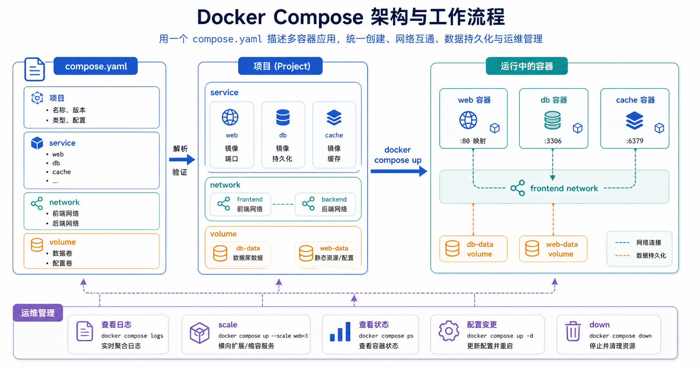

## 概述

Docker Compose 用一个 YAML 文件描述一组相关服务，让开发者可以用一条命令创建、启动、停止和删除多容器应用。

现在推荐使用 Docker Compose v2，也就是 `docker compose` 子命令。旧版 `docker-compose` v1 已停止维护，不建议在新环境中继续安装或编写教程。

## 适用场景

Compose 最适合把一组本地开发或测试服务一次性拉起，例如 Web、数据库、缓存和消息队列。它能让依赖关系、网络、端口、环境变量和数据卷写进同一个文件，但生产发布仍要结合目标平台的密钥、网络和健康检查能力设计。



## 核心概念

| 概念 | 说明 |
|------|------|
| **项目 (project)** | 一组由 Compose 管理的服务、网络和数据卷 |
| **服务 (service)** | 应用中的一个角色，例如 `web`、`db`、`redis` |
| **容器 (container)** | 服务运行后的实例，一个服务可以扩展出多个容器 |
| **网络 (network)** | 服务之间通信的虚拟网络 |
| **卷 (volume)** | 独立于容器生命周期的数据存储 |

Compose 默认读取当前目录中的 `compose.yaml` 或 `docker-compose.yml`。新项目推荐使用 `compose.yaml`。

## 安装与验证

Docker Desktop 已内置 Compose v2。Linux 服务器建议通过 Docker 官方仓库安装 Docker Engine 和 Compose 插件。

```bash
# 查看 Docker 版本
docker version

# 查看 Compose 版本
docker compose version
```

如果系统只能识别 `docker-compose`，通常说明正在使用旧版独立二进制。新项目应优先升级到 Compose v2。

## 基本示例

创建 `compose.yaml`：

```yaml
services:
  web:
    image: nginx:1.27-alpine
    ports:
      - "8080:80"
```

启动服务：

```bash
docker compose up -d
docker compose ps
```

停止并删除容器、默认网络：

```bash
docker compose down
```

## 完整示例

下面示例包含 Web、数据库、命名卷、专用网络、环境变量文件和健康检查。

```yaml
services:
  web:
    image: nginx:1.27-alpine
    ports:
      - "8080:80"
    depends_on:
      db:
        condition: service_healthy
    networks:
      - app-net

  db:
    image: mysql:8.4
    env_file:
      - .env
    volumes:
      - mysql-data:/var/lib/mysql
    healthcheck:
      test: ["CMD-SHELL", "mysqladmin ping -h localhost -uroot -p$${MYSQL_ROOT_PASSWORD}"]
      interval: 10s
      timeout: 5s
      retries: 5
    networks:
      - app-net

volumes:
  mysql-data:

networks:
  app-net:
```

`.env` 文件示例：

```dotenv
MYSQL_ROOT_PASSWORD=change_me_to_a_strong_password
MYSQL_DATABASE=app
```

> 不要把生产环境密码提交到 Git。真实项目应使用密钥管理服务或部署平台提供的 Secret 能力。

## 常用命令

| 命令 | 说明 |
|------|------|
| `docker compose up -d` | 后台创建并启动服务 |
| `docker compose ps` | 查看项目中的容器 |
| `docker compose logs -f` | 实时查看日志 |
| `docker compose exec web sh` | 进入指定服务容器 |
| `docker compose build` | 构建服务镜像 |
| `docker compose pull` | 拉取服务镜像 |
| `docker compose restart` | 重启服务 |
| `docker compose down` | 停止并删除容器和默认网络 |
| `docker compose down -v` | 同时删除命名卷，慎用 |

## 常用配置

### 端口映射

```yaml
ports:
  - "8080:80"
```

含义是将主机的 `8080` 端口映射到容器内的 `80` 端口。

### 环境变量

```yaml
environment:
  APP_ENV: development
  DB_HOST: db
```

变量较多时建议使用 `env_file`：

```yaml
env_file:
  - .env
```

### 数据卷

```yaml
volumes:
  mysql-data:

services:
  db:
    volumes:
      - mysql-data:/var/lib/mysql
```

命名卷由 Docker 管理，比直接绑定宿主机目录更适合数据库持久化。

### 依赖关系

```yaml
depends_on:
  db:
    condition: service_healthy
```

`depends_on` 可以控制启动顺序；如果需要等待数据库真正可用，应配合 `healthcheck`。

## 配置检查清单

- 使用 `compose.yaml` 和 `docker compose`，避免新项目继续依赖 v1。
- 数据库、队列等有状态服务使用命名卷。
- 密码和 token 不写入仓库，优先使用 Secret 或部署平台配置。
- 为关键服务配置 `healthcheck`，避免只依赖启动顺序。
- 使用明确镜像标签，并为需要构建的服务保留 Dockerfile。

## 小结

Compose 适合本地开发、测试环境和小型部署。写 Compose 文件时应优先使用 `docker compose`、`compose.yaml`、命名卷和清晰的服务边界；涉及密码、证书和生产网络策略时，不要只依赖示例配置。
