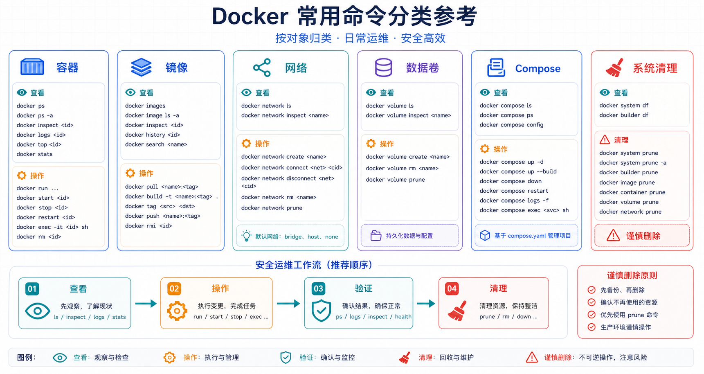

## 概述

本文整理 Docker 日常高频命令。速查表适合回忆命令，不替代对数据持久化、权限和生产安全的理解。

## 使用建议

速查命令前先判断操作对象：容器、镜像、网络、数据卷还是 Compose 项目。涉及删除、清理、覆盖标签和生产镜像推送时，先用查看命令确认目标，再执行变更命令。



## 容器生命周期

| 命令 | 说明 |
|------|------|
| `docker run IMAGE` | 创建并启动容器 |
| `docker create IMAGE` | 创建容器但不启动 |
| `docker start NAME` | 启动已存在容器 |
| `docker stop NAME` | 优雅停止容器 |
| `docker restart NAME` | 重启容器 |
| `docker kill NAME` | 立即终止容器 |
| `docker rm NAME` | 删除已停止容器 |
| `docker rm -f NAME` | 强制删除运行中容器，慎用 |
| `docker pause NAME` | 暂停容器进程 |
| `docker unpause NAME` | 恢复容器进程 |

## 容器查看与调试

| 命令 | 说明 |
|------|------|
| `docker ps` | 查看运行中的容器 |
| `docker ps -a` | 查看所有容器 |
| `docker logs NAME` | 查看日志 |
| `docker logs -f NAME` | 实时查看日志 |
| `docker exec -it NAME sh` | 进入容器执行命令 |
| `docker inspect NAME` | 查看详细元数据 |
| `docker top NAME` | 查看容器进程 |
| `docker stats NAME` | 查看资源使用 |
| `docker port NAME` | 查看端口映射 |

## 镜像管理

| 命令 | 说明 |
|------|------|
| `docker images` | 查看本地镜像 |
| `docker pull IMAGE:TAG` | 拉取镜像 |
| `docker build -t NAME:TAG .` | 构建镜像 |
| `docker tag SRC DST` | 给镜像打标签 |
| `docker history IMAGE` | 查看镜像层历史 |
| `docker rmi IMAGE` | 删除镜像 |
| `docker save IMAGE -o image.tar` | 导出镜像 |
| `docker load -i image.tar` | 导入镜像 |

## 仓库操作

| 命令 | 说明 |
|------|------|
| `docker login` | 登录镜像仓库 |
| `docker logout` | 退出登录 |
| `docker search KEYWORD` | 搜索公开镜像 |
| `docker push IMAGE:TAG` | 推送镜像 |
| `docker pull IMAGE:TAG` | 拉取镜像 |

生产环境建议使用明确版本标签或镜像摘要，不要依赖 `latest`。

## 网络与数据卷

| 命令 | 说明 |
|------|------|
| `docker network ls` | 查看网络 |
| `docker network create NAME` | 创建网络 |
| `docker network inspect NAME` | 查看网络详情 |
| `docker network rm NAME` | 删除网络 |
| `docker volume ls` | 查看数据卷 |
| `docker volume create NAME` | 创建数据卷 |
| `docker volume inspect NAME` | 查看卷详情 |
| `docker volume rm NAME` | 删除未使用卷 |

## Compose 常用命令

| 命令 | 说明 |
|------|------|
| `docker compose version` | 查看 Compose v2 版本 |
| `docker compose up -d` | 后台启动项目 |
| `docker compose ps` | 查看项目容器 |
| `docker compose logs -f` | 查看项目日志 |
| `docker compose exec SERVICE sh` | 进入指定服务容器 |
| `docker compose pull` | 拉取服务镜像 |
| `docker compose build` | 构建服务镜像 |
| `docker compose down` | 停止并删除项目容器和默认网络 |
| `docker compose down -v` | 同时删除命名卷，慎用 |

## 常用组合命令

```bash
# 运行一个临时 Ubuntu 容器
docker run --rm -it ubuntu:24.04 bash

# 运行 Nginx 并映射端口
docker run -d --name web -p 8080:80 nginx:1.27-alpine

# 查看最近 100 行日志
docker logs --tail 100 web

# 从容器复制文件到主机
docker cp web:/etc/nginx/nginx.conf ./nginx.conf

# 从主机复制文件到容器
docker cp ./index.html web:/usr/share/nginx/html/index.html

# 清理已停止容器
docker container prune

# 清理未使用镜像
docker image prune
```

## 清理命令提醒

| 命令 | 风险 |
|------|------|
| `docker container prune` | 删除所有已停止容器 |
| `docker image prune -a` | 删除所有未被容器使用的镜像 |
| `docker volume prune` | 删除未使用数据卷，可能丢失数据 |
| `docker system prune -a --volumes` | 大范围清理镜像、容器、网络和卷，必须谨慎 |

执行清理前，先用 `docker ps -a`、`docker images`、`docker volume ls` 确认对象是否仍有价值。
