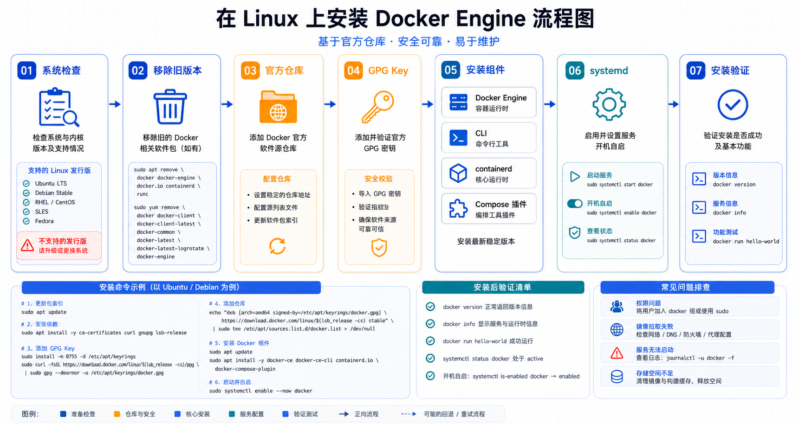

## 概述

Docker Engine 建议通过 Docker 官方软件仓库安装。这样可以正常接收安全更新，也能同时安装 Compose v2 插件。

CentOS Linux 7 已在 2024 年 6 月 30 日停止维护，CentOS 6 更早停止维护。新环境不建议继续以 CentOS 7 作为默认安装目标，应优先选择 Ubuntu LTS、Debian、CentOS Stream、Rocky Linux、AlmaLinux 或 RHEL 兼容发行版。

## 安装策略

生产环境建议优先使用官方软件仓库安装，这样版本来源、升级路径和安全补丁都更清晰。便捷脚本适合临时测试，不适合作为服务器初始化的长期标准。

安装前先确认三件事：系统发行版仍受支持、内核版本满足要求、主机可以访问 Docker 仓库或内部镜像源。



## 安装前检查

```bash
# 查看系统版本
cat /etc/os-release

# 查看内核版本
uname -r

# 确认 systemd 服务管理可用
systemctl --version
```

如果服务器使用了旧内核、旧发行版或厂商定制系统，应先确认 Docker 官方文档是否仍支持该平台。

## Ubuntu 安装

### 1. 移除旧版本

```bash
for pkg in docker.io docker-doc docker-compose docker-compose-v2 podman-docker containerd runc; do
  sudo apt-get remove -y "$pkg"
done
```

### 2. 添加官方仓库

```bash
sudo apt-get update
sudo apt-get install -y ca-certificates curl
sudo install -m 0755 -d /etc/apt/keyrings
sudo curl -fsSL https://download.docker.com/linux/ubuntu/gpg -o /etc/apt/keyrings/docker.asc
sudo chmod a+r /etc/apt/keyrings/docker.asc

echo \
  "deb [arch=$(dpkg --print-architecture) signed-by=/etc/apt/keyrings/docker.asc] https://download.docker.com/linux/ubuntu \
  $(. /etc/os-release && echo "${UBUNTU_CODENAME:-$VERSION_CODENAME}") stable" | \
  sudo tee /etc/apt/sources.list.d/docker.list > /dev/null

sudo apt-get update
```

### 3. 安装 Docker Engine

```bash
sudo apt-get install -y docker-ce docker-ce-cli containerd.io docker-buildx-plugin docker-compose-plugin
```

### 4. 启动并验证

```bash
sudo systemctl enable --now docker
sudo docker run hello-world
docker compose version
```

## CentOS Stream / RHEL 系安装

以下步骤适用于 Docker 官方仓库支持的 RHEL 系发行版。CentOS Linux 7 不应作为新系统推荐目标。

### 1. 移除旧版本

```bash
sudo dnf remove -y docker \
  docker-client \
  docker-client-latest \
  docker-common \
  docker-latest \
  docker-latest-logrotate \
  docker-logrotate \
  docker-engine
```

### 2. 添加官方仓库

```bash
sudo dnf install -y dnf-plugins-core
sudo dnf config-manager --add-repo https://download.docker.com/linux/centos/docker-ce.repo
```

### 3. 安装 Docker Engine

```bash
sudo dnf install -y docker-ce docker-ce-cli containerd.io docker-buildx-plugin docker-compose-plugin
```

### 4. 启动并验证

```bash
sudo systemctl enable --now docker
sudo docker run hello-world
docker compose version
```

## 非 root 用户配置

默认情况下，Docker 守护进程需要 root 权限。将用户加入 `docker` 组后可以免 `sudo` 执行 Docker 命令：

```bash
sudo usermod -aG docker "$USER"
newgrp docker
docker ps
```

注意：`docker` 组等价于授予接近 root 的主机控制能力，只应给可信用户。

## 镜像加速配置

国内网络环境可能拉取镜像较慢，可以在 `/etc/docker/daemon.json` 配置可用的镜像源。镜像源可用性会变化，建议使用所在云厂商或组织维护的地址。

```json
{
  "registry-mirrors": [
    "https://mirror.example.com"
  ]
}
```

配置后重启 Docker：

```bash
sudo systemctl restart docker
docker info
```

## 便捷脚本说明

Docker 提供 convenience script：

```bash
curl -fsSL https://get.docker.com -o get-docker.sh
sudo sh get-docker.sh
```

这个脚本适合临时测试和开发环境，不适合生产服务器的标准化安装。生产环境应优先使用官方仓库步骤，并把安装命令纳入自动化配置管理。

## 安装验收清单

- `docker run hello-world` 能正常拉取镜像并启动容器。
- `docker compose version` 能返回 Compose v2 版本。
- `systemctl is-enabled docker` 确认服务已设置为开机启动。
- `/etc/docker/daemon.json` 是合法 JSON，修改后已重启 Docker。
- 只有可信用户被加入 `docker` 组。

## 常见问题

### 权限错误

如果执行 `docker ps` 提示权限不足，确认当前用户是否已加入 `docker` 组，并重新登录终端。

```bash
groups
sudo usermod -aG docker "$USER"
```

### 服务启动失败

```bash
sudo systemctl status docker
sudo journalctl -u docker --no-pager -n 100
```

重点检查内核版本、存储驱动、代理配置和 `/etc/docker/daemon.json` 的 JSON 语法。
