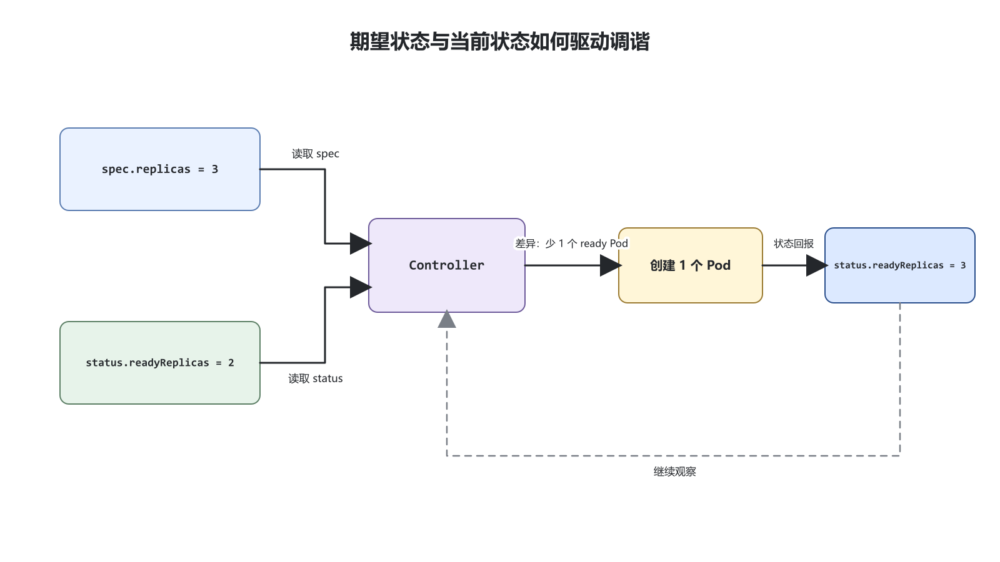
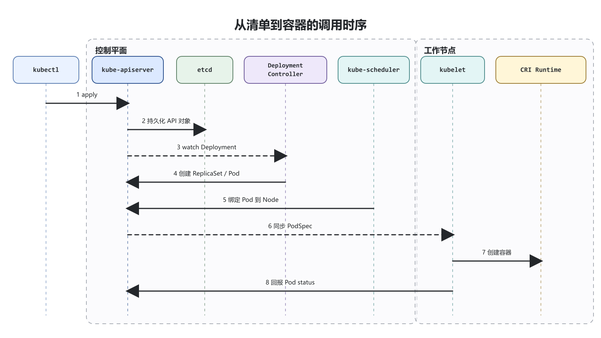
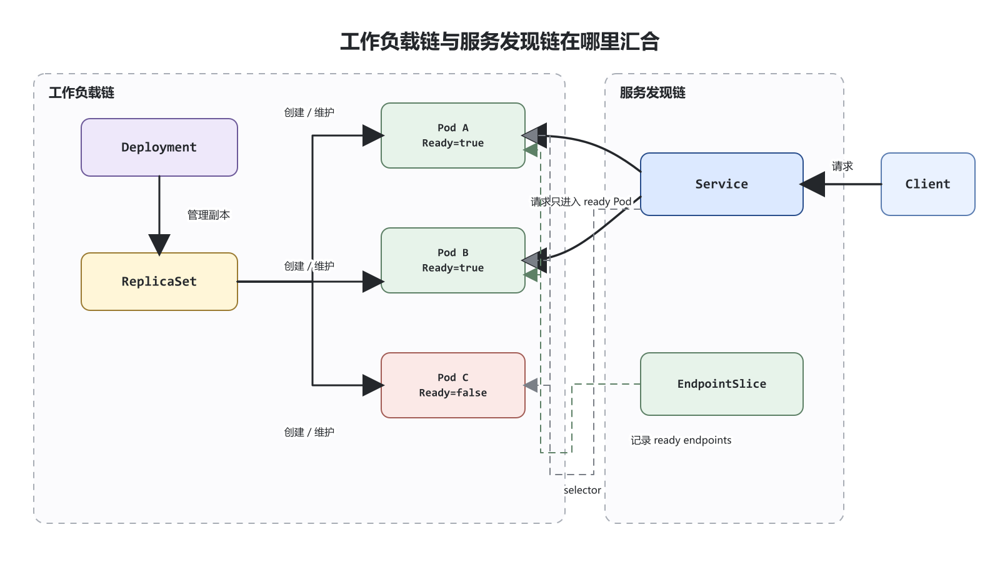

## 前置知识与学习目标

本文面向第一次从单机容器进入 Kubernetes 的开发者或运维工程师。开始前，你应当能够区分镜像与容器、读懂基本 YAML 映射和列表，并理解 HTTP 端口的作用；不要求已有集群管理经验。

全文只回答一个核心问题：**Kubernetes 如何把一个 Deployment 和 Service 声明，持续调谐成可访问、可自愈的无状态服务？**

读完后，你应当能够：

- 复述从 `kubectl apply` 到容器运行的控制链；
- 解释 Deployment、ReplicaSet、Pod、Service 和 EndpointSlice 的职责与关系；
- 用 `spec.replicas`、`status.readyReplicas` 和 EndpointSlice 判断服务处于哪个中间状态；
- 部署、验证、主动破坏并恢复本文的 `demo-web` 示例。

> 本文聚焦单集群中的无状态 HTTP 工作负载。生产集群安装、持久化存储、Ingress/Gateway、RBAC、安全加固和自动伸缩只标明边界，不在本篇展开。

## 从一个真实问题开始

假设 `demo-web` 需要同时运行 3 个等价副本。某个进程退出、节点短暂不可用或版本发布时，Pod 会被替换，Pod IP 也会变化。客户端却希望始终使用一个稳定入口，而且不应把请求发给尚未就绪的副本。

在单机脚本里，你可能编写“启动三个容器，失败就重启”的过程。Kubernetes 采用另一种契约：你声明“我需要 3 个符合模板的副本和一个稳定服务入口”，各控制器不断比较**期望状态（Desired State）**与**当前状态（Current State）**，再执行缩小差异的动作。这个持续控制过程称为**调谐（Reconciliation）**。

## 核心机制：不是执行一次，而是持续调谐

Kubernetes API 对象通常同时包含两类信息：

- `spec`：使用者提交的期望状态，例如 `spec.replicas: 3`；
- `status`：系统观察并回报的当前状态，例如 `status.readyReplicas: 2`。

控制器（Controller）通过 API Server 观察对象。当 `spec.replicas=3` 而现有副本只有 2 个时，Deployment 控制器不会直接启动容器，而是创建或调整 ReplicaSet；ReplicaSet 控制器再创建 Pod。调度器与节点组件继续处理这些 Pod，直到观察结果逐步接近期望状态。

这不是承诺“集群永远没有故障”，而是承诺：只要控制链仍然工作且资源允许，系统会持续尝试收敛。调谐也不保证立即完成；镜像拉取失败、资源不足、探针失败或 Service 选择器不匹配，都会让对象停在可观察的中间状态。

<!-- figure:s01-f01 -->



## 从清单到容器：组件调用链

一次 `kubectl apply -f demo-web.yaml` 的主路径如下：

1. `kubectl` 将清单转换为 API 请求并发送给 `kube-apiserver`。
2. API Server 完成认证、鉴权、准入与 Schema 校验；请求被接受后，API 对象持久化到 `etcd`。通常只有 API Server 直接访问 `etcd`。
3. Deployment 控制器观察到新的 Deployment，创建代表当前 Pod 模板的 ReplicaSet。
4. ReplicaSet 控制器创建 Pod；新 Pod 此时还没有绑定工作节点。
5. `kube-scheduler` 为未调度 Pod 选择节点，并把绑定结果写回 API Server。
6. 目标节点上的 `kubelet` 观察到分配给本节点的 PodSpec，通过 CRI 调用 `containerd`、`CRI-O` 等容器运行时；节点网络通常由 CNI 插件接入。
7. `kubelet` 持续把 Pod 与容器状态回报给 API Server，控制器据此继续调谐。

控制平面（Control Plane）的核心组件包括 API Server、`etcd`、调度器和控制器管理器；工作节点（Worker Node）的关键组件是 `kubelet`、容器运行时，以及按集群实现部署的网络组件。`kube-proxy` 是 Service 数据平面的一种常见实现，但在部分网络方案中可以是可选的，因此不能把它当成所有集群的唯一转发方式。

Kubernetes 从 1.24 起移除了内置 dockershim。这里的准确含义是：`kubelet` 需要通过 CRI 与兼容运行时通信；它不等于“Docker 构建的 OCI 镜像不能运行”。

<!-- figure:s01-f02 -->



## 两条对象链如何汇合

`demo-web` 同时包含一条工作负载链和一条服务发现链：

```text
Deployment → ReplicaSet → Pod
Service --selector--> EndpointSlice → ready Pod IP:port
```

工作负载链负责“应该有几个什么样的 Pod”。Deployment 管理发布策略和 Pod 模板，ReplicaSet 维护某一版模板的副本数，Pod 则是被调度到节点的最小工作负载单元。不要手工修改 Deployment 所属的 ReplicaSet；下一次调谐会覆盖这种绕过上层声明的操作。

服务发现链负责“客户端应访问哪些后端”。Service 的选择器匹配 Pod 标签，控制面据此维护 EndpointSlice。EndpointSlice 记录后端地址和就绪条件，Service 的实现再把流量送往可用端点。Pod 被替换后，即使名字和 IP 改变，Service 名称与虚拟入口仍可保持稳定。

readiness probe 与 liveness probe 解决不同问题：readiness 失败会让 Pod 暂时退出 Service 的可用端点，但不会因为这一结果自动重启容器；liveness 失败才会触发容器重启。启动慢的程序还应评估 startup probe，避免 liveness 在初始化阶段误杀进程。

<!-- figure:s01-f03 -->



## 最小可验证示例

下面的清单创建一个 3 副本 Deployment 和一个集群内可访问的 ClusterIP Service。贯穿全文的名称固定为 `demo-web`，选择器固定为 `app.kubernetes.io/name=demo-web`。

```yaml
apiVersion: apps/v1
kind: Deployment
metadata:
  name: demo-web
  namespace: k8s-demo
  labels:
    app.kubernetes.io/name: demo-web
spec:
  replicas: 3
  strategy:
    type: RollingUpdate
    rollingUpdate:
      maxUnavailable: 0
      maxSurge: 1
  selector:
    matchLabels:
      app.kubernetes.io/name: demo-web
  template:
    metadata:
      labels:
        app.kubernetes.io/name: demo-web
    spec:
      containers:
        - name: nginx
          image: nginx:1.27-alpine
          ports:
            - name: http
              containerPort: 80
          resources:
            requests:
              cpu: 50m
              memory: 32Mi
            limits:
              cpu: 250m
              memory: 128Mi
          readinessProbe:
            httpGet:
              path: /
              port: http
            initialDelaySeconds: 2
            periodSeconds: 5
            timeoutSeconds: 2
            failureThreshold: 3
---
apiVersion: v1
kind: Service
metadata:
  name: demo-web
  namespace: k8s-demo
  labels:
    app.kubernetes.io/name: demo-web
spec:
  selector:
    app.kubernetes.io/name: demo-web
  ports:
    - name: http
      protocol: TCP
      port: 80
      targetPort: http
  type: ClusterIP
```

### 关键字段为什么存在

| 字段                  | 输入与作用                                | 失败边界                                             |
| --------------------- | ----------------------------------------- | ---------------------------------------------------- |
| `replicas: 3`         | 期望 3 个 Pod                             | 资源不足时，Pod 可能长期 Pending                     |
| Deployment `selector` | 确定 ReplicaSet 管理哪些 Pod              | 必须与 Pod 模板标签匹配，创建后不可随意修改          |
| Pod 模板标签          | 为工作负载归属和 Service 选择提供稳定身份 | 标签值不一致会导致控制器冲突或 Service 无端点        |
| `requests`            | 调度器用于放置 Pod 的资源需求             | request 过大可能无法调度，过小会造成资源争用         |
| `limits`              | 节点侧的资源上限                          | CPU 超限通常被节流；内存超限可能触发 OOM 终止        |
| `readinessProbe`      | 判断该 Pod 是否应接收 Service 流量        | 探针路径、端口或超时错误会造成有 Pod 但无 ready 端点 |
| Service `port`        | 客户端访问 Service 的端口                 | 只定义入口，不代表容器监听该端口                     |
| Service `targetPort`  | 转发到 Pod 的命名端口 `http`              | 名称必须与容器端口名称一致                           |
| `type: ClusterIP`     | 提供集群内稳定虚拟入口                    | 默认不能直接从集群外访问                             |

示例镜像固定到次版本标签，便于复现实验；生产发布还应使用组织审核的镜像仓库，并优先采用不可变标签或 digest。资源数值只是学习环境起点，不是生产容量结论。

## 部署、输入输出与中间状态

先创建隔离的练习命名空间，再应用清单：

```bash
kubectl create namespace k8s-demo
kubectl apply -f demo-web.yaml
kubectl rollout status deployment/demo-web -n k8s-demo --timeout=120s
```

重复执行 `kubectl create namespace` 会得到 AlreadyExists；这不是工作负载失败。`kubectl apply` 具有声明式更新语义，重复应用未变化的清单不会重复创建另一组同名对象。

用以下命令观察控制链，而不是只看最后一行“成功”：

```bash
kubectl get deployment,pod,service -n k8s-demo \
  -l app.kubernetes.io/name=demo-web
kubectl get endpointslice -n k8s-demo \
  -l kubernetes.io/service-name=demo-web
kubectl get deployment demo-web -n k8s-demo \
  -o jsonpath='{.spec.replicas}{" desired / "}{.status.readyReplicas}{" ready\n"}'
```

关键输入、输出和中间状态如下：

| 阶段       | 可观察输入             | 关键中间状态                          | 达标输出                                   |
| ---------- | ---------------------- | ------------------------------------- | ------------------------------------------ |
| API 接受   | 两个 YAML 文档         | Deployment、Service 已持久化          | `kubectl apply` 显示 created 或 configured |
| 副本创建   | `spec.replicas=3`      | ReplicaSet 创建 Pod                   | Pod 数量逐步达到 3                         |
| 调度与启动 | PodSpec、requests      | Pending → ContainerCreating → Running | 3 个 Pod 均 Running                        |
| 就绪判定   | readiness HTTP GET `/` | Ready=False → Ready=True              | `status.readyReplicas=3`                   |
| 服务发现   | Service selector       | EndpointSlice 收集 ready 地址         | EndpointSlice 有 3 个 ready 端点           |

最后建立本地端口转发；保持第一个终端运行，再从第二个终端请求：

```bash
kubectl port-forward -n k8s-demo service/demo-web 8080:80
curl -I http://127.0.0.1:8080/
```

预期收到 Nginx 的 `HTTP/1.1 200 OK`。若 Pod 全部 Running 但请求仍失败，应继续检查 Ready 条件、EndpointSlice 和 Service 端口映射，而不是重复重启 `kubectl`。

## 两个最小故障实验

以下命令只应在练习命名空间执行。先确认上下文和命名空间，生产环境不要照抄破坏性步骤。

### 实验一：删除一个 Pod，观察自愈

```bash
pod_name=$(kubectl get pod -n k8s-demo \
  -l app.kubernetes.io/name=demo-web \
  -o jsonpath='{.items[0].metadata.name}')
kubectl delete pod -n k8s-demo "$pod_name"
kubectl get pod -n k8s-demo \
  -l app.kubernetes.io/name=demo-web --watch
```

输入是“当前少了一个 Pod”，中间状态是旧 Pod Terminating、新 Pod Pending/Running，输出是副本数重新回到 3。创建替代 Pod 的是控制器链，不是 Service，也不是被删除的 Pod 自己复活。

### 实验二：破坏 Service 选择器，观察断流

```bash
kubectl patch service demo-web -n k8s-demo --type merge \
  -p '{"spec":{"selector":{"app.kubernetes.io/name":"not-found"}}}'
kubectl get endpointslice -n k8s-demo \
  -l kubernetes.io/service-name=demo-web

kubectl patch service demo-web -n k8s-demo --type merge \
  -p '{"spec":{"selector":{"app.kubernetes.io/name":"demo-web"}}}'
```

破坏后，Pod 仍可保持 Running/Ready，但 EndpointSlice 不再包含它们，Service 无可用后端；恢复选择器后端点会重新出现。这个实验把“工作负载健康”与“服务发现正确”分成了两个可验证问题。

## 排障与可恢复策略

按控制链逐层定位，比无目的地删除 Pod 更可靠：

1. **声明是否被接受**：运行 `kubectl apply`，再用 `kubectl get ... -o yaml` 检查实际 `spec`。
2. **控制器是否推进**：查看 `kubectl describe deployment demo-web -n k8s-demo` 和 rollout 状态。
3. **是否能调度**：对 Pending Pod 执行 `kubectl describe pod`，重点看 Events 中的资源、污点和亲和性原因。
4. **容器是否启动**：检查 `kubectl logs`、镜像拉取状态、退出码和重启次数。
5. **是否就绪**：检查 Pod Conditions 与 readiness probe 的路径、端口和超时。
6. **服务是否选中后端**：比较 Pod 标签、Service 选择器与 EndpointSlice。

发布失败时，优先修复清单并重新 `apply`。若前一版 Deployment 已知可用，可运行：

```bash
kubectl rollout undo deployment/demo-web -n k8s-demo
kubectl rollout status deployment/demo-web -n k8s-demo --timeout=120s
```

练习结束后可删除整个隔离命名空间：`kubectl delete namespace k8s-demo`。这会删除命名空间内的示例资源，执行前必须确认没有把真实资源放进该命名空间。

## 常见误区

1. **“`kubectl apply` 直接启动容器。”** 它提交 API 对象；控制器、调度器、kubelet 和运行时随后分阶段工作。
2. **“Service 会创建或重启 Pod。”** Service 只抽象网络端点；副本由 Deployment/ReplicaSet 控制器维护。
3. **“Running 就等于可接收流量。”** Running 描述 Pod 阶段，Service 是否发送流量还取决于就绪条件与端点状态。
4. **“readiness 失败会重启容器。”** readiness 主要控制流量资格；liveness 才用于判断是否需要重启。
5. **“limit 是调度器的主要依据。”** 调度主要依据 request；limit 由节点侧执行，CPU 与内存超限的结果也不同。
6. **“Docker 镜像不能再用于 Kubernetes。”** 被移除的是 dockershim；符合 OCI 规范的镜像仍可由 CRI 运行时运行。

## 什么时候不适用

- 只需在单机运行一个低风险进程、没有自愈和滚动发布需求时，Docker Compose 或系统服务管理器通常更简单。
- 有稳定网络身份、持久卷或有序启停需求的工作负载，不能直接照搬本文的无状态 Deployment；应评估 StatefulSet、Operator 或托管服务。
- `ClusterIP` 只解决集群内访问。公网入口需要结合 Gateway API、Ingress 或云负载均衡，并单独设计 TLS、认证和限流。
- 本文的资源值、单副本控制平面假设和故障实验不构成生产容量、安全或高可用方案。

## 自检题

1. `spec.replicas=3`，但 `status.readyReplicas=2`。至少列出三类可能停滞点，并说明先看什么对象或字段。
2. 三个 Pod 都是 Running/Ready，但 Service 没有可用端点。哪两个配置必须首先比较？
3. readiness 与 liveness 同时失败时，它们分别影响哪条路径？为什么不能用同一个“进程存在”检查机械替代两者？

<details>
<summary>展开答案</summary>

1. 可能停在调度（Pending 与 Events）、容器启动（状态、退出码、日志）或就绪探针（Pod Conditions 与 probe 事件）。先沿 Deployment → ReplicaSet → Pod 查看数量与状态，再检查问题 Pod 的 Events 和 Conditions。
2. 首先比较 Service 的 `spec.selector` 与 Pod 的 `metadata.labels`；匹配后再检查 Service 的 `targetPort` 是否与 Pod 命名端口一致。EndpointSlice 是验证匹配结果的直接证据。
3. readiness 影响 Service → EndpointSlice → ready Pod 的流量资格；liveness 影响 kubelet 是否重启容器。一个进程可以存活但暂时不能服务，也可能能返回浅层 HTTP 200 却已失去关键内部进展，因此两种探针必须围绕不同故障语义设计。

</details>

## 本篇总结

Kubernetes 的关键不是“记住很多 YAML 字段”，而是理解持续调谐：`spec` 声明期望，`status` 暴露当前状态，控制器、调度器、kubelet 与容器运行时共同缩小差异。工作负载链 `Deployment → ReplicaSet → Pod` 维护副本，服务发现链 `Service → EndpointSlice → ready Pod` 提供稳定入口。只要能沿这两条链观察中间状态，你就能把“服务不可用”拆成可验证的问题。

## 下一篇衔接

下一篇应在本文的 Service、标签和 readiness 基础上，专门回答“Service 名称如何通过 EndpointSlice 与集群 DNS 找到不断变化的 Pod”。届时再展开 ClusterIP、无头 Service、DNS 记录和数据平面；当前目录尚未创建该后续篇目，因此这里不伪造链接。

## 资料来源

- [Kubernetes Components](https://kubernetes.io/docs/concepts/overview/components/)
- [Controllers](https://kubernetes.io/docs/concepts/architecture/controller/)
- [Deployments](https://kubernetes.io/docs/concepts/workloads/controllers/deployment/)
- [Service](https://kubernetes.io/docs/concepts/services-networking/service/)
- [Labels and Selectors](https://kubernetes.io/docs/concepts/overview/working-with-objects/labels/)
- [Container Runtime Interface](https://kubernetes.io/docs/concepts/containers/cri/)
- [Resource Management for Pods and Containers](https://kubernetes.io/docs/concepts/configuration/manage-resources-containers/)
- [Liveness, Readiness, and Startup Probes](https://kubernetes.io/docs/concepts/workloads/pods/probes/)
