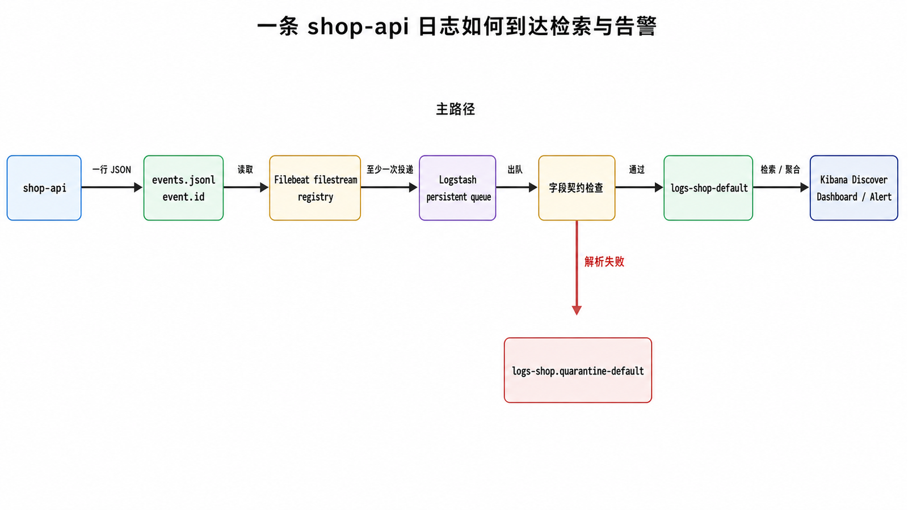
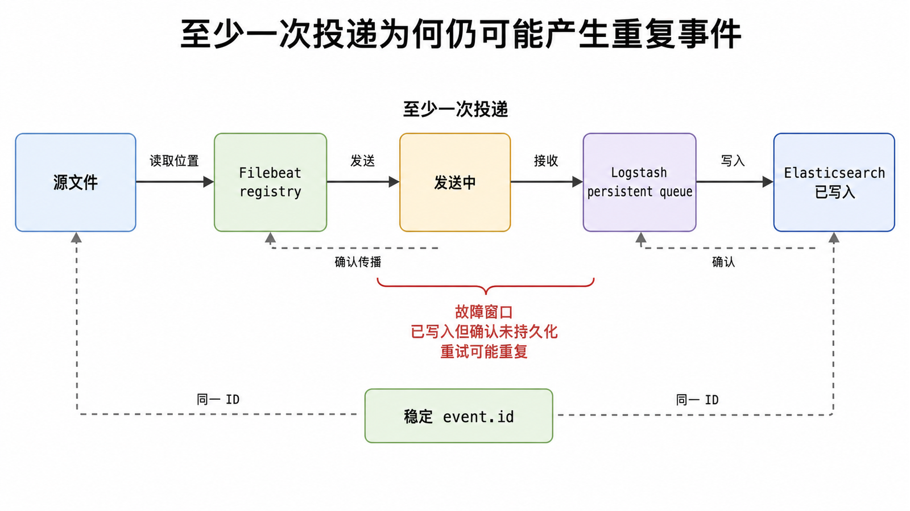

<!-- content-frozen: 2026-07-17; conceptual changes require storyboard reset -->

一条日志出现在应用文件里，却没有出现在 Kibana。问题可能发生在文件轮转、采集偏移、网络输出、Logstash 队列、字段解析、Mapping、Elasticsearch 写入或 Kibana 时间范围中的任意一层。可靠日志系统必须让每个阶段都有明确输入、输出、状态和失败去向。

## 前置知识与学习目标

你需要理解前四篇中的 Mapping、data stream 模板、集群部署与健康诊断。本文使用在线商店 `shop-api`，目标 data stream 为 `logs-shop-default`。示例以当前 Elastic Stack 9.x 概念为基准。

“ELK”历史上指 Elasticsearch、Logstash、Kibana；现代 Elastic Stack 还包含 Elastic Agent、Beats、Fleet、APM 等组件。本文保留读者熟悉的 ELK 称呼，但不会假设每条链路都必须经过 Logstash。

完成本文后，你应该能够：

1. 为日志事件定义稳定字段契约，并解释每个组件的职责。
2. 在直写 Elasticsearch 与引入 Logstash 之间做需求驱动选择。
3. 解释 Filebeat registry、Logstash persistent queue、至少一次投递和重复事件的关系。
4. 用固定 `event.id` 跟踪输入、中间状态、最终文档和告警条件。

## 核心问题：一条事件怎样穿过整条链路

本文只追踪这一条输入：

```json
{
  "@timestamp": "2026-07-17T12:00:00.000Z",
  "event.id": "evt-20260717-0001",
  "service.name": "shop-api",
  "service.environment": "production",
  "log.level": "ERROR",
  "message": "payment authorization timed out",
  "trace.id": "4bf92f3577b34da6a3ce929d0e0e4736",
  "order.id": "O-20260717-001"
}
```

这是一行 JSON（JSON Lines），不是把多行 Python 字典直接写入文件。`@timestamp` 表示事件发生时间；`event.id` 是端到端追踪与去重依据；`service.name` 和 `log.level` 用于精确过滤；`message` 用于全文搜索；`trace.id` 与 `order.id` 用于关联请求和业务对象。

<!-- figure:s05-f01 -->



主路径是：

```text
shop-api JSON Lines
  -> Filebeat filestream + registry
  -> Logstash beats input + persistent queue
  -> 字段校验 / 补充上下文 / 失败分流
  -> Elasticsearch logs-shop-default
  -> Kibana Discover / Dashboard / Alert
```

辅助路径是解析失败事件进入 `logs-shop.quarantine-default`，而不是污染正式 data stream 或静默丢弃。

## 组件职责与选择边界

| 组件          | 本文职责                                          | 不应承担的职责                                  |
| ------------- | ------------------------------------------------- | ----------------------------------------------- |
| 应用          | 输出一行一个结构化事件，提供业务上下文与稳定 ID   | 不等待 Kibana 写入完成，不在日志中记录密码/令牌 |
| Filebeat      | 读取文件、维护偏移、补充主机元数据、批量发送      | 不作为复杂业务规则引擎                          |
| Logstash      | 缓冲、解析、富化、条件路由和输出重试              | 不替代上游字段契约，也不保证 exactly-once       |
| Elasticsearch | 以 data stream 存储、索引、查询并执行生命周期管理 | 不修复语义错误或自动去除所有重复事件            |
| Kibana        | Discover、可视化、看板、规则与调查入口            | 不作为日志的持久化来源                          |

如果事件已经符合目标字段契约、只需少量 ingest processor，可以让 Elastic Agent/Filebeat 直写 Elasticsearch。若需要多输入汇聚、复杂解析、外部查表、条件路由、独立持久队列或多个输出，再引入 Logstash。组件越多，故障面和运维成本也越大。

## 应用端：先建立字段契约

Python 最小示例输出单行 JSON：

```python
import json
from datetime import datetime, timezone


def build_event(event_id: str, order_id: str) -> dict:
    return {
        "@timestamp": datetime.now(timezone.utc).isoformat().replace("+00:00", "Z"),
        "event": {"id": event_id},
        "service": {"name": "shop-api", "environment": "production"},
        "log": {"level": "ERROR"},
        "message": "payment authorization timed out",
        "trace": {"id": "4bf92f3577b34da6a3ce929d0e0e4736"},
        "order": {"id": order_id},
    }


print(json.dumps(build_event("evt-20260717-0001", "O-20260717-001"), ensure_ascii=False))
```

输入是 `event_id` 与 `order_id`；输出是可 JSON 编码的字典。关键中间状态是嵌套对象，编码后 ECS 风格字段在 Elasticsearch 中表示为 `event.id`、`service.name`。异常堆栈应放进明确字段如 `error.stack_trace`，避免依赖多行拼接；若必须采集传统多行日志，应在最靠近来源的 Filebeat parser 合并，防止多文件流在中心端交错。

隐私边界：禁止记录访问令牌、密码、完整银行卡号和不必要的个人数据。脱敏应尽量在应用或采集入口完成，并用测试样本验证；“以后在 Kibana 隐藏列”不等于数据没有被存储。

## Filebeat：读取、解码并记录偏移

使用 `filestream` input，而不是旧的 `log` input：

```yaml
filebeat.inputs:
  - type: filestream
    id: shop-api-json
    enabled: true
    paths:
      - /var/log/shop-api/events.jsonl
    parsers:
      - ndjson:
          target: ""
          add_error_key: true
          expand_keys: true

processors:
  - add_host_metadata: ~

output.logstash:
  hosts: ["logstash.internal:5044"]
  ssl.certificate_authorities: ["/etc/pki/ca.crt"]

logging.level: info
```

关键参数：

- `id` 在同一 agent 上必须稳定且唯一，便于 Filebeat 追踪 input 状态。
- `paths` 指向实际文件；容器环境要验证挂载路径和 inode/轮转行为。
- `ndjson.target: ""` 把 JSON 字段展开到根；字段冲突必须通过契约避免。
- `add_error_key: true` 让非法 JSON 产生可路由的 `error.*`，而不是静默丢失。
- TLS CA 让 Filebeat 验证 Logstash 身份；生产环境还应按安全要求配置客户端证书或受控网络身份。

Filebeat registry 记录已经读取/确认的文件状态。删除 registry 会让采集器失去偏移记忆，可能从头重读或按配置重新定位，造成重复或遗漏；事故中不要把清空 registry 当作第一步。

配置上线前执行：

```bash
filebeat test config -c /etc/filebeat/filebeat.yml
filebeat test output -c /etc/filebeat/filebeat.yml
```

第一个验证语法，第二个验证输出连通性；两者都不能证明目标事件最终可检索，仍需端到端测试。

## Logstash：缓冲、分流与至少一次投递

### 持久队列

在 `logstash.yml` 启用 persistent queue：

```yaml
queue.type: persisted
path.queue: /var/lib/logstash/queue
queue.max_bytes: 4gb
pipeline.ecs_compatibility: v8
```

`queue.max_bytes` 不是越大越安全。它决定磁盘预算与可吸收的下游中断窗口，估算需要输入峰值字节率、事件膨胀系数和目标缓冲时长；磁盘满仍会导致背压继续向 Filebeat 和源文件传播。

### 管道与失败分流

```ruby
input {
  beats {
    port => 5044
    ssl_enabled => true
    ssl_certificate_authorities => ["/etc/logstash/certs/ca.crt"]
    ssl_certificate => "/etc/logstash/certs/logstash.crt"
    ssl_key => "/etc/logstash/certs/logstash.pkcs8.key"
  }
}

filter {
  if ![service][name] or ![event][id] or ![@timestamp] {
    mutate { add_tag => ["_shop_contract_failure"] }
  }

  mutate {
    add_field => { "[@metadata][ingest_pipeline]" => "shop-logs-normalize-v1" }
  }
}

output {
  if [error][type] == "json" or "_shop_contract_failure" in [tags] {
    elasticsearch {
      hosts => ["https://es01:9200", "https://es02:9200"]
      api_key => "${ELASTIC_API_KEY}"
      ssl_enabled => true
      ssl_certificate_authorities => "/etc/logstash/certs/ca.crt"
      data_stream => "true"
      data_stream_type => "logs"
      data_stream_dataset => "shop.quarantine"
      data_stream_namespace => "default"
    }
  } else {
    elasticsearch {
      hosts => ["https://es01:9200", "https://es02:9200"]
      api_key => "${ELASTIC_API_KEY}"
      ssl_enabled => true
      ssl_certificate_authorities => "/etc/logstash/certs/ca.crt"
      data_stream => "true"
      data_stream_type => "logs"
      data_stream_dataset => "shop"
      data_stream_namespace => "default"
      pipeline => "%{[@metadata][ingest_pipeline]}"
    }
  }
}
```

输入是 Beats event；中间状态是契约检查标签与 `@metadata`；输出是正式 data stream 或隔离 data stream。真实部署中 API key 必须来自 Logstash keystore/秘密系统，不能写成明文。

Logstash persistent queue 能在进程重启和暂时下游故障时保存已接收事件，但不提供端到端 exactly-once。输出在“已写入 Elasticsearch、确认尚未持久化”这类边界重试时，事件可能重复。应用提供稳定 `event.id`，下游统计和告警才能识别重复；是否使用该 ID 作为 Elasticsearch `_id` 需要评估写入吞吐、覆盖语义与 data stream 约束。

<!-- figure:s05-f02 -->



Dead Letter Queue（DLQ）也不是任意错误的总保险箱。它主要处理特定输出无法交付的事件；解析失败需要像上例一样显式打标和路由。隔离流必须有访问控制、保留期、告警和修复/重放流程，否则只是把丢失变成不可见积压。

## Elasticsearch：Data Stream、模板与保留

上一篇配置文已经创建匹配 `logs-shop-*` 的 data stream 模板。首次写入前模拟模板，随后验证：

```http
POST /_index_template/_simulate_index/logs-shop-default
GET /_data_stream/logs-shop-default
GET /logs-shop-default/_mapping
GET /logs-shop-default/_ilm/explain
```

正式事件的字段类型应满足：

- `@timestamp`: `date`
- `event.id`, `service.name`, `service.environment`, `log.level`, `trace.id`, `order.id`: `keyword`
- `message`: `text`

若模板使用 `dynamic: strict`，未知字段会拒绝写入。这是契约保护，不是把严格模式关闭的理由；先在隔离流观察新字段，再评审 Mapping 版本和兼容策略。

自管 Elastic Stack 可用 ILM 管理 backing indices 的 rollover 与保留。Serverless 使用 data stream lifecycle 等对应能力。保留期要同时满足排障窗口、合规、成本和快照策略；删除阶段不可替代备份。

## Kibana：从固定事件到可行动告警

在 Discover 中选择匹配 `logs-shop-*` 的 data view，时间字段使用 `@timestamp`。用稳定 ID 进行第一条验收查询：

```text
event.id : "evt-20260717-0001"
```

再验证业务查询：

```text
service.name : "shop-api" and log.level : "ERROR" and @timestamp >= now-15m
```

告警不要只写“ERROR 数量 > 0”。至少定义：

- 查询与时间窗口，例如 5 分钟内 `shop-api` ERROR ≥ 20。
- 分组键，例如 `service.name`。
- 评估间隔、连续触发次数和恢复条件。
- 无数据（no data）与执行失败如何处理。
- 通知中携带 runbook、时间范围和可复现查询，不直接泄露敏感日志正文。

## 端到端验收：只追踪一个 `event.id`

1. **应用输出**：把固定事件追加到 `events.jsonl`，确认每个事件恰好一行且能被 `jq -c .` 解析。
2. **Filebeat 输入**：观察 input/harvester 日志与 registry 更新，不删除 registry。
3. **输出连接**：确认 Filebeat 无持续 publish error；Logstash beats input 有事件进入。
4. **队列状态**：观察 Logstash queue 与 pipeline 指标，确认没有持续增长或 output retry 风暴。
5. **分流结果**：合法事件进入 `logs-shop-default`；缺少 `event.id` 的测试事件进入 quarantine。
6. **Elasticsearch 查询**：按 `event.id` 搜索，核对 `_source`、Mapping 和 `@timestamp`。
7. **Kibana 时间语义**：Discover 时间范围覆盖事件时间，而不是只看采集时间。
8. **告警验证**：用可控测试事件跨过阈值，确认触发与恢复通知。

查询固定事件：

```http
GET /logs-shop-default/_search
{
  "query": {
    "term": {
      "event.id": "evt-20260717-0001"
    }
  }
}
```

预期 `hits.total.value >= 1`。若大于 1，先判断是否为重复投递；若为 0，按链路从应用文件向后检查，不能直接在 Kibana 反复刷新。

## 常见故障与恢复边界

| 症状                             | 先看哪里                            | 常见根因                           | 安全动作                                  |
| -------------------------------- | ----------------------------------- | ---------------------------------- | ----------------------------------------- |
| Filebeat 不读新日志              | input 日志、路径、权限、registry    | 路径挂载错误、inode/轮转行为、权限 | 修路径/权限并观察偏移；不要先删 registry  |
| Logstash queue 持续增长          | pipeline 指标、ES 输出错误          | 下游变慢、Mapping 拒绝、认证失败   | 保护磁盘，修复下游；必要时限流上游        |
| 正式流没有事件但 quarantine 增长 | `error.*`、失败标签、字段契约       | 非法 JSON、必需字段缺失            | 修应用格式或版本化 parser，再受控重放     |
| ES 返回 429                      | thread pool、写入延迟、分片与磁盘   | 写入过载或恢复争用                 | 降低/平滑输入，查容量；不要无限加大队列   |
| Kibana 看不到已写入事件          | 直接 `_search`、data view、时间范围 | 时间字段/时区、过滤器、权限        | 先用 API 按 `event.id` 验证，再修 UI 条件 |

恢复必须考虑磁盘上仍在增长的源日志、Filebeat registry、Logstash queue 与 Elasticsearch 已确认写入之间的相对状态。重置任何一层状态前先做备份和重复/遗漏评估。

## 常见误区

- **ELK 每条链都必须有 Logstash**：简单、契约稳定的事件可以直写；复杂路由和持久缓冲才需要它。
- **关闭防火墙或 SELinux 是安装步骤**：这会扩大攻击面；应配置明确端口、策略和证书。
- **日志是字符串，字段以后再说**：没有字段契约，就无法稳定过滤、聚合、告警和治理隐私。
- **Persistent Queue 等于 exactly-once**：重试边界仍可能重复，稳定 `event.id` 与幂等消费不可少。
- **DLQ 会自动接住所有坏事件**：解析错误必须显式标记和分流，DLQ 有明确适用范围。
- **只看 Kibana 验收**：UI 时间范围、data view 和权限都可能遮蔽数据；先用固定 ID 从 API 验证。

## 什么时候不适用

小规模、低保留、无需全文检索的日志可以使用更简单的本地轮转与集中归档；强指标聚合更适合指标系统，完整分布式追踪需要 APM/OpenTelemetry 设计。若事件量和团队能力无法承担多组件运维，应优先减少组件或使用托管方案。本文不比较其他日志平台，也不展开 trace 采样和成本采购。

## 读者自检

1. 什么情况下 Filebeat 可以直写 Elasticsearch，什么情况下值得加入 Logstash？
2. 为什么 persistent queue 不能保证端到端 exactly-once？
3. Kibana 搜不到一条日志时，为什么应先用 `event.id` 调 Elasticsearch API？

<details>
<summary>查看答案</summary>

1. 字段已符合契约且只需简单处理时可直写；需要复杂解析/富化、条件路由、独立持久缓冲或多个输出时再加入 Logstash。
2. 在下游已经写入但上游确认尚未持久化等故障窗口中，重试可能重复；队列只保存与重放事件，无法让跨组件确认成为一个原子事务。
3. API 能先证明数据是否真实写入并排除 data view、时间范围、UI 过滤器与 Kibana 权限等展示层变量。

</details>

## 本篇总结

可靠日志管理不是安装四个组件，而是建立一条有字段契约、偏移状态、背压、失败分流、保留策略和端到端验证的链路。用固定 `event.id` 穿透每层，以正式流和 quarantine 分离质量状态，并接受至少一次投递可能带来的重复。

## 下一篇衔接

Elasticsearch 主路径至此闭环。实际落地时，建议下一步建立三类运行手册：采集延迟、解析失败率和 data stream 写入/保留异常；每条告警都链接到本文的固定证据链和恢复边界。

## 资料来源

- [Elastic：The Elastic Stack](https://www.elastic.co/guide/en/elastic-stack/current/overview.html)
- [Elastic：Filebeat reference](https://www.elastic.co/docs/reference/beats/filebeat)
- [Elastic：Filestream input](https://www.elastic.co/docs/reference/beats/filebeat/filebeat-input-filestream)
- [Elastic：Deploying and scaling Logstash](https://www.elastic.co/docs/reference/logstash/deploying-scaling-logstash)
- [Elastic：Persistent queues](https://www.elastic.co/docs/reference/logstash/persistent-queues)
- [Elastic：Dead letter queues](https://www.elastic.co/docs/reference/logstash/dead-letter-queues)
- [Elastic：Set up a data stream](https://www.elastic.co/docs/manage-data/data-store/data-streams/set-up-data-stream)
- [Elastic：Explore logs in Discover](https://www.elastic.co/docs/solutions/observability/logs/explore-logs)
