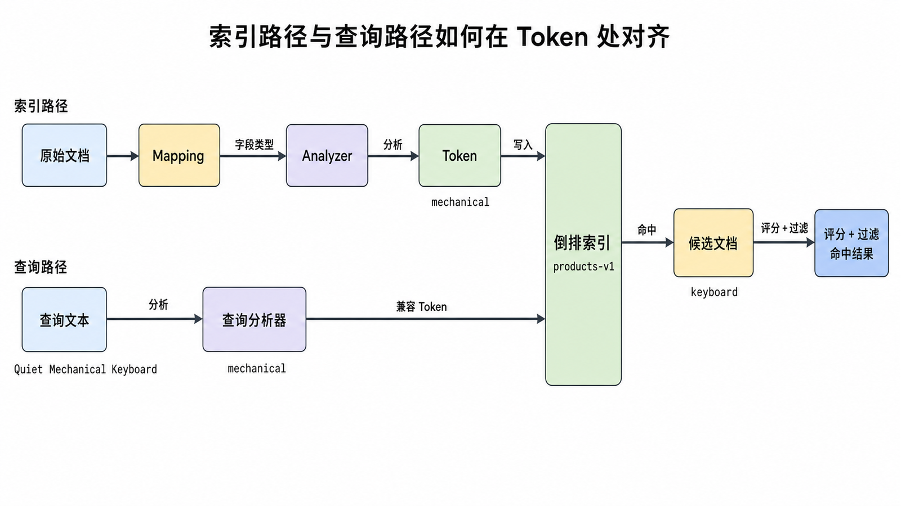
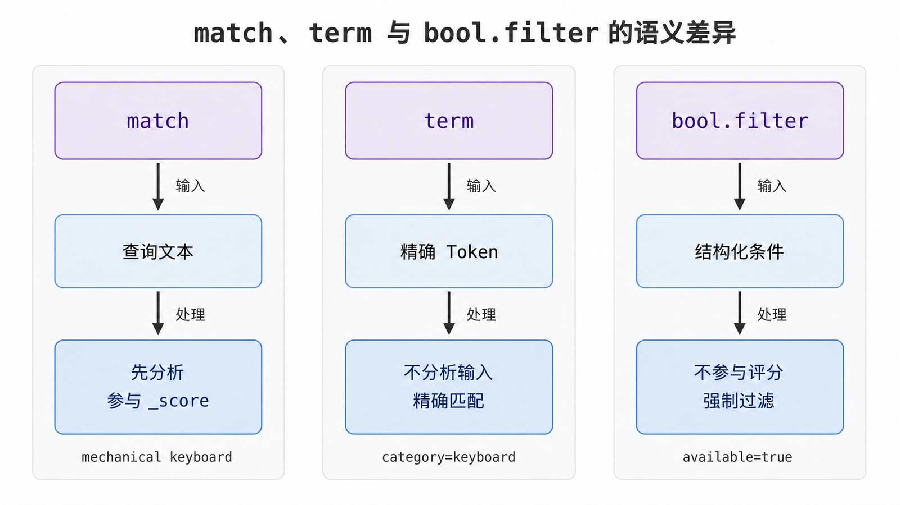

<!-- content-frozen: 2026-07-17; conceptual changes require storyboard reset -->

当用户搜索“静音机械键盘”时，系统不仅要找到包含完整短语的商品，还要识别“机械”“键盘”等词，过滤下架商品，并让更相关的结果排在前面。`LIKE '%机械键盘%'` 能做子串匹配，却没有解释文本、维护相关性和横向扩展的完整模型。Elasticsearch 的价值，正是把“写入文本”转换成可检索结构，再把“查询文本”转换成可比较的相关性证据。

## 前置知识与学习目标

阅读前只需要会读 JSON、发送 HTTP 请求，并理解数据库中的记录与字段。本文示例以 Elasticsearch 9.x 为基准；8.x 的核心概念相同，安全配置与个别 API 细节以对应版本文档为准。

完成本文后，你应该能够：

1. 解释文档从 Mapping、Analyzer、Token 到倒排索引的写入链路。
2. 根据字段用途选择 `text`、`keyword`、数值或日期类型。
3. 解释 `match`、`term`、`bool.filter` 对分析、评分和缓存语义的影响。
4. 用 `_analyze`、`_mapping` 和 `_search` 验证自己的判断，而不是猜测。

## 核心问题：文本怎样变成可搜索结果

全文检索有两条相互对应的路径：

- **索引路径**：原始文档 → Mapping → 字段分析 → Token → 倒排索引。
- **查询路径**：查询文本 → 查询分析 → Token → 倒排表命中 → 评分与过滤 → 命中文档。

两条路径必须在关键字段上使用兼容的分析方式。若写入时产生 Token `机械`、`键盘`，查询时却把整段输入当成一个未经分析的精确值，就可能得到零结果。

<!-- figure:s01-f01 -->



### Index、Document、Field 与 Mapping

本文贯穿一个在线商店示例：

- Index：`products-v1`，保存一组具有共同字段契约的商品文档。
- Document：一件商品的 JSON 对象，例如 `product_id=P-1001`。
- Field：`name`、`category`、`price`、`description` 等属性。
- Mapping：每个字段怎样被解析、索引和查询的契约。

关系型数据库的 Table/Row/Column 可以帮助入门，但不能当成严格等价关系。Elasticsearch 的字段可能被分析成多个 Token，同一文档会进入分片，Mapping 的错误类型通常不能原地修改，往往需要新建索引并 reindex。

## 索引时：分析器与倒排索引

### 先设计字段用途

下面的 Mapping 同时表达全文检索、精确过滤、聚合和范围查询需求：

```http
PUT /products-v1
{
  "settings": {
    "number_of_shards": 1,
    "number_of_replicas": 1
  },
  "mappings": {
    "dynamic": "strict",
    "properties": {
      "product_id": { "type": "keyword" },
      "name": { "type": "text" },
      "category": { "type": "keyword" },
      "price": { "type": "scaled_float", "scaling_factor": 100 },
      "description": { "type": "text" },
      "available": { "type": "boolean" },
      "created_at": { "type": "date" }
    }
  }
}
```

关键参数与边界：

| 配置              | 作用                                        | 失败边界                                                                |
| ----------------- | ------------------------------------------- | ----------------------------------------------------------------------- |
| `dynamic: strict` | 未声明字段立即拒绝，防止脏字段悄悄扩散      | 上游新增字段时会返回 `strict_dynamic_mapping_exception`，需要先变更契约 |
| `keyword`         | 保留完整值，适合 ID、状态、分类、排序和聚合 | 不适合按自然语言词语做全文检索                                          |
| `text`            | 经过分析器产生 Token，适合人类可读文本      | 默认不用于排序与普通 terms 聚合                                         |
| `scaled_float`    | 把价格按比例缩放为整数存储                  | `scaling_factor` 决定精度，改变精度通常需要重建索引                     |

这里把分片数设为 1 是为了让本地实验的输出容易解释，不是生产容量建议。生产分片数要由数据量、写入吞吐、查询并发、恢复时间目标和压测共同决定。

### 用 `_analyze` 观察中间状态

Analyzer 通常由字符过滤器（可选）、Tokenizer 和 Token Filter 组成。不要只背定义，直接检查输入和输出：

```http
POST /products-v1/_analyze
{
  "field": "name",
  "text": "Quiet Mechanical Keyboard"
}
```

使用默认 `standard` analyzer 时，关键中间状态近似为：

```json
{
  "input": "Quiet Mechanical Keyboard",
  "tokens": ["quiet", "mechanical", "keyboard"]
}
```

每个 Token 还带有位置和字符偏移。短语查询依赖 Token 的位置关系；高亮依赖偏移信息。中文没有天然空格边界，生产环境需要选择并测试适合语料的中文分析器，本文不假定某个第三方插件已经安装。

倒排索引可简化理解为“Token → 出现该 Token 的文档及位置信息”：

```text
keyboard   -> P-1001, P-1002
mechanical -> P-1001
quiet      -> P-1001
```

这不是 Elasticsearch 的完整磁盘结构，但足以解释为什么按词查找无需扫描每一条原始文本。

### 写入两个可比较文档

Bulk API 使用 NDJSON：动作行与文档行必须逐行出现，请求体末尾必须有换行。

```http
POST /_bulk
{ "index": { "_index": "products-v1", "_id": "P-1001" } }
{ "product_id": "P-1001", "name": "Quiet Mechanical Keyboard", "category": "keyboard", "price": 699.00, "description": "Hot-swappable keyboard with silent switches", "available": true, "created_at": "2026-07-17T08:00:00Z" }
{ "index": { "_index": "products-v1", "_id": "P-1002" } }
{ "product_id": "P-1002", "name": "Compact Office Keyboard", "category": "keyboard", "price": 299.00, "description": "Compact keyboard for office use", "available": false, "created_at": "2026-07-17T08:05:00Z" }
```

预期顶层输出应包含 `"errors": false`。若为 `true`，必须逐项检查 `items[*].index.error`，不能只看 HTTP 200；Bulk 请求允许部分成功。

## 查询时：分析、过滤与评分

### `match`：对全文字段先分析再查询

```http
GET /products-v1/_search
{
  "query": {
    "match": {
      "name": "mechanical keyboard"
    }
  }
}
```

输入是字符串，查询分析器会产生 `mechanical` 与 `keyboard`。输出的 `hits.hits[*]._score` 表示相关性证据；`P-1001` 同时包含两个词，通常会比只包含 `keyboard` 的文档更相关。具体分值受统计信息、查询结构和版本实现影响，不应硬编码为业务常量。

### `term`：不分析输入，匹配精确 Token

```http
GET /products-v1/_search
{
  "query": {
    "term": {
      "category": "keyboard"
    }
  }
}
```

`category` 是 `keyword`，索引中保存完整值 `keyboard`，因此 `term` 合适。不要对 `name` 直接执行 `term: "Mechanical Keyboard"` 并期待全文语义：`term` 不会替你把输入分析为两个小写 Token。

<!-- figure:s01-f02 -->



### `bool.filter`：表达必须满足但不参与相关性评分的条件

```http
GET /products-v1/_search
{
  "query": {
    "bool": {
      "must": [
        { "match": { "name": "mechanical keyboard" } }
      ],
      "filter": [
        { "term": { "available": true } },
        { "range": { "price": { "lte": 800 } } }
      ]
    }
  }
}
```

这里有三类状态：

1. `match` 产生候选并参与 `_score`。
2. `term available=true` 删除下架商品，不贡献分数。
3. `range price<=800` 再按结构化条件过滤。

预期只返回 `P-1001`。如果“是否上架”被放进 `should`，它可能只是加分而不是强制条件，业务语义就变了。

## 最小验证闭环

遇到“明明写入了却搜不到”时，按以下顺序验证：

```http
GET /products-v1/_mapping
POST /products-v1/_analyze
{
  "field": "name",
  "text": "mechanical keyboard"
}
GET /products-v1/_doc/P-1001
GET /products-v1/_search
{
  "explain": true,
  "query": { "match": { "name": "mechanical keyboard" } }
}
```

分别回答四个问题：字段类型是什么、查询产生哪些 Token、文档是否真实存在、每个命中为何得到当前分数。`explain: true` 成本较高，适合定点诊断，不应默认用于高流量生产查询。

## 常见误区

- **把 Index 当成数据库的完全替代品**：类比只能帮助定位概念，不能推出事务、约束和关联查询能力相同。
- **所有字符串都设成 `text`**：ID、状态和分类通常需要 `keyword`；否则精确过滤与聚合会变得困难。
- **在 `text` 字段上用 `term` 查自然语言**：`term` 不分析输入，常见结果是零命中或只命中偶然相同的 Token。
- **只看 Bulk 的 HTTP 状态**：Bulk 可能部分失败，必须检查顶层 `errors` 与每一项错误。
- **依赖动态 Mapping 猜字段**：第一条异常数据可能把字段推断成错误类型，后续文档会被拒绝或查询语义失真。

## 什么时候不适用

Elasticsearch 适合全文检索、结构化过滤、聚合和近实时分析，但不是所有数据的默认主库。如果核心需求是多表强事务、严格外键约束、极低规模的简单主键查询，关系型数据库通常更直接。若要求写入后立即对所有查询可见，要注意 Elasticsearch 的 refresh 与近实时语义；若要求向量语义搜索，需要另行设计 embedding、向量字段与召回评估，本文不展开。

## 读者自检

1. 为什么 `name` 适合 `text`，而 `category` 适合 `keyword`？
2. `match` 与 `term` 的输入处理差异是什么？
3. Bulk 返回 HTTP 200 是否能证明所有文档都写入成功？

<details>
<summary>查看答案</summary>

1. `name` 是人类可读文本，需要分词后按词和相关性搜索；`category` 是受控完整值，主要用于精确过滤、排序或聚合。
2. `match` 会对全文查询文本执行分析；`term` 把输入当作精确 Token，不执行全文分析。
3. 不能。Bulk 允许部分成功，必须检查顶层 `errors`，并检查失败项的 `status` 和 `error`。

</details>

## 本篇总结

Elasticsearch 搜索不是“把 JSON 放进去再模糊匹配”。Mapping 决定字段契约，Analyzer 把全文字段变成 Token，倒排索引把 Token 映射到文档；查询端再用兼容的分析方式产生候选，用结构化 filter 收紧集合，并用相关性评分排序。任何搜索异常都可以从 Mapping、Token、原始文档和 Explain 四层逐步验证。

## 下一篇衔接

现在我们有了可验证的 `products-v1` 工作负载。下一篇将回答：怎样把这个索引放进一个能正确发现节点、完成首次选主、承受节点故障并可从快照恢复的集群。

## 资料来源

- [Elastic：Text field type](https://www.elastic.co/docs/reference/elasticsearch/mapping-reference/text)
- [Elastic：Keyword type family](https://www.elastic.co/docs/reference/elasticsearch/mapping-reference/keyword)
- [Elastic：Analyze API](https://www.elastic.co/docs/api/doc/elasticsearch/operation/operation-indices-analyze)
- [Elastic：Match query](https://www.elastic.co/docs/reference/query-languages/query-dsl/query-dsl-match-query)
- [Elastic：Term query](https://www.elastic.co/docs/reference/query-languages/query-dsl/query-dsl-term-query)
- [Elastic：Bulk API](https://www.elastic.co/docs/api/doc/elasticsearch/operation/operation-bulk)
