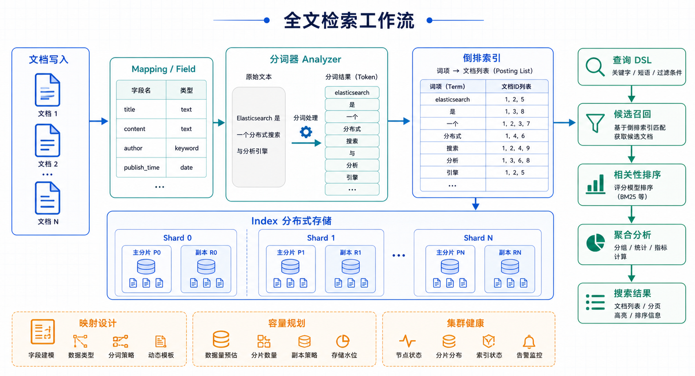

> Elasticsearch 是一个基于 Lucene 的分布式、RESTful 风格的搜索和数据分析引擎，广泛应用于日志分析、全文搜索等场景。

## 阅读导览

这篇文章聚焦入门使用：先理解 Index、Document、Field、Shard 和 Replica，再掌握索引创建、文档写入、查询 DSL 与聚合。真正进入生产前，还需要继续关注映射设计、分词器、容量规划和集群健康。



## 核心概念

### 数据结构对比

| 关系型数据库 | Elasticsearch | 说明 |
|--------------|---------------|------|
| Database | Index | 数据库 |
| Table | Type（已废弃） | 数据表 |
| Row | Document | 数据行 |
| Column | Field | 数据列 |

### 分片与副本

| 概念 | 说明 |
|------|------|
| **分片** | 数据水平切分，支持海量存储 |
| **副本** | 数据备份，提高可用性 |

## 基本操作

### 索引操作

```bash
# 创建索引
PUT /my_index
{
  "settings": {
    "number_of_shards": 3,
    "number_of_replicas": 1
  },
  "mappings": {
    "properties": {
      "title": { "type": "text", "analyzer": "ik_max_word" },
      "content": { "type": "text" },
      "author": { "type": "keyword" },
      "created_at": { "type": "date" }
    }
  }
}

# 查看索引列表
GET /_cat/indices?v

# 删除索引
DELETE /my_index
```

### 文档操作

```bash
# 插入文档
PUT /my_index/_doc/1
{
  "title": "Elasticsearch 入门",
  "content": "Elasticsearch 是一个强大的全文搜索引擎",
  "author": "张三",
  "created_at": "2024-01-01T10:00:00"
}

# 查询文档
GET /my_index/_doc/1

# 批量操作
POST /_bulk
{"index":{"_index":"my_index","_id":"2"}}
{"title":"批量插入"}
```

## 查询操作

### 精确查询

```bash
# 全文搜索
GET /my_index/_search
{
  "query": {
    "match": { "content": "搜索" }
  }
}

# 短语搜索
GET /my_index/_search
{
  "query": {
    "match_phrase": { "content": "强大的全文搜索" }
  }
}

# 关键词搜索
GET /my_index/_search
{
  "query": {
    "term": { "author": "张三" }
  }
}

# 范围查询
GET /my_index/_search
{
  "query": {
    "range": { "views": { "gte": 100, "lte": 1000 } }
  }
}
```

### 复合查询

```bash
GET /my_index/_search
{
  "query": {
    "bool": {
      "must": [{ "match": { "title": "Elasticsearch" } }],
      "should": [{ "match": { "tags": "搜索" } }],
      "filter": { "range": { "views": { "gte": 100 } } }
    }
  },
  "highlight": {
    "fields": { "content": {} }
  }
}
```

### 聚合查询

```bash
GET /my_index/_search
{
  "size": 0,
  "aggs": {
    "author_count": {
      "terms": { "field": "author", "size": 10 }
    },
    "total_views": { "sum": { "field": "views" } }
  }
}
```

## Python 客户端

```python
from elasticsearch import Elasticsearch

es = Elasticsearch(['http://localhost:9200'])

# 插入文档
doc = {
    'title': 'Python Elasticsearch',
    'content': '使用 Python 操作 Elasticsearch',
    'author': '张三'
}
es.index(index='my_index', id=1, document=doc)

# 搜索
result = es.search(index='my_index', body={
    'query': { 'match': { 'content': '搜索' } }
})

for hit in result['hits']['hits']:
    print(hit['_source'])
```

## 小结

- **分布式存储**：支持海量数据
- **全文搜索**：强大的查询能力
- **聚合分析**：实时数据分析
- **RESTful API**：易集成

实践时建议先设计好字段类型和查询模式，再创建索引模板。频繁变更 mapping、盲目增加分片或把所有字段都设成 `text`，都会让后期检索和维护变复杂。
