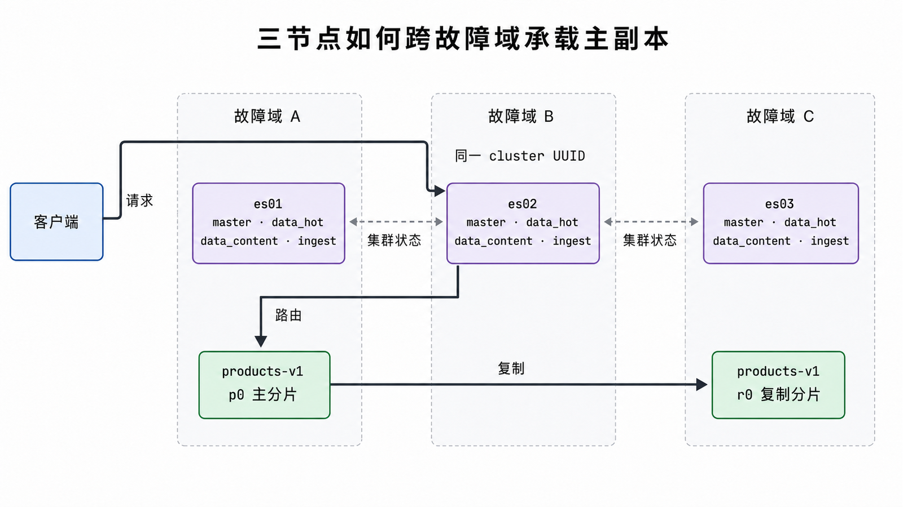
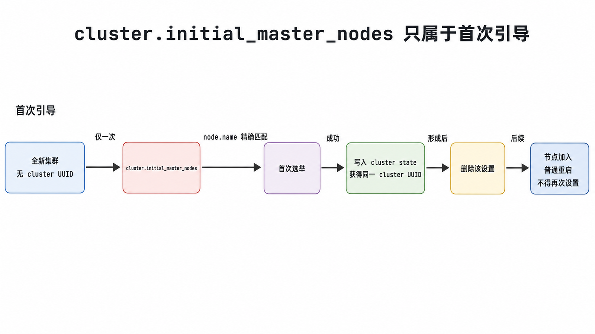

<!-- content-frozen: 2026-07-17; conceptual changes require storyboard reset -->

“三个进程都能访问 9200 端口”不等于“得到了一个可恢复集群”。真正的部署结果必须同时回答：谁能参与选主、数据副本落在哪些故障域、节点怎样发现彼此、第一次引导与以后重启有何不同、凭证和传输怎样保护，以及节点或磁盘损坏后如何恢复。

## 前置知识与学习目标

你需要先理解上一篇的 Index、Primary Shard 与 Replica Shard，并能使用 Docker Compose 或 Linux 服务管理工具。本文示例以 Elasticsearch 9.x 自管集群为基准；云托管、ECK 和跨集群复制不在本文范围。

完成本文后，你应该能够：

1. 区分本地单节点验证、三节点实验集群和生产拓扑。
2. 解释 `discovery.seed_hosts` 与 `cluster.initial_master_nodes` 的职责和生命周期。
3. 根据可用性与恢复目标安排可选主节点、数据节点、持久化目录和快照仓库。
4. 用节点、集群、分片、TLS 与恢复演练证据验收部署，而不是只看端口。

## 从恢复目标反推拓扑

继续使用在线商店的 `products-v1`。假设目标是：任意一个节点停止时搜索仍可用；同一分片的主副本不落在同一节点；每天有快照；内部传输与 HTTP 都需要认证和 TLS。

一个小型生产起点可以是三个跨故障域的节点，每个节点同时承担 `master` 与数据角色。规模增大后再把可选主职责与数据层分离。关键不是“角色越专用越专业”，而是同一故障不会同时带走投票多数和唯一数据副本。

<!-- figure:s02-f01 -->



### 角色与故障域

| 对象                   | 主要职责                           | 部署约束                                            |
| ---------------------- | ---------------------------------- | --------------------------------------------------- |
| 可选主节点             | 维护 cluster state、参与选举       | 需要稳定低延迟通信；典型生产拓扑使用 3 个可选主节点 |
| 数据节点               | 保存分片并执行索引、查询和聚合     | 主副本应跨节点/故障域；磁盘与恢复带宽必须容量化     |
| Ingest 节点            | 运行 ingest pipeline               | 复杂管道可与数据节点隔离，避免处理峰值拖慢搜索      |
| Coordinating-only 节点 | 接收请求、scatter/gather、归并结果 | 仍需足够内存；它不是“零成本负载均衡器”              |

所有节点都知道集群状态并可协调请求。不要用“主节点处理所有查询”来理解 Elasticsearch；当选主节点应尽量避免承受重查询与批量写入。

## 先建立可丢弃的本地验证环境

下面命令只用于单机学习。它关闭安全功能并使用临时容器，不可直接作为生产模板：

```bash
docker run --rm --name es-local \
  -p 127.0.0.1:9200:9200 \
  -e discovery.type=single-node \
  -e xpack.security.enabled=false \
  -e ES_JAVA_OPTS="-Xms1g -Xmx1g" \
  docker.elastic.co/elasticsearch/elasticsearch:9.4.2
```

另一个终端验证：

```bash
curl --fail --silent http://127.0.0.1:9200/
curl --fail --silent http://127.0.0.1:9200/_cluster/health?pretty
```

预期根响应包含版本号，健康响应包含 `number_of_nodes: 1`。若 `products-v1` 配置了 1 个副本，单节点环境会是 `yellow`，因为 Elasticsearch 不会把副本放在与主分片相同的节点；这在本地实验中是可解释状态，不应通过伪造第二个进程或盲目改配置掩盖。

## 三节点集群的形成过程

每个节点至少需要稳定的 `cluster.name`、唯一 `node.name`、明确角色、数据路径、网络地址与发现种子。9.x 使用 `node.roles`，不要再使用旧的 `node.master`、`node.data` 和 `node.ingest` 布尔键。

以 `es01` 为例：

```yaml
cluster.name: shop-search
node.name: es01
node.roles: [master, data_hot, data_content, ingest]
path.data: /var/lib/elasticsearch
path.logs: /var/log/elasticsearch
network.host: 10.20.0.11
http.port: 9200
transport.port: 9300
discovery.seed_hosts:
  - 10.20.0.11:9300
  - 10.20.0.12:9300
  - 10.20.0.13:9300
cluster.initial_master_nodes: [es01, es02, es03]
```

`es02`、`es03` 只替换 `node.name` 与 `network.host`。`discovery.seed_hosts` 是节点寻找潜在集群成员的入口；它不是完整成员清单，也不决定谁最终当选主节点。

### 首次引导不是日常配置

`cluster.initial_master_nodes` 只用于**全新集群第一次形成投票配置**。其中的值必须与 `node.name` 精确一致，只应放在可选主节点上。集群成功形成后：

1. 从所有配置中删除该设置。
2. 节点加入现有集群、普通重启、滚动重启和完整集群重启时都不要再次设置。
3. 不要为了修复“master not discovered”而随意创建另一套初始投票配置，否则可能形成与原集群无关的新集群并带来数据风险。

<!-- figure:s02-f02 -->



首次引导的状态链是：

```text
全新且无 cluster UUID
  -> 三个 node.name 形成初始投票配置
  -> 选出主节点并写入 cluster state
  -> 所有节点获得同一个 cluster UUID
  -> 删除 cluster.initial_master_nodes
  -> 后续只执行加入或重启
```

验收时不要只比 `cluster.name`，还要比较 cluster UUID：

```bash
for host in 10.20.0.11 10.20.0.12 10.20.0.13; do
  curl --fail --silent --cacert ca.crt \
    -u "$ES_USER:$ES_PASSWORD" \
    "https://$host:9200/" | jq '{name,cluster_name,cluster_uuid}'
done
```

三个响应应具有同一个 `cluster_uuid`，节点名各不相同。

## 数据、内存与主机边界

Elasticsearch 发行包自带兼容 JDK；除非有明确支持矩阵和运维理由，不需要另外安装 JDK。生产环境应使用专用非 root 账号、持久化数据卷，并让每个节点拥有独立数据目录。

硬件不存在脱离负载的“推荐数字”。容量规划至少要测量：

- 每日原始与索引后数据增量、保留期和副本数。
- 写入峰值、查询并发、聚合复杂度与允许延迟。
- 单节点失败后需要搬迁的数据量和恢复时间目标（RTO）。
- 快照增量、仓库吞吐与可接受的数据丢失窗口（RPO）。

Elasticsearch 默认会根据节点角色与可用内存自动设置 JVM heap。优先保留默认自动 sizing；只有压测和 GC/内存证据表明需要时，才在 `jvm.options.d` 中设置相等的 `Xms`/`Xmx`。Heap 之外还要为 filesystem cache 和直接内存留空间。

主机侧至少验证文件描述符、线程数、swap 和 `vm.max_map_count`。具体阈值应跟随当前官方文档与安装方式；不要复制旧博客中的固定数字后就认为 bootstrap checks 一定通过。

## 安全与秘密管理

当前 Elasticsearch 首次启动会进行安全自动配置。生产环境必须保留认证与 TLS，不要把 `xpack.security.enabled: false` 当成排障捷径。部署验收至少覆盖：

- HTTP 客户端校验 CA，凭证不写入 Markdown、镜像或 Git。
- transport TLS 保护节点间通信，节点证书的 SAN 与实际地址匹配。
- 应用使用 API key 或最小权限服务账号，不共享超级用户。
- 密码、私钥和 keystore 通过受控秘密系统分发并可轮换。

最小权限验证应同时包含成功与拒绝用例：应用账号能读写 `products-*`，但不能修改 cluster settings 或读取其他业务索引。

## 快照与恢复演练

复制某个节点的 `path.data` 不是受支持的集群备份。快照由 Elasticsearch 协调分片状态并写入仓库；所有相关节点必须能访问仓库，仓库权限与保留策略要单独管理。

注册仓库前，文件系统仓库需在各节点配置 `path.repo`；对象存储仓库需要对应插件/客户端与凭证。示例：

```http
PUT /_snapshot/shop-backup
{
  "type": "fs",
  "settings": {
    "location": "/mnt/es-backups/shop",
    "compress": true
  }
}
```

执行并等待完成：

```http
PUT /_snapshot/shop-backup/pre-release-20260717?wait_for_completion=true
{
  "indices": "products-v1",
  "include_global_state": false
}
```

成功输出应为 `snapshot.state: SUCCESS` 且没有失败分片。真正的恢复验收要在隔离环境或使用重命名规则执行 restore，验证文档数量、抽样查询、Mapping 和应用权限；“快照 API 返回 200”不足以证明可恢复。

## 故障注入与部署验收

按从低风险到高风险顺序执行：

1. **配置静态检查**：容器用 `docker compose config`，服务包检查 YAML、目录权限和 bootstrap checks。
2. **身份检查**：三个节点返回相同 cluster UUID；`_cat/nodes?v` 显示预期角色。
3. **数据检查**：创建 `products-v1`，写入样例，确认主副本分布在不同节点。
4. **单节点停止**：一次只停一个节点，确认集群仍有主节点、查询仍成功，并观察分片状态变化。
5. **恢复检查**：节点重新加入后等待分片恢复，再次核对文档和健康状态。
6. **快照恢复**：把快照恢复为新名称并执行固定查询断言。

验证命令：

```http
GET /
GET /_cat/nodes?v&h=name,ip,node.role,master
GET /_cluster/health?wait_for_status=yellow&timeout=30s
GET /_cat/shards/products-v1?v&h=index,shard,prirep,state,node
GET /_snapshot/shop-backup/pre-release-20260717
```

`wait_for_status=yellow` 表示等待达到 yellow 或更好，不代表最终目标一定是 yellow。生产多节点集群通常应在恢复窗口后回到 green。

## 常见误区

- **把三个独立单节点当成一个三节点集群**：必须核对 cluster UUID 和节点列表。
- **永久保留 `cluster.initial_master_nodes`**：它不是发现配置，重复引导可能创建错误集群。
- **在同一宿主机放多个副本就宣称高可用**：宿主机仍是共同故障域。
- **固定给 JVM 一半内存就结束容量规划**：heap、filesystem cache、直接内存、容器限制和工作负载必须一起测量。
- **备份数据目录**：文件复制无法替代一致的 Snapshot API。
- **为快速连通关闭 TLS 与认证**：本地回环实验可以明确降级，生产环境必须通过证书与最小权限解决问题。

## 什么时候不适用

单机 Docker 适合学习 API 和执行可丢弃测试，不适合验证跨故障域高可用。三个混合角色节点适合小型起点，不适合所有规模；当 cluster state、索引数量、查询协调或 ingest 负载增长时，需要基于监控和压测拆分角色。若团队不具备补丁、证书、备份和 24×7 值守能力，托管 Elastic 服务可能比自管更合理。

## 读者自检

1. `discovery.seed_hosts` 与 `cluster.initial_master_nodes` 有什么不同？
2. 为什么三个节点都能返回 `cluster.name=shop-search` 仍不能证明它们属于同一集群？
3. 为什么复制 `path.data` 不是可靠备份？

<details>
<summary>查看答案</summary>

1. 前者提供发现入口，后者只定义全新集群第一次选举的初始可选主节点集合；首次形成后必须删除后者。
2. 多个独立集群可以使用同一名字；必须核对相同的 cluster UUID 和一致节点视图。
3. 节点目录包含并发变化的分片和元数据，文件复制无法获得受支持的一致集群快照；应使用 Snapshot API 并做恢复演练。

</details>

## 本篇总结

部署的完成条件不是进程存活，而是拓扑、发现、首次引导、故障域、安全、数据持久化和恢复演练都有证据。先用可丢弃单节点验证 API，再用统一 cluster UUID、角色分布、分片副本、单节点故障和快照恢复验收真实集群。

## 下一篇衔接

集群已经形成，但“能运行”还不等于“配置正确”。下一篇将把静态节点设置、动态集群设置和索引/数据流模板分层，建立可验证、可回滚的配置变更流程。

## 资料来源

- [Elastic：Start a multi-node cluster with Docker Compose](https://www.elastic.co/docs/deploy-manage/deploy/self-managed/install-elasticsearch-docker-compose)
- [Elastic：Discovery and cluster formation settings](https://www.elastic.co/docs/reference/elasticsearch/configuration-reference/discovery-cluster-formation-settings)
- [Elastic：Important Elasticsearch configuration](https://www.elastic.co/docs/deploy-manage/deploy/self-managed/important-settings-configuration)
- [Elastic：Node roles](https://www.elastic.co/docs/deploy-manage/distributed-architecture/clusters-nodes-shards/node-roles)
- [Elastic：Set up basic security](https://www.elastic.co/docs/deploy-manage/security/set-up-minimal-security)
- [Elastic：Snapshot and restore](https://www.elastic.co/docs/deploy-manage/tools/snapshot-and-restore)
