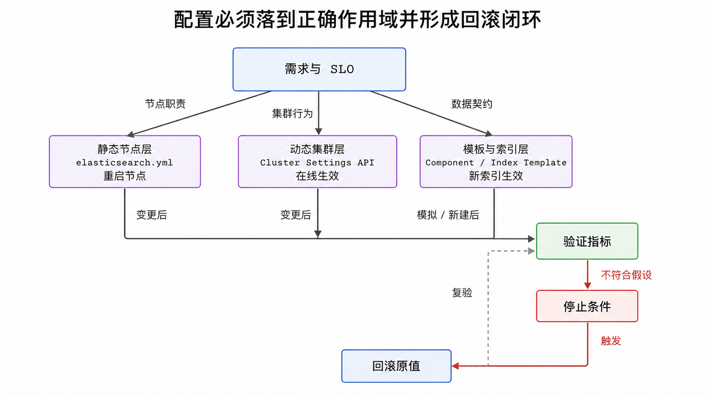

<!-- content-frozen: 2026-07-17; conceptual changes require storyboard reset -->

配置 Elasticsearch 最危险的方式，是从别人的 `elasticsearch.yml` 复制几十个参数，却不知道它们由谁读取、何时生效、覆盖什么默认值、失败后怎样回滚。可靠配置应从需求出发，并明确落在哪一层：节点启动层、动态集群层，还是新索引/数据流的模板层。

## 前置知识与学习目标

你需要已经完成上一篇的集群部署，理解节点角色、发现、首次引导、分片和快照。本文继续使用 `es01/es02/es03`、商品索引 `products-v1` 与日志数据流 `logs-shop-default`。

完成本文后，你应该能够：

1. 区分静态节点设置、动态集群设置和索引模板，判断是否需要重启。
2. 使用当前 `node.roles`、组合模板与 data stream 配置，避免旧 API。
3. 为每次变更定义假设、观测指标、验证查询、回滚值和停止条件。
4. 解释为什么 JVM、breaker、refresh、分片数都不存在脱离负载的万能值。

## 三层配置模型

<!-- figure:s03-f01 -->



| 层级         | 典型载体                                       | 作用对象                   | 生效方式                    | 示例                                      |
| ------------ | ---------------------------------------------- | -------------------------- | --------------------------- | ----------------------------------------- |
| 静态节点层   | `elasticsearch.yml`、keystore、`jvm.options.d` | 单个节点进程               | 通常重启节点                | `node.roles`、`path.data`、`network.host` |
| 动态集群层   | Cluster Update Settings API                    | 当前集群                   | 在线生效                    | 分片分配开关、恢复限速                    |
| 模板与索引层 | Component/Index Template、创建索引设置         | 匹配的新索引或 data stream | 新 backing index 创建时生效 | Mapping、分片数、生命周期策略             |

同名设置的来源可能不同。动态集群设置通常覆盖配置文件默认值；模板只影响匹配且在模板应用后新建的索引，不能反向改写旧索引的 Mapping。每次排查都要问“我看到的值来自哪里”和“它影响的是已有对象还是未来对象”。

## 静态节点层：身份、角色和边界

### 最小可解释配置

`es01` 的核心配置可以保持短小：

```yaml
cluster.name: shop-search
node.name: es01
node.roles: [master, data_hot, data_content, ingest]
path.data: /var/lib/elasticsearch
path.logs: /var/log/elasticsearch
network.host: 10.20.0.11
http.port: 9200
transport.port: 9300
discovery.seed_hosts:
  - 10.20.0.11:9300
  - 10.20.0.12:9300
  - 10.20.0.13:9300
```

这里没有 `cluster.initial_master_nodes`，因为集群在上一篇已经完成首次引导。也没有旧版的 `node.master: true`、`node.data: true`、`transport.tcp.port`；9.x 应使用 `node.roles` 与 `transport.port`。

`node.roles` 的每个值都是职责声明：

- `master`：可参与选主并维护 cluster state。
- `data_content`：承载普通内容索引，如 `products-v1`。
- `data_hot`：承载数据流的热层 backing indices，如新写入日志。
- `ingest`：执行 ingest pipeline。

从数据节点移除 data role 前必须先迁走分片并确认数据目录满足 repurpose 条件，不能只改 YAML 后重启。改变角色是一次数据与容量迁移，不是文本编辑。

### 安全设置与 keystore

证书路径等静态设置可写入配置，但密码、云仓库密钥和安全字符串应进入 Elasticsearch keystore 或外部秘密系统：

```bash
bin/elasticsearch-keystore add s3.client.default.access_key
bin/elasticsearch-keystore add s3.client.default.secret_key
```

命令从标准输入交互读取秘密。不要把真实值放进 Shell history、环境转储、Compose 文件或 Git。变更后使用 reload secure settings 或按设置要求滚动重启，并验证依赖功能，而不是打印秘密确认。

## JVM 与主机：先接受默认，再用证据推翻

Elasticsearch 默认根据节点角色和可用内存自动配置 heap，通常应保留。只有出现持续 GC 压力、circuit breaker、容器内存与节点角色不匹配等证据，并经过压测后，才在 `jvm.options.d/heap.options` 中覆盖：

```text
-Xms8g
-Xmx8g
```

两者保持相等只是稳定 heap 边界，不表示 8 GiB 适合所有节点。停止条件也要预先定义，例如：若 p99 查询延迟改善不足且 old GC pause 增加，则回滚。不要复制 `NewSize`、`MaxNewSize`、固定 GC 参数等旧模板；现代 JDK 与 Elasticsearch 的默认策略会演进。

主机设置由安装方式决定。对自管 Linux，至少检查：

```bash
ulimit -n
sysctl vm.max_map_count
swapon --show
```

预期值必须满足当前版本 bootstrap checks。容器场景还要同时检查宿主机 sysctl、容器 memory limit 和进程实际可见内存；只看容器内 YAML 不够。

## 动态集群层：在线变更必须可回滚

先读取显式值与默认值：

```http
GET /_cluster/settings?include_defaults=true&flat_settings=true
```

假设节点恢复占满网络，需要临时把恢复带宽设为 `80mb`。使用 persistent 设置，并在变更单中保存原值：

```http
PUT /_cluster/settings
{
  "persistent": {
    "indices.recovery.max_bytes_per_sec": "80mb"
  }
}
```

验证不只是“API 成功”，还要观察恢复吞吐、业务 p95/p99 延迟、写入拒绝和恢复预计完成时间。若效果不符合假设，用 `null` 清除显式覆盖，回到下层配置或默认值：

```http
PUT /_cluster/settings
{
  "persistent": {
    "indices.recovery.max_bytes_per_sec": null
  }
}
```

不要用 transient 设置保存长期意图；它可能在不显眼的时机消失，也增加配置来源复杂度。对 `cluster.routing.allocation.enable` 这类影响分片的开关，必须写明自动恢复时间或人工回滚负责人，避免维护结束后仍停留在受限状态。

## 模板层：为未来索引定义契约

日志采用 data stream `logs-shop-default`。先创建可复用 Mapping 组件：

```http
PUT /_component_template/shop-logs-mappings-v1
{
  "template": {
    "mappings": {
      "dynamic": "strict",
      "properties": {
        "@timestamp": { "type": "date" },
        "service.name": { "type": "keyword" },
        "log.level": { "type": "keyword" },
        "message": { "type": "text" },
        "trace.id": { "type": "keyword", "ignore_above": 256 }
      }
    }
  },
  "_meta": {
    "owner": "observability",
    "schema_version": 1
  }
}
```

再创建 index template：

```http
PUT /_index_template/shop-logs-v1
{
  "index_patterns": ["logs-shop-*"],
  "priority": 200,
  "data_stream": {},
  "composed_of": ["shop-logs-mappings-v1"],
  "template": {
    "settings": {
      "index.number_of_shards": 1,
      "index.number_of_replicas": 1,
      "index.refresh_interval": "5s"
    }
  },
  "_meta": {
    "owner": "observability",
    "change_ticket": "OBS-20260717"
  }
}
```

关键参数：

- `index_patterns` 决定候选范围，过宽会误伤其他索引。
- `priority` 解决多个匹配模板的优先级；同优先级冲突要在上线前消除。
- `data_stream: {}` 声明此模板可创建 data stream。
- `composed_of` 组合可版本化组件。
- `refresh_interval: 5s` 用可见性延迟换取部分写入效率，只适合能接受该近实时窗口的日志场景。

在创建真实数据前模拟模板：

```http
POST /_index_template/_simulate_index/logs-shop-default
```

输出应显示命中的模板与最终合成设置。若 `overlapping` 或合成结果出现意外 Mapping，先修模板再写数据。

### 已有索引与未来索引不是同一个变更面

`index.number_of_replicas`、`refresh_interval` 等部分设置可对已有索引动态修改；主分片数通常不能原地改变。字段从 `text` 改为 `keyword` 也不能安全原地变换，应创建 `products-v2`、reindex、验证数量与查询，再切换 alias。

```http
POST /_aliases
{
  "actions": [
    { "remove": { "index": "products-v1", "alias": "products-read" } },
    { "add": { "index": "products-v2", "alias": "products-read" } }
  ]
}
```

同一个 alias 更新请求是原子的，但应用写入双写、数据增量追赶和回滚仍需单独设计。

## 一次配置变更的完整记录

以 `refresh_interval: 1s → 5s` 为例，变更单至少包含：

```text
目标：降低 logs-shop-default 写入压力
假设：业务允许最多约 5 秒搜索可见性延迟
范围：shop-logs-v1 模板与下一代 backing index
前置基线：写入吞吐、refresh time、搜索可见性、p99 查询延迟
验证：simulate template；rollover 后读取新 backing index 设置；端到端写入并计时可见
停止条件：可见性超过 SLO 或查询错误率上升
回滚：模板改回 1s；必要时 rollover 生成使用回滚设置的新 backing index
```

配置值本身不是目标；可观测、可回滚的业务效果才是目标。

## 常见误区

- **把所有配置放进 `elasticsearch.yml`**：动态集群设置和模板有不同生命周期，混放会造成来源不清。
- **在现有集群重新设置首次引导列表**：`cluster.initial_master_nodes` 不属于日常配置。
- **直接复制 breaker、thread pool 或 GC 数值**：没有工作负载与监控证据的“调优”往往只是改变故障形态。
- **创建模板后认为旧索引已更新**：模板主要作用于之后创建的索引或 backing index。
- **把 CORS 设为 `*` 暴露集群**：浏览器直连 Elasticsearch 通常扩大攻击面，应通过受控后端与最小权限访问。
- **只记录新值，不记录原值和回滚 API**：故障时就无法快速恢复已知状态。

## 什么时候不适用

本文的三层模型适用于自管 Elasticsearch。Elastic Cloud、ECK 和 Serverless 会接管部分节点与生命周期设置，应使用对应控制面而不是强行写入不可用参数。固定分片数、refresh、heap 或恢复限速都不能跨业务照搬；没有数据规模和 SLO 时，只能先保守使用默认值并建立测量。

## 读者自检

1. 修改 `node.roles` 与修改 `indices.recovery.max_bytes_per_sec` 的生效方式有何不同？
2. 为什么创建新的 index template 不会自动修复 `products-v1` 的错误字段类型？
3. 一次配置变更除了新值，至少还要记录哪些信息？

<details>
<summary>查看答案</summary>

1. `node.roles` 是节点静态设置，通常需要安全迁移职责并重启；恢复限速是动态集群设置，可通过 API 在线修改和清除。
2. 模板在索引或 backing index 创建时合成设置；已有 Mapping 不会被模板回写，字段类型变更通常需要新索引与 reindex。
3. 目标、假设、范围、基线指标、验证方法、停止条件、原值/回滚动作和负责人。

</details>

## 本篇总结

先判断配置属于节点、集群还是未来索引，再决定载体和生效方式。静态设置保持最小化；动态设置保存原值并可清除；模板先模拟再创建真实对象。JVM 和性能参数都应由 SLO、压测和监控驱动，而不是由“最佳实践数字”驱动。

## 下一篇衔接

配置定义了预期状态，下一篇将把这些预期变成诊断证据：从 cluster health 找到具体未分配分片，读取 allocation decider，并只在根因明确后选择可逆修复动作。

## 资料来源

- [Elastic：Node settings](https://www.elastic.co/docs/reference/elasticsearch/configuration-reference/node-settings)
- [Elastic：Cluster update settings API](https://www.elastic.co/docs/api/doc/elasticsearch/operation/operation-cluster-put-settings)
- [Elastic：Index templates](https://www.elastic.co/docs/manage-data/data-store/templates)
- [Elastic：Simulate index template API](https://www.elastic.co/docs/api/doc/elasticsearch/operation/operation-indices-simulate-index-template)
- [Elastic：Important system configuration](https://www.elastic.co/docs/deploy-manage/deploy/self-managed/important-system-configuration)
- [Elastic：JVM settings](https://www.elastic.co/docs/reference/elasticsearch/jvm-settings)
