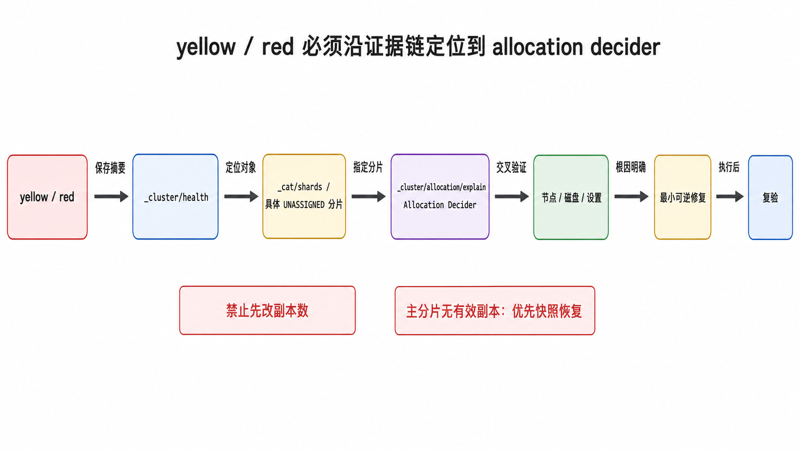
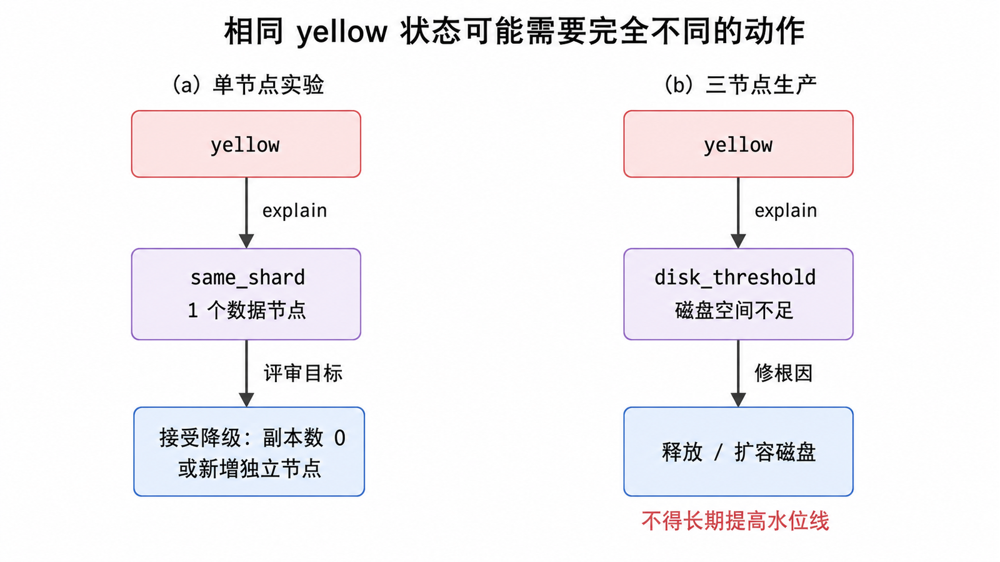

<!-- content-frozen: 2026-07-17; conceptual changes require storyboard reset -->

值班告警显示集群从 green 变成 yellow。最危险的反应是马上把副本数改成 0；最可靠的反应是先定位“哪个副本为什么无法分配”，再决定这个状态是否符合环境预期。集群颜色是分片可用性的摘要，不是根因，也不是性能健康证明。

## 前置知识与学习目标

你需要理解主分片、复制分片、节点角色、磁盘水位线、动态设置和快照。本文继续使用 `products-v1` 与节点 `es01/es02/es03`。

完成本文后，你应该能够：

1. 精确定义 green、yellow、red，不把颜色与延迟、容量混为一谈。
2. 执行 health → shards → allocation explain → 节点/设置证据 → 修复 → 复验。
3. 区分可解释的单节点 yellow、可恢复副本问题与可能丢数据的主分片问题。
4. 用超时、认证、退出码和结构化输出建立最小监控检查。

## 先理解颜色的精确含义

| 状态     | 分片条件                                   | 数据可用性含义                         | 初始响应                                         |
| -------- | ------------------------------------------ | -------------------------------------- | ------------------------------------------------ |
| `green`  | 所有主分片和复制分片都已分配               | 分片冗余达到当前配置目标               | 继续检查延迟、容量和错误率；green 不代表性能正常 |
| `yellow` | 所有主分片已分配，但至少一个复制分片未分配 | 当前数据可读写，但部分冗余不足         | 找到未分配副本；判断是拓扑预期还是故障           |
| `red`    | 至少一个主分片未分配                       | 对应分片的数据不可用，部分操作可能失败 | 立即定位主分片；优先保护证据并评估恢复来源       |

单节点集群为索引配置一个副本时会 yellow，因为 Elasticsearch 不会把主副本与复制副本放在同一节点。这是拓扑与副本目标矛盾的可解释结果。生产三节点集群突然 yellow 则通常需要调查，但也不能跳过证据直接操作。

## 一条固定诊断链

<!-- figure:s04-f01 -->



### 1. 保存时间点与集群摘要

```http
GET /_cluster/health?filter_path=cluster_name,status,timed_out,number_of_nodes,number_of_data_nodes,active_primary_shards,active_shards,unassigned_shards,initializing_shards,relocating_shards,number_of_pending_tasks
```

示例输入是当前集群，输出可能为：

```json
{
  "cluster_name": "shop-search",
  "status": "yellow",
  "timed_out": false,
  "number_of_nodes": 3,
  "number_of_data_nodes": 3,
  "active_primary_shards": 1,
  "active_shards": 1,
  "unassigned_shards": 1,
  "initializing_shards": 0,
  "relocating_shards": 0,
  "number_of_pending_tasks": 0
}
```

这个摘要只能说明有一个未分配副本。记录响应、告警时间和最近变更，不要在证据保存前重启所有节点或清除数据目录。

### 2. 把摘要落到具体分片

```http
GET /_cat/shards?v&h=index,shard,prirep,state,node,unassigned.reason&s=state,index,shard
```

重点筛选 `state=UNASSIGNED`，并记录：

- `index`：受影响索引。
- `shard`：分片编号。
- `prirep`：`p` 是主分片，`r` 是复制分片。
- `unassigned.reason`：最初变成未分配的事件，不一定是当前阻止分配的根因。

例如 `products-v1 0 r UNASSIGNED NODE_LEFT` 表示 0 号复制分片在节点离开后未分配；还不能据此认定只要重启节点就会恢复。

### 3. 让 allocation decider 解释当前阻塞原因

对明确分片请求解释：

```http
GET /_cluster/allocation/explain
{
  "index": "products-v1",
  "shard": 0,
  "primary": false
}
```

关键中间状态：

```json
{
  "current_state": "unassigned",
  "can_allocate": "no",
  "allocate_explanation": "...",
  "node_allocation_decisions": [
    {
      "node_name": "es02",
      "node_decision": "no",
      "deciders": [
        {
          "decider": "disk_threshold",
          "decision": "NO",
          "explanation": "..."
        }
      ]
    }
  ]
}
```

真正可行动的证据在每个节点的 `deciders`：哪个规则返回 `NO` 或 `THROTTLE`，以及解释指向哪项设置或资源。无参数调用会选择任意未分配分片，适合快速查看；事故记录应指定 index/shard/primary，保证结果可复现。

### 4. 用节点与设置证据交叉验证

```http
GET /_cat/nodes?v&h=name,ip,node.role,master,disk.used_percent,heap.percent,ram.percent
GET /_cat/allocation?v&h=node,shards,disk.indices,disk.used,disk.avail,disk.total,disk.percent
GET /_cluster/settings?include_defaults=true&flat_settings=true
GET /products-v1/_settings?flat_settings=true
```

如果 decider 是 `disk_threshold`，核对磁盘水位线和真实可用空间；若是 `filter`，核对索引分配过滤器与节点属性；若是 `same_shard`，确认是否只有一个符合条件的数据节点。不要用一条“通用修复命令”覆盖所有 decider。

### 5. 选择最小、可逆的修复动作

优先级从低风险到高风险：

1. 恢复离线但数据完整的节点或网络。
2. 释放/扩容磁盘，修正错误分配过滤器或恢复缺失角色。
3. 等待受限恢复并监控，必要时在证据支持下临时调整恢复限速。
4. 若副本目标确实超过环境能力，经过可用性评审后修改副本数。
5. 若主分片无有效副本，优先从快照恢复。

强制分配 stale primary 或 empty primary 可能确认性丢失数据，本文不提供可复制命令。只有在数据所有者确认恢复来源、损失范围和审批记录后，才应按官方灾难恢复流程执行。

### 6. 复验并关闭临时变更

```http
GET /_cluster/health?wait_for_status=green&timeout=60s
GET /_cat/shards/products-v1?v&h=index,shard,prirep,state,node
GET /products-v1/_count
```

验证内容包括：颜色是否回到目标、未分配数是否为 0、主副本是否位于不同节点、固定查询与文档计数是否正确、临时 allocation/recovery 设置是否已清除。超时不是“继续等”的同义词，需要重新读取 explain 判断阻塞是否变化。

## 两个典型场景

### 场景 A：单节点实验环境的副本未分配

输入状态：`number_of_data_nodes=1`，`products-v1` 有 1 个主分片和 1 个副本；explain 显示 `same_shard` 不允许副本落在主分片节点。

决策：

- 若这是临时学习环境且明确不需要节点故障冗余，可把副本数改为 0，并在文档中标记降级。
- 若目标是验证故障恢复，应新增真正独立的数据节点，而不是消除副本。

```http
PUT /products-v1/_settings
{
  "index.number_of_replicas": 0
}
```

这条命令只适用于已确认的场景 A，不是 yellow 的通用修复。

### 场景 B：三节点集群超过磁盘水位线

输入状态：副本未分配，explain 的 `disk_threshold` 对候选节点返回 `NO`，`_cat/allocation` 显示可用空间不足。

正确动作通常是删除已到期且有保留策略保障的数据、扩容磁盘、修复异常数据增长或恢复缺失节点。不要长期提高水位线来掩盖容量不足；那会缩小 Elasticsearch 为迁移和恢复保留的安全空间。

<!-- figure:s04-f02 -->



## 最小监控脚本

下面脚本只读取健康状态，使用 API key、TLS CA、连接超时和退出码。它是探针，不替代完整监控。

```bash
#!/usr/bin/env bash
set -euo pipefail

: "${ELASTICSEARCH_URL:?set ELASTICSEARCH_URL}"
: "${ELASTIC_API_KEY:?set ELASTIC_API_KEY}"
: "${ELASTIC_CA_CERT:?set ELASTIC_CA_CERT}"

response="$({
  curl --fail --silent --show-error \
    --connect-timeout 3 --max-time 8 \
    --cacert "$ELASTIC_CA_CERT" \
    -H "Authorization: ApiKey $ELASTIC_API_KEY" \
    "$ELASTICSEARCH_URL/_cluster/health?filter_path=status,timed_out,unassigned_shards"
} 2>&1)" || {
  printf 'UNKNOWN: %s\n' "$response" >&2
  exit 3
}

status="$(jq -r '.status // "unknown"' <<<"$response")"
timed_out="$(jq -r '.timed_out // false' <<<"$response")"
unassigned="$(jq -r '.unassigned_shards // -1' <<<"$response")"

printf 'status=%s timed_out=%s unassigned=%s\n' "$status" "$timed_out" "$unassigned"

case "$status" in
  green) exit 0 ;;
  yellow) exit 1 ;;
  red) exit 2 ;;
  *) exit 3 ;;
esac
```

输入是三个环境变量和一个可达集群；输出是一行结构化摘要。退出码 `0/1/2/3` 分别表示 green/yellow/red/unknown。调用方要设置告警去抖与持续时间，避免短暂分片迁移产生告警风暴。

## 常见误区

- **green 等于一切正常**：它只描述分片分配；查询超时、写入拒绝、GC、磁盘增长仍可能异常。
- **yellow 一律紧急或一律忽略**：严重性取决于环境目标、持续时间和受影响副本。
- **先改副本数再查原因**：这会消除冗余目标，可能掩盖节点、磁盘或过滤器故障。
- **把 `unassigned.reason` 当作当前根因**：它记录初始事件；当前阻塞要看 allocation decider。
- **事故中重启全部节点**：会破坏证据并扩大故障域。
- **对 red 强制空主分片**：这可能永久丢弃仍可恢复的数据，应优先节点恢复或快照。

## 什么时候不适用

本文流程针对分片分配和集群颜色。若问题是查询慢、写入拒绝、GC、线程池排队或热点分片，需要进入性能与容量诊断；若问题来自应用权限、TLS 或网络代理，应从请求错误和安全审计日志排查。Serverless/托管环境的可用诊断 API 与操作权限可能不同，应使用对应平台工具。

## 读者自检

1. green 能否证明查询延迟正常？为什么？
2. `unassigned.reason=NODE_LEFT` 能否直接证明重启该节点就是唯一修复？
3. 什么情况下把副本数从 1 改为 0 才是可接受动作？

<details>
<summary>查看答案</summary>

1. 不能。green 只说明所有主副本和复制分片已分配，不描述延迟、错误率、GC、容量或线程池。
2. 不能。它说明最初未分配的事件；当前阻塞原因要读取 allocation explain 的各节点 decider，并用节点和设置数据交叉验证。
3. 只有在确认目标环境只有一个数据节点、明确接受失去节点故障冗余，并记录这是环境约束或临时降级时；不能作为所有 yellow 的默认修复。

</details>

## 本篇总结

颜色是入口，不是答案。固定使用 health 保存摘要，用 cat shards 定位对象，用 allocation explain 获取当前决策证据，再用节点、磁盘和设置交叉验证。修复动作从恢复资源和纠正约束开始，最后才考虑改变可用性目标；每次都要复验数据与清理临时设置。

## 下一篇衔接

至此，Elasticsearch 后端已经可部署、可配置、可诊断。下一篇把它放进完整日志链路，跟踪一条 `shop-api` 日志从采集、解析、背压、写入到 Kibana 检索与告警的每个状态。

## 资料来源

- [Elastic：Red or yellow cluster health status](https://www.elastic.co/docs/troubleshoot/elasticsearch/red-yellow-cluster-status)
- [Elastic：Cluster health API](https://www.elastic.co/docs/api/doc/elasticsearch/operation/operation-cluster-health)
- [Elastic：Explain shard allocations API](https://www.elastic.co/docs/api/doc/elasticsearch/operation/operation-cluster-allocation-explain)
- [Elastic：Using the cluster allocation API for troubleshooting](https://www.elastic.co/docs/troubleshoot/elasticsearch/cluster-allocation-api-examples)
- [Elastic：Diagnose unavailable shards](https://www.elastic.co/docs/troubleshoot/monitoring/unavailable-shards)
- [Elastic：Disk-based shard allocation settings](https://www.elastic.co/docs/reference/elasticsearch/configuration-reference/cluster-level-shard-allocation-routing-settings)
