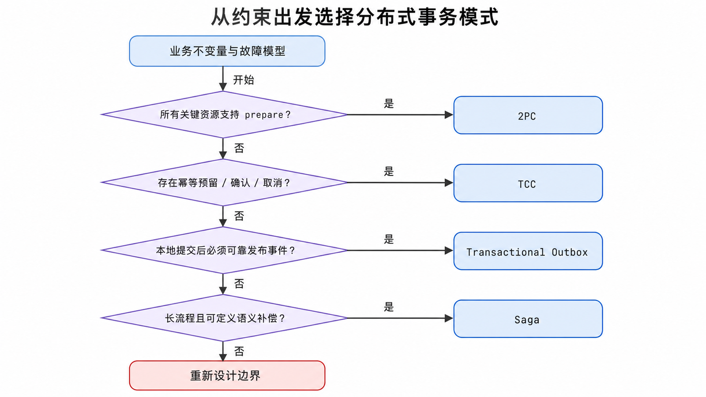
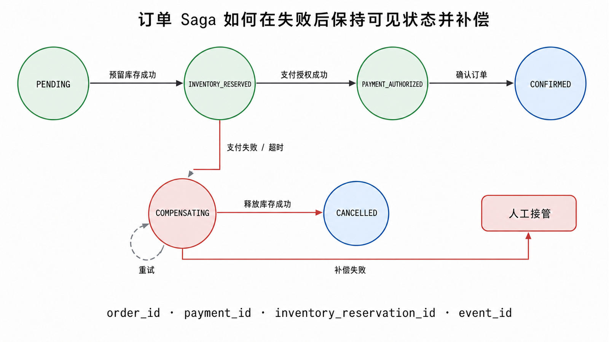

<!-- content-frozen: 2026-07-17; conceptual changes require storyboard reset -->

用户提交订单后，订单服务写入 `order_id=O-20260717-001`，库存服务预留商品，支付服务完成授权。调用支付时网络超时：支付可能根本没收到，也可能已经成功但响应丢失。此时“再调用一次”可能重复扣款，“直接回滚数据库”又无法撤销另一个服务已经完成的副作用。分布式事务的核心不是选择一个流行名词，而是先定义业务不变量和不确定状态，再选择能在目标故障模型下收敛的协议。

## 前置知识与学习目标

阅读前应理解本地 ACID 事务、HTTP/RPC 超时、消息队列至少一次投递和数据库唯一约束。本文是“分布式系统”系列的独立文章；它与同目录的 Elasticsearch 主路径没有伪造依赖。

完成本文后，你应该能够：

1. 区分原子提交、线性一致性、最终一致性和业务不变量。
2. 正确解释 CAP：权衡发生在网络分区期间，而不是日常固定“选两个”。
3. 比较 2PC、TCC、事务型发件箱（Transactional Outbox）与 Saga 的参与者、状态和失败边界。
4. 为 `order_id`、`event_id`、补偿动作设计幂等、重试、超时和人工接管。

## 先定义成功：不变量、状态与故障模型

本文的业务不变量是：

```text
订单只有在“库存已预留”且“支付已授权”时才能进入 CONFIRMED。
任何不确定结果先停留在 PENDING 或 COMPENSATING，不得伪装成成功。
重复命令不得产生第二次扣款或第二份库存预留。
```

统一变量：

| 变量                       | 含义         | 幂等约束                           |
| -------------------------- | ------------ | ---------------------------------- |
| `order_id`                 | 订单业务主键 | 所有参与服务都以它关联同一次流程   |
| `payment_id`               | 支付授权标识 | 支付服务对重复授权命令返回同一结果 |
| `inventory_reservation_id` | 库存预留标识 | 重复预留不重复扣减可售库存         |
| `event_id`                 | 事件唯一标识 | 消费者以唯一约束或 inbox 记录去重  |

必须覆盖的故障包括：请求超时、响应丢失、服务重启、消息重复、消息乱序、参与者永久失败、补偿失败和人工介入。若设计只在“所有调用都立即成功”时成立，它不是分布式事务方案。

## CAP 能解释什么，不能解释什么

CAP 讨论的是分布式数据系统在网络分区下，线性一致性（C）与每个请求都获得非错误响应的可用性（A）不能同时保证。Partition tolerance（P）不是产品菜单里的普通功能；当节点间消息丢失或无限延迟时，系统必须面对分区。

因此更准确的问题是：**当分区真的发生时，这个操作选择拒绝/等待以保护一致性，还是返回可能不是最新的结果以保持可用？** 没有分区时，系统仍可以同时提供一致性和可用响应；不同操作也可以做不同选择。

CAP 不能直接替你选择订单事务模式。订单是否允许 `PENDING`、能否撤销支付、可接受多长收敛时间，属于业务不变量、隔离、持久性和故障恢复问题。把 CAP 简化为“银行选 CP、社交选 AP”会隐藏具体操作和故障语义。

## 四种模式的决策入口

<!-- figure:d01-f01 -->



| 模式                 | 核心机制                                               | 最适合                                   | 主要代价与失败边界                                              |
| -------------------- | ------------------------------------------------------ | ---------------------------------------- | --------------------------------------------------------------- |
| 2PC                  | 所有资源先 prepare，再由协调者统一 commit/abort        | 支持 XA/prepare 的受控资源，必须原子提交 | 锁持有时间、协调者/参与者恢复、分区时阻塞与可用性下降           |
| TCC                  | 业务资源 Try 预留，Confirm 生效，Cancel 释放           | 有明确预留语义、核心短流程               | 每个参与者都要实现幂等 Confirm/Cancel、防悬挂与空回滚           |
| Transactional Outbox | 业务变更与待发事件写入同一本地事务，relay 至少一次发送 | 数据库变更后可靠发布事件                 | 远端消费不是同一原子提交；重复、顺序、积压和 relay 恢复必须治理 |
| Saga                 | 一组本地事务按序执行，失败后运行语义补偿               | 长流程、跨服务、允许中间状态             | 补偿不等于数据库回滚；并发可见性、补偿失败和人工处理复杂        |

没有一个模式在所有维度更好。先问资源是否支持协议、是否能补偿、允许阻塞多久、是否允许中间状态、吞吐与延迟目标、团队能否运营重试与人工队列。

## 2PC：原子决策与阻塞代价

两阶段提交包含协调者与多个支持 prepare 的资源管理器：

```text
阶段 1 Prepare
Coordinator -> Inventory: PREPARE(order_id)
Coordinator -> Payment:   PREPARE(order_id)
Participants -> Coordinator: YES / NO，并把决定前状态写入稳定日志

阶段 2 Decision
全部 YES: Coordinator -> Participants: COMMIT
任一 NO:  Coordinator -> Participants: ABORT
Participants 持久化结果并确认
```

Prepare 成功的参与者不能自行猜测最终结果；它已经承诺能提交并通常继续持有锁/资源。如果协调者在最终决定传播前故障，参与者可能阻塞等待恢复。2PC 解决的是原子提交决定，不自动提供高可用，也不等于两次普通 HTTP 调用。

适用前提：所有关键资源支持兼容的事务协议；阻塞与锁时间可接受；协调者和参与者都有稳定日志与恢复流程；超时不会被误当作 abort。对跨互联网支付 API 或不支持 XA 的 SaaS 调用，通常无法直接使用 2PC。

## TCC：把预留与释放变成业务协议

TCC 把每个参与者拆成三类幂等动作：

- `Try(order_id)`：检查条件并预留资源，例如冻结库存、预授权额度。
- `Confirm(order_id)`：确认使用预留资源。
- `Cancel(order_id)`：释放预留资源。

状态约束示例：

```text
NONE --Try--> RESERVED --Confirm--> CONFIRMED
NONE --Cancel--> CANCELLED       （空回滚必须安全）
RESERVED --Cancel--> CANCELLED
CONFIRMED --Cancel--> 拒绝或进入独立退款流程
```

网络乱序可能让 `Cancel` 先于迟到的 `Try`，称为悬挂风险。参与者应记录事务标识和终态：看到已经 Cancel 的 `order_id` 后，迟到 Try 不能重新预留。Confirm/Cancel 重复到达必须返回稳定结果。TCC 的“补偿”是预先设计的资源协议，不是捕获异常后随意执行一个反向函数。

适合库存预留、账户冻结等天然存在 reserve/confirm/release 语义的短流程。不适合无法预留或不可逆的外部动作，例如已发送且无法撤回的短信、已产生法律效力的指令。

## Transactional Outbox：可靠发布，不是远端原子提交

订单服务在一个本地数据库事务中同时写订单和 outbox：

```sql
BEGIN;

INSERT INTO orders (order_id, status, amount)
VALUES ('O-20260717-001', 'PENDING', 699.00);

INSERT INTO outbox_events (event_id, aggregate_id, event_type, payload, published_at)
VALUES (
  'evt-order-created-0001',
  'O-20260717-001',
  'OrderCreated',
  '{"order_id":"O-20260717-001","amount":699.00}',
  NULL
);

COMMIT;
```

若事务提交，订单与待发事件同时存在；若回滚，两者都不存在。独立 relay 轮询 outbox 或读取数据库变更日志，把事件发送到 broker。

关键边界：relay 可能在“消息已发出、`published_at` 尚未更新”时崩溃，恢复后会重复发送。因此消费者必须使用 `event_id` 幂等处理。Outbox 保证本地状态与“发布意图”原子一致，不保证库存服务已经消费，更不把两个数据库变成一个事务。

运行指标至少包括最老未发布事件年龄、outbox 积压数、发布失败率、重复率和消费者处理延迟。只创建表而没有 relay、告警与清理策略，不算完成。

## Saga：本地事务与语义补偿

订单 Saga 可按以下步骤执行：

```text
T1 创建 PENDING 订单
T2 预留库存
T3 支付授权
T4 确认订单

若 T3 失败：C2 释放库存 -> C1 取消订单
若 C2 失败：保持 COMPENSATING，重试并告警，不能伪装为 CANCELLED
```

<!-- figure:d01-f02 -->



补偿不是数据库 rollback。库存释放可能受当前业务状态限制；支付授权的反向动作可能是 void 或 refund，具有费用、时效和不可逆边界。Saga 允许中间状态被其他事务看到，因此要设计语义锁，例如 `PENDING` 订单不能发货，预留库存有过期时间。

一个可运行的最小状态模型：

```python
from dataclasses import dataclass, field
from enum import Enum


class OrderState(str, Enum):
    PENDING = "PENDING"
    CONFIRMED = "CONFIRMED"
    COMPENSATING = "COMPENSATING"
    CANCELLED = "CANCELLED"


@dataclass
class OrderSaga:
    order_id: str
    state: OrderState = OrderState.PENDING
    completed: set[str] = field(default_factory=set)

    def execute(self, payment_ok: bool) -> OrderState:
        self.completed.add("order_created")
        self.completed.add("inventory_reserved")

        if payment_ok:
            self.completed.add("payment_authorized")
            self.state = OrderState.CONFIRMED
            return self.state

        self.state = OrderState.COMPENSATING
        self.completed.discard("inventory_reserved")  # 幂等释放的模型化结果
        self.state = OrderState.CANCELLED
        return self.state


assert OrderSaga("O-20260717-001").execute(payment_ok=True) == OrderState.CONFIRMED
assert OrderSaga("O-20260717-002").execute(payment_ok=False) == OrderState.CANCELLED
```

输入是 `order_id` 和支付结果；关键中间状态是 `completed` 与 `COMPENSATING`；输出是 `CONFIRMED` 或 `CANCELLED`。这段代码只验证状态转换，不模拟网络、持久化和并发。生产实现必须把 Saga 状态、命令 ID、重试次数和下一次重试时间持久化，使用原子条件更新防止两个 worker 同时推进。

### 编排与事件协作

- **Orchestration**：一个编排器显式发命令并记录状态，路径易观察，但编排器成为重要基础设施。
- **Choreography**：服务根据事件自行推进，耦合在事件契约中；参与者多时全局流程和故障定位可能变得困难。

选择取决于流程复杂度、团队边界与可观测性，不是“事件驱动一定更解耦”。无论哪种方式，都要有稳定关联 ID、版本化事件、超时、重试上限、补偿状态和人工接管。

## 用订单场景做选择

按顺序回答：

1. 是否必须让多个支持 XA 的资源在同一原子决策中提交？若是，评估 2PC 的阻塞与运营能力。
2. 每个参与者是否能提供有期限、可幂等的预留/确认/取消？若是，TCC 能保护短链路资源。
3. 核心问题是否是“本地提交后必须可靠发布事件”？使用 Transactional Outbox，并接受至少一次投递。
4. 流程是否跨多个自治服务、持续较长且能定义业务补偿？使用 Saga，并显式管理中间状态。
5. 动作是否不可逆、补偿代价不可接受？重新设计审批、预授权或人工确认边界，不要假装存在技术 rollback。

混合使用很常见：订单服务用 Outbox 可靠发布 Saga 事件，库存参与者内部用 TCC 式预留，支付调用使用幂等键和查询接口处理未知结果。组合模式时必须写清每一层保证什么，避免把多个“最终会重试”误认为全局原子性。

## 最小故障注入与验收

至少测试：

| 注入点                          | 预期状态                               | 必须验证                 |
| ------------------------------- | -------------------------------------- | ------------------------ |
| 写订单后、本地事务提交前崩溃    | 订单与 outbox 都不存在                 | 本地原子性               |
| outbox 发送后、标记已发送前崩溃 | 消息可能重复                           | 消费者按 `event_id` 幂等 |
| 库存 Try 成功、Confirm 响应丢失 | 状态可查询，重复 Confirm 安全          | TCC 幂等与未知结果恢复   |
| 支付超时但实际成功              | 订单保持 PENDING，按 `payment_id` 查询 | 不重复扣款，不误取消     |
| Saga 补偿失败                   | 保持 COMPENSATING 并重试/告警          | 不伪装为 CANCELLED       |
| 消息乱序                        | 终态不被旧事件覆盖                     | 版本号或状态机条件更新   |

高风险验收不能只断言最终状态，还要检查副作用次数、审计日志、未决事务年龄和人工队列。

## 常见误区

- **CAP 就是永远选择两个字母**：权衡发生在分区期间，且要针对具体操作与一致性模型讨论。
- **超时等于失败**：超时只表示调用方不知道结果，必须用幂等键和查询接口消除不确定性。
- **Saga 补偿等于 rollback**：补偿是新的业务动作，可能失败、收费或无法完全恢复原状。
- **Outbox 等于 exactly-once**：relay 仍可能重复发送，消费者必须幂等。
- **分布式锁能替代事务协议**：锁只提供一定范围的互斥，不让多个资源原子提交，也不自动处理持有者故障后的业务状态。
- **分布式 ID 属于事务方案**：唯一 ID 有助于关联和幂等，但不提供原子性。

## 什么时候不适用

如果所有数据仍能放在一个数据库边界内，优先使用本地事务和模块化单体，通常更简单可靠。只为“微服务形式”引入 Saga、TCC 或消息基础设施会增加未决状态、运维和审计成本。2PC 不适用于不支持 prepare 的外部 API；TCC 不适用于无法预留或取消的动作；Saga 不适用于不允许中间状态且又没有补偿语义的强原子流程。

## 读者自检

1. 支付调用超时后，为什么不能立即认定支付失败并再次扣款？
2. Transactional Outbox 原子保证了什么，没有保证什么？
3. Saga 补偿失败时，订单为什么应保持 `COMPENSATING` 而不是直接写 `CANCELLED`？

<details>
<summary>查看答案</summary>

1. 请求或响应可能在网络中丢失，远端可能已经成功；应使用稳定 `payment_id` 查询结果，重复命令必须幂等。
2. 它原子保证本地业务变更与待发布事件同时提交或回滚；不保证 relay 只发送一次，也不保证远端服务已消费并提交。
3. `CANCELLED` 表示补偿已完成；补偿失败时副作用仍存在，写成终态会掩盖风险并停止必要重试/人工处理。

</details>

## 本篇总结

先定义业务不变量、未知结果和故障模型，再选择协议。2PC 提供受控资源的原子提交但可能阻塞；TCC 把预留、确认、取消变成业务接口；Outbox 原子记录本地状态与发布意图；Saga 用本地事务和语义补偿管理长流程。所有模式都离不开稳定 ID、幂等、状态持久化、重试上限、可观测性和人工接管。

## 下一篇衔接

后续可沿两条路径继续：实现事务型消息的 relay/inbox 与积压治理，或实现可持久化 Saga 编排器，包括定时重试、状态条件更新、补偿失败和人工工作台。两者都以本文的 `order_id`、`event_id` 和状态机为输入。

## 资料来源

- [Gilbert & Lynch：Brewer's conjecture and the feasibility of consistent, available, partition-tolerant web services](https://doi.org/10.1145/564585.564601)
- [Garcia-Molina & Salem：Sagas](https://doi.org/10.1145/38713.38742)
- [Gray & Lamport：Consensus on Transaction Commit](https://arxiv.org/abs/cs/0408036)
- [Microsoft Open Specifications：Two-Phase Commit Protocol](https://learn.microsoft.com/en-us/openspecs/windows_protocols/ms-tpsod/e34079f0-22de-4c03-9cb8-84c2448a4613)
- [Microservices.io：Transactional Outbox pattern](https://microservices.io/patterns/data/transactional-outbox)
- [Microservices.io：Saga pattern](https://microservices.io/patterns/data/saga.html)
