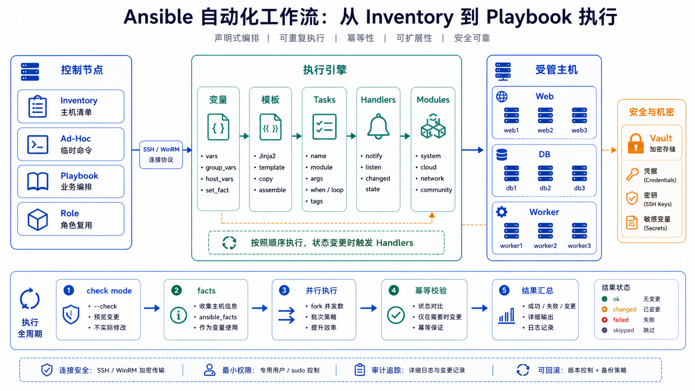

# Ansible 自动化运维 详解

## 简介

Ansible 是开源的自动化运维工具，采用 SSH 协议实现远程连接，无需在远程主机上安装代理。它使用 YAML 格式的 Playbook 来定义配置、编排和部署任务。

**核心特点：**

- **无代理架构**：通过 SSH 连接管理主机，无需在被管理节点安装额外软件
- **幂等性**：同一操作执行多次结果一致，安全的重复执行
- **YAML 语法**：Playbook 采用人类可读的 YAML 格式
- **丰富模块**：内置 3000+ 模块，支持各类操作
- **并行执行**：支持多主机并行操作

## 阅读路线

这篇文章适合按“先能跑、再可维护、最后可治理”的顺序阅读：

1. 先掌握 Inventory、Ad-Hoc 命令和 Playbook 基础，能批量执行常见运维任务。
2. 再学习变量、模板、Handler 和 Role，把脚本式配置整理成可复用的项目结构。
3. 最后补上 Vault、标签、干跑、事实缓存和排障方法，让 Playbook 能进入团队协作和生产发布流程。

如果只是排查线上问题，可以优先看“常见问题与排查”；如果要建设标准化运维仓库，应重点看“Roles 角色”“变量与模板”和“最佳实践”。



## 核心概念

### 基础架构

```text
┌─────────────────┐      SSH      ┌─────────────────┐
│  Ansible Host   │◀────────────▶│  Managed Hosts  │
│ (Control Node)  │             │                 │
│                 │             │                 │
│  - Inventory    │             │  - No Agent     │
│  - Playbook     │             │  - Python       │
│  - Modules      │             │  - SSH          │
└─────────────────┘             └─────────────────┘
```

### 核心术语

| 术语 | 说明 |
|------|------|
| **Control Node** | Ansible 控制节点，安装 Ansible 的主机 |
| **Managed Node** | 被管理主机，通过 SSH 连接管理 |
| **Inventory** | 主机清单，定义被管理主机 |
| **Playbook** | 剧本，YAML 格式的任务定义文件 |
| **Module** | 模块，执行特定任务的代码单元 |
| **Role** | 角色，组织 Playbook 的最佳实践方式 |
| **Fact** | 事实，收集的被管理主机信息 |
| **Task** | 任务，Playbook 中的最小执行单元 |
| **Handler** | 处理器，通知机制触发的任务 |

## 安装 Ansible

### 方式一：pip 安装

```bash
pip install ansible

# 验证安装
ansible --version
```

### 方式二：包管理器安装

**Ubuntu/Debian：**

```bash
sudo apt update
sudo apt install software-properties-common
sudo apt-add-repository --yes --update ppa:ansible/ansible
sudo apt install ansible
```

**CentOS/RHEL：**

```bash
sudo yum install epel-release
sudo yum install ansible
```

**macOS：**

```bash
brew install ansible
```

### 方式三：Docker

```bash
docker run -it --rm \
  -v $(pwd):/ansible/project \
  -v ~/.ssh:/root/.ssh:ro \
  ansible/ansible:latest \
  ansible-inventory -i inventory --list
```

## Inventory 主机清单

### 基础 Inventory

#### INI 格式

```ini
# /etc/ansible/hosts

# 单个主机
192.0.2.50

# 主机别名
webserver1 ansible_host=192.0.2.51 ansible_port=22

# 主机组
[webservers]
192.0.2.51
192.0.2.52
192.0.2.53

# 主机组嵌套
[production:children]
webservers
dbservers

[webservers]
web01.example.com
web02.example.com ansible_user=admin ansible_ssh_private_key_file=~/.ssh/id_rsa

[dbservers]
db01.example.com
db02.example.com

[all:vars]
ansible_python_interpreter=/usr/bin/python3
```

#### YAML 格式

```yaml
all:
  hosts:
    192.0.2.50:
  children:
    webservers:
      hosts:
        web01.example.com:
        web02.example.com:
          ansible_user: admin
          ansible_ssh_private_key_file: ~/.ssh/id_rsa
    dbservers:
      hosts:
        db01.example.com:
        db02.example.com:
    production:
      children:
        webservers:
        dbservers:
      vars:
        ansible_python_interpreter: /usr/bin/python3
```

### 主机变量与组变量

```yaml
# 主机变量
web01.example.com:
  http_port: 80
  max_requests_per_child: 128

# 组变量
webservers:
  vars:
    nginx_version: "1.24.0"
    deploy_user: deploy
```

### 动态 Inventory

支持从云服务商或数据库动态获取主机列表。

```bash
# AWS EC2 动态 Inventory
ansible all -i ec2.py -m ping

# 使用 AWS 插件
ansible-inventory -i aws_ec2.yml --list
```

AWS EC2 插件配置：

```yaml
# aws_ec2.yml
plugin: amazon.aws.aws_ec2
regions:
  - us-east-1
  - us-west-2
filters:
  instance-state-name: running
keyed_groups:
  - key: tags.Name
    prefix: tag_
  - key: platform
    prefix: platform_
compose:
  ansible_host: public_ip_address
```

## Ad-Hoc 命令

### 基础语法

```bash
ansible <host-pattern> -m <module> -a "<arguments>"
```

### 常用示例

```bash
# 测试连通性
ansible all -m ping

# 执行 shell 命令
ansible all -m shell -a "uptime"

# 复制文件
ansible webservers -m copy -a "src=/local/file dest=/remote/path"

# 安装包
ansible dbservers -m yum -a "name=postgresql state=present"

# 启动服务
ansible webservers -m service -a "name=nginx state=started enabled=yes"

# 收集事实
ansible all -m setup

# 过滤收集特定事实
ansible all -m setup -a "filter=ansible_memory_*"

# 创建用户
ansible all -m user -a "name=deploy shell=/bin/bash"

# 文件权限
ansible all -m file -a "path=/data mode=0755 owner=www group=www"
```

## Playbook 基础

### 基本结构

```yaml
---
# playbook.yml
- name: Configure web server
  hosts: webservers
  become: yes
  gather_facts: yes

  vars:
    nginx_version: "1.24.0"
    app_port: 8080

  tasks:
    - name: Install nginx
      apt:
        name: nginx
        state: present
        update_cache: yes

    - name: Copy nginx config
      template:
        src: nginx.conf.j2
        dest: /etc/nginx/nginx.conf
      notify: Restart nginx

    - name: Ensure nginx is running
      service:
        name: nginx
        state: started
        enabled: yes

  handlers:
    - name: Restart nginx
      service:
        name: nginx
        state: restarted
```

### 执行 Playbook

```bash
# 语法检查
ansible-playbook playbook.yml --syntax-check

# 模拟执行（干跑）
ansible-playbook playbook.yml --check

# 指定 Inventory
ansible-playbook playbook.yml -i inventory/production

# 指定用户
ansible-playbook playbook.yml -u admin --become

# 详细输出
ansible-playbook playbook.yml -v

# 多级详细输出
ansible-playbook playbook.yml -vvv
```

## Playbook 进阶

### 条件执行

```yaml
tasks:
  - name: Install Apache on CentOS
    yum:
      name: httpd
      state: present
    when: ansible_facts['os_family'] == "RedHat"

  - name: Install Apache on Debian
    apt:
      name: apache2
      state: present
    when: ansible_facts['os_family'] == "Debian"

  - name: Install Nginx if using custom port
    apt:
      name: nginx
      state: present
    when: app_port is defined
```

### 循环

```yaml
tasks:
  - name: Create multiple users
    user:
      name: "{{ item }}"
      state: present
      groups: "{{ item_groups }}"
    loop:
      - { name: 'user1', item_groups: 'wheel' }
      - { name: 'user2', item_groups: 'www-data' }

  - name: Install multiple packages
    apt:
      name: "{{ packages }}"
      state: present
    vars:
      packages:
        - git
        - vim
        - curl
        - wget
```

### 错误处理

```yaml
tasks:
  - name: Try to stop service
    service:
      name: "{{ item }}"
      state: stopped
    ignore_errors: yes
    register: service_stop_result
    loop:
      - nginx
      - httpd
      - apache2

  - name: Report failure
    debug:
      msg: "Failed to stop services: {{ service_stop_result.results | map(attribute='msg') | list }}"
    when: service_stop_result.results | map(attribute='failed') | any

  - name: Always execute task
    debug:
      msg: "This always runs"
    always_run: yes

  - name: Run on failure
    debug:
      msg: "Something went wrong"
    when: failed | default(false)
```

### 块（Block）处理

```yaml
tasks:
  - name: Install and configure database
    block:
      - name: Install postgresql
        apt:
          name: postgresql
          state: present

      - name: Configure postgresql
        template:
          src: postgresql.conf.j2
          dest: /etc/postgresql/postgresql.conf
        notify: Restart postgresql

      - name: Start postgresql
        service:
          name: postgresql
          state: started
    when: ansible_facts['os_family'] == "Debian"
    rescue:
      - name: Rollback on failure
        debug:
          msg: "Database installation failed, rolling back"
```

### 任务委托

```yaml
tasks:
  - name: Notify external service
    uri:
      url: https://status.example.com/api/notify
      method: POST
    delegate_to: localhost

  - name: Wait for database to be ready
    wait_for:
      host: db.example.com
      port: 5432
      timeout: 60
    delegate_to: localhost
```

### 异步执行

```yaml
tasks:
  - name: Long running task
    command: /opt/long-running-script.sh
    async: 3600
    poll: 0
    register: long_task

  - name: Check task status
    async_status:
      jid: "{{ long_task.ansible_job_id }}"
    register: job_result
    until: job_result.finished
    retries: 100
    delay: 10
```

## Roles 角色

### 目录结构

```
roles/
common/
├── defaults/
│   └── main.yml          # 默认变量（优先级最低）
├── files/
│   └── templates/        # 文件和模板
├── handlers/
│   └── main.yml          # 处理器
├── meta/
│   └── main.yml          # 角色依赖
├── tasks/
│   └── main.yml          # 任务
├── templates/
│   └── ntp.conf.j2       # 模板文件
└── vars/
    └── main.yml          # 角色变量（优先级高）
```

### 创建 Role

```bash
# 使用 ansible-galaxy 创建
ansible-galaxy init roles/nginx
```

### Role 示例

#### tasks/main.yml

```yaml
---
# tasks file for roles/nginx
- name: Install nginx
  apt:
    name: nginx
    state: present
  when: ansible_facts['os_family'] == "Debian"

- name: Copy nginx config
  template:
    src: nginx.conf.j2
    dest: /etc/nginx/nginx.conf
  notify: Restart nginx

- name: Enable nginx site
  file:
    src: /etc/nginx/sites-available/default
    dest: /etc/nginx/sites-enabled/default
    state: link
  notify: Restart nginx
```

#### handlers/main.yml

```yaml
---
# handlers file for roles/nginx
- name: Restart nginx
  service:
    name: nginx
    state: restarted

- name: Reload nginx
  service:
    name: nginx
    state: reloaded
```

#### templates/nginx.conf.j2

```nginx
user {{ nginx_user }};
worker_processes {{ ansible_facts['processor_vcpus'] }};
error_log {{ nginx_error_log }};
pid {{ nginx_pid_file }};

events {
    worker_connections {{ nginx_worker_connections }};
}

http {
    include /etc/nginx/mime.types;
    default_type application/octet-stream;

    access_log {{ nginx_access_log }};

    sendfile on;
    keepalive_timeout {{ nginx_keepalive_timeout }};

    server {
        listen {{ nginx_port }};
        server_name {{ nginx_server_name }};
        location / {
            root {{ nginx_document_root }};
            index index.html;
        }
    }
}
```

#### defaults/main.yml

```yaml
---
nginx_user: www-data
nginx_port: 80
nginx_server_name: localhost
nginx_document_root: /var/www/html
nginx_worker_connections: 1024
nginx_keepalive_timeout: 65
nginx_error_log: /var/log/nginx/error.log
nginx_access_log: /var/log/nginx/access.log
nginx_pid_file: /var/run/nginx.pid
```

### 使用 Role 的 Playbook

```yaml
---
# site.yml
- name: Configure all servers
  hosts: all
  become: yes
  gather_facts: yes
  roles:
    - role: common
      tags: common

- name: Configure webservers
  hosts: webservers
  become: yes
  roles:
    - role: nginx
      tags: nginx
    - role: app
      tags: app

- name: Configure dbservers
  hosts: dbservers
  become: yes
  roles:
    - role: postgresql
      tags: database
```

### Role 依赖

```yaml
# meta/main.yml
---
dependencies:
  - role: common
    vars:
      timezone: Asia/Shanghai
```

## 常用模块

### 文件操作

```yaml
# 复制文件
- name: Copy file
  copy:
    src: local/file.txt
    dest: /remote/file.txt
    owner: www-data
    group: www-data
    mode: '0644'
    backup: yes

# 模板
- name: Render template
  template:
    src: config.j2
    dest: /etc/app/config
    mode: '0600'

# 文件属性
- name: Create directory
  file:
    path: /data/application
    state: directory
    owner: app
    group: app
    mode: '0755'
```

### 包管理

```yaml
# APT (Debian/Ubuntu)
- name: Install packages
  apt:
    name:
      - nginx
      - git
      - vim
    state: present
    update_cache: yes

# YUM (CentOS/RHEL)
- name: Install packages
  yum:
    name:
      - httpd
      - git
    state: present

# Snap
- name: Install snaps
  snap:
    name:
      - code
      - docker
    classic: yes
```

### 服务管理

```yaml
- name: Start service
  service:
    name: nginx
    state: started
    enabled: yes

- name: Stop service
  systemd:
    name: nginx
    state: stopped
    enabled: no
```

### 用户管理

```yaml
- name: Create user
  user:
    name: deploy
    comment: "Deploy user"
    shell: /bin/bash
    groups: sudo
    append: yes
    password: "{{ 'password123' | password_hash('sha512') }}"
    ssh_key: "{{ lookup('file', '~/.ssh/id_rsa.pub') }}"
    ssh_key_comments: "ansible-managed"
```

### 命令执行

```yaml
# Shell（支持管道等）
- name: Run shell command
  shell: |
    cd /opt/app && ./build.sh
  args:
    executable: /bin/bash
  creates: /opt/app/build_complete

# Command（更安全）
- name: Run command
  command: /opt/app/deploy.sh
  args:
    creates: /opt/app/deployed

# Script（在远程执行本地脚本）
- name: Run local script
  script: ./scripts/setup.sh
  args:
    creates: /opt/app/setup_complete
```

### Git 模块

```yaml
- name: Clone repository
  git:
    repo: "https://github.com/example/app.git"
    dest: /opt/app
    version: main
    force: yes
    accept_hostkey: yes

- name: Update repository
  git:
    repo: "https://github.com/example/app.git"
    dest: /opt/app
    update: yes
```

### Docker 模块

```yaml
- name: Pull Docker image
  docker_image:
    name: nginx
    tag: latest
    source: pull

- name: Start container
  docker_container:
    name: web
    image: nginx:latest
    state: started
    ports:
      - "80:80"
    volumes:
      - /data/www:/usr/share/nginx/html:ro
    restart_policy: unless-stopped
```

### AWS 模块

```yaml
- name: Create EC2 instance
  ec2:
    key_name: my-key
    instance_type: t2.micro
    image: ami-12345678
    region: us-east-1
    exact_count: 1
    count_tag:
      Name: web-server
    tags:
      Environment: production
```

## 变量与模板

### 变量定义

```yaml
# Playbook 中定义
- name: Example
  hosts: all
  vars:
    app_name: myapp
    app_version: "1.0.0"

# Role defaults 中定义
# roles/app/defaults/main.yml
app_port: 8080
app_env: production

# Inventory 中定义
[webservers]
web01 ansible_host=192.0.2.51 app_port=8080
```

### 变量优先级

从高到低：

1. extra vars（命令行）
2. task vars（任务级别）
3. block vars（块级别）
4. role and include vars
5. play vars
6. play vars_prompt
7. host facts
8. inventory host vars
9. inventory group vars
10. role defaults

### Jinja2 模板

```jinja
{# templates/config.j2 #}
app:
  name: {{ app_name }}
  version: {{ app_version }}
  port: {{ app_port | default(8080) }}
  env: {{ app_env | default('production') }}


features:

  - {{ feature }}



database:
  host: {{ db_host | mandatory }}
  port: {{ db_port | default(5432) }}
  name: {{ db_name }}
```

## 实战案例

### 部署 Nginx

#### 目录结构

```
project/
├── inventory/
│   ├── production
│   └── staging
├── playbooks/
│   └── deploy-nginx.yml
├── roles/
│   └── nginx/
│       ├── tasks/
│       │   └── main.yml
│       ├── handlers/
│       │   └── main.yml
│       ├── templates/
│       │   └── nginx.conf.j2
│       └── defaults/
│           └── main.yml
└── ansible.cfg
```

#### ansible.cfg

```ini
[defaults]
inventory = inventory/production
roles_path = roles
host_key_checking = False
retry_files_enabled = False
gather_facts = True

[privilege_escalation]
become = True
become_method = sudo
become_user = root
become_ask_pass = False

[ssh_connection]
ssh_args = -o ControlMaster=auto -o ControlPersist=60s -o StrictHostKeyChecking=no
```

#### Playbook

```yaml
---
# playbooks/deploy-nginx.yml
- name: Deploy Nginx to production
  hosts: webservers
  become: yes

  vars:
    nginx_port: 80
    nginx_server_name: "{{ inventory_hostname }}"
    nginx_document_root: /var/www/html

  pre_tasks:
    - name: Update apt cache
      apt:
        update_cache: yes
        cache_valid_time: 3600
      when: ansible_facts['os_family'] == "Debian"

  roles:
    - nginx

  tasks:
    - name: Deploy index.html
      copy:
        content: |
          <!DOCTYPE html>
          <html>
          <head><title>Welcome</title></head>
          <body>
          <h1>Server: {{ inventory_hostname }}</h1>
          <p>Deployed by Ansible</p>
          </body>
          </html>
        dest: "{{ nginx_document_root }}/index.html"
        mode: '0644'
```

### 多环境部署

```yaml
---
# playbooks/deploy-app.yml
- name: Deploy application
  hosts: all
  become: yes

  vars:
    app_version: "{{ lookup('env', 'APP_VERSION') | default('latest') }}"

  vars_files:
    - "vars/{{ deploy_env }}.yml"

  roles:
    - role: common
      tags: common
    - role: app
      vars:
        app_version: "{{ app_version }}"
      tags: app

  post_tasks:
    - name: Verify deployment
      uri:
        url: "http://{{ inventory_hostname }}:{{ app_port }}"
        status_code: 200
      register: verify_result
      until: verify_result is succeeded
      retries: 5
      delay: 10
      delegate_to: localhost
```

### 滚动更新

```yaml
---
# playbooks/rolling-update.yml
- name: Rolling update application
  hosts: webservers
  become: yes
  serial: 1

  tasks:
    - name: Check current version
      command: cat /opt/app/version
      register: current_version
      changed_when: false

    - name: Stop application
      systemd:
        name: app
        state: stopped

    - name: Update application
      git:
        repo: "{{ app_repo }}"
        dest: /opt/app
        version: "{{ app_version }}"
      when: app_version != current_version.stdout

    - name: Start application
      systemd:
        name: app
        state: started

    - name: Health check
      uri:
        url: "http://{{ inventory_hostname }}:{{ app_port }}/health"
        status_code: 200
      register: health_result
      until: health_result is succeeded
      retries: 10
      delay: 5

    - name: Verify new version
      command: cat /opt/app/version
      register: new_version

    - name: Notify
      debug:
        msg: "Updated from {{ current_version.stdout }} to {{ new_version.stdout }}"
```

### 数据库初始化

```yaml
---
# playbooks/init-database.yml
- name: Initialize database
  hosts: dbservers
  become: yes
  gather_facts: no

  vars:
    db_name: myapp
    db_user: myapp_user
    db_password: "{{ vault_db_password }}"

  tasks:
    - name: Install PostgreSQL
      apt:
        name:
          - postgresql
          - postgresql-contrib
        state: present

    - name: Start PostgreSQL
      systemd:
        name: postgresql
        state: started
        enabled: yes

    - name: Create database
      postgresql_db:
        name: "{{ db_name }}"
        login_host: localhost
        login_user: postgres
        login_password: "{{ vault_postgres_password }}"
        state: present

    - name: Create user
      postgresql_user:
        name: "{{ db_user }}"
        password: "{{ db_password }}"
        priv: "{{ db_name }}=ALL"
        login_host: localhost
        login_user: postgres
        login_password: "{{ vault_postgres_password }}"
        state: present

    - name: Set permissions
      command: >
        psql -U postgres -c "GRANT ALL PRIVILEGES ON DATABASE {{ db_name }} TO {{ db_user }}"
```

## 最佳实践

### 目录结构

```
production/
├── ansible.cfg
├── inventory/
│   ├── production
│   ├── production.yml
│   └── group_vars/
│       └── all.yml
├── playbooks/
│   ├── site.yml
│   ├── webservers.yml
│   └── dbservers.yml
└── roles/
    ├── common/
    ├── nginx/
    ├── app/
    └── postgresql/
```

### 安全建议

```yaml
# 使用 Vault 加密敏感数据
# 创建加密文件
ansible-vault create group_vars/all/vault.yml

# 编辑加密文件
ansible-vault edit group_vars/all/vault.yml

# 使用 Vault 运行 Playbook
ansible-playbook site.yml --ask-vault-pass
# 或
ansible-playbook site.yml --vault-password-file ~/.vault_pass
```

vault.yml 内容：

```yaml
---
vault_db_password: "S3cur3P@ssw0rd!"
vault_aws_access_key: "AKIA..."
vault_aws_secret_key: "..."

# 使用变量
db_password: "{{ vault_db_password }}"
```

### 标签使用

```yaml
tasks:
  - name: Install packages
    apt:
      name: "{{ packages }}"
    tags:
      - install
      - packages

  - name: Configure application
    template:
      src: app.conf.j2
      dest: /etc/app.conf
    tags:
      - config

  - name: Start service
    service:
      name: app
      state: started
    tags:
      - start
      - service
```

使用标签执行：

```bash
# 只执行带 install 标签的任务
ansible-playbook site.yml --tags install

# 跳过特定标签
ansible-playbook site.yml --skip-tags config
```

### 测试 Playbook

```bash
# 语法检查
ansible-playbook site.yml --syntax-check

# 干跑
ansible-playbook site.yml --check

# 检查任务执行计划
ansible-playbook site.yml --list-tasks

# 检查主机
ansible-playbook site.yml --list-hosts

# 使用 test mode
ansible-playbook site.yml -C
```

## 常见问题与排查

### 1. SSH 连接失败

```bash
# 测试 SSH 连接
ssh -vvv user@hostname

# 检查 Ansible SSH 配置
ansible all -m ping -vvv

# 确保 SSH 密钥配置正确
ssh-copy-id user@hostname
```

### 2. 权限不足

```yaml
# Playbook 中启用提权
- name: Install package
  apt:
    name: nginx
    state: present
  become: yes
  become_user: root
  become_method: sudo
```

### 3. 事实收集超时

```yaml
# 禁用事实收集
- name: Disable facts
  hosts: all
  gather_facts: no

# 部分收集事实
- name: Partial facts
  hosts: all
  gather_facts: yes
  gather_subset:
    - min
    - network
    - virtual
```

### 4. 任务执行失败

```bash
# 启用失败回调
ansible-playbook site.yml --flush-cache

# 重试失败主机
ansible-playbook site.yml --limit @retry.txt
```

### 5. 性能优化

```ini
# ansible.cfg
[defaults]
forks = 20
gathering = smart
fact_caching = jsonfile
fact_caching_connection = /tmp/facts_cache
fact_caching_timeout = 86400

[ssh_connection]
pipelining = True
```

## 小结

Ansible 作为最流行的自动化运维工具，其核心价值在于：

- **无代理**：通过 SSH 连接，简化管理
- **幂等性**：安全重复执行
- **YAML 语法**：人类可读的配置文件
- **丰富生态**：3000+ 模块支持各类操作
- **角色机制**：代码复用和组织最佳实践

落地清单：

- 合理规划 Inventory 结构和变量
- 使用 Roles 组织 Playbook 代码
- 使用 Vault 加密敏感凭据
- 善用 Handler 机制处理通知
- 使用 tags 灵活控制任务执行
- 启用事实缓存优化性能

附加参考：

- [Ansible 官方文档](https://docs.ansible.com/)
- [Ansible Galaxy](https://galaxy.ansible.com/)
- [Ansible Module Index](https://docs.ansible.com/ansible/latest/modules/list_of_all_modules.html)
- [Ansible 示例仓库](https://github.com/ansible/ansible-examples)

---
