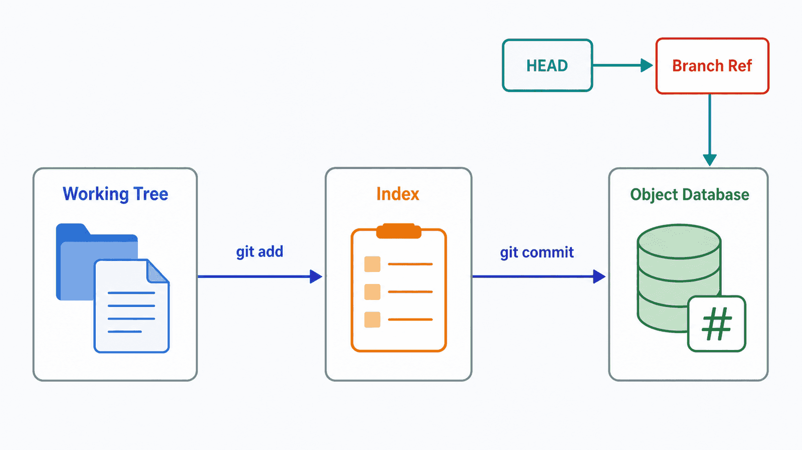
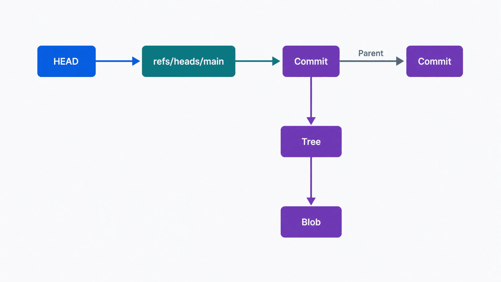

## 前置知识与学习目标

本文面向已经用过 `git add`、`git commit` 或 `git push`，但仍会靠背命令处理问题的读者。你只需要会使用终端并能编辑文本文件。

学完后，你应该能够：

1. 区分工作区、暂存区（Index）和对象数据库保存的内容。
2. 解释 blob、tree、commit、HEAD 与分支引用之间的关系。
3. 根据 `status` 和两种 `diff` 预测下一次提交会包含什么。
4. 用一个可重复的最小实验验证自己的判断，而不是直接试危险命令。

## 真实场景：为什么改过的内容没有进入提交

贯穿本系列的示例叫 `notes-cli`。现在你修改了 `src/format.mjs`，运行过一次 `git add`，随后又补了一行代码。提交后，最后补的那一行却不在提交里。

问题不在 `commit`，而在对 `add` 的理解：`git add` 暂存的是命令执行当时的文件内容，不是“从现在开始持续跟踪这个文件的后续变化”。同一个路径可以同时存在已暂存和未暂存的修改。

## 核心机制：Git 提交的是快照

Git 把提交理解为一组对象和引用，而不是一份永远向前追加的补丁文件。日常操作可先压缩成四个区域：

| 区域                   | 保存什么                             | 常用观察方式                       |
| ---------------------- | ------------------------------------ | ---------------------------------- |
| 工作区（working tree） | 当前可以编辑的文件                   | `git status`、`git diff`           |
| 暂存区（index）        | 下一次提交准备记录的快照             | `git diff --staged`                |
| 对象数据库             | blob、tree、commit、tag 等不可变对象 | `git cat-file`、`git show`         |
| 引用                   | 分支、标签、HEAD 等可移动名字        | `git branch`、`git log --decorate` |

<!-- figure-anchor:g01-f01 -->



最常见的数据流是：

```text
编辑文件 -> git add -> Index -> git commit -> Commit
                         ^                     |
                         |                     v
                       HEAD ---------------- Branch Ref
```

`git add` 把指定内容写入对象数据库，并更新 Index 指向这些内容；`git commit` 根据 Index 创建 tree 和 commit，再移动当前分支引用。提交成功后，工作区未必干净，因为未暂存的修改仍会留下。

## 关键对象、引用与状态变化

### 四类核心对象

| 对象   | 核心内容                            | 是否直接保存文件名 |
| ------ | ----------------------------------- | ------------------ |
| blob   | 文件内容                            | 否                 |
| tree   | 名称、模式以及 blob/tree 的对象 ID  | 是                 |
| commit | 根 tree、父提交、作者、提交者和说明 | 否                 |
| tag    | 被标记对象、标记者、说明与可选签名  | 否                 |

两个路径内容完全相同时可以复用同一个 blob。文件名和目录层级由 tree 表达，提交通过父指针形成有向无环图。

<!-- figure-anchor:g01-f02 -->



对象 ID 由对象内容和类型等信息计算。传统仓库通常使用 SHA-1；Git 正在推进 SHA-256 仓库格式。日常讨论中应称其为“对象 ID”或“提交 ID”，不要把所有仓库都永久假定为固定 40 位 SHA-1。

### HEAD、分支与远程跟踪引用

分支通常只是一个指向提交的可移动引用，例如 `refs/heads/main`。`HEAD` 通常再指向当前分支：

```text
HEAD -> refs/heads/main -> C3 -> C2 -> C1
```

创建分支不会复制完整项目；它只创建另一个引用。切换分支时，Git 根据目标提交和 Index 更新工作区。

`origin/main` 是本地的远程跟踪引用，不是服务器上的分支本身。它表示“上一次成功与 origin 通信时，本地看到的远程 main”。远程同步会在第 3 篇展开。

### tracked 不是 staged

文件先分为 tracked 与 untracked。tracked 文件相对 `HEAD`、Index 和工作区又可能处于不同状态：

| 观察结果  | 含义                                 |
| --------- | ------------------------------------ |
| untracked | 工作区有路径，Index 和 HEAD 不认识它 |
| modified  | 工作区与 Index 不同                  |
| staged    | Index 与 HEAD 不同                   |
| clean     | 工作区、Index 与 HEAD 对应内容一致   |

## 最小实践：亲手观察三个版本

下面的实验只操作新建目录。不要在有未提交工作的仓库里照抄初始化命令。

```bash
mkdir notes-cli
cd notes-cli
git init -b main
git config user.name "Git Learner"
git config user.email "learner@example.com"
```

创建 `src/format.mjs`：

```js
export const formatTitle = title => title.trim();
```

然后运行：

```bash
git status --short
git add src/format.mjs
git diff --staged
git commit -m "feat: add title formatter"
```

第一次提交后，再把函数改为：

```js
export const formatTitle = title => title.trim().toUpperCase();
```

观察三个比较面：

```bash
git diff
git add src/format.mjs
git diff --staged
git diff HEAD
```

它们分别回答：

- `git diff`：工作区相对 Index 还有什么未暂存修改？
- `git diff --staged`：Index 相对 HEAD 准备提交什么？
- `git diff HEAD`：工作区和 Index 合起来相对 HEAD 改了什么？

需要确认对象关系时，可以只读检查：

```bash
git log --oneline --decorate
git cat-file -p HEAD
git cat-file -p HEAD^{tree}
```

## 输入、输出与失败边界

| 操作                | 输入                | 可观察输出              | 失败或意外边界                 |
| ------------------- | ------------------- | ----------------------- | ------------------------------ |
| `git add <path>`    | 工作区指定路径      | Index 更新              | 之后继续编辑不会自动更新 Index |
| `git commit`        | 当前 Index          | 新 commit，当前分支移动 | 空 Index 默认不会创建提交      |
| `git status`        | HEAD、Index、工作区 | 状态分类                | 只看文件名不足以理解具体差异   |
| `git diff`          | 工作区与 Index      | 未暂存补丁              | 已暂存内容不会显示             |
| `git diff --staged` | Index 与 HEAD       | 待提交补丁              | 未暂存内容不会显示             |

自动化脚本应先检查退出码，再解析稳定的机器格式，例如 `git status --porcelain=v1`；不要依赖给人阅读、可能随配置变化的彩色输出。

## 常见误区与适用边界

### 误区一：`.git` 等于本地仓库加远程仓库

`.git` 保存本地对象和引用。远程仓库是另一个仓库；`origin` 只是本地配置中的远程名称。

### 误区二：`git add .` 永远安全

它可能把调试输出、密钥或大文件一起暂存。提交前至少运行：

```bash
git status --short
git diff --staged
```

### 误区三：`.gitignore` 能停止跟踪已提交文件

`.gitignore` 主要影响未跟踪文件的发现。已经被跟踪的文件需要先从 Index 移除，再提交这个变化：

```bash
git rm --cached path/to/file
```

该命令保留工作区文件，但会让下一次提交停止跟踪它；执行前仍应确认路径和差异。

### 什么时候不必研究对象内部

正常提交并不要求每天使用 `cat-file`。对象模型的价值在于预测命令结果、解释分支为何轻量，以及在 merge、reset、reflog 等场景中判断什么会移动、什么仍可恢复。

## 本篇自检

<details>
<summary>1. 为什么同一文件会同时显示 staged 和 modified？</summary>

因为 `git add` 只把当时的内容写入 Index；随后再次编辑只改变工作区，所以 Index 与 HEAD 不同，同时工作区与 Index 也不同。

</details>

<details>
<summary>2. 分支创建为什么通常很快？</summary>

分支主要是一个指向既有提交的可移动引用，不需要复制完整文件树或提交历史。

</details>

<details>
<summary>3. 提交前如何分别检查未暂存和已暂存修改？</summary>

用 `git diff` 检查工作区相对 Index 的修改，用 `git diff --staged` 检查 Index 相对 HEAD 的修改。

</details>

## 本篇总结

Git 的稳定心智模型不是命令清单，而是“工作区、Index、不可变对象和可移动引用”。`add` 更新 Index，`commit` 根据 Index 创建对象并移动当前分支。只要先判断命令会影响哪一层，多数操作都能被解释和验证。

## 下一篇衔接

下一篇把线性提交扩展为提交图：分支如何移动，fast-forward、三方 merge 与 rebase 分别怎样改变历史，以及冲突状态究竟保存在哪里。

## 资料来源

- [Pro Git：What is Git?](https://git-scm.com/book/en/v2/Getting-Started-What-is-Git)
- [Pro Git：Recording Changes to the Repository](https://git-scm.com/book/en/v2/Git-Basics-Recording-Changes-to-the-Repository)
- [Pro Git：Git Objects](https://git-scm.com/book/en/v2/Git-Internals-Git-Objects)
- [Pro Git：Git References](https://git-scm.com/book/en/v2/Git-Internals-Git-References)
- [Git hash-function-transition](https://git-scm.com/docs/hash-function-transition.html)
