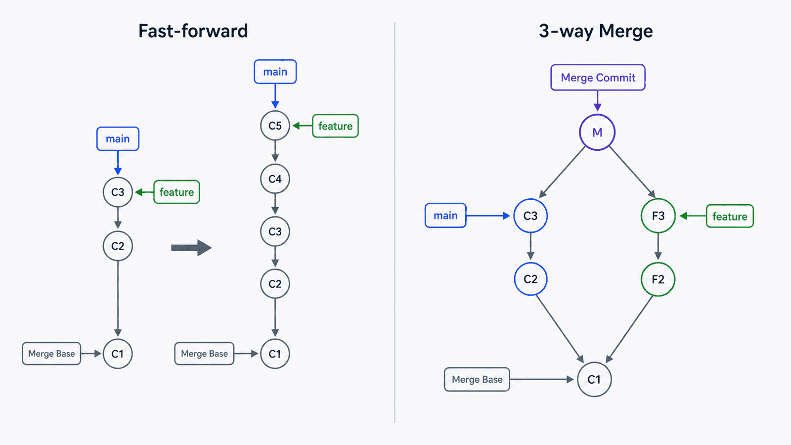
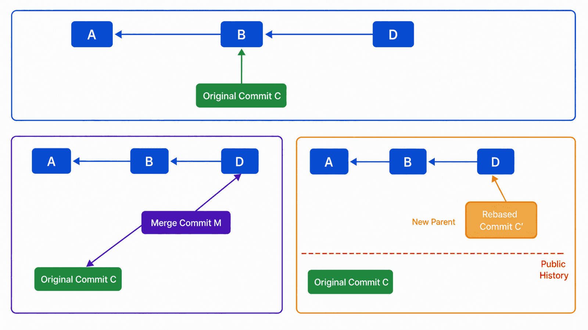

## 前置知识与学习目标

阅读前应理解上一篇中的 commit、parent、HEAD 和分支引用。本文不再重复对象存储，而是关注提交图如何变化。

学完后，你应该能够：

1. 从提交图判断一次 merge 能否 fast-forward。
2. 区分 merge 与 rebase 对提交身份和历史形状的影响。
3. 解释冲突时工作区、Index 和特殊引用保存了什么。
4. 选择适合个人分支和公共分支的集成方式。

## 真实场景：两条正确修改为什么不能自动合并

在 `notes-cli` 中，`main` 把标题格式改成首字母大写；`feature/uppercase` 把同一行改成全大写。两边语法都正确，但 Git 不知道业务上应该保留哪一种结果。

冲突不是 Git 损坏了代码，而是自动三方合并无法唯一决定最终内容。解决者必须理解三份输入：共同祖先、当前分支和被集成分支。

## 核心机制：分支是提交图上的引用

假设最初历史为：

```text
A---B  main, feature/uppercase
```

如果只有 feature 前进：

```text
A---B---C  feature/uppercase
     ^
     main
```

在 `main` 执行 `git merge feature/uppercase` 时，Git 只需把 `main` 移到 `C`，这就是 fast-forward，没有新 merge commit。

如果两边都前进：

```text
      C  feature/uppercase
     /
A---B---D  main
```

Git 会以 `B` 为 merge base，把 `B -> C` 与 `B -> D` 的变化合成。自动成功时创建同时指向 `C` 和 `D` 的 merge commit。

<!-- figure-anchor:g02-f01 -->



## merge 与 rebase 如何改变历史

### merge：保留两条真实开发线

```bash
git switch main
git merge feature/uppercase
```

非快进合并创建双父提交：

```text
      C------M
     /      /
A---B------D
```

优点是保留集成关系和原提交 ID；代价是图可能更复杂。

### rebase：复制提交到新基线

```bash
git switch feature/uppercase
git rebase main
```

Git 会计算 feature 相对共同祖先的提交，再依次应用到 `main` 顶部：

```text
原来: A---B---D  main
           \
            C    feature

之后: A---B---D---C'  feature
```

`C'` 内容可能与 `C` 等价，但父提交、时间或元数据不同，所以对象 ID 不同。rebase 是历史改写，不是“把原提交移动过去”。

<!-- figure-anchor:g02-f02 -->



### 选择原则

| 场景                         | 推荐起点                 | 原因                              |
| ---------------------------- | ------------------------ | --------------------------------- |
| 尚未共享的个人功能分支       | rebase 可选              | 可整理本地历史，影响范围可控      |
| 已被多人基于其开发的公共分支 | merge 优先               | 避免让其他人的提交基础失效        |
| 需要保留真实集成节点         | merge                    | merge commit 明确表达两条历史汇合 |
| 项目明确要求线性历史         | rebase 后再 fast-forward | 需配合团队规则和受保护分支        |

## 冲突时的状态与调用链

### merge 冲突

```bash
git switch main
git merge feature/uppercase
```

发生冲突后：

- `HEAD` 仍指向当前分支原提交。
- `MERGE_HEAD` 记录被合并提交。
- Index 可保存共同祖先、ours 和 theirs 三个阶段的条目。
- 工作区出现冲突标记，供人决定最终内容。

```text
<<<<<<< HEAD
export const formatTitle = title => capitalize(title.trim());
=======
export const formatTitle = title => title.trim().toUpperCase();
>>>>>>> feature/uppercase
```

先编辑成业务上正确的唯一版本，再运行：

```bash
git add src/format.mjs
git diff --staged
git commit
```

放弃本次 merge：

```bash
git merge --abort
```

### rebase 冲突

rebase 会逐个重放提交。解决当前冲突后运行：

```bash
git add src/format.mjs
git rebase --continue
```

如果当前提交已经被上游等价修改覆盖，可以确认后跳过：

```bash
git rebase --skip
```

放弃整个 rebase 并回到开始前：

```bash
git rebase --abort
```

不要把 `--skip` 当作“忽略冲突”；它会丢弃当前被重放提交带来的变化。

## 最小实践：制造并解释一次冲突

从上一篇的 `notes-cli` 继续：

```bash
git switch -c feature/uppercase
```

在 feature 上把实现改成全大写并提交：

```bash
git add src/format.mjs
git commit -m "feat: uppercase note titles"
```

回到 main，对同一行做不同修改并提交：

```bash
git switch main
git add src/format.mjs
git commit -m "feat: capitalize note titles"
git log --oneline --graph --decorate --all
```

执行 merge，出现冲突后先观察而不是立刻覆盖文件：

```bash
git merge feature/uppercase
git status
git ls-files -u
git diff --ours
git diff --theirs
```

`git ls-files -u` 能看到 Index 中的冲突阶段。完成解决后再次画图：

```bash
git log --oneline --graph --decorate --all
```

## 输入、输出与失败边界

| 操作               | 输入                           | 成功结果                    | 主要失败边界                       |
| ------------------ | ------------------------------ | --------------------------- | ---------------------------------- |
| merge              | 当前提交、目标提交、merge base | 引用快进或创建 merge commit | 内容冲突、未提交修改阻塞           |
| rebase             | 待重放提交序列、新基线         | 创建新提交并移动分支        | 冲突、提交被跳过、公共历史被改写   |
| `--abort`          | 进行中的 merge/rebase 状态     | 尝试回到操作前              | 操作开始后额外修改可能增加恢复难度 |
| `git add` 冲突文件 | 人工确认后的工作区内容         | Index 标记该路径已解决      | 暂存错误版本会进入最终提交         |

在开始集成前先保证 `git status` 可解释。未提交修改、未跟踪文件和自动生成文件都可能让“回到开始前”变得不直观。

## 常见误区与适用边界

### 误区一：rebase 比 merge 更高级

两者表达不同历史。选择标准是协作边界和审计需求，而不是命令看起来是否整洁。

### 误区二：ours 永远表示 main

在普通 merge 中 ours 通常是当前分支；在 rebase 的内部重放语义里，界面中的 ours/theirs 容易与直觉相反。更可靠的做法是查看提交、文件内容和操作上下文，不凭单词猜测。

### 误区三：解决冲突就是删除标记

删除标记只是语法步骤。仍需运行测试、检查 `git diff --staged`，确认组合后的行为符合业务要求。

### 什么时候不适合整理历史

已经发布并被其他人依赖的提交，不应仅为“好看”而 rebase。若必须改写，需要明确通知、协调同步方式，并使用受保护分支策略降低误覆盖风险。

## 本篇自检

<details>
<summary>1. 什么条件下 merge 可以 fast-forward？</summary>

当前分支提交是目标提交的祖先，分支引用直接前移即可包含目标历史，不需要新 merge commit。

</details>

<details>
<summary>2. rebase 后提交 ID 为什么变化？</summary>

rebase 在新父提交上重新创建提交；父指针属于 commit 内容，因此即使补丁相同，新对象 ID 也会不同。

</details>

<details>
<summary>3. 冲突解决后为什么必须检查 staged diff？</summary>

最终提交读取的是 Index。工作区看起来正确不代表暂存内容正确，`git diff --staged` 才显示将进入提交的结果。

</details>

## 本篇总结

merge 从共同祖先合成两条历史，rebase 把提交复制到新基线。冲突是无法自动决定业务结果的显式状态。先画提交图、确认公共边界，再选择集成方式，比机械执行命令可靠。

## 下一篇衔接

下一篇把本地提交图连接到另一个仓库，解释 remote、远程跟踪引用、upstream、fetch、pull 和 push 分别读写什么。

## 资料来源

- [Pro Git：Branches in a Nutshell](https://git-scm.com/book/en/v2/Git-Branching-Branches-in-a-Nutshell)
- [Pro Git：Basic Branching and Merging](https://git-scm.com/book/en/v2/Git-Branching-Basic-Branching-and-Merging)
- [Pro Git：Rebasing](https://git-scm.com/book/en/v2/Git-Branching-Rebasing)
- [git-merge Documentation](https://git-scm.com/docs/git-merge)
- [git-rebase Documentation](https://git-scm.com/docs/git-rebase)
