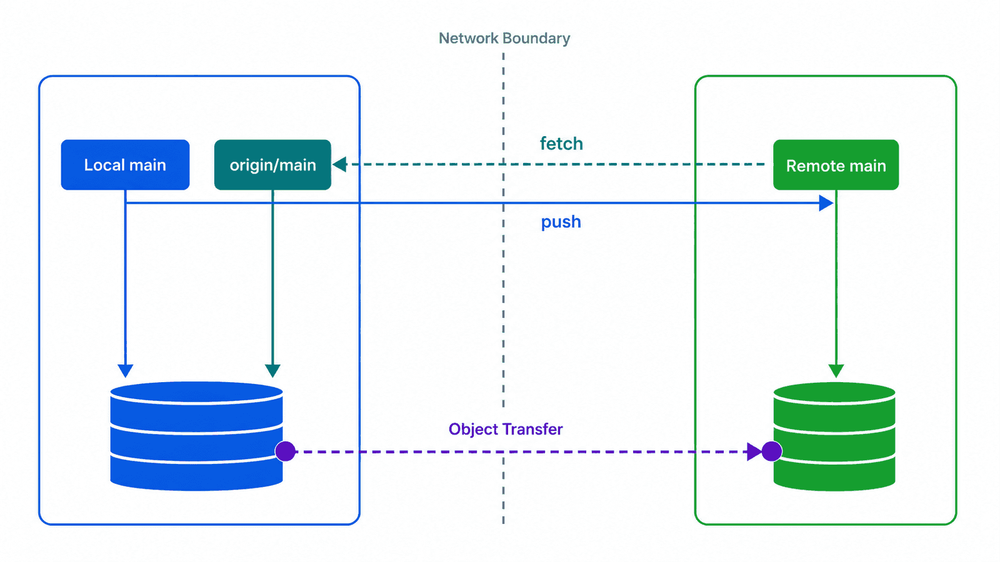
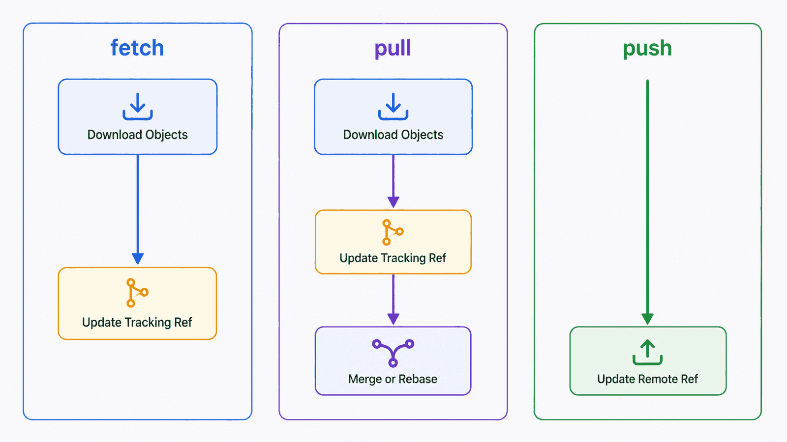

## 前置知识与学习目标

阅读前应能看懂提交图，并理解分支是引用、merge 与 rebase 会怎样改变历史。本文使用本地 bare 仓库模拟服务器，不依赖 GitHub 账号或网络。

学完后，你应该能够：

1. 区分远程仓库、remote 名称、远程跟踪引用和 upstream。
2. 解释 fetch、pull、push 分别读取和移动哪些引用。
3. 在同步前后用提交图验证结果。
4. 判断普通 push、拒绝推送和 `--force-with-lease` 的安全边界。

## 真实场景：已经 pull，为什么仍然推不上去

你在 `notes-cli` 的 `main` 上完成提交，同事也向服务器的 `main` 推送了新提交。你的 `git push` 被拒绝；运行 `git pull` 后又出现 merge 或 rebase 冲突。

关键不是记住“先 pull 再 push”，而是回答三个问题：

1. 服务器当前分支指向哪里？
2. 本地 `main` 与 `origin/main` 分别指向哪里？
3. 你准备通过 merge、rebase 还是放弃本地提交来消除分叉？

## 核心机制：一次通信更新两边不同的引用

### 四个容易混淆的概念

| 概念         | 示例                        | 含义                                      |
| ------------ | --------------------------- | ----------------------------------------- |
| 远程仓库     | GitHub 上的仓库或 bare repo | 另一个对象数据库与引用集合                |
| remote       | `origin`                    | 本地配置中一组 URL 和 fetch 规则的短名    |
| 远程跟踪引用 | `origin/main`               | 本地记录的“上次看到的远程 main”           |
| upstream     | `main` 跟踪 `origin/main`   | 当前分支默认比较、pull 和 push 的目标关系 |

`origin` 不是特殊协议关键字，只是 `clone` 默认创建的名称。一个本地仓库可以配置多个 remote。

<!-- figure-anchor:g03-f01 -->



### fetch：下载对象并更新远程跟踪引用

```bash
git fetch origin
```

fetch 通常执行两类动作：

1. 从远程下载本地缺少的对象。
2. 按 refspec 更新 `refs/remotes/origin/*`。

它不会自动移动本地 `main`，也不会改写工作区。因此 fetch 是同步前最适合观察证据的动作。

### pull：fetch 加集成

```bash
git pull --ff-only
git pull --rebase
```

pull 先 fetch，再根据参数和配置执行 merge 或 rebase。不要把 pull 当成单一原子动作；排障时分开运行 fetch 和显式集成更容易看清失败阶段。

### push：请求远程更新引用

```bash
git push origin main
```

push 上传远程缺少的对象，并请求服务器把目标引用从旧值更新到新值。普通 push 通常要求远程引用能够 fast-forward，以免覆盖别人已经发布的提交。

<!-- figure-anchor:g03-f02 -->



## 引用变化与协作策略

假设 fetch 后看到：

```text
      L1  main
     /
A---B---R1  origin/main
```

这表示本地和远程已分叉。可选路径包括：

```bash
# 保留一次显式集成
git merge origin/main

# 仅在本地提交尚未被他人依赖时整理历史
git rebase origin/main
```

完成并测试后再 push。先运行：

```bash
git log --oneline --graph --decorate --all
git diff origin/main...HEAD
```

三点 `...` 在这里比较双方共同祖先到本地 HEAD 的变化，适合审阅“当前分支准备贡献什么”。

### upstream 的建立与查看

首次推送功能分支时：

```bash
git push -u origin feature/uppercase
```

`-u` 建立 upstream。之后可查看：

```bash
git branch -vv
git status -sb
git rev-parse --abbrev-ref --symbolic-full-name @{upstream}
```

如果脚本需要明确目标，应传完整 remote 和 branch，不要依赖开发者机器上可能不同的默认配置。

## 最小实践：用本地 bare 仓库模拟服务器

在 `notes-cli` 的同级目录创建 bare 仓库：

```bash
git init --bare notes-cli-remote.git
```

回到工作仓库：

```bash
git remote add origin ../notes-cli-remote.git
git push -u origin main
git remote -v
git branch -vv
```

再克隆第二份工作副本模拟同事：

```bash
git clone notes-cli-remote.git notes-cli-peer
```

在 peer 中配置仓库级身份、提交并推送：

```bash
git config user.name "Peer Developer"
git config user.email "peer@example.com"
git add README.md
git commit -m "docs: clarify usage"
git push origin main
```

原工作仓库先 fetch 再观察：

```bash
git fetch origin
git log --oneline --graph --decorate --all
git status -sb
```

这个实验把认证、网络和托管平台排除在外，只验证 Git 对象与引用的同步语义。

## 输入、输出与失败边界

| 操作                      | 主要输入                 | 成功结果                   | 典型失败                           |
| ------------------------- | ------------------------ | -------------------------- | ---------------------------------- |
| fetch                     | remote URL、refspec      | 下载对象，更新远程跟踪引用 | 连接、认证、远程引用不存在         |
| pull                      | fetch 结果、集成策略     | 本地分支被 merge 或 rebase | 未指定策略、冲突、脏工作区         |
| push                      | 本地源引用、远程目标引用 | 上传对象并更新远程引用     | non-fast-forward、权限、分支保护   |
| push `--force-with-lease` | 预期的远程旧值           | 仅在远程仍匹配预期时改写   | lease 过期、错误目标、团队仍受影响 |

### 安全强推不是无风险强推

```bash
git fetch origin
git push --force-with-lease origin feature/uppercase
```

`--force-with-lease` 会检查你期望的远程旧值，降低静默覆盖新提交的风险；它仍会改写公共历史。受保护分支、明确沟通和再次 fetch 仍然必要。

### 标签推送要显式

普通 push 不保证推送所有本地标签。发布标签建议明确指定：

```bash
git tag -a v1.0.0 -m "release v1.0.0"
git push origin v1.0.0
```

批量 `git push --tags` 前应审查本地标签，避免把实验或私有标签一起发布。

## 常见误区与适用边界

### 误区一：`origin/main` 会实时反映服务器

它只在 fetch、pull 或某些成功 push 后更新。离线时它仍是本地缓存的引用。

### 误区二：pull 只是下载

pull 还会集成，可能修改当前分支和工作区。只想刷新证据时使用 fetch。

### 误区三：push 成功等于变更可发布

push 只证明对象和引用被远程接受；测试、评审、CI、分支保护和部署是后续不同关卡。

### 什么时候不用共享远程

本地个人仓库、离线实验和临时 bisect 不需要远程。remote 是协作和备份边界，不是 Git 本地提交的前置条件。

## 本篇自检

<details>
<summary>1. fetch 后为什么本地 main 不一定变化？</summary>

fetch 主要更新 `origin/main` 等远程跟踪引用；本地 `main` 是另一条引用，需要显式 merge、rebase 或其他操作才会移动。

</details>

<details>
<summary>2. non-fast-forward 拒绝保护了什么？</summary>

它阻止远程引用直接跳到一个不包含其当前提交的新历史，从而避免普通 push 静默覆盖已发布提交。

</details>

<details>
<summary>3. 为什么排障时建议把 pull 拆成 fetch 与集成？</summary>

这样能区分失败发生在网络下载阶段还是本地 merge/rebase 阶段，并能在修改当前分支前观察提交图。

</details>

## 本篇总结

远程协作的核心仍是对象和引用：fetch 更新本地的远程跟踪引用，pull 在此基础上集成，push 请求远程移动引用。先观察双方提交图，再选择集成和发布方式，才能避免把“同步”变成不可解释的试错。

## 下一篇衔接

下一篇把提交历史当作证据库：用 log、diff、blame 和 bisect 定位变化，再用 cherry-pick 与 worktree 隔离复现和移植修复。

## 资料来源

- [Pro Git：Working with Remotes](https://git-scm.com/book/en/v2/Git-Basics-Working-with-Remotes)
- [Pro Git：Remote Branches](https://git-scm.com/book/en/v2/Git-Branching-Remote-Branches)
- [git-fetch Documentation](https://git-scm.com/docs/git-fetch)
- [git-pull Documentation](https://git-scm.com/docs/git-pull)
- [git-push Documentation](https://git-scm.com/docs/git-push)
