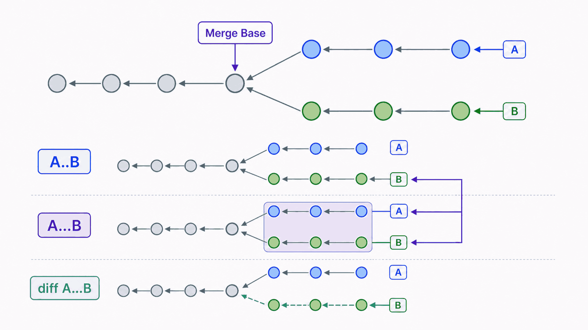
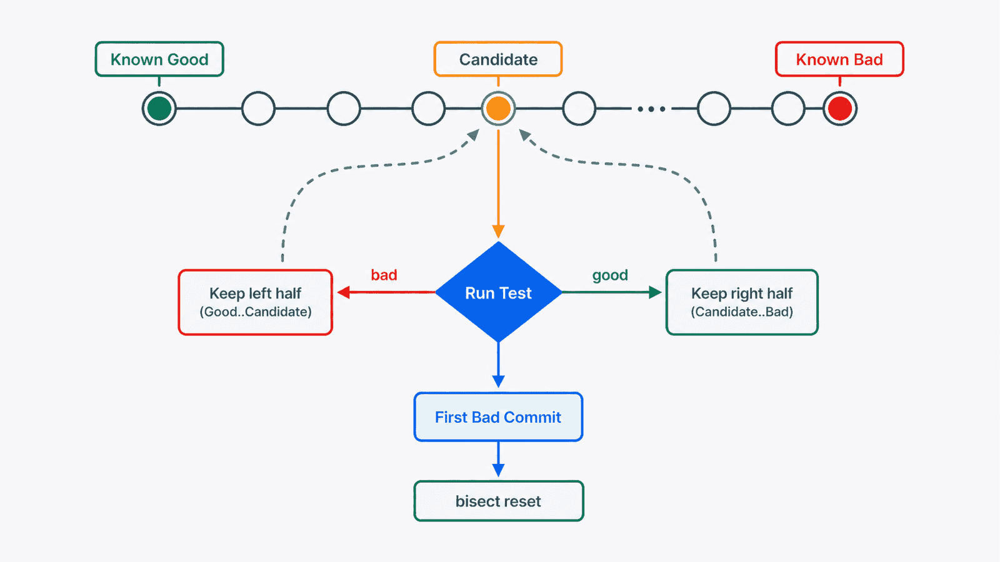

## 前置知识与学习目标

阅读前应能看懂提交图、分支引用与远程跟踪引用。本文只做历史查询、隔离复现和受控移植，不讨论如何撤销错误；恢复策略留到下一篇。

学完后，你应该能够：

1. 用 revision range 精确回答“比较哪两端”。
2. 从 log、diff 和 blame 建立变更证据链。
3. 用 bisect 把线性搜索缩小为对数级定位。
4. 用 worktree 隔离现场，用 cherry-pick 移植单个已验证提交。

## 真实场景：格式化函数从哪个提交开始出错

`notes-cli` 最近十个提交中，某次修改让空标题返回错误结果。逐个阅读全部提交既慢又容易受提交说明误导。更可靠的问题分解是：

1. 哪个版本确定正常，哪个版本确定异常？
2. 两者之间有哪些候选提交？
3. 每次测试如何给出稳定的 good/bad 结论？
4. 定位后如何在不破坏当前工作区的情况下验证修复？

## 核心机制：先限定集合，再检查证据

### log 选择提交集合

```bash
git log --oneline --graph --decorate --all
git log -- src/format.mjs
git log -p -- src/format.mjs
git log --since="2 weeks ago" --author="Developer"
```

路径前的 `--` 用来结束 revision 参数，避免路径名被误判为分支或提交。

常用范围语义：

| 表达式              | 选择含义                |
| ------------------- | ----------------------- |
| `A..B`              | B 可达但 A 不可达的提交 |
| `A...B`             | A、B 对称差中的提交     |
| `A^`                | A 的第一个父提交        |
| `A~3`               | 沿第一父链向前 3 步     |
| `branch@{upstream}` | 分支的 upstream 引用    |

比较提交集合与比较文件差异不是同一个问题。`git log A..B` 选择提交；`git diff A B` 比较两个 tree；`git diff A...B` 把 merge base 与 B 比较。

<!-- figure-anchor:g04-f01 -->



### diff 验证实际内容

```bash
git show --stat --oneline <commit>
git show <commit> -- src/format.mjs
git diff <good> <bad> -- src/format.mjs
git diff --word-diff <good> <bad> -- README.md
```

提交说明是线索，diff 才是实际内容证据。重命名识别是基于相似度推断，不是提交对象永久保存的“rename”事件。

### blame 定位最后一次行级变化

```bash
git blame -L 1,40 src/format.mjs
git blame -w -L 1,40 src/format.mjs
```

blame 展示当前每行最后关联的提交，适合找到进一步阅读的入口。它不能证明个人责任，也不能直接说明设计原因；大量格式化、移动代码或复制代码会降低直观性。

## bisect：用可重复测试定位首个坏提交

已知当前 `HEAD` 异常、标签 `v1.0.0` 正常：

```bash
git bisect start
git bisect bad HEAD
git bisect good v1.0.0
```

Git 会检出中间候选提交。每次运行同一个测试，并标记：

```bash
node --test
git bisect good
# 或
git bisect bad
```

结束后必须恢复：

```bash
git bisect reset
```

若测试可以用退出码稳定表达结果，可自动运行：

```bash
git bisect run node --test
```

退出码 `0` 表示 good，`1` 到 `127`（除 `125`）表示 bad，`125` 表示当前提交无法测试并跳过。测试不稳定、依赖外部服务或不同历史需要不同构建环境时，不适合直接自动 bisect。

<!-- figure-anchor:g04-f02 -->



## worktree 与 cherry-pick：隔离现场和移植结果

### 用 worktree 保留当前工作区

需要在旧提交复现问题，但当前目录还有工作时：

```bash
git worktree add ../notes-cli-debug <commit>
git worktree list
```

验证结束后，在主工作区执行：

```bash
git worktree remove ../notes-cli-debug
git worktree prune
```

多个 worktree 共享对象数据库和大部分引用，但拥有独立工作区、Index 和 HEAD。不要把同一普通分支同时检出到多个 worktree 后绕过保护强行修改。

### 用 cherry-pick 移植一个提交

确认修复提交 `F1` 自包含且通过测试后：

```bash
git switch release/1.x
git cherry-pick F1
```

cherry-pick 会在当前分支创建一个新提交，内容对应所选提交引入的变化，但父提交和对象 ID 不同。发生冲突时：

```bash
git add <resolved-paths>
git cherry-pick --continue
```

或放弃整个操作：

```bash
git cherry-pick --abort
```

cherry-pick 适合移植独立修复，不适合长期代替分支集成；大量相互依赖提交被零散移植会让历史关系难以追踪。

## 最小实践：建立可审计的定位记录

一次诊断至少记录以下内容：

```text
symptom: empty title returns "UNTITLED"
good: v1.0.0
bad: main@{2026-07-15}
test: node --test test/format.test.mjs
first_bad_commit: <object-id>
fix_commit: <object-id>
verification: tests passed in isolated worktree
```

推荐命令顺序：

```bash
git status --short
git log --oneline --graph --decorate --all
git diff v1.0.0...main -- src/format.mjs
git bisect start main v1.0.0
git bisect run node --test test/format.test.mjs
git bisect reset
```

先确认工作区状态是为了避免把诊断过程与未提交修改混在一起。bisect 会反复切换提交，构建产物和依赖缓存应能被安全清理或隔离。

## 输入、输出与失败边界

| 工具        | 输入                          | 输出               | 主要边界                           |
| ----------- | ----------------------------- | ------------------ | ---------------------------------- |
| log         | revision 集合、路径、过滤器   | 提交序列           | 过滤条件可能隐藏关键提交           |
| diff/show   | 两个 tree 或一个提交          | 实际补丁           | 三点与两点语义容易混淆             |
| blame       | 当前文件与行范围              | 行到提交的线索     | 不是责任判定，移动/格式化会干扰    |
| bisect      | 一个 good、一个 bad、稳定测试 | 首个坏提交候选     | flaky test 会给出错误结论          |
| worktree    | 提交或分支、目标目录          | 隔离工作区         | 仍共享对象和引用，删除前要检查工作 |
| cherry-pick | 一个或多个提交                | 当前分支上的新提交 | 冲突、重复移植、依赖不完整         |

## 常见误区与适用边界

### 误区一：提交说明足以证明原因

说明可能过时或不完整。应结合 diff、测试、评审记录和当时需求判断。

### 误区二：blame 用来找“责任人”

它只展示当前行最后关联的提交。修复问题需要还原上下文，而不是把代码所有权简化为个人归因。

### 误区三：bisect 找到的提交就是根因

bisect 找到的是让测试首次从 good 变为 bad 的提交。环境变化、隐藏依赖或测试定义错误仍可能让结论偏离真实根因。

### 什么时候不用 cherry-pick

如果目标是同步一整条长期开发线，使用 merge 或 rebase 更能表达依赖关系。cherry-pick 应服务于明确、独立、可验证的提交。

## 本篇自检

<details>
<summary>1. `A..B` 和 `A...B` 在 log 中有什么区别？</summary>

`A..B` 选择 B 可达但 A 不可达的提交；`A...B` 选择两端对称差中的提交，即排除双方共同可达部分。

</details>

<details>
<summary>2. 自动 bisect 对测试脚本有什么要求？</summary>

同一提交上结果应稳定，并用约定退出码表达 good、bad 或 skip；依赖外部不稳定状态的测试会污染定位结果。

</details>

<details>
<summary>3. worktree 为什么比直接 checkout 旧提交更适合保留现场？</summary>

它提供独立工作区、Index 和 HEAD，不需要在当前目录切走分支或覆盖当前文件，同时仍复用仓库对象。

</details>

## 本篇总结

历史诊断的核心是限定提交集合、检查实际 diff、用稳定测试缩小范围，并在隔离环境验证。log、blame 和提交说明提供线索，bisect 和测试提供可重复证据，worktree 与 cherry-pick负责隔离和受控移植。

## 下一篇衔接

下一篇处理诊断后的动作选择：错误位于工作区、Index、本地提交还是已发布历史时，分别应该使用 restore、reset、revert、reflog 或 stash 中的哪一个。

## 资料来源

- [gitrevisions Documentation](https://git-scm.com/docs/gitrevisions)
- [git-log Documentation](https://git-scm.com/docs/git-log)
- [git-diff Documentation](https://git-scm.com/docs/git-diff)
- [git-blame Documentation](https://git-scm.com/docs/git-blame)
- [git-bisect Documentation](https://git-scm.com/docs/git-bisect)
- [git-worktree Documentation](https://git-scm.com/docs/git-worktree)
- [git-cherry-pick Documentation](https://git-scm.com/docs/git-cherry-pick)
