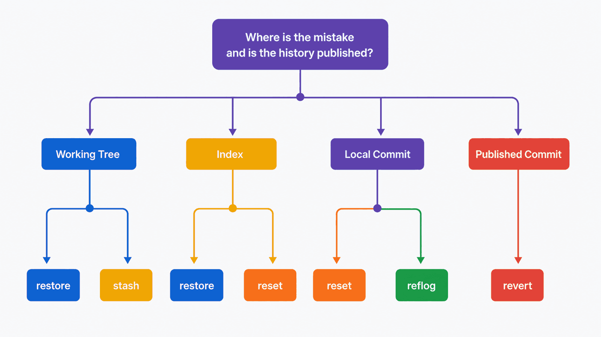
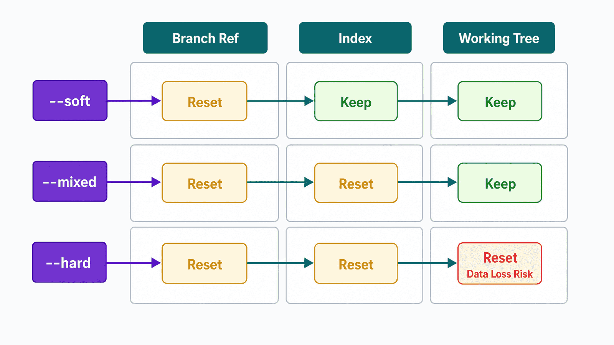

## 前置知识与学习目标

阅读前应理解 HEAD、分支引用、Index、工作区和提交图。恢复操作的差异，本质上是它们会移动哪个引用、重写哪一层内容，以及是否创建新提交。

学完后，你应该能够：

1. 先按错误所在层级和是否已发布选择工具。
2. 解释 restore、reset 与 revert 的不同影响面。
3. 使用 reflog 找回仍存在但失去引用的提交。
4. 识别 `--hard`、强制覆盖和 stash 的数据丢失边界。

## 真实场景：一句“撤销刚才的修改”有六种含义

在 `notes-cli` 中，下面这些请求不能用同一个命令回答：

- 只想丢弃工作区中还没暂存的一行。
- 暂存了错误文件，但希望保留编辑内容。
- 本地最后一次提交说明写错了。
- 本地提交方向错误，还没有 push。
- 错误已经进入共享 `main`。
- 误 reset 后看不到原提交了。

执行前先记录证据：

```bash
git status --short
git log --oneline --decorate -8
git reflog -8
git diff
git diff --staged
```

## 核心机制：按影响层和发布边界决策

<!-- figure-anchor:g05-f01 -->



| 目标                 | 推荐起点                      | 工作区         | Index        | 分支引用/历史               |
| -------------------- | ----------------------------- | -------------- | ------------ | --------------------------- |
| 丢弃未暂存路径修改   | `git restore <path>`          | 改写           | 不变         | 不变                        |
| 取消暂存并保留编辑   | `git restore --staged <path>` | 不变           | 改写         | 不变                        |
| 修改最后一次本地提交 | `git commit --amend`          | 取决于暂存内容 | 用于新提交   | 创建新 commit，分支移动     |
| 回退未发布本地提交   | `git reset`                   | 按模式变化     | 按模式变化   | 分支移动                    |
| 撤销已发布提交       | `git revert <commit>`         | 形成反向变化   | 形成反向变化 | 新增提交，不改写旧历史      |
| 找回失去引用的提交   | `git reflog` 后建分支         | 不直接变化     | 不直接变化   | 新建引用恢复可达性          |
| 临时腾空工作区       | `git stash push`              | 回到基线       | 回到基线     | 创建 stash 记录，不移动分支 |

“是否已发布”比“命令是否方便”更重要。公共历史优先追加可审计的反向提交；未发布的个人历史才考虑 reset 或 amend。

## restore：处理路径级工作区和 Index

取消暂存但保留工作区修改：

```bash
git restore --staged src/format.mjs
```

用 Index 内容覆盖工作区路径：

```bash
git restore src/format.mjs
```

第二条会丢弃该路径未暂存修改。执行前先看 `git diff -- src/format.mjs`。

从指定提交恢复路径到工作区和 Index：

```bash
git restore --source=<commit> --staged --worktree src/format.mjs
```

这不是把分支退回该提交，而是用指定 tree 的路径内容改写两层状态，随后仍需决定是否提交。

## reset：移动当前分支并选择如何重置状态

假设当前分支为：

```text
A---B---C  HEAD -> main
```

执行 `git reset B` 会让 `main` 移回 B；三种模式决定 C 相对 B 的变化留在哪里。

<!-- figure-anchor:g05-f02 -->



| 模式      | 分支引用 | Index         | 工作区   | 常见用途                   |
| --------- | -------- | ------------- | -------- | -------------------------- |
| `--soft`  | 移动     | 保留 C 的变化 | 保留     | 重新组织未发布提交         |
| `--mixed` | 移动     | 重置到 B      | 保留     | 默认模式，重新选择暂存内容 |
| `--hard`  | 移动     | 重置到 B      | 重置到 B | 丢弃已跟踪修改，风险最高   |

```bash
git reset --soft HEAD~1
git reset --mixed HEAD~1
```

不要在不清楚未跟踪文件、嵌套仓库和构建产物状态时把 `--hard` 当清理命令。`reset --hard` 不保证清理所有未跟踪文件，却会覆盖已跟踪文件中的未提交修改。

## revert：用新提交反转已发布变化

```bash
git revert <commit>
```

revert 计算目标提交引入的变化并尝试应用反向补丁，然后创建新提交。原提交仍留在历史中，因此适合共享分支。

回滚 merge commit 需要指定保留哪条父线：

```bash
git revert -m 1 <merge-commit>
```

`-m 1` 不是“回滚第一个提交”，而是把第一个父提交视为主线。错误选择会产生难以理解的结果；应先用 `git show --no-patch --pretty=raw <merge-commit>` 检查父顺序，并在临时分支验证。

## reflog：恢复引用移动记录

误把 `main` reset 到旧提交后：

```bash
git reflog --date=iso
```

找到操作前的对象 ID，先创建恢复分支，不要立即再次 reset：

```bash
git branch recovery/before-reset <object-id>
git log --oneline --decorate recovery/before-reset -5
```

reflog 是本地引用日志，有过期和清理策略，也不会自动存在于其他克隆中。它是重要恢复窗口，但不是备份系统。

## stash 与 amend 的适用边界

### stash 临时保存状态

```bash
git stash push -u -m "wip: formatter experiment"
git stash list
git stash show -p stash@{0}
git stash apply stash@{0}
```

确认应用结果和测试后再删除：

```bash
git stash drop stash@{0}
```

`pop` 相当于应用成功后尝试删除，冲突时更不容易判断 stash 是否仍存在。重要工作应提交到临时分支，而不是长期堆在 stash 中。

### amend 重建最后一次提交

```bash
git add src/format.mjs
git commit --amend
```

amend 会创建新 commit 并移动当前分支，原提交可能只能通过 reflog 找到。若原提交已经发布，amend 会导致后续 push 需要历史改写，不应作为默认修正方式。

## 最小实践：在临时分支验证恢复

先创建保护引用：

```bash
git branch backup/before-recovery
```

然后模拟一次未发布提交重组：

```bash
git reset --soft HEAD~1
git status --short
git diff --staged
git commit -m "fix: normalize empty titles"
```

模拟已发布错误时，不移动旧历史：

```bash
git switch -c recovery/revert-demo
git revert <bad-commit>
node --test
git log --oneline --decorate -4
```

验收重点不是命令退出码为零，而是：引用位置正确、Index 与工作区可解释、测试通过、没有把无关变化一起提交。

## 输入、输出与失败边界

| 操作           | 可恢复性线索                    | 主要风险                           |
| -------------- | ------------------------------- | ---------------------------------- |
| restore 工作区 | 未暂存内容通常没有 Git 对象保护 | 覆盖后可能无法由 Git 找回          |
| reset 分支     | 原位置通常暂时存在于 reflog     | reflog 会过期；继续操作会增加混淆  |
| revert         | 原历史保留                      | 反向补丁可能冲突或不恢复外部副作用 |
| stash          | stash 引用保存状态              | 未包含的未跟踪/忽略文件仍可能丢失  |
| amend          | 原提交通常暂见于 reflog         | 已发布时造成历史分叉               |

Git 只能恢复进入对象数据库的内容。编辑器本地历史、文件系统快照和远程备份仍是未提交工作的另一层保护。

## 常见误区与适用边界

### 误区一：reset 和 revert 都是删除提交

reset 移动引用；revert 新增反向提交。两者对公共历史的影响完全不同。

### 误区二：reflog 能找回任何文件

只有曾进入 Git 对象或引用变化链的内容才可能通过 Git 找回。纯工作区且从未暂存的内容不在保证范围内。

### 误区三：stash 是可靠长期备份

stash 适合短期上下文切换，没有清晰分支名、评审和远程副本。重要阶段应建立分支并提交。

### 什么时候不该自动恢复

涉及共享分支、发布标签、生成制品、数据库迁移或外部 API 副作用时，Git 只覆盖源码历史。应先制定业务回滚方案，再决定代码层 revert。

## 本篇自检

<details>
<summary>1. 已暂存错误文件但想保留编辑，应使用什么？</summary>

使用 `git restore --staged <path>` 把该路径从 Index 取消暂存，工作区内容保持不变，然后重新检查状态。

</details>

<details>
<summary>2. 公共 main 上的错误为什么优先 revert？</summary>

revert 追加可审计的反向提交，不要求其他协作者重建已经基于旧提交形成的历史。

</details>

<details>
<summary>3. 误 reset 后为什么先建 recovery 分支？</summary>

先给原对象增加稳定引用，避免继续移动当前分支时再次失去位置，也便于对比和验证后再决定合并或重置。

</details>

## 本篇总结

恢复操作先判断错误位于工作区、Index、本地提交还是公共历史。restore 面向路径层，reset 移动当前分支，revert 追加反向提交，reflog 提供有限恢复窗口，stash 只适合短期上下文。任何危险操作前都应保存证据和建立保护引用。

## 下一篇衔接

下一篇处理另一类“push 失败”：当提交图没有问题，但 HTTPS 443 无法建立连接时，如何按 remote、DNS、TCP、代理、TLS 和认证逐层定位，而不是反复改配置。

## 资料来源

- [Git：Reset, restore and revert](https://git-scm.com/docs/git#_reset_restore_and_revert)
- [git-restore Documentation](https://git-scm.com/docs/git-restore)
- [git-reset Documentation](https://git-scm.com/docs/git-reset)
- [git-revert Documentation](https://git-scm.com/docs/git-revert)
- [git-reflog Documentation](https://git-scm.com/docs/git-reflog)
- [git-stash Documentation](https://git-scm.com/docs/git-stash)
