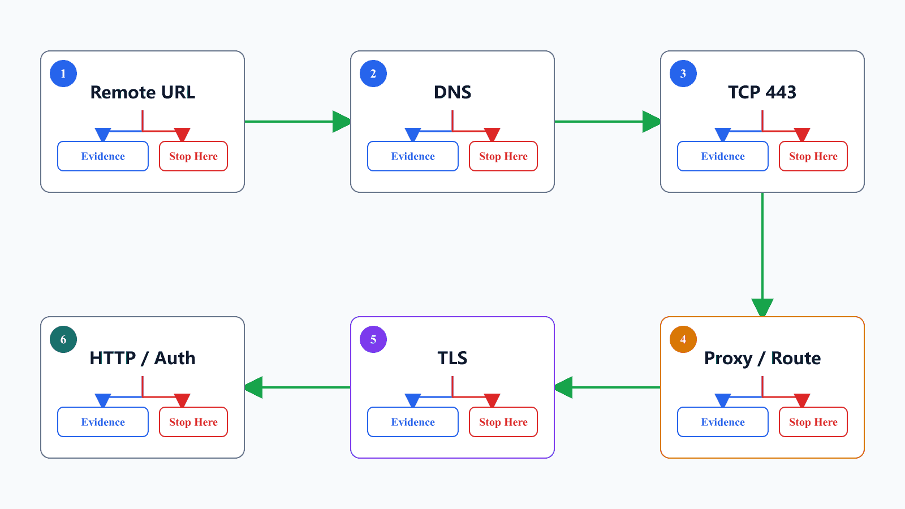
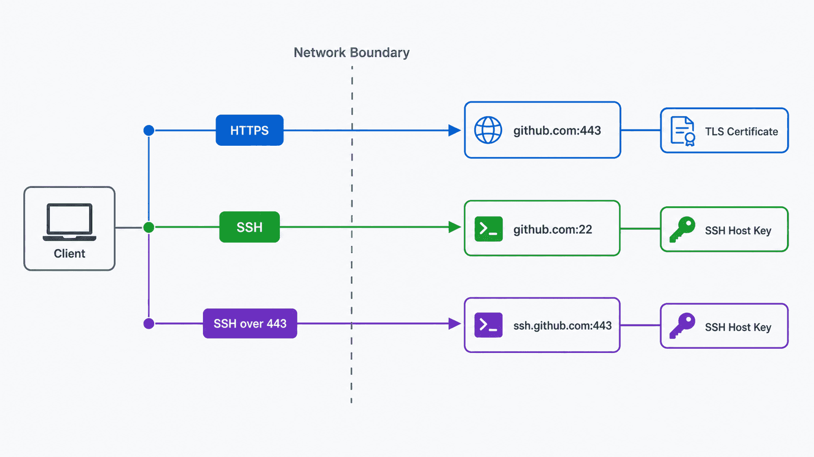

## 前置知识与学习目标

阅读前应理解 remote、fetch、push 和远程跟踪引用。本文以 GitHub.com 为例；企业内网、GitHub Enterprise Server 和自建 Git 服务的主机名、证书与网络策略可能不同。

学完后，你应该能够：

1. 从 remote URL 判断实际使用 HTTPS 还是 SSH。
2. 按 DNS、TCP、代理、TLS、HTTP/认证的顺序收集证据。
3. 找到 Git 代理配置的作用域与来源，避免盲目写全局配置。
4. 在不关闭证书校验的前提下处理企业证书或改用 SSH over 443。

## 真实场景：443 超时不等于 Git 端口配置错了

常见错误如下：

```text
Failed to connect to github.com port 443 after 21090 ms:
Couldn't connect to server
```

端口 443 是 HTTPS 的默认目标端口。这个错误说明连接尚未成功建立到目标服务，常见原因包括代理残留、网络出口策略、DNS、公司防火墙、VPN 路由或目标服务可达性。它通常不是“Git 端口与系统端口不一致”。

## 核心机制：先确定协议，再定位失败层

第一步永远是检查 remote，而不是修改代理：

```bash
git remote -v
git remote get-url --all origin
```

典型 HTTPS URL：

```text
https://github.com/OWNER/REPOSITORY.git
```

典型 SSH URL：

```text
git@github.com:OWNER/REPOSITORY.git
```

HTTPS 通常连接 `github.com:443`；SSH 简写通常连接 `github.com:22`。配置 SSH over 443 后，SSH 实际目标是 `ssh.github.com:443`。两条路径使用不同的代理、证书与认证机制，不能混为一谈。

<!-- figure-anchor:g06-f01 -->



推荐按以下层级停止和分流：

| 层级      | 要回答的问题                   | 证据示例                     |
| --------- | ------------------------------ | ---------------------------- |
| remote    | URL 和协议是否是预期值？       | `git remote -v`              |
| DNS       | 主机名解析到什么地址？         | `nslookup github.com`        |
| TCP       | 目标端口能否建立连接？         | `Test-NetConnection`         |
| 代理/路由 | 流量经哪个出口？               | Git 配置来源、环境变量       |
| TLS       | 证书链、主机名和时间是否有效？ | `curl -Iv`、Git curl trace   |
| HTTP/认证 | 服务响应与凭据是否有效？       | `git ls-remote` 的状态与错误 |

## 第一步：基础连通性与只读 Git 请求

### Windows PowerShell

```powershell
Resolve-DnsName github.com
Test-NetConnection github.com -Port 443
curl.exe -I https://github.com
```

### macOS 或 Linux

```bash
getent hosts github.com
curl -I https://github.com
```

不同系统可能没有 `getent`；可改用 `dig` 或 `nslookup`。然后对公开或有权访问的仓库执行只读引用查询：

```bash
git ls-remote https://github.com/OWNER/REPOSITORY.git
```

解释结果时逐层判断：

- DNS 失败：先处理解析器、VPN 或域名策略。
- TCP 443 失败：检查防火墙、代理、网络出口和服务状态。
- curl 成功而 Git 失败：重点检查 Git 自身配置、证书后端和凭据。
- 已收到 HTTP 401/403：网络与 TLS 多半已通，应进入认证或权限排查。

## 第二步：找出代理配置来自哪里

Git 配置有 system、global、local、worktree 和命令行等作用域。先只读查看来源：

```bash
git config --show-origin --show-scope --get-regexp '^http\..*proxy$'
git config --show-origin --show-scope --get-regexp '^remote\..*proxy$'
```

再检查环境变量。

PowerShell：

```powershell
Get-ChildItem Env:*proxy*
```

macOS/Linux shell：

```bash
env | grep -i proxy
```

常见变量包括 `HTTP_PROXY`、`HTTPS_PROXY`、`ALL_PROXY` 和对应小写形式。不同程序对大小写和 `NO_PROXY` 的支持存在差异，所以应记录实际进程环境。

### 临时验证优先于永久配置

如果已知本地 HTTP 代理监听 `127.0.0.1:7890`，先只对一次命令验证：

```bash
git -c http.proxy=http://127.0.0.1:7890 \
  ls-remote https://github.com/OWNER/REPOSITORY.git
```

SOCKS5 且希望代理端解析域名时：

```bash
git -c http.proxy=socks5h://127.0.0.1:7890 \
  ls-remote https://github.com/OWNER/REPOSITORY.git
```

验证有效后再决定持久作用域。只针对 GitHub.com：

```bash
git config --global \
  http.https://github.com.proxy \
  http://127.0.0.1:7890
```

Git 的代理配置属于 `http.proxy` 或 URL 级 `http.<url>.proxy`。不要凭目标是 HTTPS 就发明 `https.proxy` 配置键；代理 URL 的 `http://` 表示客户端连接代理的方式，不等于目标网站使用明文 HTTP。

取消前先确认来源和作用域。例如删除 global URL 级配置：

```bash
git config --global --unset-all http.https://github.com.proxy
```

如果实际配置来自 system、local 或环境变量，删除 global 键不会解决问题。

## 第三步：收集 Git 的网络轨迹

不要把包含凭据的完整日志直接发布。Git curl trace 可能暴露 URL、代理地址、用户名、Cookie 或授权头；分享前必须脱敏。

PowerShell：

```powershell
$env:GIT_TRACE = "1"
$env:GIT_CURL_VERBOSE = "1"
git ls-remote https://github.com/OWNER/REPOSITORY.git
Remove-Item Env:GIT_TRACE
Remove-Item Env:GIT_CURL_VERBOSE
```

macOS/Linux shell：

```bash
GIT_TRACE=1 GIT_CURL_VERBOSE=1 \
  git ls-remote https://github.com/OWNER/REPOSITORY.git
```

主要观察：实际连接主机和端口、是否使用代理、DNS 结果、TCP/TLS 阶段、HTTP 状态。日志用于确定失败层，不应直接作为“多试几次”的理由。

## TLS 与企业证书：不要关闭校验

以下命令会削弱 HTTPS 身份校验，不应作为解决方案：

```bash
git config --global http.sslVerify false
```

若错误包含 certificate、CA、SSL 或 hostname：

1. 检查系统时间和目标主机名。
2. 确认公司代理是否执行 TLS inspection。
3. 按组织规范把企业根证书导入受信任证书库，或为 Git 配置受控 CA 文件。
4. 确认 Git 使用的 TLS/证书后端与系统工具是否一致。
5. 恢复并验证 `http.sslVerify=true`。

不要从不可信聊天记录下载根证书，也不要把内部证书文件提交进仓库。

## HTTPS 与 SSH over 443

如果 HTTPS 路径受限，也可以评估 SSH；这会改变认证方式，不保证绕过代理或组织策略。

普通 SSH 测试：

```bash
ssh -T git@github.com
```

GitHub.com 官方提供 SSH over 443，先测试专用主机：

```bash
ssh -T -p 443 git@ssh.github.com
```

测试成功后可在 `~/.ssh/config` 配置：

```text
Host github.com
  HostName ssh.github.com
  Port 443
  User git
```

再次验证：

```bash
ssh -T git@github.com
```

首次连接应核对 GitHub 官方公布的主机密钥指纹。GitHub Enterprise Server 和部分数据驻留场景不支持同样的 SSH over 443 入口，不能直接照搬 `ssh.github.com`。

<!-- figure-anchor:g06-f02 -->



## 最小实践：可复现排障记录

```text
1. 保存原始错误、时间和网络环境
2. git remote -v：确认 HTTPS 还是 SSH
3. DNS 与目标端口：确认是否到达目标
4. git config --show-origin --show-scope：定位代理来源
5. 检查环境变量：确认进程出口
6. curl 与 git ls-remote：区分系统工具和 Git
7. 脱敏 trace：定位 DNS/TCP/TLS/HTTP/认证层
8. 只修改证据指向的配置
9. 用同一只读命令复测并记录结果
```

建议把排障记录写成表格：

| 时间  | 网络       | remote URL | DNS  | TCP  | 代理来源    | TLS/HTTP 结果 | 结论           |
| ----- | ---------- | ---------- | ---- | ---- | ----------- | ------------- | -------------- |
| 10:30 | 公司 Wi-Fi | HTTPS      | 成功 | 失败 | global 残留 | 未到 TLS      | 先清理错误代理 |

这样可以避免切换 VPN、DNS 和代理后无法判断究竟哪项变化有效。

## 输入、输出与失败边界

| 操作            | 输入       | 输出                | 边界                           |
| --------------- | ---------- | ------------------- | ------------------------------ |
| DNS 查询        | 主机名     | IP 或解析错误       | 成功不代表端口可达             |
| TCP 测试        | 主机、端口 | 连接成功或超时/拒绝 | 不验证 Git 权限                |
| curl HEAD       | HTTPS URL  | TLS 与 HTTP 结果    | 与 Git 的证书/代理配置可能不同 |
| `git ls-remote` | remote URL | refs 或分层错误     | 私有仓库还需要凭据             |
| trace           | Git 请求   | 详细网络证据        | 可能含敏感信息，必须脱敏       |

## 常见误区与适用边界

### 误区一：刷新 DNS 能修复所有 443 错误

只有证据显示解析异常或缓存错误时，刷新 DNS 才有意义。TCP 被阻断、代理错误和 TLS 证书问题不会因此自动消失。

### 误区二：浏览器能打开 GitHub，Git 就一定能连接

浏览器可能使用系统代理、扩展或不同证书库；Git 进程可能读取另一套配置和环境变量。

### 误区三：关闭 SSL 校验可以证明是证书问题

它会同时取消关键安全保障，并可能把中间人攻击误判成“连接恢复”。应检查证书链和受信任根，而不是关闭验证。

### 什么时候应交给网络管理员

公司网络明确执行 TLS inspection、需要代理认证、阻断 GitHub IP/域名或只允许受管客户端时，应携带脱敏证据交给管理员，不要尝试规避组织策略。

## 本篇自检

<details>
<summary>1. `git@github.com:OWNER/REPO.git` 默认为什么不是 HTTPS 443？</summary>

这是 SSH 的 scp 风格 URL，默认连接 `github.com:22`；只有显式配置后才可能通过 `ssh.github.com:443`。

</details>

<details>
<summary>2. 为什么应先用 `git -c http.proxy=...` 做一次性验证？</summary>

它把影响限制在单次命令，能验证假设而不立即污染所有仓库的 global 配置；确认有效后再选择持久作用域。

</details>

<details>
<summary>3. 收到 HTTP 403 时还应继续排查 TCP 443 吗？</summary>

通常不应把它当 TCP 连接失败。既然收到了 HTTP 响应，DNS、TCP 和 TLS 多半已完成，应转向凭据、权限、组织策略或分支保护证据。

</details>

## 本篇总结

443 排障的关键是分层：remote 决定协议，DNS 和 TCP 决定能否到达，代理决定出口，TLS 决定身份与加密，HTTP/认证决定服务是否接受请求。先收集证据，再做最小范围修改，远比反复写全局代理或关闭证书校验可靠。

## 下一篇衔接

本系列到这里完成了从本地对象、分支集成、远程同步、历史诊断、撤销恢复到网络排障的闭环。下一步可以继续学习签名提交、部分克隆、子模块、Git Hooks、服务端策略与大型仓库维护，并始终沿用“对象—引用—证据—边界”的分析方法。

## 资料来源

- [GitHub Docs：Troubleshooting connectivity problems](https://docs.github.com/en/get-started/using-github/troubleshooting-connectivity-problems)
- [GitHub Docs：Using SSH over the HTTPS port](https://docs.github.com/en/authentication/troubleshooting-ssh/using-ssh-over-the-https-port)
- [GitHub Docs：GitHub's SSH key fingerprints](https://docs.github.com/en/authentication/keeping-your-account-and-data-secure/githubs-ssh-key-fingerprints)
- [git-config Documentation](https://git-scm.com/docs/git-config)
- [git-ls-remote Documentation](https://git-scm.com/docs/git-ls-remote)
- [Git environment variables](https://git-scm.com/book/en/v2/Git-Internals-Environment-Variables)
