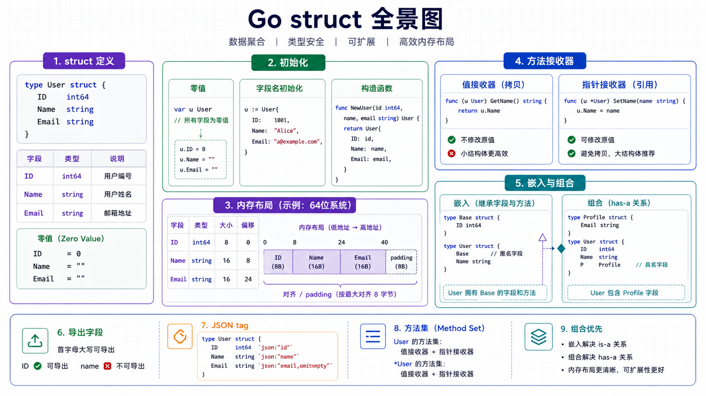

## 结构体定义

结构体把多个字段组合成一个新的类型。

```go
type User struct {
    ID    int64
    Name  string
    Email string
}
```



字段首字母大写表示可导出，其他包可以访问；首字母小写表示仅包内可见。

```go
type user struct {
    id   int64  // 包内可见
    Name string // 包外可见
}
```

---

## 实例化和初始化

### 零值实例

```go
var u User
fmt.Println(u.ID, u.Name) // 0 ""
```

Go 鼓励设计“零值可用”的类型。比如 `sync.Mutex` 的零值就可以直接使用。

### 字段名初始化

```go
u := User{
    ID:    1,
    Name:  "Alice",
    Email: "alice@example.com",
}
```

推荐优先使用字段名初始化，可读性高，也不怕字段顺序变化。

### 顺序初始化

```go
u := User{1, "Alice", "alice@example.com"}
```

顺序初始化要求提供所有字段，并严格遵守字段声明顺序。生产代码中不推荐在跨包结构体上使用。

### 指针实例

```go
u := &User{Name: "Alice"}
u.Email = "alice@example.com"
```

`new(User)` 也会返回 `*User`，但字段名初始化通常更直观。

---

## 构造函数

Go 没有构造函数语法，通常用普通函数创建并校验对象。

```go
func NewUser(id int64, name, email string) (*User, error) {
    if id <= 0 {
        return nil, fmt.Errorf("id 必须大于 0")
    }
    if name == "" {
        return nil, fmt.Errorf("name 不能为空")
    }

    return &User{
        ID:    id,
        Name:  name,
        Email: email,
    }, nil
}
```

当创建过程需要校验、设置默认值或隐藏内部字段时，构造函数很有用。

---

## 方法和接收器

方法是带接收器的函数。

```go
func (u User) DisplayName() string {
    return fmt.Sprintf("%d:%s", u.ID, u.Name)
}
```

### 值接收器

值接收器会复制结构体。

```go
func (u User) Rename(name string) {
    u.Name = name // 修改的是副本
}
```

### 指针接收器

指针接收器可以修改原对象，也避免复制大结构体。

```go
func (u *User) Rename(name string) {
    u.Name = name
}
```

经验规则：

- 方法需要修改接收者时，用指针接收器。
- 结构体较大或包含锁时，用指针接收器。
- 同一个类型的方法尽量统一接收器风格，避免方法集理解成本。

---

## 方法集

方法集决定一个类型是否实现接口。

```go
type Renamer interface {
    Rename(string)
}

func (u *User) Rename(name string) {
    u.Name = name
}

var _ Renamer = (*User)(nil) // 编译期检查 *User 是否实现接口
```

如果方法定义在 `*User` 上，`User` 的值方法集不包含这个方法，但可寻址变量调用时编译器会自动取地址。

---

## 内存布局和对齐

结构体字段在内存中按声明顺序排列，但为了 CPU 高效访问，编译器会插入填充字节。

```go
type BadLayout struct {
    A bool  // 1 byte
    B int64 // 8 bytes，需要对齐
    C bool  // 1 byte
}

type GoodLayout struct {
    B int64
    A bool
    C bool
}
```

字段顺序可能影响结构体大小。在大量对象场景中，可以把宽字段放前面，减少填充。

```go
fmt.Println(unsafe.Sizeof(BadLayout{}))
fmt.Println(unsafe.Sizeof(GoodLayout{}))
```

不要为了微小收益过早调整字段顺序。只有在对象数量巨大、内存敏感或性能分析证明有必要时再优化。

---

## 嵌入与组合

Go 没有传统继承，常用结构体嵌入和接口组合来复用行为。

```go
type Logger struct{}

func (Logger) Log(message string) {
    fmt.Println(message)
}

type Service struct {
    Logger // 匿名字段，Logger 的方法会被提升
    Name   string
}

func main() {
    s := Service{Name: "order"}
    s.Log("started") // 等价于 s.Logger.Log("started")
}
```

嵌入不是“父子类继承”。它只是把字段和方法提升到外层类型，外层类型仍然是独立类型。

### 命名组合

```go
type Service struct {
    logger Logger // 命名字段，调用时更明确
}

func (s Service) Start() {
    s.logger.Log("started")
}
```

如果希望依赖关系更清晰，命名字段通常比匿名嵌入更容易维护。

---

## 结构体标签

标签是附加在字段上的元数据，常用于 JSON、数据库映射、校验等。

```go
type UserDTO struct {
    ID    int64  `json:"id"`
    Name  string `json:"name"`
    Email string `json:"email,omitempty"`
}
```

`omitempty` 表示字段为零值时省略输出。

```go
data, err := json.Marshal(UserDTO{ID: 1, Name: "Alice"})
if err != nil {
    return err
}
fmt.Println(string(data))
```

只有导出字段才能被 `encoding/json` 等包访问。小写字段即使写了标签也不会被 JSON 编码。

---

## 匿名结构体

匿名结构体适合临时组合数据。

```go
response := struct {
    Success bool   `json:"success"`
    Message string `json:"message"`
}{
    Success: true,
    Message: "ok",
}
```

如果同样的结构会被复用，应该定义成具名类型。

---

## 小结

1. 结构体字段顺序既影响可读性，也可能影响内存对齐。
2. Go 通过方法和接口表达行为，不使用传统类继承。
3. 嵌入能提升字段和方法，但组合关系要保持清晰。
4. 指针接收器适合修改对象和避免复制。
5. JSON 标签只对导出字段生效。
